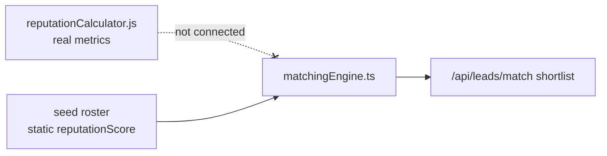
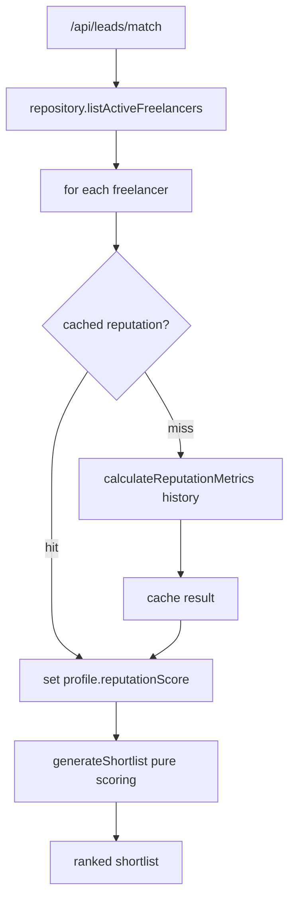

# AIE-05 — Wire Real Reputation into the Matching Engine

> **Role**: AI Engineer · **Priority**: 🟡 High · **Effort**: ~2 days
> **Migration status**: ⚪ **Unaffected by the TS→Python migration.** `matchingEngine.ts` (AI-006) and `reputationCalculator.js` are deterministic and **stay in TypeScript**. This story is entirely TS-side.

---

## Story Identity

| Field | Value |
|:---|:---|
| **Story ID** | `AIE-05` |
| **Owner** | AI Engineer |
| **Backend files** | [matchingEngine.ts](../../../backend/src/services/matchingEngine.ts), [reputationCalculator.js](../../../backend/src/skills/reputationCalculator.js), [index.ts](../../../backend/src/index.ts) |

---

## 1. Current Problem

`matchingEngine.ts` is a pure scoring function that consumes `reputationScore` directly off each `FreelancerProfile`:

```ts
reputation: f.reputationScore,         // 0-100 composite
// ...
f.reputationScore * weights.reputation
```

The interface comment is explicit that this should come "from `reputationCalculator` in prod" — but nothing connects them. Today the score is whatever static value the seed/roster provides, so:

- Reputation never reflects a freelancer's **actual escrow history** (on-time rate, revision efficiency, dispute-free delivery).
- The `reputationCalculator.js` skill — which exists and computes exactly these metrics — is unused by matching.
- `/api/leads/match` ranks candidates on stale numbers, weakening the "trust-first shortlist" UVP.



---

## 2. Why It Matters

- Matching is on the critical path (AI-006, 🔴). Its output quality is capped by the quality of the reputation signal.
- The platform already computes trustworthy reputation; not using it is wasted signal and a credibility gap.

---

## 3. Step-Wise Solution

### Step 3.1 — Keep the engine pure
Do **not** make `matchingEngine.ts` fetch data. It stays a pure function. Instead, enrich the roster **before** scoring, at the repository/route boundary.

### Step 3.2 — Add reputation enrichment
In the freelancer repository (or a thin service used by `/api/leads/match`), for each candidate:
1. Load the freelancer's escrow history.
2. Call `calculateReputationMetrics(escrowHistory)` from `reputationCalculator.js`.
3. Set `profile.reputationScore` to the computed composite before passing the roster to `generateShortlist()`.

### Step 3.3 — Cache to control cost/latency
Reputation changes slowly. Cache the computed composite per freelancer with a TTL in the TS layer (a simple in-repo Map/TTL cache — the AIA-02 Gemini cache lives in the Python service and is not reused here) so a match request doesn't recompute history for every candidate every time.

### Step 3.4 — Handle no-history gracefully
New freelancers with no escrow history should get a documented neutral baseline (e.g., 60) and a `riskFlags` entry like `"new / limited track record"`, rather than 0 (which would unfairly bury them) or 100 (which would over-promote them).

### Step 3.5 — Surface it in fit reasons
The engine already pushes `"Strong reputation: X/100 verified score"` when `>= 85`. Once the score is real, this reason becomes meaningful — add a complementary low-reputation risk flag for transparency.



---

## 4. Done When

- [ ] `matchingEngine.ts` remains a pure function (no data fetching added).
- [ ] Each candidate's `reputationScore` is computed from real escrow history via `reputationCalculator.js` before scoring.
- [ ] Computed reputation is cached with a TTL.
- [ ] New/no-history freelancers get a documented neutral baseline + risk flag.
- [ ] `npm run build` passes; a sample match shows reputation-driven ranking changes.

---

## 5. Cross-References

| Document | Relevance |
|:---|:---|
| [AI-006 Spec](../ai_006_smart_matching_lead_scoring.md) | Matching engine design |
| [AIA-02 Cache](./AIA-02-gemini-result-cache.md) | Caching infrastructure to reuse |
| [AIA-03 GitHub Scan](./AIA-03-github-scan-pipeline.md) | Sibling signal-enrichment pipeline |
