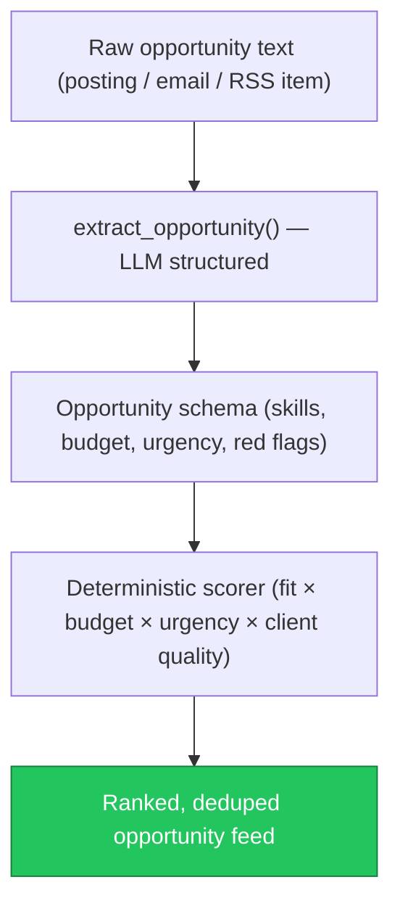

# AIE-06 — AI-005 Opportunity Intelligence Scoring (Design + Deterministic Scorer)

> **Role**: AI Engineer · **Priority**: 🟡 High · **Effort**: ~2 days
> **Status**: ✅ Done (verified 2026-07-19). `schemas/opportunity.py`, `features/opportunity.py` (deterministic scorer), and `POST /ai/opportunity/score` are all implemented. Canonical status: [ai-service backlog](../../../stories/ai-service/README.md).

---

## Story Identity

| Field | Value |
|:---|:---|
| **Story ID** | `AIE-06` |
| **Owner** | AI Engineer |
| **Files** | `ai-service/app/schemas/opportunity.py` (new), `ai-service/app/features/opportunity.py` (new), `ai-service/app/main.py` |
| **Depends on** | AIA-05 (call resilience) |

---

## 1. Current Problem

AI-005 (Opportunity Intelligence & Scoring) is specced but unbuilt: there is no schema for an opportunity, no LLM extractor that turns a raw job/lead posting into a structured `Opportunity`, and no deterministic scorer to rank opportunities for a freelancer. Today the platform can parse a *client* brief (AI-001) but cannot ingest and rank *inbound* opportunities.

The scoring must be **deterministic** (same inputs → same score) so ranking is explainable and testable; the LLM is used only for *extraction*, not scoring.

---

## 2. Why It Matters

- **Net-new value**: Opportunity intelligence is a headline UVP ("fast hire for urgent work" / lead scoring) with no current implementation.
- **Foundation for AIA-04**: The discovery-automation pipeline needs this schema + scorer as its contract before connectors can be built.
- **Explainability**: A deterministic scorer produces auditable, reproducible rankings — critical for trust.

---

## 3. Step-Wise Solution

### Step 3.1 — `Opportunity` schema
Define a Pydantic `Opportunity` in `schemas/opportunity.py`: `title`, `summary`, `required_skills[]`, `nice_to_have_skills[]`, `budget_range`, `currency`, `urgency` (enum), `remote` (bool), `red_flags[]`, `source`, `posted_at`, and a stable `dedupe_key`.

### Step 3.2 — LLM extractor
Implement `extract_opportunity(raw_text)` using `generate_structured()` constrained to the `Opportunity` schema, with a sanitizing fallback (mirror the brief-parser pattern) so malformed postings never hard-fail.

### Step 3.3 — Deterministic scorer
Implement `score_opportunity(opportunity, freelancer_profile) -> OpportunityScore` with an explainable weighted formula (skill-fit %, budget adequacy, urgency, client quality, red-flag penalty). No LLM in this path. Return per-factor sub-scores for transparency.

### Step 3.4 — Dedupe key + route
Generate a stable `dedupe_key` (hash of normalized title + source + budget) to prevent duplicate ingestion. Expose `POST /ai/opportunity/score` (and keep extraction reusable for AIA-04).

---

## 4. Done When

- [ ] `Opportunity` + `OpportunityScore` schemas exist and validate.
- [ ] `extract_opportunity()` returns structured output with a safe fallback.
- [ ] `score_opportunity()` is deterministic and returns per-factor sub-scores.
- [ ] A stable `dedupe_key` is produced for identical postings.
- [ ] `POST /ai/opportunity/score` is wired and documented on `/health` feature list.
- [ ] Unit tests cover extraction fallback + scoring determinism.
- [ ] `python -m compileall app` passes cleanly.

---

## 5. Cross-References

| Document | Relevance |
|:---|:---|
| [ai_005_opportunity_intelligence_scoring.md](../ai_005_opportunity_intelligence_scoring.md) | Feature spec |
| [opportunity_intelligence_build_guide.md](../opportunity_intelligence_build_guide.md) | Build guide |
| [brief_parser.py](../../../../ai-service/app/features/brief_parser.py) | Extractor + fallback pattern to mirror |
