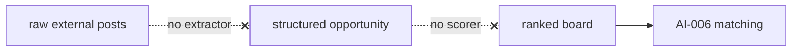
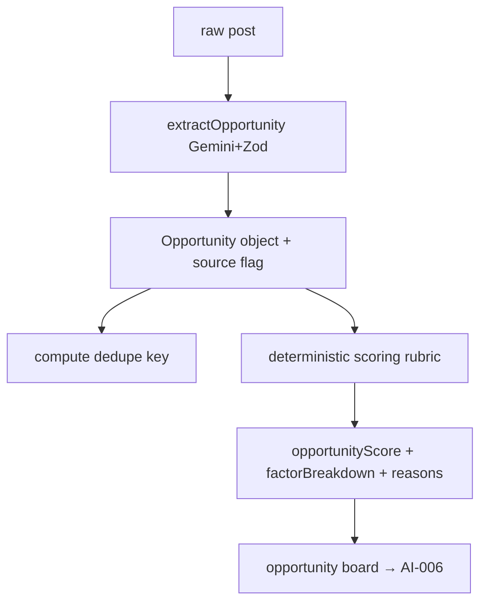

# AIE-06 — Design AI-005 Opportunity Intelligence Scoring

> **Role**: AI Engineer · **Priority**: 🟡 High · **Effort**: ~3–4 days (model/scoring design)

---

## Story Identity

| Field | Value |
|:---|:---|
| **Story ID** | `AIE-06` |
| **Owner** | AI Engineer |
| **Backend files** | new `backend/src/skills/opportunityIntelligence.ts` |
| **Pairs with** | [AIA-04 Discovery Automation](./AIA-04-opportunity-discovery-automation.md) |

---

## 1. Current Problem

AI-005 is the only subsystem with **no implementation** — the registry marks it `❌ Not built`, and only the [build guide](../opportunity_intelligence_build_guide.md) exists. There is no extraction schema and no lead-scoring rubric, so:

- Raw external posts can't be turned into structured opportunities.
- There is nothing to rank discovered leads by relevance/quality.
- AI-006 matching has no inbound external lead source to score against (the dependency graph shows `AI-005 → AI-006` and `AI-005 → AI-001`).

This story covers the **intelligence design** (schema + extraction prompt + scoring). The ingestion/scheduling plumbing is [AIA-04](./AIA-04-opportunity-discovery-automation.md).



---

## 2. Why It Matters

- Opportunity discovery is a key growth lever (inbound demand) and a documented 🟡 High feature.
- Doing the schema + scoring design first (this story) lets the automation engineer build connectors against a stable contract.

---

## 3. Step-Wise Solution

### Step 3.1 — Define the extraction schema (Zod)
Model an `Opportunity` mirroring the established pattern in `briefParser.ts`:
```ts
const OpportunitySchema = z.object({
  title: z.string().min(1),
  summary: z.string().min(1),
  requiredSkills: z.array(z.string()),
  domain: z.string(),
  budgetSignal: z.enum(['none','low','medium','high']),
  budgetEstimate: z.number().nullable(),
  urgency: z.enum(['low','medium','high']),
  sourceUrl: z.string(),
  postedAt: z.string().nullable(),
  legitimacySignals: z.array(z.string()),
  spamSignals: z.array(z.string()),
});
```

### Step 3.2 — Write the extraction skill
`extractOpportunity(rawPost, apiKey, model)` using the same hardened pattern as the other skills: native Gemini `responseSchema` + Zod parse + an honest fallback marker (reuse the AIE-02 `source` convention — never emit a fabricated opportunity as real).

### Step 3.3 — Define the scoring rubric (deterministic)
Keep scoring **deterministic** (like `matchingEngine.ts`), not an LLM call, so it's cheap, explainable, and tunable via env weights:
| Factor | Signal |
|:---|:---|
| Skill relevance | overlap with the platform's freelancer skill inventory |
| Budget quality | `budgetSignal` / estimate vs platform floor |
| Urgency | maps to time-to-fill value |
| Legitimacy | legitimacy minus spam signals |
| Freshness | decay by `postedAt` age |

Output `opportunityScore` (0–100) + `factorBreakdown` + `scoreReasons` — the same shape as the matching engine for UI consistency.

### Step 3.4 — Define dedupe key
Specify a canonical dedupe key (e.g., normalized title + source domain + posted week) so AIA-04 can drop duplicates deterministically.

### Step 3.5 — Provide a labeled mini-set
Add 10–15 example posts with expected extraction + score bands to the AIE-04 eval harness so AI-005 quality is gated like the others.



---

## 4. Done When

- [ ] `OpportunitySchema` (Zod) is defined and documented.
- [ ] `extractOpportunity()` follows the project's hardened LLM pattern with an honest fallback marker.
- [ ] A deterministic, env-weighted scoring function returns score + breakdown + reasons.
- [ ] A canonical dedupe key is specified for AIA-04.
- [ ] A labeled mini-set is added to the eval harness.
- [ ] `npm run build` passes.

---

## 5. Cross-References

| Document | Relevance |
|:---|:---|
| [AI-005 Spec](../ai_005_opportunity_intelligence_scoring.md) | Feature intent |
| [Opportunity Intelligence Build Guide](../opportunity_intelligence_build_guide.md) | Source policy + 7-stage build order |
| [AIA-04 Discovery Automation](./AIA-04-opportunity-discovery-automation.md) | Builds connectors/cron against this schema |
| [matchingEngine.ts](../../../backend/src/services/matchingEngine.ts) | Scoring shape to mirror |
