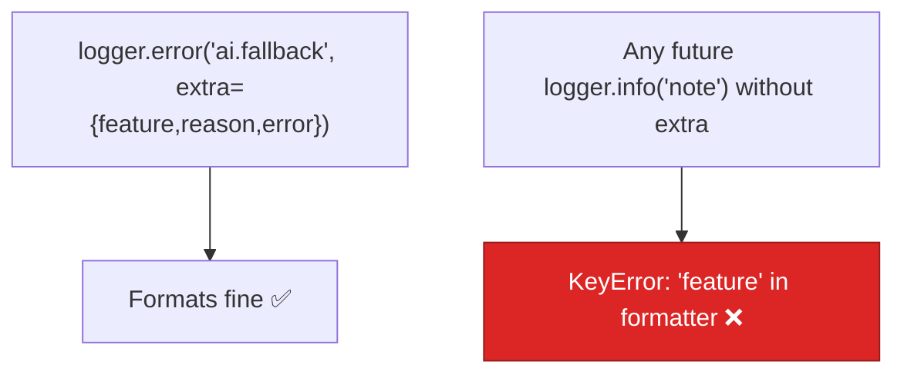

# AIE-07 — Fallback Logger Crashes on Records Missing Custom Fields

> **Role**: AI Engineer · **Priority**: 🟡 Medium · **Effort**: ~0.5 day
> **Status**: 🔴 Not started. Fragile formatter in [fallback_logger.py](../../../../ai-service/app/features/fallback_logger.py).

---

## Story Identity

| Field | Value |
|:---|:---|
| **Story ID** | `AIE-07` |
| **Owner** | AI Engineer |
| **Files** | `ai-service/app/features/fallback_logger.py`, callers in `ai-service/app/features/*` |
| **Depends on** | None |

---

## 1. Current Problem

The dedicated fallback logger hard-codes custom LogRecord attributes into its format string:

```python
# ai-service/app/features/fallback_logger.py
formatter = logging.Formatter(
    "%(levelname)s: %(feature)s %(reason)s %(message)s %(error)s"
)
```

Python's logging formats a record by string-interpolating these names against the record's `__dict__`. If **any** log call on this logger omits `extra={"feature": ..., "reason": ..., "error": ...}`, formatting raises `KeyError: 'feature'` inside the logging machinery. Today every caller in `brief_parser.py` passes all three, so it works — but it is a latent trap: a single future `logger.info("...")` without the full `extra` payload will throw at log time (and logging errors can be swallowed or crash the handler). It also couples the log format rigidly to one call signature.



---

## 2. Why It Matters

- **Latent crash**: Observability code (AIA-06) or a quick debug log added later will detonate this trap.
- **Robust logging is table stakes**: A logger should never raise because a field was omitted.
- **Loose coupling**: Structured fields belong in a filter/adapter, not baked into a brittle format string.

---

## 3. Step-Wise Solution

### Step 3.1 — Default the custom fields
Add a `logging.Filter` (or `LoggerAdapter`) that injects default values (`feature="-"`, `reason="-"`, `error=""`) onto any record lacking them, so the formatter always finds its keys.

### Step 3.2 — Prefer structured/JSON output
Optionally switch to a JSON formatter that serializes whatever extras are present, decoupling the format from a fixed field list (pairs naturally with AIA-06 telemetry).

### Step 3.3 — Provide a typed helper
Expose `log_fallback(feature, reason, error)` so callers cannot forget a field, and update `brief_parser.py` to use it.

---

## 4. Done When

- [ ] Logging on the fallback logger without custom fields no longer raises.
- [ ] A `log_fallback(...)` helper exists and is used by `brief_parser.py`.
- [ ] Existing `ai.fallback` records still contain `feature`, `reason`, `error`.
- [ ] Unit test asserts a bare `logger.info("x")` does not raise.
- [ ] `python -m compileall app` passes cleanly.

---

## 5. Cross-References

| Document | Relevance |
|:---|:---|
| [fallback_logger.py](../../../../ai-service/app/features/fallback_logger.py) | The fragile formatter |
| [brief_parser.py](../../../../ai-service/app/features/brief_parser.py) | Primary caller |
| [AIA-06](./AIA-06-ai-observability-telemetry.md) | Structured logging successor |
