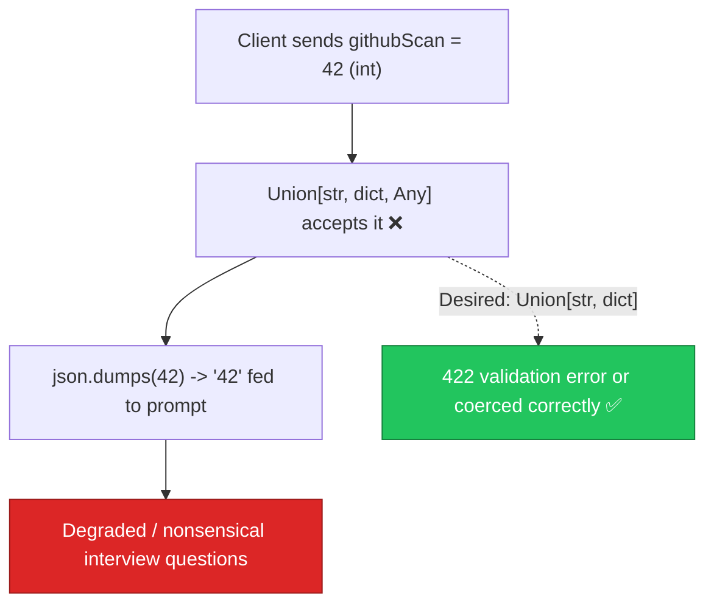

# AIE-08 — `Union[..., Any]` in Request Models Silently Disables Validation

> **Role**: AI Engineer · **Priority**: 🟡 Medium · **Effort**: ~0.5 day
> **Status**: 🔴 Not started. Present in [main.py L88-L99](../../../../ai-service/app/main.py#L88-L99).

---

## Story Identity

| Field | Value |
|:---|:---|
| **Story ID** | `AIE-08` |
| **Owner** | AI Engineer |
| **Files** | `ai-service/app/main.py`, `ai-service/app/features/interview.py`, `ai-service/app/features/extensions.py` |
| **Depends on** | None |

---

## 1. Current Problem

Two request models declare fields as a `Union` that ends in `Any`:

```python
# ai-service/app/main.py
class InterviewRequest(BaseModel):
    briefText: str = Field(min_length=1)
    githubScan: Union[str, dict, Any] = ""        # ← Any makes the whole union permissive
    missingSkills: List[str] = Field(default_factory=list)

class ExtensionsRequest(BaseModel):
    completedDeliverables: Union[str, list, Any] = ""   # ← same problem
    chatSummary: str = ""
```

Because `Any` matches everything, `Union[str, dict, Any]` is effectively just `Any`. Pydantic performs **no** coercion or validation on these fields — a caller can send an int, a bool, or a nested object of any shape and it passes untouched. Downstream, `interview.py` and `extensions.py` then do `json.dumps(value)` or `str(value)` on whatever arrived, which can produce garbage prompt context (e.g. `"true"`, `"42"`) that quietly degrades LLM output. The `Union` *looks* like it constrains input but does not.



---

## 2. Why It Matters

- **Silent quality loss**: Malformed inputs reach the LLM as prompt text instead of being rejected.
- **False sense of typing**: The `Union` implies constraints that aren't enforced.
- **Cheap fix, real safety**: Tightening the type is low-effort and prevents a class of garbage-in/garbage-out failures.

---

## 3. Step-Wise Solution

### Step 3.1 — Drop `Any` from the unions
Change `githubScan` to `Union[str, dict]` and `completedDeliverables` to `Union[str, list]`. Keep sensible defaults (`""`).

### Step 3.2 — Normalize explicitly in the feature layer
Keep the existing "stringify if not a string" logic in `interview.py` / `extensions.py`, but now it only ever receives the two intended shapes.

### Step 3.3 — Decide reject-vs-coerce policy
If lenient input is desired, add a `field_validator` that coerces unexpected types to a safe string rather than relying on `Any`. Prefer explicit coercion over an open type.

### Step 3.4 — Confirm error behavior
Sending an int/bool now yields a clear `422` (or documented coercion), not silent passthrough.

---

## 4. Done When

- [ ] `githubScan` and `completedDeliverables` no longer include `Any`.
- [ ] Unexpected types are either rejected (`422`) or explicitly coerced via a validator.
- [ ] Feature-layer stringification still handles the allowed shapes.
- [ ] Unit/endpoint tests cover valid string, valid dict/list, and invalid int/bool.
- [ ] `python -m compileall app` passes cleanly.

---

## 5. Cross-References

| Document | Relevance |
|:---|:---|
| [main.py](../../../../ai-service/app/main.py) | Request model definitions |
| [interview.py](../../../../ai-service/app/features/interview.py) | Consumes `githubScan` |
| [extensions.py](../../../../ai-service/app/features/extensions.py) | Consumes `completedDeliverables` |
