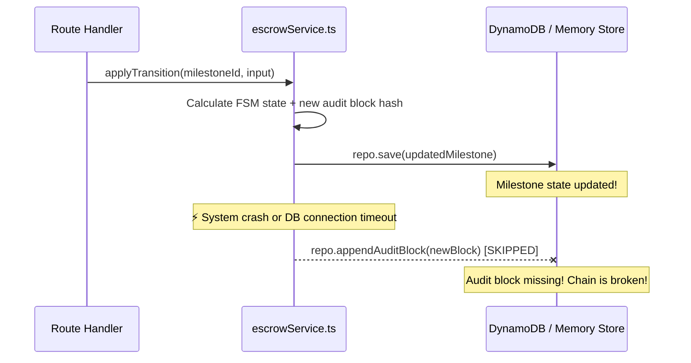

# BUG-01 — Escrow TOCTOU Race: `save` and `appendAuditBlock` Not Atomic

> **Role**: Backend Engineer · **Priority**: 🔴 Critical · **Effort**: ~1 day
> **Status**: 🔴 Not started. Identified in [escrowService.ts L84-L85](../../../../backend/src/services/escrowService.ts#L84-L85).

---

## Story Identity

| Field | Value |
|:---|:---|
| **Story ID** | `BUG-01` |
| **Owner** | Backend Engineer / FSM Expert |
| **Files** | `backend/src/services/escrowService.ts`, `backend/src/services/milestoneRepository.ts` |
| **Depends on** | None |

---

## 1. Current Problem

In `applyTransition()` inside [escrowService.ts](../../../../backend/src/services/escrowService.ts), state changes to the milestone and adding the audit record to the ledger are executed as two separate asynchronous database calls:

```typescript
// backend/src/services/escrowService.ts
await repo.save(updatedMilestone);    // Writes to 'milestones' table
await repo.appendAuditBlock(newBlock); // Writes to 'audit_blocks' table
```

Because these writes are not wrapped in a single database transaction (e.g., DynamoDB `TransactWriteItems`), the system can fail partially. If the system crashes, is restarted, or the database experiences throttling/failures after `save()` but before `appendAuditBlock()`, the milestone advances to the next state (e.g. `Active` or `Funds_Released`) while the corresponding hash link in the audit trail is never appended.

This breaks the immutable cryptographic chain. Any subsequent call to `verifyAuditChain()` will immediately fail because the `previousHash` pointer of the next block will not match the latest block in the ledger.



---

## 2. Why It Matters

- **Audit Trail Trust**: FixFlowAI's core UVP is a verifiable cryptographic audit trail for all escrow milestones. A broken chain destroys trust and prevents automated auditing.
- **Double-Spending Defense**: If an audit chain fails validation, the system cannot guarantee that a milestone has not been illegally double-transitioned or modified.
- **Permanent Corruption**: Because the chain uses SHA-256 hashes linking each block to the previous block's hash, a single missing block prevents any future audits from passing.

---

## 3. Step-Wise Solution

### Step 3.1 — Define a Transactional Write Method in the Repository
Add a new method `saveWithAuditBlock(milestone: Milestone, block: AuditTrailBlock): Promise<void>` to the `MilestoneRepository` interface in [milestoneRepository.ts](../../../../backend/src/services/milestoneRepository.ts).

### Step 3.2 — Implement DynamoDB transactional safety
In `DynamoDbMilestoneRepository`, implement this method using the `TransactWriteCommand` from `@aws-sdk/lib-dynamodb`. Both writes must succeed or fail together:
```typescript
import { TransactWriteCommand } from '@aws-sdk/lib-dynamodb';

async saveWithAuditBlock(m: Milestone, block: AuditTrailBlock) {
  const { ddb, table } = await import('../config/aws.js');
  await ddb.send(new TransactWriteCommand({
    TransactItems: [
      {
        Put: {
          TableName: table('milestones'),
          Item: this.toItem(m),
        }
      },
      {
        Put: {
          TableName: table('audit_blocks'),
          Item: { ...block, blockIndex: block.index },
        }
      }
    ]
  }));
}
```

### Step 3.3 — Implement In-Memory Transaction Fallback
In `InMemoryMilestoneRepository`, use a lock or try-catch block with rollback logic. If appending the audit block fails, revert the in-memory milestone state to the previous state.

### Step 3.4 — Refactor the Escrow Service
Update [escrowService.ts](../../../../backend/src/services/escrowService.ts) to call the new transactional save method:
```typescript
// Remove these lines:
// await repo.save(updatedMilestone);
// await repo.appendAuditBlock(newBlock);

// Replace with:
await repo.saveWithAuditBlock(updatedMilestone, newBlock);
```

---

## 4. Done When

- [ ] `MilestoneRepository` contains `saveWithAuditBlock()`.
- [ ] `DynamoDbMilestoneRepository` uses `TransactWriteCommand` to execute atomic writes.
- [ ] `InMemoryMilestoneRepository` has rollback logic on failure.
- [ ] Unit tests verify that if the audit log insertion fails, the milestone state change is rolled back (or never committed).
- [ ] `npm run build` passes successfully.

---

## 5. Cross-References

| Document | Relevance |
|:---|:---|
| [escrowStateMachine.ts](../../../../backend/src/skills/escrowStateMachine.ts) | Core state logic and hash chain builder |
| [escrowService.ts](../../../../backend/src/services/escrowService.ts) | Service orchestration layer |
| [milestoneRepository.ts](../../../../backend/src/services/milestoneRepository.ts) | DB read/write client |
