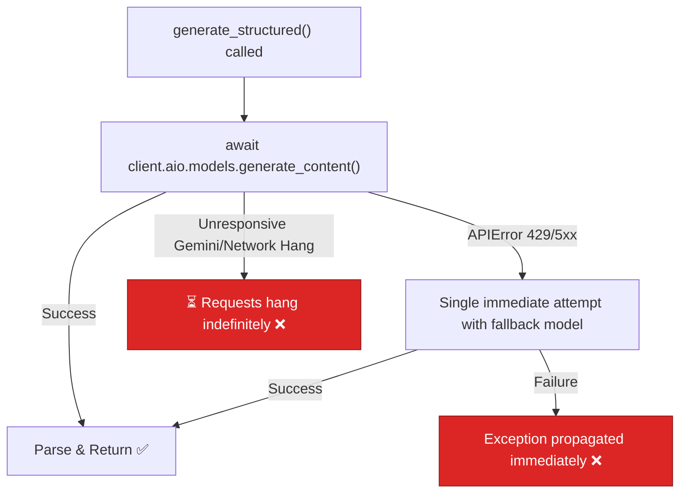

# BUG-02 — Gemini Wrapper Has No Timeout and Single-Point Retry

> **Role**: AI Automation Engineer · **Priority**: 🔴 Critical · **Effort**: ~2 days
> **Status**: ✅ Done (verified 2026-07-19). `generate_structured()` wraps each call in `asyncio.wait_for(timeout=GEMINI_TIMEOUT_SEC)` with bounded retries + exponential backoff/jitter. Canonical status: [ai-service backlog](../../../stories/ai-service/README.md).

---

## Story Identity

| Field | Value |
|:---|:---|
| **Story ID** | `BUG-02` |
| **Owner** | AI Automation Engineer |
| **Files** | `ai-service/app/llm/gemini.py`, `ai-service/app/config.py` |
| **Depends on** | None |

---

## 1. Current Problem

The central LLM call wrapper `generate_structured()` inside [gemini.py](../../../../ai-service/app/llm/gemini.py) executes async API calls to the Google Gemini API using `client.aio.models.generate_content()` without wrapping the request in a timeout (e.g. `asyncio.wait_for()`). 

If the Google Gemini backend experiences latency spikes, quota limits, or hangs indefinitely, the API thread blocks without yielding control back to the FastAPI event loop. 

Furthermore, the retry mechanism is a simple one-off try-except block that tries the fallback model once if the HTTP response code is 429 or 5xx:

```python
# ai-service/app/llm/gemini.py
try:
    response = await client.aio.models.generate_content(
        model=primary_model, contents=contents, config=config
    )
except APIError as e:
    if (e.code in (429, 500, 502, 503, 504) ...):
        # A single attempt with the fallback model
        response = await client.aio.models.generate_content(
            model=settings.gemini_fallback_model, ...
        )
```

This single retry contains no backoff delay, no jitter, and does not handle general connection errors, socket timeouts, or internal JSON decoding failures.



---

## 2. Why It Matters

- **FastAPI Thread Starvation**: An unbounded request blocks worker resources. A series of hanging LLM requests will crash the entire FastAPI server.
- **Quota Recovery**: 429 rate limit errors usually require a short cool-off window before retrying. An immediate retry will always fail.
- **Failover Integrity**: If both the main model and the fallback model fail immediately under load, the user gets synthetic fallback proposals instead of a retry opportunity.

---

## 3. Step-Wise Solution

### Step 3.1 — Configure Timestamps and Limits in Settings
Add `GEMINI_TIMEOUT_SEC` (default `15.0`) and `GEMINI_MAX_RETRIES` (default `3`) to the settings class in [config.py](../../../../ai-service/app/config.py).

### Step 3.2 — Implement a Timeout Guard
Wrap the API calls in `asyncio.wait_for()` to enforce a hard timeout:
```python
import asyncio

try:
    response = await asyncio.wait_for(
        client.aio.models.generate_content(...),
        timeout=settings.gemini_timeout_sec
    )
except asyncio.TimeoutError:
    raise ValueError("Gemini API call timed out.")
```

### Step 3.3 — Implement Exponential Backoff with Jitter
Add a structured retry loop for transient errors (429 and 5xx APIErrors, timeouts, and network issues) with randomized jitter:
```python
import random
import time

# Backoff formula: min(max_delay, base_delay * (2 ** attempt)) + jitter
```

### Step 3.4 — Fallback Model Swapping
If the primary model is failing, swap to the fallback model on subsequent retries rather than doing a single try-catch after the primary has completely failed.

---

## 4. Done When

- [ ] `config.py` contains settings for timeouts and retries.
- [ ] `generate_structured()` uses `asyncio.wait_for()` to guarantee it returns within the timeout limit.
- [ ] Exponential backoff with random jitter is verified to run multiple times on transient errors.
- [ ] Unit tests in `ai-service` verify timeout handling and retry counts.
- [ ] `python -m compileall app` compiles cleanly.

---

## 5. Cross-References

| Document | Relevance |
|:---|:---|
| [gemini.py](../../../../ai-service/app/llm/gemini.py) | Central LLM client caller |
| [config.py](../../../../ai-service/app/config.py) | App configuration keys |
