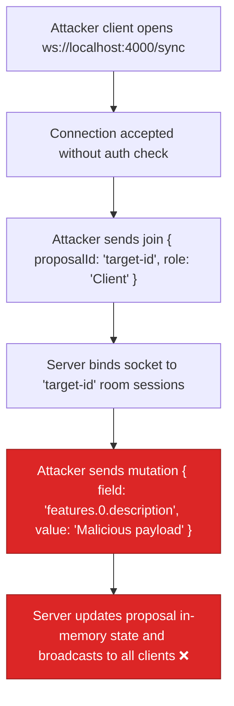

# BUG-03 — WebSocket Sync Has Zero Authentication

> **Role**: Security Engineer · **Priority**: 🟡 High · **Effort**: ~2 days
> **Status**: ✅ Done (verified 2026-07-17). JWT-gated upgrade, per-message `clientId===sub` check, proposal-ownership authorization, and token-derived role enforcement all implemented in [syncServer.ts](../../../../backend/src/skills/syncServer.ts). `npm run build` passes.

---

## Story Identity

| Field | Value |
|:---|:---|
| **Story ID** | `BUG-03` |
| **Owner** | Security Engineer / Backend Engineer |
| **Files** | `backend/src/skills/syncServer.ts`, `backend/src/index.ts` |
| **Depends on** | None |

---

## 1. Current Problem

The collaborative document editing system in [syncServer.ts](../../../../backend/src/skills/syncServer.ts) manages real-time synchronization of proposal details using WebSocket connections. However, the connection upgrade process and the channel subscribe (`join`) protocol contain **no authentication or authorization gates**:

```typescript
// backend/src/skills/syncServer.ts
server.on('upgrade', (request: IncomingMessage, socket: any, head: any) => {
  const pathname = new URL(request.url || '', `http://${request.headers.host}`).pathname;
  if (pathname === '/sync') {
    this.wss.handleUpgrade(request, socket, head, (ws: WebSocket) => {
      this.wss.emit('connection', ws, request);
    });
  }
});
```

During connection connection/negotiation, the WebSocket server does not verify authorization headers or query parameters. Inside the connection handler, when a client sends a `join` message:

```typescript
case 'join': {
  const { proposalId, clientId, role, vectorClock } = payload;
  // ...
  let room = activeRooms.get(proposalId);
  // ...
  room.sessions.set(clientId, { ws, clientId, role });
```

The server trusts the user-declared `proposalId`, `clientId`, and `role` credentials. No DB checks are run to verify if:
1. The user is logged in.
2. The user has permission to view/edit the specified `proposalId`.
3. The client's actual role matches the requested role parameter.



---

## 2. Why It Matters

- **Data Poisoning**: Anyone can connect and overwrite feature titles, technical descriptions, or budget lines of any active proposal.
- **Data Leakage**: Upon joining a room, the server immediately returns the full cached JSON structure of the proposal (`sync_response`) to the client, leading to unauthorized access.
- **Denial of Service**: Attackers can spawn thousands of virtual connections and join random rooms, causing memory bloat and connection exhaustion.

---

## 3. Step-Wise Solution

### Step 3.1 — Verify token during HTTP upgrade
Extract the JWT access token from the upgrade request query parameter (e.g. `ws://localhost:4000/sync?token=<token>`). In [syncServer.ts](../../../../backend/src/skills/syncServer.ts):
```typescript
import { verifyAccessToken } from '../auth/tokens.js';

// Inside server.on('upgrade')
const url = new URL(request.url || '', `http://${request.headers.host}`);
const token = url.searchParams.get('token');
if (!token) {
  socket.write('HTTP/1.1 401 Unauthorized\r\n\r\n');
  socket.destroy();
  return;
}
try {
  const decoded = verifyAccessToken(token);
  // Store claims on request object
  (request as any).auth = decoded;
} catch (err) {
  socket.write('HTTP/1.1 403 Forbidden\r\n\r\n');
  socket.destroy();
  return;
}
```

### Step 3.2 — Enforce Token Verification on Room Join
In the WebSocket `'message'` switch-case, verify that the `clientId` matches the token's subject ID (`request.auth.sub`).

### Step 3.3 — Authorize Proposal Access
Query the `proposalRepository` to verify that the proposal exists and matches the user's ID (`userId = sub`), or that they are a permitted collaborator. Reject the join and terminate the socket if authorization fails.

---

## 4. Done When

- [x] WebSocket upgrade requires a valid JWT `token` parameter.
- [x] Unauthorized WebSocket connections are closed with `401` or `403` status.
- [x] `join` payload claims (`clientId`, `role`) are validated against the JWT claims — `clientId` must equal the token `sub`, and the session role is derived from the token (`resolveClientRole(auth.role)`); a mismatched declared role is rejected with close code `4003`.
- [x] Database query confirms user permissions before returning the proposal state cache — `proposalRepository.get()` + `proposal.userId === auth.sub` (unknown proposal → `4004`, non-owner → `4003`).
- [x] `npm run build` compiles successfully.

> **Remaining (out of BUG-03 scope, tracked separately):** multi-party collaboration (currently owner-only, since `StoredProposal` has no collaborators field) and a per-room/per-user connection cap for the DoS concern. Open these as follow-ups if needed.

---

## 5. Cross-References

| Document | Relevance |
|:---|:---|
| [syncServer.ts](../../../../backend/src/skills/syncServer.ts) | Collaboration synchronizer server |
| [tokens.ts](../../../../backend/src/auth/tokens.ts) | Token verification client |
| [proposalRepository.ts](../../../../backend/src/services/proposalRepository.ts) | Proposal storage model |
