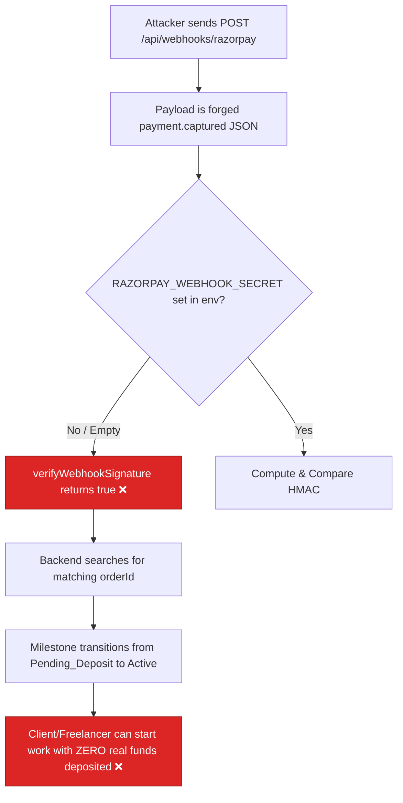

# BUG-04 — Razorpay Webhook Signature Bypass If Secret Missing

> **Role**: Security Auditor / Backend Engineer · **Priority**: 🔴 Critical · **Effort**: ~1 day
> **Status**: 🔴 Not started. Identified in [paymentService.ts L93-L97](../../../../backend/src/services/paymentService.ts#L93-L97).

---

## Story Identity

| Field | Value |
|:---|:---|
| **Story ID** | `BUG-04` |
| **Owner** | Security Auditor / Backend Engineer |
| **Files** | `backend/src/services/paymentService.ts`, `backend/src/index.ts` |
| **Depends on** | None |

---

## 1. Current Problem

The Razorpay webhook signature validator in [paymentService.ts](../../../../backend/src/services/paymentService.ts) contains a fallback rule that bypasses signature checks if no webhook secret is configured:

```typescript
// backend/src/services/paymentService.ts
export function verifyWebhookSignature(
  body: string,
  signature: string,
  webhookSecret: string
): boolean {
  if (!webhookSecret) {
    console.log('[SIMULATION] Webhook secret not configured. Bypassing signature check.');
    return true; // ← Dangerous signature bypass!
  }
```

In production, if `RAZORPAY_WEBHOOK_SECRET` is not set or is empty in the server environment variables, the system falls back to returning `true`. 

This means the webhook endpoint `/api/webhooks/razorpay` in [index.ts](../../../../backend/src/index.ts) will process any unauthenticated payload, including forged payments:

```typescript
// backend/src/index.ts
app.post('/api/webhooks/razorpay', asyncRoute(async (req, res) => {
  const signature = req.headers['x-razorpay-signature'] as string;
  const body = JSON.stringify(req.body);
  const webhookSecret = process.env.RAZORPAY_WEBHOOK_SECRET || '';

  const isValid = verifyWebhookSignature(body, signature, webhookSecret);
  if (!isValid) { ... } // Signature bypass will evaluate as valid!
```

An attacker can POST a fake `payment.captured` JSON body matching an active order ID, and the backend will immediately transition the associated milestone from `Pending_Deposit` to `Active` without verified funds.



---

## 2. Why It Matters

- **Financial Risk**: Freelancers will start milestone deliveries believing funds are locked in the Razorpay escrow. Once completed, no funds exist to release, causing direct losses.
- **Audit Ledger Compromise**: The audit block will record `system` as the state changer with the metadata `"Payment captured via webhook."` leading to incorrect auditing metrics.
- **Production Vulnerability**: If the secret is omitted during environment setup, the platform operates in insecure simulation mode without warning.

---

## 3. Step-Wise Solution

### Step 3.1 — Remove the Webhook Bypass Code
Modify [paymentService.ts](../../../../backend/src/services/paymentService.ts) to throw an error or return `false` if `webhookSecret` is not supplied:
```typescript
export function verifyWebhookSignature(
  body: string,
  signature: string,
  webhookSecret: string
): boolean {
  if (!webhookSecret) {
    console.error('CRITICAL SECURITY ALERT: Webhook secret not configured. Rejecting payload.');
    return false; // ← Reject unsigned webhooks
  }
  // HMAC check remains...
```

### Step 3.2 — Add Boot-Time Verification
Add a check in the server startup logic in [index.ts](../../../../backend/src/index.ts) that checks `process.env.RAZORPAY_WEBHOOK_SECRET`. 

If `process.env.NODE_ENV === 'production'` and the webhook secret is missing, crash the process immediately with a descriptive error. If in development/testing mode, print a prominent warning.

---

## 4. Done When

- [ ] `verifyWebhookSignature` returns `false` if the webhook secret is empty or missing.
- [ ] Forged webhook payloads are rejected with a `400 Bad Request` code when the secret is missing.
- [ ] Boot-time check crashes the server in production if `RAZORPAY_WEBHOOK_SECRET` is not set.
- [ ] `npm run build` compiles cleanly.

---

## 5. Cross-References

| Document | Relevance |
|:---|:---|
| [paymentService.ts](../../../../backend/src/services/paymentService.ts) | HMAC verification implementation |
| [index.ts](../../../../backend/src/index.ts) | Webhook handler endpoint router |
