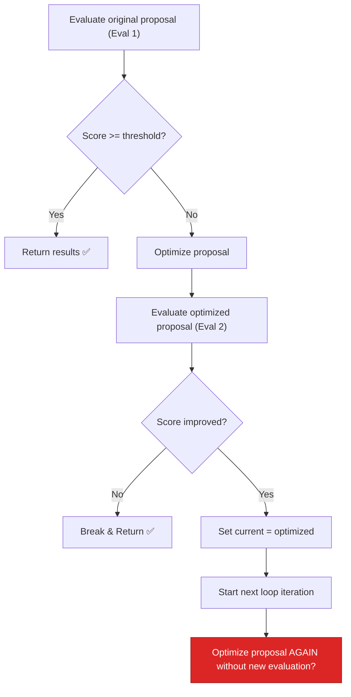

# BUG-05 — Confidence Grid Double-Evaluates on First Cycle

> **Role**: AI Engineer · **Priority**: 🟡 Medium · **Effort**: ~1 day
> **Status**: ✅ Done (verified 2026-07-19). The loop evaluates the initial proposal once, then each optimized proposal exactly once per cycle — no redundant re-evaluation. Canonical status: [ai-service backlog](../../../stories/ai-service/README.md).

---

## Story Identity

| Field | Value |
|:---|:---|
| **Story ID** | `BUG-05` |
| **Owner** | AI Engineer |
| **Files** | `ai-service/app/features/confidence_grid.py` |
| **Depends on** | None |

---

## 1. Current Problem

The multi-agent self-correction loop in [confidence_grid.py](../../../../ai-service/app/features/confidence_grid.py) evaluates the proposal before starting the correction loop, and then inside the loop evaluates the new proposal after optimization:

```python
# ai-service/app/features/confidence_grid.py
auditor_eval, feasibility_eval, confidence_index = await evaluate_proposal(brief_text, current) # Eval 1
while True:
    # ...
    optimized_proposal, optimizer_succeeded = await optimize_proposal(brief_text, current, combined_issues)
    # ...
    new_auditor, new_feasibility, new_confidence = await evaluate_proposal(brief_text, optimized_proposal) # Eval 2
    # ...
    current = optimized_proposal
    auditor_eval, feasibility_eval, confidence_index = new_auditor, new_feasibility, new_confidence
    cycle += 1
```

If the optimization succeeded and met the improvement criteria, the loop variables are updated with `new_auditor, new_feasibility, new_confidence` and the loop repeats (if `max_correction_cycles > 1`). 

However, because the initial values are evaluated before the loop starts, in a multi-cycle scenario, the loop immediately checks the updated `current` proposal. But on the next cycle, we evaluate the *optimized* proposal again before generating modifications, resulting in duplicate LLM evaluations of the exact same proposal.



---

## 2. Why It Matters

- **Latency Waste**: Each `evaluate_proposal` runs two LLM agents in parallel. Running a redundant evaluation cycle adds 3 to 7 seconds of latency to the API response.
- **API Cost**: Generating structured JSON outputs from Gemini carries token costs. Avoiding double-evaluations directly decreases running costs.

---

## 3. Step-Wise Solution

### Step 3.1 — Re-structure the loop
Align the loop to evaluate **at the beginning of the iteration** rather than having separate evaluations outside and inside the loop. Maintain the initial evaluation and only compute new scores when the proposal has been modified:

```python
# Initialize variables
current = proposal
cycle = 0

# Run initial evaluation
auditor_eval, feasibility_eval, confidence_index = await evaluate_proposal(brief_text, current)

while True:
    # Log cycle info
    # ...
    
    # If confidence meets threshold or max cycles reached, record cycle and break
    if confidence_index >= threshold or cycle >= max_cycles:
        cycle_records.append(CycleRecord(
            cycle=cycle,
            auditor=auditor_eval,
            feasibility=feasibility_eval,
            confidenceIndex=confidence_index,
            # ...
        ))
        break
        
    # Optimize
    optimized_proposal, optimizer_succeeded = await optimize_proposal(...)
    if not optimizer_succeeded:
        # Break out
        break
        
    # Evaluate the optimization outcome
    new_auditor, new_feasibility, new_confidence = await evaluate_proposal(brief_text, optimized_proposal)
    
    # Check for improvement
    if new_confidence >= confidence_index + min_improvement:
        # Commit proposal & evaluation to current loop state
        current = optimized_proposal
        auditor_eval, feasibility_eval, confidence_index = new_auditor, new_feasibility, new_confidence
        # Append record of success
        cycle_records.append(CycleRecord(...))
        cycle += 1
    else:
        # Optimization did not improve score, append failed cycle record & exit
        cycle_records.append(CycleRecord(...))
        break
```

This ensures each proposal candidate is evaluated exactly once, and loop state is correctly carried forward.

---

## 4. Done When

- [ ] `process_confidence_grid()` only evaluates a proposal candidate once.
- [ ] Multi-cycle optimization flows execute without duplicate calls to `evaluate_proposal`.
- [ ] Unit tests verify that total evaluations match the number of optimization attempts + 1.
- [ ] `python -m compileall app` passes cleanly.

---

## 5. Cross-References

| Document | Relevance |
|:---|:---|
| [confidence_grid.py](../../../../ai-service/app/features/confidence_grid.py) | Self-correction state machine |
