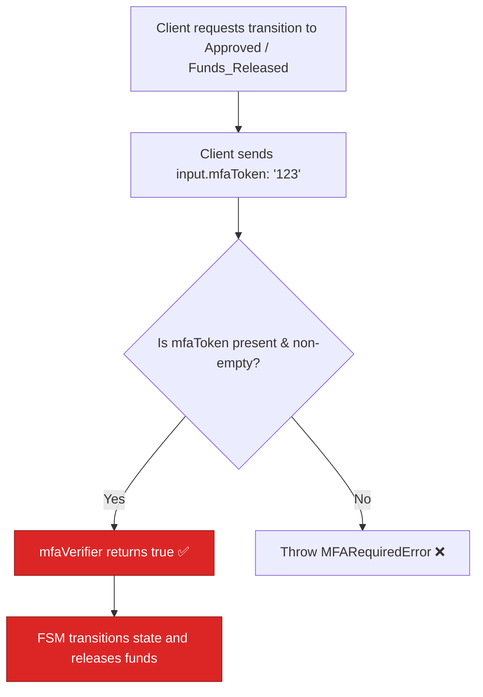

# BUG-06 — MFA Verifier is a Stub: Any Non-Empty String Passes

> **Role**: Security Auditor / FSM Expert · **Priority**: 🔴 Critical · **Effort**: ~1 day
> **Status**: 🔴 Not started. Identified in [escrowService.ts L70-L71](../../../../backend/src/services/escrowService.ts#L70-L71).

---

## Story Identity

| Field | Value |
|:---|:---|
| **Story ID** | `BUG-06` |
| **Owner** | Security Auditor / Backend Engineer |
| **Files** | `backend/src/services/escrowService.ts` |
| **Depends on** | None |

---

## 1. Current Problem

To prevent unauthorized release of funds, the escrow FSM logic requires Multi-Factor Authentication (MFA) before transitioning milestones to `Approved` or `Funds_Released`. However, the FSM verifier implementation in the service layer [escrowService.ts](../../../../backend/src/services/escrowService.ts) accepts **any non-empty string** as a valid MFA token:

```typescript
// backend/src/services/escrowService.ts
const mfaVerifier = (_mid: string, _state: MilestoneState) =>
  Boolean(input.mfaToken && input.mfaToken.trim());
```

This verification function is executed by `transitionMilestone()` inside the FSM:

```typescript
// backend/src/skills/escrowStateMachine.ts
if (toState === 'Approved' || toState === 'Funds_Released') {
  if (!mfaVerifier) {
    throw new MFARequiredError(milestone.id, toState);
  }
  if (!mfaVerifier(milestone.id, toState)) {
    throw new Error(`MFA Verification Failed...`);
  }
  mfaVerified = true;
}
```

Because the verifier function simply checks if `mfaToken` is present and non-empty, sending `mfaToken: "x"` or `mfaToken: "bypass"` satisfies the check. There is no cryptographic verification, database code lookup, or TOTP (Time-Based One-Time Password) decryption.



---

## 2. Why It Matters

- **Financial Leakage**: Attackers who hijack a client session can release escrow funds to themselves immediately by bypassing the secondary confirmation step.
- **Regulatory Compliance**: Trust-first freelancing operating systems require strict audit trails. Surpassing an MFA gate with a dummy string violates payment processor security policies.

---

## 3. Step-Wise Solution

### Step 3.1 — Design a Cryptographic OTP Code Verification Helper
Create an `otpVerifier.ts` helper in `backend/src/auth/` that uses standard TOTP verification (using a library like `otplib` or native cryptographic code over a stored user OTP secret).

### Step 3.2 — Enforce Real Token Checking in the Service
Update [escrowService.ts](../../../../backend/src/services/escrowService.ts) to verify the actual token code. Fetch the user's OTP secret from the database using `userRepository`, verify the token, and return `true` only on match:
```typescript
import { verifyOtp } from '../auth/otpVerifier.js';
import { getUserRepository } from './userRepository.js';

const mfaVerifier = async (mid: string, state: MilestoneState) => {
  if (!input.mfaToken) return false;
  
  // Retrieve the trigger user's profile to get their OTP secret
  const user = await getUserRepository().findById(input.triggerUserId);
  if (!user || !user.otpSecret) return false;

  return verifyOtp(input.mfaToken, user.otpSecret);
};
```
*Note: Make the FSM `mfaVerifier` parameter support `async` promises or handle token checking in the service method before invoking the transition check.*

---

## 4. Done When

- [ ] `mfaVerifier` performs true OTP code checking against a stored user secret.
- [ ] Transition to `Approved` or `Funds_Released` fails if `mfaToken` is invalid or expired.
- [ ] Standard dummy strings like `"x"`, `"bypass"`, or `"123"` are rejected.
- [ ] `npm run build` compiles cleanly.

---

## 5. Cross-References

| Document | Relevance |
|:---|:---|
| [escrowService.ts](../../../../backend/src/services/escrowService.ts) | Service layer where verifier is defined |
| [escrowStateMachine.ts](../../../../backend/src/skills/escrowStateMachine.ts) | FSM execution boundaries |
| [userRepository.ts](../../../../backend/src/services/userRepository.ts) | User store containing authentication secrets |
