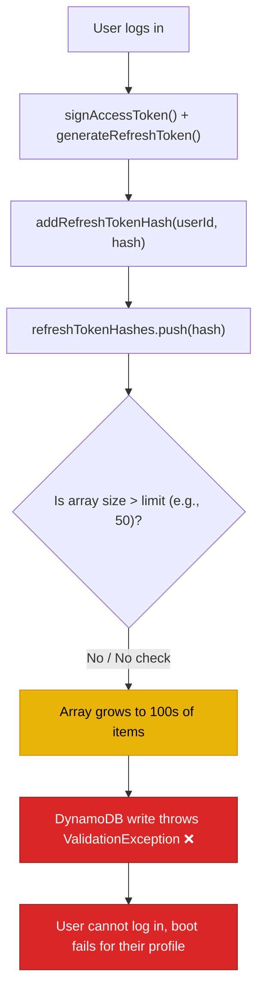

# BUG-07 — Refresh Token Hash Array Grows Unbounded

> **Role**: Backend Engineer · **Priority**: 🟡 Medium · **Effort**: ~1 day
> **Status**: 🔴 Not started. Identified in [userRepository.ts L191](../../../../backend/src/services/userRepository.ts#L191).

---

## Story Identity

| Field | Value |
|:---|:---|
| **Story ID** | `BUG-07` |
| **Owner** | Backend Engineer |
| **Files** | `backend/src/services/userRepository.ts` |
| **Depends on** | None |

---

## 1. Current Problem

Every successful login issues an access token and a refresh token. To allow session revocation, the server persists the SHA-256 hash of the refresh token inside the user's document in the database. In [userRepository.ts](../../../../backend/src/services/userRepository.ts), the handler appends the new hash directly to `refreshTokenHashes`:

```typescript
// backend/src/services/userRepository.ts
async addRefreshTokenHash(userId: string, hash: string): Promise<void> {
  const users = await this.load();
  const u = users.find((x) => x.id === userId);
  if (!u) return;
  if (!u.refreshTokenHashes.includes(hash)) u.refreshTokenHashes.push(hash);
  u.updatedAt = new Date().toISOString();
  await this.persist();
}
```

There is **no limit or array size check** when pushing new token hashes to this array. Over time:
1. Every authentication from a new browser session, mobile app, or client-side agent adds a new element to the array.
2. If the user never logs out explicitly (which clears the specific token or all tokens), the list grows continuously.

If using the DynamoDB provider, this unbounded array will eventually push the size of the user item beyond the hard **400KB DynamoDB item limit**, causing all future write actions (and logins) to fail.



---

## 2. Why It Matters

- **Storage Optimization**: Unbounded lists degrade read/write latency and increase DynamoDB capacity unit consumption.
- **Service Outage**: Users logging in frequently or hitting authenticated endpoints with multiple client agents will hit a hard ceiling where their profile cannot be updated or accessed.

---

## 3. Step-Wise Solution

### Step 3.1 — Define a Max Token Cap
Define a constant `MAX_REFRESH_TOKENS = 30` in [userRepository.ts](../../../../backend/src/services/userRepository.ts) to cap the maximum concurrent sessions per user.

### Step 3.2 — Enforce FIFO Eviction
When adding a new hash, check if the array size exceeds the cap. If so, evict the oldest token hashes (FIFO - First In, First Out) before pushing the new hash:
```typescript
const MAX_REFRESH_TOKENS = 30;

// Inside addRefreshTokenHash()
if (!u.refreshTokenHashes.includes(hash)) {
  u.refreshTokenHashes.push(hash);
  // Keep the latest MAX_REFRESH_TOKENS tokens
  if (u.refreshTokenHashes.length > MAX_REFRESH_TOKENS) {
    u.refreshTokenHashes = u.refreshTokenHashes.slice(-MAX_REFRESH_TOKENS);
  }
}
```

### Step 3.3 — Implement Expiry Cleanup
Additionally, store the token creation timestamp alongside the hash so that a scheduled background cron or inline check can evict hashes that are older than `REFRESH_TTL` (7 days).

---

## 4. Done When

- [ ] `addRefreshTokenHash` caps the maximum session count.
- [ ] Old tokens are automatically evicted using FIFO when the cap is reached.
- [ ] Database profiles remain well below the 400KB limit under simulated login spam.
- [ ] `npm run build` compiles successfully.

---

## 5. Cross-References

| Document | Relevance |
|:---|:---|
| [userRepository.ts](../../../../backend/src/services/userRepository.ts) | Session token persistence repository |
| [tokens.ts](../../../../backend/src/auth/tokens.ts) | Issuance claims and TTL configuration |
