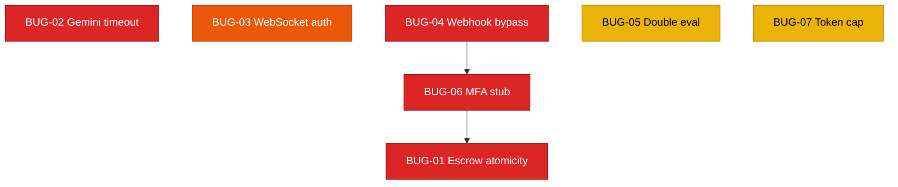
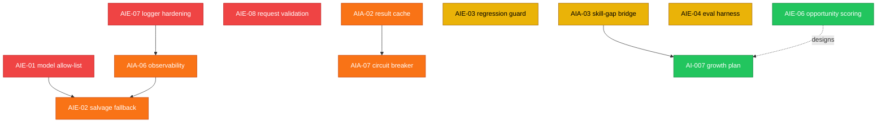

# FixFlowAI — Codebase Hardening Backlog

> **Engineering stories for security auditing, robustness, and fault tolerance.** Each story is a self-contained `.md` containing the current problem, why it matters, a step-wise solution, Mermaid visuals, and "done when" acceptance criteria.

---

## ⚠️ Backlog Scope

This backlog focuses entirely on **bugs, fault tolerance, and security safeguards** discovered during the latest codebase audit. It replaces the previous AI feature backlog (which has been completed or deprecated). These stories are scoped to the existing codebases (TypeScript Backend and Python AI Service).

---

## Role Definitions

| Role | Responsibility | Code Surface |
|:---|:---|:---|
| **Backend Engineer** | Core API security, performance, FSM transitions, database transaction integrity, token caching | `backend/src/services/*`, `backend/src/skills/*`, `backend/src/routes/*` |
| **AI Engineer** | AI pipeline logic, LLM parameter optimization, multi-agent validation loops | `ai-service/app/features/*`, `ai-service/app/schemas/*` |
| **AI Automation Engineer** | Async retries, timeout guard rails, API retry logic with exponential backoff | `ai-service/app/llm/*`, `ai-service/app/config.py` |
| **Security Auditor** | Payment signature verification, OAuth safety, MFA validation mechanics | All layers |

---

## Story Registry

| ID | Story | Priority | Effort | Touches |
|:---|:---|:---:|:---:|:---|
| `BUG-01` | [Escrow Race Condition](./BUG-01-escrow-race-condition.md) | 🔴 Critical | ~1 day | `escrowService.ts`, `milestoneRepository.ts` |
| `BUG-02` | [Gemini Unbounded Request Hang](./BUG-02-gemini-unbounded-hang.md) | 🔴 Critical | ~2 days | `gemini.py`, `config.py` |
| `BUG-03` | [WebSocket Sync Missing Auth](./BUG-03-websocket-sync-auth.md) | 🟡 High | ~2 days | `syncServer.ts`, `index.ts` |
| `BUG-04` | [Razorpay Webhook Bypass](./BUG-04-razorpay-webhook-bypass.md) | 🔴 Critical | ~1 day | `paymentService.ts`, `index.ts` |
| `BUG-05` | [Confidence Grid Double-Evaluation](./BUG-05-confidence-grid-double-eval.md) | 🟡 Medium | ~1 day | `confidence_grid.py` |
| `BUG-06` | [MFA Verifier Stub Bypass](./BUG-06-mfa-verifier-stub.md) | 🔴 Critical | ~1 day | `escrowService.ts` |
| `BUG-07` | [Refresh Token Unbounded Growth](./BUG-07-refresh-token-unbounded-grow.md) | 🟡 Medium | ~1 day | `userRepository.ts` |

---

## Dependency Map

---

## Suggested Execution Order

We recommend resolving stories in three phases:

1. **Phase 1: Financial Safety (Critical)**
   - **BUG-04** (Webhook signature validation bypass)
   - **BUG-06** (MFA verifier stub bypass)
   - **BUG-01** (Non-atomic escrow saves)
   *These three together form a critical path where attackers can trigger fake payments and release funds.*

2. **Phase 2: Platform Resilience**
   - **BUG-02** (Gemini request timeouts and exponential backoff)
   - **BUG-03** (WebSocket collaboration route auth checks)

3. **Phase 3: Cleanup & Optimization**
   - **BUG-05** (Confidence grid double-evaluation redundancy)
   - **BUG-07** (Refresh token array growth limit check)

> **Note:** `BUG-02`, `BUG-05`, and `BUG-07` are **✅ done** — the story files are retained for history. The remaining `BUG-*` items are being handled separately by the backend/security track.

---

## 🤖 AI Engineer Backlog (AIE / AIA / AI-007)

> A dedicated backlog for the **AI Engineer** and **AI Automation Engineer**, scoped entirely to `ai-service/app/*`. These stories cover AI bug fixes, robustness hardening, and net-new AI feature development. Each follows the same structure as the `BUG-*` stories (problem → why → step-wise solution → done-when → cross-refs) and is grounded in the current Python AI service code.

### AI Engineer (AIE) — pipeline logic, prompts, schemas, quality

| ID | Story | Priority | Effort | Touches |
|:---|:---|:---:|:---:|:---|
| `AIE-01` | [Model allow-list enforcement & fail-fast](./AIE-01-model-allowlist-failfast.md) | 🔴 Critical | ~0.5 day | `config.py`, `gemini.py`, `main.py` |
| `AIE-02` | [Brief parser discards partial LLM output](./AIE-02-brief-parser-salvage-fallback.md) | 🔴 Critical | ~1 day | `brief_parser.py` |
| `AIE-03` | [Confidence grid regression-guard baseline bug](./AIE-03-confidence-grid-regression-guard.md) | 🟡 High | ~1 day | `confidence_grid.py`, `config.py` |
| `AIE-04` | [Golden AI evaluation harness](./AIE-04-ai-eval-harness.md) | 🟡 High | ~2 days | `ai-service/eval/*` |
| `AIE-06` | [Opportunity intelligence scoring (AI-005)](./AIE-06-opportunity-intelligence-scoring.md) | 🟡 High | ~2 days | `schemas/opportunity.py`, `features/opportunity.py` |
| `AIE-07` | [Fallback logger crashes on missing fields](./AIE-07-fallback-logger-hardening.md) | 🟡 Medium | ~0.5 day | `fallback_logger.py` |
| `AIE-08` | [`Union[..., Any]` disables request validation](./AIE-08-request-model-any-union-validation-hole.md) | 🟡 Medium | ~0.5 day | `main.py`, `interview.py`, `extensions.py` |

### AI Automation Engineer (AIA) — resilience, cost, telemetry, pipelines

| ID | Story | Priority | Effort | Touches |
|:---|:---|:---:|:---:|:---|
| `AIA-02` | [Gemini result cache](./AIA-02-gemini-result-cache.md) | 🟡 High | ~1 day | `cache.py`, `gemini.py`, `config.py` |
| `AIA-03` | [Deterministic skill-gap bridge → interview](./AIA-03-deterministic-skill-gap-bridge.md) | 🟡 High | ~1.5 days | `features/skill_gap.py`, `interview.py` |
| `AIA-06` | [AI observability & telemetry](./AIA-06-ai-observability-telemetry.md) | 🟡 High | ~1.5 days | `telemetry.py`, `gemini.py`, `main.py` |
| `AIA-07` | [Gemini circuit breaker](./AIA-07-gemini-circuit-breaker.md) | 🟡 Medium | ~1 day | `llm/circuit_breaker.py`, `gemini.py` |

### New Feature

| ID | Story | Priority | Effort | Touches |
|:---|:---|:---:|:---:|:---|
| `AI-007` | [Freelancer confidence growth plan engine](./AI-007-freelancer-growth-plan-engine.md) | 🟡 High | ~2.5 days | `schemas/growth.py`, `features/growth.py`, `main.py` |

### Suggested AI Engineer Execution Order

**Recommended sequence:** quick correctness/robustness wins first (`AIE-01`, `AIE-07`, `AIE-08`), then trust + resilience (`AIE-02`, `AIA-06`, `AIA-02`, `AIA-07`), then quality & signal (`AIE-03`, `AIA-03`, `AIE-04`), and finally net-new engines (`AIE-06`, `AI-007`).
