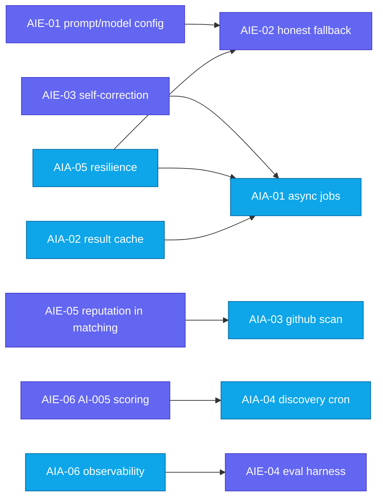

# FixFlowAI — AI Team Story Backlog

> Engineering stories for the **AI Engineer** and **AI Automation Engineer**. Each story is a self-contained `.md` with the current problem, why it matters, a step-wise solution, Mermaid visuals, and "done when" acceptance criteria.

> These stories are scoped to the **AI layer only** (the six `AI-00x` subsystems and the automation around them). Infrastructure, auth-wiring, payments, and frontend work live in the [go-live roadmap](../../go_live_roadmap.md) and [backend connectivity roadmap](../../architecture/backend_connectivity_roadmap.md).

---

## Role Definitions

| Role | Owns | Code surface |
|:---|:---|:---|
| **AI Engineer** | LLM intelligence quality — prompts, schemas, model selection, output reliability, evaluation, scoring design | `skills/briefParser.ts`, `skills/confidenceGrid.ts`, `skills/interviewGenerator.ts`, `skills/contextExtensions.ts`, `services/matchingEngine.ts` |
| **AI Automation Engineer** | Everything around the AI — async jobs, queues/workers, scheduled discovery, GitHub scanning, retries/idempotency, caching, observability | new job/worker layer, connectors, cache layer, telemetry |

---

## Story Registry

### AI Engineer

| ID | Story | Priority | Touches |
|:---|:---|:---:|:---|
| `AIE-01` | [Fix brand + model-config drift in prompts](./AIE-01-prompt-brand-model-config.md) | 🔴 Critical | briefParser, confidenceGrid, index |
| `AIE-02` | [Make Brief Parser fallback honest (not silent)](./AIE-02-brief-parser-honest-fallback.md) | 🔴 Critical | briefParser |
| `AIE-03` | [Configurable + auditable Confidence Grid self-correction](./AIE-03-confidence-grid-self-correction.md) | 🟡 High | confidenceGrid |
| `AIE-04` | [AI evaluation harness (golden set + regression)](./AIE-04-ai-evaluation-harness.md) | 🟡 High | all skills, test |
| `AIE-05` | [Wire real reputation into the Matching Engine](./AIE-05-reputation-into-matching.md) | 🟡 High | matchingEngine, reputationCalculator |
| `AIE-06` | [Design AI-005 Opportunity Intelligence scoring](./AIE-06-opportunity-intelligence-scoring.md) | 🟡 High | new ai-005 skill |

### AI Automation Engineer

| ID | Story | Priority | Touches |
|:---|:---|:---:|:---|
| `AIA-01` | [Convert blocking AI-002 evaluation to async job + poll](./AIA-01-async-evaluation-jobs.md) | 🔴 Critical | confidenceGrid, jobs layer |
| `AIA-02` | [Gemini result cache layer](./AIA-02-gemini-result-cache.md) | 🟡 High | all AI skills |
| `AIA-03` | [Automate GitHub scan pipeline feeding AI-003](./AIA-03-github-scan-pipeline.md) | 🟡 High | interviewGenerator, new scanner |
| `AIA-04` | [AI-005 discovery automation (connectors + cron)](./AIA-04-opportunity-discovery-automation.md) | 🟡 High | new connectors, scheduler |
| `AIA-05` | [Resilience for all Gemini calls (retry/timeout/breaker)](./AIA-05-gemini-call-resilience.md) | 🔴 Critical | shared Gemini wrapper |
| `AIA-06` | [AI observability — logs, metrics, alarms](./AIA-06-ai-observability.md) | 🟡 High | shared telemetry |

---

## Dependency Map

---

## Suggested Execution Order

1. **AIE-01** (config correctness) — unblocks everything; small.
2. **AIA-05** (resilience wrapper) — every later AI call rides on it.
3. **AIE-02** + **AIA-06** (honest failures + observability) — stop hiding errors.
4. **AIA-02** (caching) + **AIA-01** (async eval) — cost & latency.
5. **AIE-03** (self-correction) on top of async eval.
6. **AIE-05** + **AIA-03** (matching quality + GitHub scan).
7. **AIE-04** (eval harness) — ongoing quality gate.
8. **AIE-06** + **AIA-04** (AI-005 net-new).

---

## Cross-References

| Document | Relevance |
|:---|:---|
| [AI Features Index](../README.md) | The six `AI-00x` subsystems |
| [Implementation Playbook](../ai_features_implementation_playbook.md) | Current state of each route |
| [Go-Live Roadmap](../../go_live_roadmap.md) | Phase 5 (optional AI) context |
| [Serverless Migration Plan](../../architecture/serverless_migration_plan.md) | Async AI + deployment constraints |
| [Opportunity Intelligence Build Guide](../opportunity_intelligence_build_guide.md) | Source material for AIE-06 / AIA-04 |
