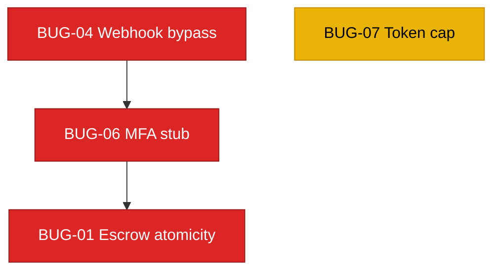

# FixFlowAI — Codebase Hardening Backlog

> **📍 Canonical AI-service status board:** [`docs/stories/ai-service/README.md`](../../../stories/ai-service/README.md).
> As of 2026-07-19 the AI-service story statuses were re-verified against the code. **Completed story files have been removed** (they are recoverable from git history). This backlog now lists only stories with **remaining work**.

> **Engineering stories for security auditing, robustness, and fault tolerance.** Each story is a self-contained `.md` containing the current problem, why it matters, a step-wise solution, Mermaid visuals, and "done when" acceptance criteria.

---

## ⚠️ Backlog Scope

This backlog focuses on **bugs, fault tolerance, and security safeguards** discovered during codebase audits, plus AI-pipeline quality improvements. Stories are scoped to the existing codebases (TypeScript Backend and Python AI Service).

---

## Role Definitions

| Role | Responsibility | Code Surface |
|:---|:---|:---|
| **Backend Engineer** | Core API security, performance, FSM transitions, database transaction integrity, token caching | `backend/src/services/*`, `backend/src/skills/*`, `backend/src/routes/*` |
| **AI Engineer** | AI pipeline logic, LLM parameter optimization, multi-agent validation loops | `ai-service/app/features/*`, `ai-service/app/schemas/*` |
| **AI Automation Engineer** | Async retries, timeout guard rails, API retry logic with exponential backoff | `ai-service/app/llm/*`, `ai-service/app/config.py` |
| **Security Auditor** | Payment signature verification, OAuth safety, MFA validation mechanics | All layers |

---

## Backend / Security Backlog (remaining)

| ID | Story | Priority | Effort | Touches |
|:---|:---|:---:|:---:|:---|
| `BUG-01` | [Escrow Race Condition](./BUG-01-escrow-race-condition.md) | 🔴 Critical | ~1 day | `escrowService.ts`, `milestoneRepository.ts` |
| `BUG-04` | [Razorpay Webhook Bypass](./BUG-04-razorpay-webhook-bypass.md) | 🔴 Critical | ~1 day | `paymentService.ts`, `index.ts` |
| `BUG-06` | [MFA Verifier Stub Bypass](./BUG-06-mfa-verifier-stub.md) | 🔴 Critical | ~1 day | `escrowService.ts` |
| `BUG-07` | [Refresh Token Unbounded Growth](./BUG-07-refresh-token-unbounded-grow.md) | 🟡 Medium | ~1 day | `userRepository.ts` |

### Dependency Map

### Suggested Execution Order

1. **Financial Safety (Critical):** **BUG-04** (webhook signature bypass) → **BUG-06** (MFA verifier stub) → **BUG-01** (non-atomic escrow saves). Together these form a critical path where an attacker could trigger fake payments and release funds.
2. **Cleanup:** **BUG-07** (refresh-token array growth cap).

> **Removed as completed (git-recoverable):** `BUG-02` (Gemini timeout), `BUG-03` (WebSocket auth), `BUG-05` (confidence-grid double-eval).

---

## 🤖 AI Engineer Backlog (remaining)

> Scoped to `ai-service/app/*`. The full, code-verified AI-service status board lives in the [canonical index](../../../stories/ai-service/README.md).

| ID | Story | Priority | Effort | Touches |
|:---|:---|:---:|:---:|:---|
| `AIE-04` | [Golden AI evaluation harness](./AIE-04-ai-eval-harness.md) | 🟡 High | ~2 days | `ai-service/eval/*` |
| `AIE-09` | [Confidence grid hybrid deterministic scoring](../../../stories/ai-service/AIE-09-confidence-grid-hybrid-scoring.md) 🆕 | 🔴 Critical | ~2.5 days | `confidence_grid.py`, `schemas/confidence.py`, `config.py` |
| `AIE-10` | [Brief parser ungrounded confidence numbers](../../../stories/ai-service/AIE-10-brief-parser-ungrounded-confidence.md) 🆕 | 🟡 High | ~1.5 days | `brief_parser.py`, `schemas/proposal.py` |

### Recommended sequence

**AIE-10** (ground per-feature confidence at the source) → **AIE-09** (make the confidence grid deterministic + explainable) → **AIE-04** (golden-set harness to regression-gate the now-deterministic scores).

> **Removed as completed (git-recoverable):** `AIE-01`, `AIE-02`, `AIE-03`, `AIE-06`, `AIE-07`, `AIE-08`, `AIA-02`, `AIA-03`, `AIA-06`, `AIA-07`, `AI-007`.
