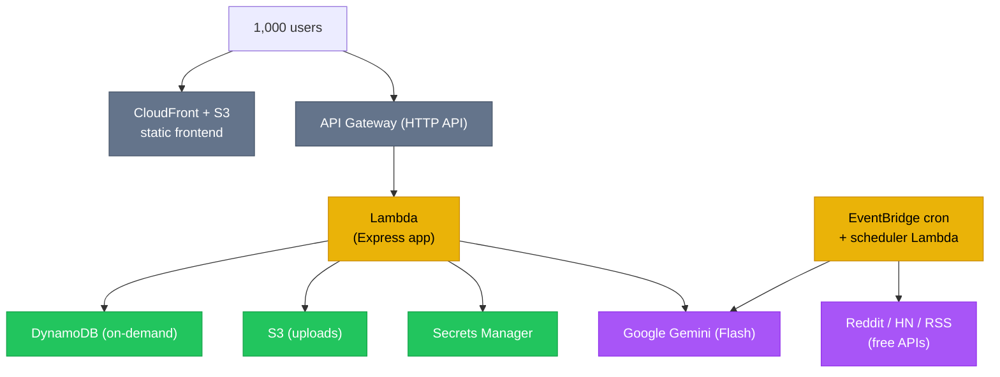
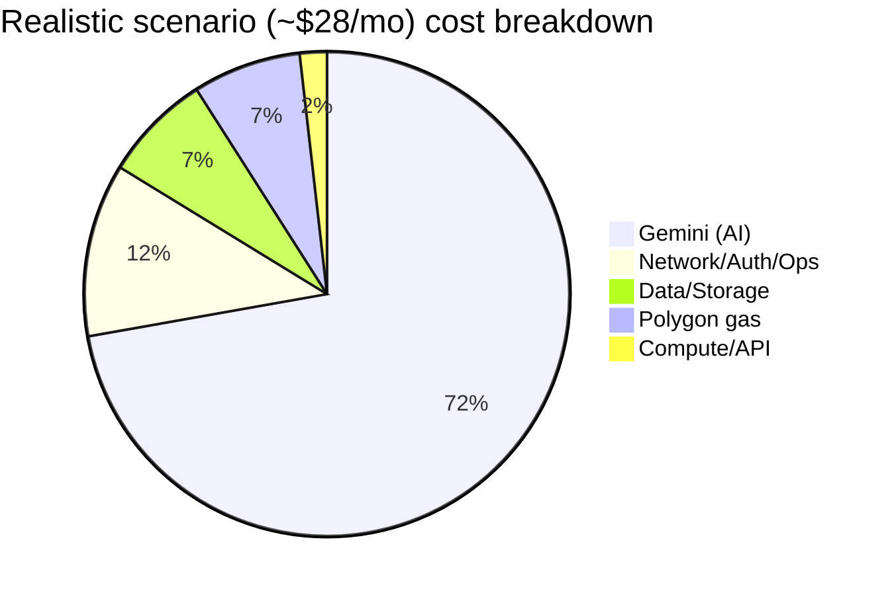

# FixFlowAI — Monthly Cost Analysis at 1,000 Users

> **Purpose:** A realistic, line-by-line estimate of what FixFlowAI costs to run per month at **1,000 monthly active users (MAU)**, using a cost-optimized AWS serverless + managed-API stack. Every number ties to a stated assumption so you can adjust it for your real traffic.

> ⚠️ **Pricing disclaimer:** Figures are indicative for AWS region **us-east-1** and provider pricing observed in **2026**. Cloud and LLM prices change often and vary by region (e.g. `ap-south-1` differs). Treat this as a planning model, not a quote — verify against the [AWS Pricing Calculator](https://calculator.aws/) and current Gemini pricing before budgeting.

---

## 1. Traffic model (the assumptions everything depends on)

These drive every cost below. If your real usage differs, scale the relevant line.

| Assumption | Value | Notes |
|:---|:---|:---|
| Monthly active users (MAU) | **1,000** | The headline target |
| Share active in a given week | 35% | ~350 weekly actives |
| API requests / active user / month | 200 | Page loads, dashboard tabs, polling |
| **Total API requests / month** | **~500,000** | 1,000 × 200, rounded up for safety |
| Briefs parsed / month (AI-001) | 1,000 | ~1 per user |
| Proposal evaluations / month (AI-002) | 800 | 2–3 Gemini calls each |
| Interview generations / month (AI-003) | 300 | |
| Contract-extension suggestions (AI-004) | 200 | |
| Matching runs / month (AI-006) | 1,500 | Math-only, **no LLM cost** |
| AI-005 discovery posts processed / month | 900 | ~30/day, 1 Gemini extraction each |
| Avg file uploads / user | 20 MB | Briefs, deliverables, evidence |
| **Total S3 storage** | **~25 GB** | Grows over time |
| Avg Lambda duration | 200 ms | Most routes; Gemini calls handled async/streamed |
| Avg Lambda memory | 256 MB | Sufficient for I/O-bound API work |

---

## 2. Architecture under costing

**Design choice that drives the low cost:** everything is **serverless and pay-per-use** (Lambda, API Gateway HTTP API, DynamoDB on-demand, S3). There are no always-on servers, so at 1,000 users you pay for actual activity, and most of it lands inside AWS free-tier allowances.

---

## 3. AWS infrastructure costs

### 3.1 Compute & API

| Service | Usage | Unit price | Before free tier | After free tier |
|:---|:---|:---|---:|---:|
| **Lambda — requests** | 500K invocations | $0.20 / 1M | $0.10 | **$0.00** (1M free/mo, always) |
| **Lambda — compute** | 500K × 0.25 GB × 0.2 s = 25K GB-s | $0.0000167 / GB-s | $0.42 | **$0.00** (400K GB-s free/mo, always) |
| **API Gateway (HTTP API)** | 500K requests | $1.00 / 1M | $0.50 | **$0.50** |
| **EventBridge (cron)** | ~180 scheduled events/mo | First 14M free | $0.00 | **$0.00** |

> **HTTP API, not REST API.** API Gateway HTTP APIs are ~70% cheaper ($1.00/M vs $3.50/M) and lower latency. Use them unless you need REST-only features.

**Subtotal compute/API: ~$0.50/month**

### 3.2 Data & storage

| Service | Usage | Unit price | Cost |
|:---|:---|:---|---:|
| **DynamoDB — writes** | ~500K write request units | $1.25 / 1M WRU | $0.63 |
| **DynamoDB — reads** | ~2M read request units | $0.25 / 1M RRU | $0.50 |
| **DynamoDB — storage** | ~5 GB | First 25 GB free | $0.00 |
| **S3 — storage** | 25 GB | $0.023 / GB | $0.58 |
| **S3 — requests** | ~200K GET/PUT | GET $0.0004/1K, PUT $0.005/1K | ~$0.30 |

**Subtotal data/storage: ~$2.00/month**

> **Why DynamoDB on-demand (not provisioned):** at this scale, on-demand avoids capacity planning and idle charges. Switch to provisioned + auto-scaling only above ~1M requests/day, where reserved capacity becomes cheaper.

### 3.3 Network, auth, secrets, ops

| Service | Usage | Unit price | Cost |
|:---|:---|:---|---:|
| **CloudFront** | ~50 GB egress + requests | First 1 TB egress free (new tier) | **$0.00** |
| **Google OAuth** | ID-token verification | Free | **$0.00** |
| **JWT sessions** | In-app (your Lambda) | No external service | **$0.00** |
| **Secrets Manager** | ~3 secrets | $0.40 / secret / mo | $1.20 |
| **CloudWatch Logs** | ~5 GB ingest | First 5 GB free, then $0.50/GB | ~$0.50 |
| **Route 53** | 1 hosted zone | $0.50 / zone / mo | $0.50 |
| **SES (email)** | ~5K emails | $0.10 / 1K | $0.50 |

**Subtotal network/auth/ops: ~$3.20/month**

> **Auth is effectively free.** Because you chose **Google OAuth + your own JWT** (not Cognito's paid MAU tiers), there's no per-user auth charge. Verifying Google ID tokens and signing JWTs happens inside your existing Lambda.

> **Cost-cut option:** move secrets to **SSM Parameter Store (Standard)** instead of Secrets Manager — Parameter Store standard parameters are **free**. Saves the $1.20. Use Secrets Manager only if you need automatic rotation.

---

## 4. AI / LLM costs (the real variable — and the biggest lever)

This is where model choice matters most. The same workload on **Gemini Flash** vs **Gemini Pro** differs by ~10–20×, with little quality loss for structured extraction tasks.

### 4.1 Estimated Gemini calls / month

| Feature | Calls/mo | ~Input tok | ~Output tok |
|:---|---:|---:|---:|
| AI-001 Brief parsing | 1,000 | 2,000 | 3,000 |
| AI-002 Confidence grid (2.5 calls each × 800) | 2,000 | 3,000 | 1,500 |
| AI-003 Interview generation | 300 | 2,000 | 1,500 |
| AI-004 Contract extensions | 200 | 1,500 | 1,500 |
| AI-005 Opportunity extraction | 900 | 1,500 | 800 |
| AI-006 Fit reasons | 500 | 2,000 | 1,000 |
| **Total** | **~4,900** | — | — |
| **Approx total tokens** | — | ~11M input | ~9M output |

> AI-006 *scoring* is pure math — **zero LLM cost**. Only the optional "fit reasons" use Gemini.

### 4.2 Cost by model choice

| Model | Input price | Output price | Monthly AI cost (≈11M in / 9M out) | Verdict |
|:---|:---|:---|---:|:---|
| **Gemini Flash** (e.g. 2.5/2.0 Flash) | ~$0.10–0.15 / 1M | ~$0.40–0.60 / 1M | **~$5–10** | ✅ Use for everything by default |
| **Gemini Pro** (e.g. 2.5 Pro) | ~$1.25 / 1M | ~$5–10 / 1M | **~$60–100** | ⚠️ Reserve for hardest tasks only |
| **Hybrid** (Flash everywhere, Pro only for AI-002 grid) | mixed | mixed | **~$15–25** | ✅ Best quality/cost balance |

**Recommendation: default to Flash, use the Hybrid only if evaluation quality demands it.** Flash is fast and more than adequate for schema-constrained JSON extraction (which is what most of these tasks are).

> ⚠️ **Config note:** your `.env` currently has `GEMINI_MODEL=Gemini 3.5 Flash`. That is **not a valid model ID** and AI calls will fail. Set a real ID such as `gemini-2.5-flash` (or the current Flash ID for your account).

**Subtotal AI (Flash default): ~$5–10/month**

---

## 5. Third-party & blockchain (transaction-based, not fixed)

These scale with *transactions*, not users, and several are pass-through (paid from the payment itself, not your platform budget).

| Service | Model | At 1,000 users | Notes |
|:---|:---|:---|:---|
| **Razorpay (fiat escrow)** | ~2% + ₹3 per transaction | Pass-through | Deducted from the payment flow, not your infra bill. Already modeled in `earningsCalculator`. |
| **Polygon (SBT minting)** | Gas per mint | ~$0–5 | Pennies per mint on Polygon; use testnet (Amoy) in dev = $0. Batch mints to reduce. |
| **AI-005 free sources** (Reddit, HN, RSS) | Free APIs | **$0.00** | Covered in the opportunity build guide |
| **AI-005 paid search (Tavily)** — *optional* | ~$0.01 / query | ~$12 | Only if you enable broader discovery |
| **Apollo enrichment** — *optional* | Free tier 100/mo | $0–49 | Only if you enable company enrichment |

**Subtotal third-party (free-source MVP): ~$0–5/month**

---

## 6. Total monthly cost — three scenarios

| Cost area | Lean (free sources, Flash) | Realistic (Hybrid AI) | With paid discovery |
|:---|---:|---:|---:|
| Compute & API | $0.50 | $0.50 | $0.50 |
| Data & storage | $2.00 | $2.00 | $2.50 |
| Network / auth / ops | $3.20 | $3.20 | $3.20 |
| AI / LLM (Gemini) | $7.00 | $20.00 | $20.00 |
| Polygon gas | $2.00 | $2.00 | $2.00 |
| Paid discovery (Tavily/Apollo) | $0.00 | $0.00 | $60.00 |
| **Total / month** | **≈ $15** | **≈ $28** | **≈ $88** |
| **Cost per user / month** | **$0.015** | **$0.028** | **$0.088** |

**Takeaway:** infrastructure is a rounding error (~$6/mo). **AI is ~70% of the bill**, so AI optimization is where the money is.

---

## 7. Cost-reduction levers (without degrading performance)

Ranked by impact. Each keeps or improves UX.

| # | Lever | Saving | Performance impact |
|:---|:---|:---|:---|
| 1 | **Use Gemini Flash by default**, Pro only where measurably better | $50–90/mo vs all-Pro | Flash is *faster*; quality parity on JSON tasks |
| 2 | **Cache AI results** — never re-parse/re-evaluate an unchanged proposal | 30–50% of AI calls | Faster (instant cache hits) |
| 3 | **Math over LLM** — AI-006 scoring & AI-005 scoring are pure functions | Avoids ~2K LLM calls/mo | Faster, deterministic |
| 4 | **SSM Parameter Store** instead of Secrets Manager | $1.20/mo | None |
| 5 | **HTTP API** instead of REST API Gateway | ~$0.35/mo + lower latency | Faster |
| 6 | **S3 lifecycle → Intelligent-Tiering / Glacier** for old deliverables | 50–90% on cold storage | None (rarely accessed files) |
| 7 | **CloudFront caching** of static + cacheable API responses | Fewer Lambda/API hits | Faster (edge cached) |
| 8 | **Batch Polygon mints** / use Amoy testnet in non-prod | Most gas cost | None |
| 9 | **DynamoDB on-demand now**, provisioned only past ~1M req/day | Avoids idle capacity | None |
| 10 | **Free discovery sources first** (Reddit/HN/RSS); add Tavily/Apollo only when ROI proven | $60/mo | None at MVP |
| 11 | **Right-size Lambda memory** (256 MB for I/O-bound routes) | Compute stays free-tier | None |
| 12 | **Gemini prompt hygiene** — trim system prompts, cap output tokens | 10–20% of token cost | None |

---

## 8. What changes as you scale

| Scale | What shifts | Action |
|:---|:---|:---|
| **1K → 10K users** | AI cost scales ~linearly (~$70–200/mo); infra still mostly free-tier | Add result caching aggressively; consider Gemini batch API |
| **10K → 100K users** | DynamoDB & Lambda leave free tier; egress grows | Move DynamoDB to provisioned+autoscaling; add CloudFront API caching; consider reserved capacity |
| **Heavy real-time use** | WebSocket sync on Lambda adds connection-minute cost | Evaluate API Gateway WebSocket vs a small Fargate service |
| **AI becomes dominant** | Gemini is >80% of bill | Negotiate committed-use pricing; cache + batch; fine-tune a smaller model for extraction |

**Rule of thumb:** at this architecture, **cost-per-user stays roughly flat** (~$0.02–0.09) as you grow, because everything is pay-per-use. The step-changes come from leaving AWS free tiers, not from architecture rewrites.

---

## 9. 12-month free-tier caveat

Some allowances used above are **AWS Free Tier (first 12 months)**, others are **Always Free**:

| Allowance | Type |
|:---|:---|
| Lambda 1M requests + 400K GB-s / mo | **Always free** |
| DynamoDB 25 GB storage | **Always free** |
| CloudWatch 5 GB logs | **Always free** |
| EventBridge 14M events | **Always free** |
| CloudFront 1 TB egress (new tier) | Always free (current terms) |
| S3 5 GB, API Gateway 1M calls | **12-month free tier only** |

After month 12, the 12-month items add a few extra dollars — still well under $10 of infra. **AI remains the dominant cost throughout.**

---

## 10. Bottom line

- **Realistic monthly cost at 1,000 users: ~$28** (≈ $0.03/user).
- **Infrastructure is ~$6**; **AI is ~$20**; the rest is blockchain gas.
- The single most important cost decision is **model choice (Flash vs Pro) + caching** — get that right and you can run 1,000 users for the price of a couple of coffees.
- Razorpay fees are pass-through (paid from transactions), not a platform cost.

> Re-run these numbers in the [AWS Pricing Calculator](https://calculator.aws/) with your real region and the current Gemini price sheet before committing to a budget.
