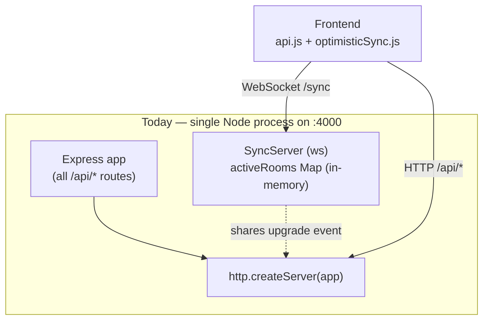
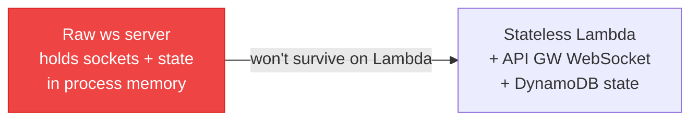
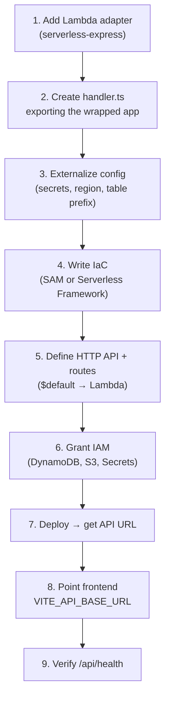
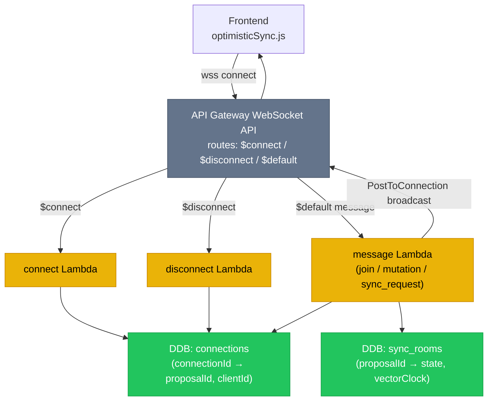
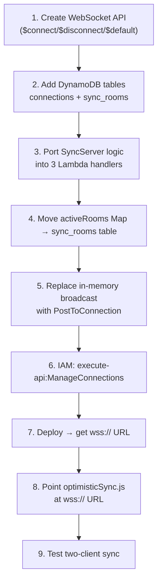
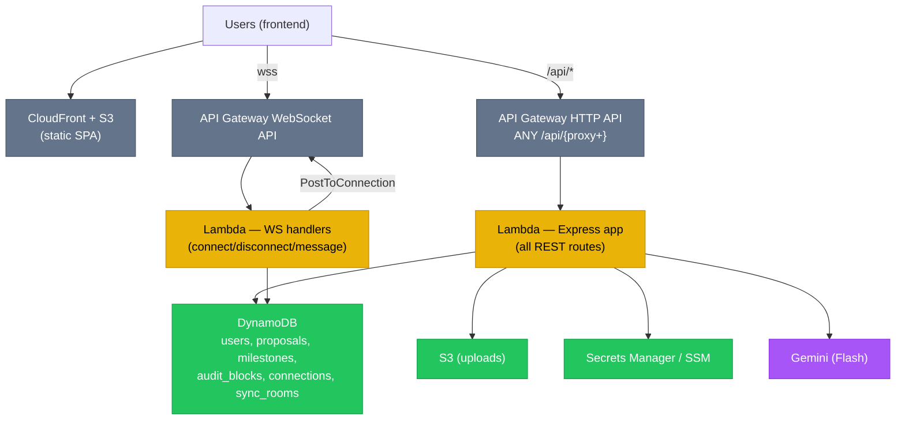

# FixFlowAI — Serverless Migration Plan (REST + WebSocket)

> **Purpose:** A detailed, step-by-step plan to move the two compute concerns onto AWS serverless:
>
> | Concern | From (today) | To (target) | Why |
> |:---|:---|:---|:---|
> | **REST APIs** (`/api/*`) | Express on port 4000 | **Lambda + API Gateway HTTP API** | Scale-to-zero, pay-per-use, no server to manage |
> | **Real-time sync** (WebSocket) | Raw `ws` package on the same HTTP server | **API Gateway WebSocket + Lambda** *(or keep on Fargate)* | Raw `ws` cannot run on Lambda — needs a connection-oriented model |
>
> Explanation-first, diagrams included, minimal code. Follow the phases in order.

---

## 1. Where these live in the project today

### 1.1 REST APIs — every route

All routes are registered in `backend/src/index.ts`, plus an auth sub-router in `backend/src/routes/auth.ts`. They run inside one Express app on a raw HTTP server (`createServer(app).listen(4000)`).

| Method | Route | Source | Notes |
|:---|:---|:---|:---|
| GET | `/api/health` | index.ts | Liveness + feature flags |
| POST | `/api/proposals/parse` | index.ts | AI-001 (Gemini) |
| POST | `/api/proposals/evaluate` | index.ts | AI-002 (Gemini ×2–3) |
| POST | `/api/interview-questions` | index.ts | AI-003 (Gemini) |
| POST | `/api/contract-extensions` | index.ts | AI-004 (Gemini) |
| POST | `/api/earnings` | index.ts | Pure math |
| POST | `/api/reputation` | index.ts | Pure math |
| POST | `/api/client-score` | index.ts | Pure math |
| POST | `/api/leads/match` | index.ts | AI-006 (math + repo) |
| POST | `/api/escrow/milestones` | index.ts | Escrow FSM |
| GET | `/api/escrow/milestones` | index.ts | List milestones |
| GET | `/api/escrow/milestones/:id` | index.ts | One milestone |
| GET | `/api/escrow/milestones/:id/audit` | index.ts | Audit chain |
| POST | `/api/escrow/milestones/:id/transition` | index.ts | FSM transition |
| GET | `/api/sync/rooms/:proposalId` | index.ts | Sync telemetry (REST) |
| POST | `/api/auth/google` | routes/auth.ts | Google sign-in |
| POST | `/api/auth/refresh` | routes/auth.ts | Token rotation |
| POST | `/api/auth/logout` | routes/auth.ts | Revoke one device |
| POST | `/api/auth/logout-all` | routes/auth.ts | Revoke all |
| GET | `/api/auth/me` | routes/auth.ts | Current user |
| PATCH | `/api/auth/me/role` | routes/auth.ts | Change role |

**Frontend consumer:** `frontend/src/lib/api.js` — a single client that prefixes every call with `${VITE_API_BASE_URL}/api`. In dev, Vite proxies `/api` → `http://localhost:4000`.

### 1.2 Real-time sync — the WebSocket

| Piece | Source | Role |
|:---|:---|:---|
| `SyncServer` class | `backend/src/skills/syncServer.ts` | Owns the `ws` `WebSocketServer`, handles `join` / `mutation` / `sync_request` frames |
| In-memory `activeRooms` Map | same file | Per-proposal room: cached state, vector clock, connected sessions |
| Attachment | `index.ts` → `new SyncServer(server)` | Hooks the HTTP `upgrade` event for path `/sync` |
| Telemetry route | `GET /api/sync/rooms/:proposalId` | Reads room metadata (REST) |
| **Frontend consumer** | `frontend/src/skills/optimisticSync.js` | `OptimisticSyncCoordinator.connect(wsUrl)` opens `new WebSocket(...)`, sends `join`/`mutation`, applies vector-clock conflict resolution |



---

## 2. Why migrate — and why WebSocket is the hard part

### 2.1 REST on Lambda: easy
Express handles a request and returns a response — a perfect fit for Lambda's request/response model. An adapter translates API Gateway events into the `(req, res)` your routes already expect. **No route logic changes.**

### 2.2 WebSocket on Lambda: needs a redesign
Lambda functions are **stateless and short-lived** — they cannot hold an open socket or keep an in-memory `activeRooms` Map between messages. Two consequences:

1. **Connection lifecycle** must move to **API Gateway WebSocket**, which invokes a Lambda per event (`$connect`, `$disconnect`, message) and tracks connection IDs for you.
2. **Room state** (`activeRooms`, vector clocks, the cached proposal) must move out of process memory into **DynamoDB**, because each message may hit a different Lambda instance.
3. **Broadcasting** changes from "loop over in-memory sockets" to calling the API Gateway **`PostToConnection`** API for each stored connection ID.



---

## 3. REST migration — Lambda + API Gateway HTTP API

### 3.1 Choose the packaging strategy

| Option | What you do | When to pick |
|:---|:---|:---|
| **A — Wrap the whole Express app** *(recommended)* | One Lambda runs the existing app via an adapter; API Gateway routes all `/api/*` to it | Now. Fastest, least risk, identical local + cloud code |
| **B — One Lambda per route** | Split each route into its own function | Later, only if a specific route gets hot and needs independent scaling/cold-start tuning |

**Pick A.** Your routes are small; Gemini latency dominates anyway. You can carve out hot routes later without rewriting.

### 3.2 Steps (Option A)



1. **Add the adapter.** Install a Lambda↔Express adapter (e.g. `@codegenie/serverless-express`). It converts API Gateway HTTP API events into Express `req/res`.
2. **Create a Lambda entry** (`backend/src/lambda.ts`) that imports the existing Express `app` (export it from `index.ts` without calling `listen` in the Lambda path) and wraps it: `export const handler = serverlessExpress({ app })`. Keep `index.ts`'s `listen` for local dev behind a `if (process.env.LOCAL)` guard or a separate `local.ts`.
3. **Externalize configuration.** Replace direct `process.env.GEMINI_API_KEY` reads with a small `config/secrets.ts` that, in Lambda, can pull from **Secrets Manager / SSM** (cache in module scope so it's fetched once per cold start). Locally it still reads `.env`.
4. **Write Infrastructure-as-Code.** Use **AWS SAM** (simplest) or **Serverless Framework**. Define: one `AWS::Serverless::Function` (Node 20, 256–512 MB, 30 s timeout for Gemini calls), one **HTTP API** with a catch-all route `ANY /api/{proxy+}` → the function.
5. **Set the route + CORS** on the HTTP API to allow your frontend origin (`http://localhost:5173`, `https://fixflowai.xyz`).
6. **Grant IAM** least-privilege to the function role: `dynamodb:*Item/Query/Scan` on the `fixflow_*` tables, `s3:GetObject/PutObject` on the uploads bucket, `secretsmanager:GetSecretValue` (or `ssm:GetParameter`).
7. **Deploy** (`sam deploy --guided`). You get an invoke URL like `https://abc123.execute-api.ap-south-1.amazonaws.com`.
8. **Point the frontend** at it: set `VITE_API_BASE_URL` to the API URL for the deployed build. The api.js client already reads this — no code change.
9. **Verify**: `GET /api/health` should return `aiEnabled`/`authEnabled` true once secrets are wired.

### 3.3 Gotchas to plan for
- **Cold starts:** keep the bundle small (esbuild), 256–512 MB memory. Gemini calls dominate latency so cold start is a minor fraction.
- **Timeout:** AI routes can take several seconds; set Lambda timeout to 30 s and the HTTP API integration timeout accordingly.
- **Payload limit:** API Gateway caps payloads at ~10 MB — fine for JSON; large files must go to **S3 via presigned URLs** (don't POST files through the API).
- **Statelessness:** the in-memory escrow `Map` in `escrowService.ts` must move to DynamoDB before going multi-instance (see the AWS migration phase in the cost/architecture docs). Until then it "works" but loses data across cold starts.

### 3.4 Env additions
```dotenv
# Lambda/runtime
LOCAL=                       # set "1" only for local Express dev
SECRETS_PROVIDER=env         # env | secretsmanager | ssm
SECRETS_PREFIX=/fixflow/      # when using SSM Parameter Store
```

---

## 4. WebSocket migration — API Gateway WebSocket + Lambda

### 4.1 The two real options

| Option | Summary | Trade-off |
|:---|:---|:---|
| **1 — API Gateway WebSocket + Lambda** *(serverless)* | Rewrite sync around `$connect`/`$disconnect`/`$default`; state in DynamoDB; broadcast via `PostToConnection` | Scales to zero, fully managed. Requires moving room state to DynamoDB. |
| **2 — Keep `ws` on Fargate** *(pragmatic)* | Run the existing `SyncServer` as a small ECS Fargate service behind an ALB; everything else on Lambda | Almost no code change, but it's an always-on container (~$10–30/mo) and you manage scaling. |

**Recommendation:** if real-time collaboration is core, do **Option 1** (it matches the serverless cost model). If you want to ship the rest now and defer, do **Option 2** or **defer WebSocket entirely** — the dashboard works without live multi-user sync.

### 4.2 Option 1 — target architecture



### 4.3 Steps (Option 1)



1. **Create a WebSocket API** in API Gateway with three routes: `$connect`, `$disconnect`, and `$default` (catch-all for messages). A custom route key selection expression (`$request.body.type`) can split `join`/`mutation`/`sync_request`, or handle all in `$default`.
2. **Add two DynamoDB tables** (extend `infra/dynamodb/`):
   - `connections` — PK `connectionId`; attributes `proposalId`, `clientId`, `role`, `ttl` (auto-expire stale connections).
   - `sync_rooms` — PK `proposalId`; attributes `state` (the cached proposal JSON), `vectorClock`, `lastUpdatedTimestamps`.
3. **Port the `SyncServer` switch logic** (`join` / `mutation` / `sync_request`) from `syncServer.ts` into Lambda handlers. The conflict-resolution functions (`detectClockConflict`, `setNestedProperty`) move over unchanged — they're already pure.
4. **Move room state to `sync_rooms`.** On `join`: read/create the room item, merge vector clocks, write back. On `mutation`: read room, apply the same LWW/vector-clock rules, write back.
5. **Replace broadcasting.** Instead of looping over in-memory sockets, query `connections` for everyone in the `proposalId`, then call API Gateway Management API **`PostToConnection`** for each. Delete connection rows that return `410 Gone`.
6. **Grant IAM** the function `execute-api:ManageConnections` on the WebSocket API plus DynamoDB access to the two tables.
7. **Deploy** → you get a `wss://...execute-api.../{stage}` URL.
8. **Point the frontend** `optimisticSync.js` `connect(wsUrl)` at the `wss://` URL (env-driven, e.g. `VITE_SYNC_WS_URL`). The client's message shapes (`join`, `mutation`) stay the same — the protocol is unchanged.
9. **Test** with two browser tabs editing the same proposal; confirm mutations propagate and conflicts resolve.

### 4.4 Option 2 — keep `ws` on Fargate (minimal change)
1. Containerize the backend (`Dockerfile`, Node 20).
2. Run only the WebSocket concern as an ECS Fargate service behind an Application Load Balancer (ALB supports WebSocket upgrades).
3. Keep all `/api/*` on Lambda; the frontend talks HTTP to API Gateway and `wss://` to the ALB.
4. `activeRooms` can stay in memory **only if you run a single task**; for >1 task you still need shared state (DynamoDB or Redis) — at which point Option 1 is the cleaner end state.

### 4.5 Env additions
```dotenv
# Frontend
VITE_SYNC_WS_URL=wss://<ws-api-id>.execute-api.ap-south-1.amazonaws.com/prod

# Backend (WebSocket Lambdas)
WS_CONNECTIONS_TABLE=fixflow_connections
WS_ROOMS_TABLE=fixflow_sync_rooms
WS_API_ENDPOINT=https://<ws-api-id>.execute-api.ap-south-1.amazonaws.com/prod   # for PostToConnection
```

---

## 5. Combined target topology



---

## 6. Phased rollout & checklist

Ship in this order; each phase is independently deployable.

- [ ] **Phase A — REST on Lambda**
  - [ ] Export Express `app` without auto-`listen` in the Lambda path
  - [ ] Add `lambda.ts` with serverless-express adapter
  - [ ] `config/secrets.ts` (env → Secrets Manager/SSM)
  - [ ] SAM/Serverless template: HTTP API + function + IAM
  - [ ] Deploy; `GET /api/health` green
  - [ ] Frontend `VITE_API_BASE_URL` points at the API
- [ ] **Phase B — persistence (prerequisite for multi-instance)**
  - [ ] DynamoDB-backed repositories replace in-memory `Map`s (escrow, users, etc.)
  - [ ] Verify escrow lifecycle survives across cold starts
- [ ] **Phase C — WebSocket** (only if real-time is needed now)
  - [ ] WebSocket API + `connections` & `sync_rooms` tables
  - [ ] Port SyncServer logic to handlers; broadcast via PostToConnection
  - [ ] Frontend `VITE_SYNC_WS_URL` points at the `wss://` URL
  - [ ] Two-client sync test passes
- [ ] **Phase D — cutover**
  - [ ] CloudFront in front of the SPA + API
  - [ ] Decommission the local `:4000` server from production

---

## 7. Cost & cross-references

- Lambda + HTTP API for this traffic is effectively free-tier (~$0.50/mo) — see [cost_analysis_1000_users.md](./cost_analysis_1000_users.md).
- WebSocket adds connection-minute + message charges; Option 1 still scales to zero, Option 2 (Fargate) is an always-on ~$10–30/mo container.
- DynamoDB tables: provisioning scripts in `infra/dynamodb/`. Add `connections` and `sync_rooms` there when you start Phase C.

| Related doc | Why |
|:---|:---|
| [cost_analysis_1000_users.md](./cost_analysis_1000_users.md) | Cost impact of each compute choice |
| [system_design.md](./system_design.md) | Overall architecture |
| `backend/src/index.ts` | The routes being wrapped |
| `backend/src/skills/syncServer.ts` | The WebSocket logic being ported |
| `frontend/src/lib/api.js` | REST client (set `VITE_API_BASE_URL`) |
| `frontend/src/skills/optimisticSync.js` | WS client (set `VITE_SYNC_WS_URL`) |

---

## 8. Decision summary

1. **REST → Lambda + HTTP API now**, using the wrap-Express approach. Low risk, no route rewrites, near-zero cost.
2. **Persistence first** (DynamoDB repositories) before relying on multi-instance Lambda — the in-memory escrow `Map` is the current blocker.
3. **WebSocket → API Gateway WebSocket** when real-time collaboration becomes a priority; until then it's safe to **defer** or run on **Fargate**. The frontend protocol doesn't change — only the connect URL and where room state lives.
