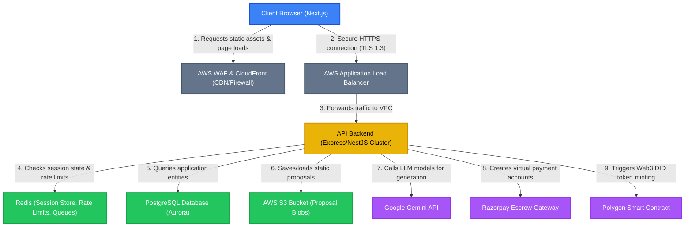
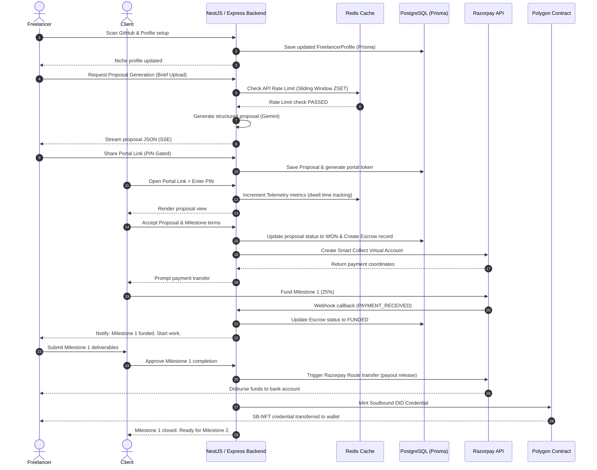

# FixFlowAI - System Design & Architecture Document

This document details the high-level system architecture, technology stack, security boundaries, and end-to-end operational sequence flows for **FixFlowAI**.

---

## 🧠 1. Architectural Overview & Requirements

FixFlowAI is designed as an Enterprise-Grade SaaS platform linking Web2 developers, freelancers, Web3 decentralized escrows, and clients.

### A. Core Tech Stack (Next-Gen Version)

| Architectural Layer | Technology Selected | Purpose |
| :--- | :--- | :--- |
| **Frontend SPA** | Next.js (App Router) + Tailwind CSS + Framer Motion | High-performance user interface, server-side rendering (SSR), and smooth interactive views. |
| **Backend API** | Node.js + Express / NestJS | Core business logic server, controller routes, and server-sent event (SSE) streaming. |
| **Primary Database**| PostgreSQL (hosted on AWS Aurora / RDS) | ACID-compliant relational storage for core entities and structured transaction records. |
| **Database ORM** | Prisma | Typesafe database client, migration management, and relational mapping. |
| **Session & Rate Cache**| Redis (hosted on AWS ElastiCache / Redis Enterprise) | High-speed stateful session storage, rate limiting, and BullMQ task queues. |
| **File Storage** | AWS S3 | Object store for template files, S3-bound briefs, and exported proposal PDFs. |
| **Payment Processor**| Razorpay APIs | Fiat escrow holdings and split-route banking payouts. |
| **Web3 Trust Layer**| Polygon Blockchain + Ethers.js | Decentralized USDC contracts, wallet binds, and Soulbound DID minting. |

---

## 🎨 2. System Architecture Topology

The diagram below maps the runtime infrastructure of FixFlowAI, enforcing separation of concerns between public ingress, private compute, and isolated state layers.

---

## 🔄 3. End-to-End Proposal & Payment Sequence

The following sequence details how a freelancer and client interact with the Next-Gen infrastructure to negotiate, lock funds, and release payments:

---

## 🔒 4. Security, Authentication & Session Specifications

For detailed guidelines regarding token configurations, role matrices, security headers, XSS/CSRF protections, and API rate limits, please refer directly to the [security_architecture.md](file:///c:/Users/suvam/Desktop/VS%20code/Projects/FixFlowAI/docs/specifications/architecture/security_architecture.md) manual.

For architectural and implementation details regarding the five core engineering subsystems (Semantic Brief Parsing, Multi-Agent Orchestration, Milestone State Machine, Real-time Sync, and Self-Correction Loops), see the [skills.md](file:///c:/Users/suvam/Desktop/VS%20code/Projects/FixFlowAI/docs/specifications/core_subsystems/skills.md) manual.

For the product strategy overview detailing how client and freelancer pain points translate into platform UVPs and engineering features, refer to the [market_positioning_and_uvps.md](file:///c:/Users/suvam/Desktop/VS%20code/Projects/FixFlowAI/docs/specifications/product_strategy/market_positioning_and_uvps.md) guide.

