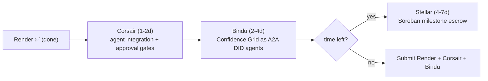

# BuildX'26 — Multi-Track Winning Plan (Master)

> **Goal:** win as many sponsor tracks as possible with the *one* FixFlowAI codebase, spending the least incremental effort.
> **Status:** Render track = ✅ done (deployed on `buildX`). This plan covers the three remaining tracks: **Corsair, Bindu, Stellar.**
> *External platform capabilities summarized from vendor docs (2026-07); verify current SDK/APIs and prize rules before building.*

---

## 1. The four tracks & what each rewards

| Track | What it is | Language | FixFlowAI hook |
|---|---|---|---|
| **Render** ✅ | Durable workflows + full-stack hosting | any | AI pipelines as durable workflows; 3-service blueprint |
| **Corsair** | "Unified integration layer for agents" — connect your agent to any app (Slack/Gmail/GitHub/Drive…) with scoped auth, **permission approval gates**, signature-verified webhooks, MCP | **TypeScript** | Your agent acts across a client/freelancer's tools; approval gates mirror your MFA/trust model |
| **Bindu** | Agent-to-Agent (A2A) protocol: agents get **DIDs**, verifiable messages, a skills system, USDC payments | **Python** | Your multi-agent Confidence Grid + DID/SBT reputation vision |
| **Stellar** | Payments blockchain + **Soroban** smart contracts | **Rust** | On-chain milestone escrow + reputation credential |

## 2. Win-probability ranking (do them in this order)

| Rank | Track | Fit | Effort | Why |
|---|---|---|---|---|
| 🥇 done | Render | ★★★★★ | done | Already shipped |
| 🥈 next | **Corsair** | ★★★★★ | **Low (1–2 days)** | TypeScript-native → drops into your Express backend. Its permission-approval model *is* your trust/MFA story. Highest ROI. |
| 🥉 then | **Bindu** | ★★★★☆ | Medium (2–4 days) | Python-native → your `ai-service`. Turns the Confidence Grid into DID'd A2A agents. High differentiation. |
| 4 | **Stellar** | ★★★★☆ | High (4–7 days) | Rust/Soroban = new language + on-chain escrow rewrite. Do only if time remains. |

**One codebase, four submissions.** The tracks compose: Corsair + Bindu agents run **on Render**; Stellar becomes the settlement layer behind your existing escrow FSM. You are not building four products — you are exposing the *same* FixFlowAI through four sponsor lenses.

## 3. The unifying narrative (say this to every judge)

> "FixFlowAI is a trust-first freelancing workspace. The same milestone-escrow + multi-agent brain is: deployed as **durable Render workflows**, acts safely across a user's tools through **Corsair's permission-gated integration layer**, runs as **DID-identified Bindu A2A agents** that talk to each other, and settles milestones on-chain via a **Stellar Soroban** contract. One system, judged four ways."

## 4. Sequencing (feasible under time pressure)

- **Days 1–2:** Corsair (see `01_corsair_track_plan.md`). Ship + record demo.
- **Days 3–6:** Bindu (see `02_bindu_track_plan.md`). Ship + record demo.
- **Days 7+ (optional):** Stellar (see `03_stellar_track_plan.md`).

## 5. What makes you stand out (judging edges)
- **Real product, not a toy demo** — every track wraps a genuinely useful escrow/hiring platform.
- **Safety is the theme** — Corsair approval gates + your MFA + audit chain = a coherent "agents you can trust with money" story that most teams won't have.
- **Cross-track composition** — few teams will submit one system to four tracks with a single narrative. Judges reward coherence.
- **Live, deployed URL** (Render) + recorded demo per track.

## 6. Per-track deliverables checklist (what a submission needs)
For each track: (a) the integration working in the deployed app, (b) a 2–3 min screen-recorded demo, (c) a short README section pointing at the code, (d) the "winning narrative" paragraph. The per-track plan docs list the exact code + demo script.

## 7. Cross-references
- `01_corsair_track_plan.md` — Corsair integration layer (do next)
- `02_bindu_track_plan.md` — Bindu A2A agents
- `03_stellar_track_plan.md` — Stellar Soroban escrow
- `../../product_strategy/buildx_prize_track_strategy.md` — original Render/Bindu/Stellar analysis
- `../../render/` — Render deployment (done)
