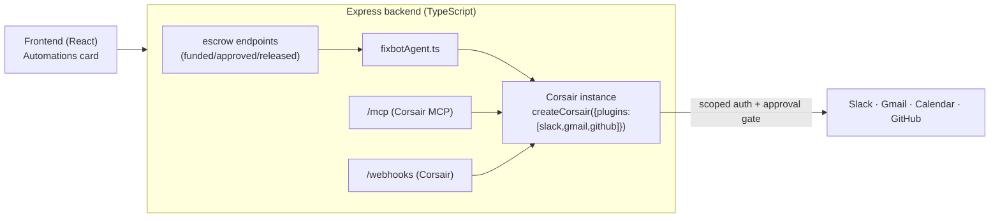

# Corsair Track — Implementation Plan (🥈 do next, ~1–2 days)

> **Track:** Corsair — "the unified integration layer for agents." Connect an agent to any app (Slack, Gmail, GitHub, Google Drive/Calendar, Notion…) with **scoped auth**, **permission approval gates** (open / cautious / strict / readonly), signature-verified **webhooks**, and an **MCP** endpoint. TypeScript-native, Apache-2.0, self-hostable. (`github.com/corsairdev/corsair`, `docs.corsair.dev`)
> **Why it's your easiest win:** Corsair is **TypeScript** — it drops straight into your existing Express backend, and its human-approval model *is* FixFlowAI's MFA/trust story.

---

## 1. The winning idea (unique angle)

FixFlowAI already gates high-value money actions behind MFA and an audit chain. Corsair extends that exact philosophy to **agent actions across a user's own tools**:

> **"FixBot" — a trust-first project agent.** When a milestone changes state, or a client types a natural-language request, the FixFlowAI agent takes real actions across Slack/Gmail/Calendar/GitHub — but every write/destructive action passes through Corsair's **permission gate** (approval link), just like a milestone release passes through MFA. Same safety model, extended from money to actions.

Concrete, demo-able flows (pick 2–3):
1. **Milestone → Slack/Email:** on `funded` / `approved` / `released`, the agent posts a message to the project's Slack channel and/or drafts a Gmail to the counterparty — **client approves the send** via a Corsair approval link.
2. **"Kickoff" automation:** when an agreement is sent, the agent creates a **Google Calendar** event per milestone deadline and a shared **Drive** folder — reads run immediately, writes require approval (cautious mode).
3. **Deliverable intake:** a **GitHub** PR/issue webhook (via Corsair's signature-verified webhook endpoint) auto-attaches evidence to the milestone in Delivery Control.

The judge takeaway: *"an agent you can trust with your apps — reads flow, writes ask first."*

## 2. Scope (MVP for the track)

- Add Corsair to the backend with **2–3 plugins** (recommended: `slack`, `gmail` or `googlecalendar`, `github`).
- Wire **one milestone event** → agent action through Corsair with **cautious/strict** mode so the approval gate is visible in the demo.
- Expose the **Corsair MCP** endpoint so the story "any agent can drive it" is true.
- One **signature-verified webhook** (GitHub) landing on the single `/webhooks` handler.
- A tiny **"Automations"** UI card showing the approval-request link + status.

## 3. Architecture (where it sits)

## 4. Step-by-step tasks

### Phase A — Install & configure (½ day)
1. `cd backend && npm install corsair` (confirm exact package name from `docs.corsair.dev/getting-started/quick-start`).
2. Create `backend/src/services/corsairClient.ts`:
   - `createCorsair({ multiTenancy: true, plugins: [slack(), gmail(), github()] })`.
   - Set per-integration permission modes: GitHub `strict`, Slack `cautious`, Gmail `strict`.
   - Export a `getCorsair()` singleton (same lazy-singleton pattern as `getMilestoneRepository()`).
3. Add env to `backend/.env` + `render.yaml` (all `sync:false`): `CORSAIR_*` keys/secrets as the docs require, plus each app's OAuth app creds. Document in the env matrix.
4. Tenancy: scope each call to the proposal/client, e.g. `getCorsair().withTenant(proposalId)`.

### Phase B — Agent action layer (½ day)
5. Create `backend/src/services/fixbotAgent.ts`:
   - `notifyProjectChannel(proposalId, text)` → `corsair.withTenant(proposalId).slack.api.messages.post(...)`.
   - `draftMilestoneEmail(proposalId, to, milestone)` → Gmail draft/send (strict → approval).
   - `createMilestoneCalendarEvents(proposalId, milestones)` → Calendar (cautious).
   - Each returns Corsair's result, including any **approval-request link** when a gate triggers.
6. Wire into existing escrow endpoints (`index.ts`) — fire-and-forget, never block the response (mirror the `notifyMilestoneEvent` pattern already added for SES):
   - `/verify-payment` success → `notifyProjectChannel(..., "Milestone funded 🎉")`.
   - `/release` success → Slack + Gmail draft to freelancer (approval-gated).

### Phase C — MCP + webhooks (½ day)
7. Mount the **Corsair MCP** route (e.g. `/api/mcp`) so external agents (Claude/Cursor) can call the same integrations with the same permission gates. This is the strongest "best use" proof.
8. Mount `POST /api/corsair/webhooks` → `processWebhook(corsair, req.headers, req.body)`; on a GitHub PR event, attach the PR link as milestone evidence.

### Phase D — UI + demo polish (½ day)
9. Add an **"Automations"** card (reuse the dashboard panel style) that:
   - lists recent agent actions + their Corsair permission status (pending/approved/denied),
   - shows the approval link when an action is awaiting approval.
10. Add a README section + record the demo (script below).

## 5. Files to create / touch
- `backend/src/services/corsairClient.ts` [new]
- `backend/src/services/fixbotAgent.ts` [new]
- `backend/src/index.ts` [wire events + `/api/mcp` + `/api/corsair/webhooks`]
- `backend/.env`, `render.yaml` [env]
- `frontend/src/sections/dashboard/Automations.jsx` [new] + nav entry in `Dashboard.jsx`
- `frontend/src/lib/api.js` [list automations / trigger test action]

## 6. Demo script (2–3 min)
1. Approve a milestone → show FixBot auto-posting to Slack (cautious read/write runs).
2. Trigger "email the freelancer their payout summary" → Corsair **intercepts the Gmail send**, shows the **approval link**; open it, **deny** once (show it's blocked), then approve → email sends.
3. Show the **MCP** endpoint being called from an external agent doing the same thing with the same gate.
4. One line: *"reads flow, writes ask first — the same trust model as our escrow MFA, now across every app."*

## 7. Feasibility, risks, mitigations
- **Feasibility: Very high** — TypeScript, same runtime as your backend; no new language.
- **Risk:** OAuth app setup per integration takes time → **mitigation:** start with **Slack only** (fastest to a wow), add Gmail/GitHub if time allows.
- **Risk:** exact package/API names → **mitigation:** follow `docs.corsair.dev/getting-started/quick-start` verbatim; the README snippets above are the shape, confirm signatures.
- **Risk:** approval links need a public URL → you already have Render + (optionally) `api.fixflowai.xyz`.

## 8. Definition of done
- [ ] Corsair configured with ≥2 plugins + permission modes.
- [ ] ≥1 milestone event triggers a gated agent action end-to-end.
- [ ] Approval link demonstrably blocks then allows a write.
- [ ] MCP endpoint live; one external-agent call shown.
- [ ] GitHub webhook attaches evidence to a milestone.
- [ ] Automations UI card + recorded demo + README section.
