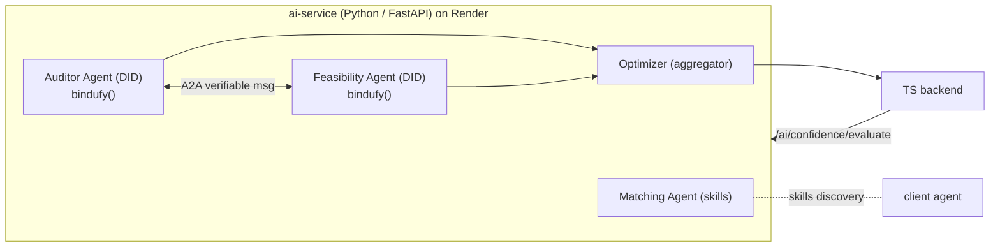

# Bindu Track — Implementation Plan (🥉 after Corsair, ~2–4 days)

> **Track:** Bindu — "identity, communication & payments layer for AI agents." Gives agents **DIDs**, verifiable **Agent-to-Agent (A2A)** messaging, a **skills** system, and **USDC** agent payments via a Python `bindufy()` wrapper. (`docs.ag2.ai/latest/docs/ecosystem/bindu/`, `pypi.org/project/bindu`)
> **Why it fits:** Bindu is **Python** → lives in your existing `ai-service`. FixFlowAI already has a **multi-agent** Confidence Grid (Auditor + Feasibility + Optimizer) and a **DID/Soulbound-credential** vision — the conceptual overlap is unusually strong.

---

## 1. The winning idea (unique angle)

> **"A marketplace of verifiable agents."** Turn FixFlowAI's Confidence-Grid personas into **independent, DID-identified A2A agents** that *talk to each other* to reach a hiring decision — and make the freelancer's reputation a **verifiable credential** carried by their agent. The multi-agent grid stops being an internal function call and becomes real agents with identities, verifiable messages, and (optionally) USDC settlement for compute.

Demo-able flows:
1. **Auditor Agent ↔ Feasibility Agent** exchange **verifiable A2A messages** to score a proposal; the **Optimizer Agent** consumes both and returns the confidence index — each with its own DID.
2. **Skills discovery:** the **Matching Agent** advertises capabilities via Bindu's skills system; a client agent discovers and invokes it.
3. **(Optional) x402 USDC micro-payment:** an agent pays another agent for a scoring/analysis task before it runs — a novel "agents settle before working" moment.

## 2. Scope (MVP for the track)

- `bindufy()` **two** Confidence-Grid agents (**Auditor**, **Feasibility**) as DID-identified A2A services in `ai-service`.
- Route the existing confidence-grid evaluation through **A2A messages** between them, with the **Optimizer** aggregating.
- Expose the **Matching** engine's capabilities via Bindu's **skills** system.
- Optional stretch: one **x402 USDC** payment demo (EVM testnet) before an agent runs.

Keep it to two agents + skills for a solid submission; payments are stretch.

## 3. Architecture

## 4. Step-by-step tasks

### Phase A — Setup (½ day)
1. `cd ai-service && pip install bindu` (confirm from PyPI/docs); add to `requirements.txt`.
2. Add env (`ai-service/.env` + `render.yaml` ai-service block): DID keys / Bindu config as the docs require (`sync:false` on Render).
3. Create `ai-service/app/agents/` package.

### Phase B — Wrap the two agents (1–1.5 days)
4. Refactor the existing confidence-grid logic (`app/features/confidence_grid.py`) into two callables: `audit(proposal)` and `feasibility(proposal)`.
5. `bindufy()` each as an A2A agent with its own DID and a declared skill (e.g. `proposal.audit`, `proposal.feasibility`).
6. Implement the A2A exchange: Auditor sends its findings to Feasibility (or both report to an Optimizer coordinator) using Bindu verifiable messages; keep the existing mean-score + self-correction loop in the Optimizer.
7. Keep a **non-Bindu fallback** path (current in-process function) behind a flag `AGENTS_MODE=bindu|inproc`, so the live demo never hard-depends on the network (mirrors your AIA-05 resilience principle).

### Phase C — Skills + backend wiring (½ day)
8. Register the **Matching** engine capability in Bindu's skills system so it's discoverable/invokable as an agent skill.
9. Backend `aiClient.ts` → call the Bindu-fronted evaluate endpoint; response shape unchanged so the frontend Confidence Grid keeps working.

### Phase D — (Optional) payments + demo (½–1 day)
10. Add one **x402 USDC** payment step on an EVM testnet: an agent pays before running a scoring task; show the tx.
11. Record the demo (script below) + README section.

## 5. Files to create / touch
- `ai-service/app/agents/auditor_agent.py`, `feasibility_agent.py`, `optimizer.py` [new]
- `ai-service/app/features/confidence_grid.py` [refactor into callables]
- `ai-service/app/main.py` [mount bindufied agents / A2A routes]
- `ai-service/requirements.txt`, `ai-service/.env`, `render.yaml` [deps + env]
- `backend/src/services/aiClient.ts` [point at the A2A-fronted evaluate]

## 6. Demo script (2–3 min)
1. Submit a brief → show the **two agents (with DIDs)** exchanging **verifiable A2A messages** and the Optimizer returning the confidence index (logs/trace visible).
2. Show a client agent **discovering the Matching skill** and invoking it.
3. (Stretch) show the **USDC payment** an agent makes before scoring.
4. One line: *"our hiring brain is a network of identity-verified agents that negotiate a decision — and they run on Render."*

## 7. Feasibility, risks, mitigations
- **Feasibility: Medium–High** — Python-native; your agents already exist as logic.
- **Risk:** learning Bindu's handler/DID model → **mitigation:** scope to **two** agents; keep the in-process fallback.
- **Risk:** payments (EVM/USDC) add scope → **mitigation:** treat x402 as optional stretch; skip if tight.
- **Compose with Render:** run the Bindu agents **as a Render service** → satisfies "agents run on Render" and strengthens both submissions.

## 8. Definition of done
- [ ] Two Confidence-Grid agents run as DID'd A2A Bindu agents.
- [ ] A real proposal evaluation flows through verifiable A2A messages.
- [ ] Matching capability exposed as a Bindu skill.
- [ ] In-process fallback flag works (demo safety).
- [ ] (Optional) one USDC agent-payment shown.
- [ ] Recorded demo + README section.
