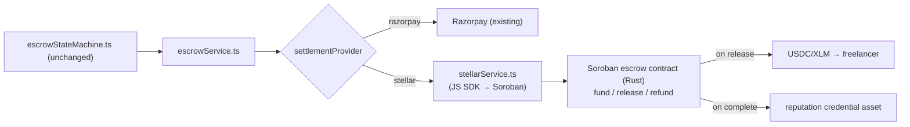

# Stellar Track — Implementation Plan (4️⃣ optional, ~4–7 days)

> **Track:** Stellar — payments blockchain with **Soroban** smart contracts (Rust) and fast, low-fee transfers/USDC. (`developers.stellar.org/docs/build/smart-contracts`)
> **Why it fits:** FixFlowAI's **milestone escrow FSM** and **Soulbound reputation** are the natural on-chain candidates. This is the heaviest lift (new language + on-chain rewrite of the settlement path), so treat it as **optional / only if Corsair + Bindu are done.**

---

## 1. The winning idea (unique angle)

> **"Trust-minimized milestone escrow."** Replace (or shadow) the custodial Razorpay hold with a **Soroban escrow contract**: the client funds a milestone on-chain; funds are **held by the contract**, not a platform account; on client approval (your existing MFA gate) the contract **releases USDC to the freelancer**; on dispute it **refunds the client**. Mint a **non-transferable reputation credential** (Stellar asset) on successful completion — your Soulbound-DID vision, on-chain.

This directly answers your earlier concern about T+2 custodial settlement: on Stellar the money is genuinely held by a contract until your FSM says release.

## 2. Scope (MVP for the track — keep it ONE contract)

- A single **Soroban escrow contract** with: `fund(milestone_id, amount)`, `approve_release(milestone_id)` (arbiter/client-gated), `refund(milestone_id)`, and a `state` view.
- Wire it as an **alternative settlement provider** behind your existing escrow FSM (do **not** rewrite the FSM — add a `settlementProvider = razorpay | stellar` seam).
- Testnet only. USDC or native XLM test asset.
- Optional stretch: issue a **reputation credential** asset on `Funds_Released`.

## 3. Architecture (additive, not a rewrite)

## 4. Step-by-step tasks

### Phase A — Toolchain + contract (2–3 days)
1. Install Rust + `stellar` CLI + Soroban SDK; set up a testnet account (friendbot funding).
2. Write the Soroban contract `contracts/escrow/src/lib.rs`:
   - storage: `milestone_id → { client, freelancer, amount, state }`
   - `fund` (client deposits), `approve_release` (gated), `refund`, `get_state`.
   - emit events on each transition (mirrors your audit chain).
3. Unit-test the contract (`soroban test`); deploy to **testnet**; record the contract id.

### Phase B — Backend integration seam (1–2 days)
4. Add `backend/src/services/stellarService.ts` using the Stellar JS SDK: `fundOnChain`, `releaseOnChain`, `refundOnChain`, `getOnChainState` — each invokes the contract and returns a tx hash.
5. Add a `settlementProvider` seam in `escrowService.ts` (env `SETTLEMENT_PROVIDER=razorpay|stellar`, default `razorpay`). When `stellar`:
   - `/fund` → `fundOnChain` (returns tx + address to fund)
   - `/release` (after MFA) → `releaseOnChain`
   - dispute→Draft → `refundOnChain`
   - store `stellarTxHash` on the milestone (extend the `Milestone` type like the Razorpay fields).
6. Keep Razorpay as default so nothing breaks; Stellar is opt-in per deploy/demo.

### Phase C — (Optional) reputation credential + UI/demo (1 day)
7. On `Funds_Released`, issue a non-transferable Stellar asset to the freelancer's account as a completion credential; surface it in Outcome Evidence.
8. Show the on-chain tx + contract state in the Audit Trail drawer (add a "view on Stellar Explorer" link).
9. Record demo + README.

## 5. Files to create / touch
- `contracts/escrow/` (Rust Soroban project) [new]
- `backend/src/services/stellarService.ts` [new]
- `backend/src/services/escrowService.ts` [add settlement seam]
- `backend/src/skills/escrowStateMachine.ts` [add `stellarTxHash?` field]
- `backend/.env`, `render.yaml` [Stellar network, contract id, signer secret — `sync:false`]
- `frontend/.../OutcomeEvidence.jsx` / `AuditTrailViewer.jsx` [explorer link]

## 6. Demo script (2–3 min)
1. Switch a deploy to `SETTLEMENT_PROVIDER=stellar`; fund a milestone → show funds held by the **contract** (explorer).
2. Approve (MFA) → `releaseOnChain` → USDC/XLM lands in the freelancer's testnet account (explorer tx).
3. Raise a dispute resolving for client → `refundOnChain`.
4. One line: *"the escrow isn't a promise in our database — it's enforced by a Soroban contract; funds are trustless until milestones are met."*

## 7. Feasibility, risks, mitigations
- **Feasibility: Medium; Effort: High** — new language (Rust) + on-chain flows.
- **Risk:** Rust/Soroban learning curve → **mitigation:** ship the **single-contract MVP** (fund/release/refund), skip the credential asset if tight; do it last.
- **Risk:** don't destabilize the working Razorpay path → **mitigation:** the `settlementProvider` seam keeps Razorpay default; Stellar is additive and opt-in.
- **Risk:** key management for the signer → **mitigation:** testnet only, signer secret as a Render `sync:false` env var, never in git.

## 8. Definition of done
- [ ] Soroban contract deployed to testnet (fund/release/refund + state).
- [ ] `settlementProvider=stellar` seam drives fund→release→refund on-chain with tx hashes stored.
- [ ] Razorpay path still default and unaffected.
- [ ] (Optional) reputation credential asset on completion.
- [ ] Explorer links in UI + recorded demo + README.
