# FixFlow AI - Client Project Ingestion and Onboarding Feasibility

Date: 2026-06-20

This document evaluates whether FixFlow AI can fetch the latest freelance project posts from external sources, normalize them into FixFlow, match them to freelancers, and eventually onboard the client/project into the FixFlow workflow.

This is an engineering and product feasibility assessment, not legal advice. Before using any third-party marketplace content in production, review the relevant platform terms with counsel and, where needed, obtain written permission or a partner/API agreement.

---

## 1. Executive Verdict

The idea is feasible if it is scoped as a compliant opportunity intelligence and workflow-conversion layer.

The idea is not feasible as "fetch every latest project from freelance marketplaces, copy it into FixFlow, and move those clients into FixFlow" without explicit source permission and client consent.

Recommended product framing:

1. Fetch or import project opportunities only from approved sources.
2. Store source attribution, canonical URL, short metadata, and source-specific retention policy.
3. Match opportunities to verified freelancers inside FixFlow.
4. Let freelancers use FixFlow to draft better proposals and workflows.
5. Keep application/contact on the original platform unless the source terms and the client allow migration.
6. Convert to a full FixFlow workspace only after the client explicitly claims or accepts the project inside FixFlow.

Overall feasibility:

| Capability | Feasibility | Reason |
| --- | --- | --- |
| Direct client onboarding through FixFlow intake | High | Fully controlled, matches existing brief parser, proposal, escrow, and workspace vision. |
| Manual import of a project URL or pasted brief by a freelancer | High | Low infrastructure complexity and avoids automated collection at first. |
| Ingesting approved RSS/API job feeds with attribution | High | Sources like We Work Remotely, Remotive, and Himalayas expose public feeds/APIs with attribution rules. |
| Freelancer.com API-based project discovery | Medium | Official API/SDK exists, but use must follow OAuth, API terms, access limits, and content restrictions. |
| Upwork API-based job search | Medium to Low | The API exposes job-posting read/search primitives, but API approval, 24-hour caching limits, anti-aggregation, non-circumvention, and competing-service restrictions create strong product constraints. |
| PeoplePerHour project ingestion | Low without partnership | Public job pages exist, but no official public project API was found during this review. |
| Fiverr project-post ingestion | Low | Fiverr is primarily service/gig-oriented; no official public buyer project-post API was found. |
| Scraping marketplace pages at scale without permission | Not recommended | High legal, account, reliability, and brand risk. |
| Auto-contacting or auto-moving clients from another platform to FixFlow | Not recommended | High spam, non-circumvention, privacy, and platform-account risk. |

---

## 2. What Your Existing Docs Already Support

The current architecture is directionally compatible with project ingestion, but it needs a new boundary between "external opportunity" and "FixFlow client/project".

Relevant existing pieces:

| Existing doc/module | Useful for ingestion idea | Gap |
| --- | --- | --- |
| `docs/specifications/product_strategy/market_positioning_and_uvps.md` | Positions FixFlow as a trust-first, zero-noise, outcome-based workspace. This matches filtered opportunity delivery better than open bidding chaos. | Needs a clear policy that third-party posts are opportunities, not onboarded clients. |
| `docs/specifications/architecture/database_design.md` | Includes `Lead`, `Proposal`, `Escrow`, `Workspace`, and BullMQ scraping queue references. | `Lead` is tied to `FreelancerProfile`; there is no neutral raw source post table, client consent table, source policy table, or ingestion run table. |
| `docs/specifications/architecture/erd_and_api_contracts.md` | Has `GET /api/leads`, `PATCH /api/leads/:leadId`, `POST /api/proposals`, and escrow endpoints. | Missing source connectors, ingestion runs, dedupe, compliance decisions, and client claim flow. |
| `docs/specifications/core_subsystems/skills.md` | Brief parser, Confidence Grid, client scoring, interview generator, escrow FSM, and reputation modules can power ranking and conversion. | Brief parser currently generates proposal output; ingestion needs a separate project-post extraction schema before proposal generation. |
| `docs/specifications/architecture/security_architecture.md` | Strong auth, RBAC, rate limiting, audit logs, and session model are compatible with ingestion and client claim links. | Needs source credentials vaulting and audit logs for external API access. |
| `docs/specifications/core_subsystems/extra_implementation_roadmap.md` | Client scoring and interview/vetting modules are useful once a post is normalized. | External clients have little or no FixFlow history, so risk scoring must start from post quality and source metadata, then evolve after transactions. |

Important product interpretation:

FixFlow should not be "another scraper that dumps jobs into a board." It should be "a trust and workflow layer that turns permitted opportunity data into structured, ranked, actionable workflows."

---

## 3. Current Source Reality: Platform-by-Platform

### 3.1 Upwork

Current official signals:

- Upwork's GraphQL API documents marketplace job posting reads and search/filter arguments, including `marketplaceJobPosting`, `marketplaceJobPostings`, job posting content by ID, and required "Read marketplace Job Postings" permissions.
- Upwork also documents subscriptions/webhooks for job posting events, but says subscription features are client-only and require Upwork team review/approval.
- API key requests are reviewed, have stated application requirements, and the docs mention a 40K daily request volume condition.
- Upwork documentation says caching must not violate ToS and specifically notes that data storage should not exceed 24 hours.
- Upwork API terms describe permitted uses such as allowing Upwork users to search/browse Upwork job postings, manage contracts, apply to jobs, or manage invoices/communications on Upwork.
- Upwork API terms also prohibit using API content in unattributed third-party aggregated search results, copying/storing content outside allowed caching, scraping/posting/transmitting site data, and operating a service that competes with Upwork Site Services.
- Upwork's user agreement has strict non-circumvention rules requiring communication and payments through Upwork for relationships first identified through Upwork unless a conversion fee or exception applies.

Feasibility conclusion:

Upwork is technically possible only as an Upwork-compliant assistant, not as a client-migration source.

Safe-ish use case:

- Authenticated Upwork user connects account.
- FixFlow shows attributed Upwork opportunities.
- FixFlow generates proposal preparation, scope analysis, and risk notes.
- The freelancer applies on Upwork and keeps communication/payment on Upwork.
- FixFlow stores only minimal metadata or deletes cached content within the permitted retention window.

Unsafe use case:

- Copying Upwork posts into a blended FixFlow marketplace.
- Hiding Upwork attribution.
- Storing Upwork post content long-term.
- Inviting Upwork clients off-platform or processing payments in FixFlow for Upwork-originated relationships.

Sources:

- Upwork API docs: https://www.upwork.com/developer/documentation/graphql/api/docs/index.html
- Upwork legal/API terms/non-circumvention: https://www.upwork.com/legal

### 3.2 Freelancer.com

Current official signals:

- Freelancer.com has an official developer portal and official SDKs.
- Public material describes endpoints around projects, bids, contests, users, messages, and milestones.
- Freelancer.com's user agreement incorporates API terms and has an "Access and Interference" section stating users must not use robots, spiders, scrapers, or other automated means, including API access, without express written permission.
- The same section restricts unreasonable load, interference, copying/reproducing/creating derivative works from site content without permission, and bypassing robot exclusion or access controls.

Feasibility conclusion:

Freelancer.com is one of the more plausible marketplace sources if you use official API access and receive the right permission. It is still not a license to scrape, republish, or migrate clients off-platform.

Safe-ish use case:

- OAuth/API integration.
- Store project ID, URL, source, skills, budget, and a short normalized summary where allowed.
- Show "apply on Freelancer.com" as the primary action unless a client independently joins FixFlow.
- Respect rate limits, pagination, source attribution, and deletion requirements.

Unsafe use case:

- Web scraping without written permission.
- Bulk copying project descriptions.
- Contacting buyers outside Freelancer.com to bypass marketplace flow.

Sources:

- Freelancer developer portal: https://developers.freelancer.com/
- Freelancer user agreement: https://www.freelancer.com/about/terms
- Official Python SDK: https://github.com/freelancer/freelancer-sdk-python

### 3.3 PeoplePerHour

Current official signals:

- PeoplePerHour has public freelance job listing pages.
- During this review, I did not find an official public API for project ingestion.
- Third-party scraping actors exist, but using them does not automatically make the data rights or platform terms safe for a commercial SaaS workflow.

Feasibility conclusion:

Low without a partnership or explicit permission.

Safe-ish use case:

- Manual URL import by a user for their own workflow.
- Store only the URL and user notes unless legal review allows more.
- Prefer a partnership/API discussion before automated ingestion.

Unsafe use case:

- Bulk scraping project listings into FixFlow.
- Republishing post details or client metadata.

Sources:

- PeoplePerHour jobs page: https://www.peopleperhour.com/freelance-jobs
- PeoplePerHour terms: https://www.peopleperhour.com/static/terms

### 3.4 Fiverr

Current official signals:

- Fiverr is primarily a service/gig marketplace, not a public project-post marketplace like Upwork/Freelancer.
- I did not find an official public API for buyer project posts.
- Unofficial scraper libraries exist, but they are not a reliable or safe basis for a production SaaS.

Feasibility conclusion:

Low for your stated goal. Fiverr is not a strong first source for "latest project posts."

Possible use:

- Market pricing intelligence from public category pages only after legal review.
- No client onboarding flow should depend on Fiverr scraping.

Sources:

- Fiverr terms: https://www.fiverr.com/legal-portal/legal-terms/terms-of-service
- Fiverr API development category page: https://www.fiverr.com/categories/programming-tech/software-development/api-integrations

### 3.5 RSS/API-friendly remote job boards

These are not pure freelance marketplaces, but they are useful for opportunity discovery, demand analysis, and possibly routing contract-friendly work to freelancers.

Examples:

- We Work Remotely has a public RSS feed and asks for attribution/link-back.
- Remotive has a public RSS feed, asks for source attribution, and says not to submit their jobs to certain third-party job boards.
- Himalayas exposes RSS and mentions API/MCP access, with attribution/link-back requirements and restrictions on submitting jobs to some third-party sites.

Feasibility conclusion:

High for an MVP opportunity feed, provided FixFlow respects attribution and does not misrepresent postings as native FixFlow clients.

Safe-ish use case:

- "External opportunities" feed.
- Link out to original application URL.
- Use FixFlow to analyze scope, skill fit, and proposal/work-plan readiness.
- Do not claim the employer/client is already using FixFlow.

Sources:

- We Work Remotely RSS: https://weworkremotely.com/remote-job-rss-feed
- Remotive RSS/API page: https://remotive.com/remote-jobs/rss-feed
- Himalayas RSS/API page: https://himalayas.app/rss

### 3.6 Reddit, Hacker News, communities

Current official signals:

- Reddit Data API terms require separate agreement for commercial purposes or uses outside expressly permitted API terms.
- Reddit restricts excessive use, commercial resale/access, spam, harassment, and some AI/model-training uses.
- Hacker News/Algolia can be useful for public demand signals and "Who is Hiring" style data, but it is mostly job/employment oriented, not contract escrow/project posting.

Feasibility conclusion:

Medium for market-signal monitoring, low-to-medium for direct client onboarding.

Safe-ish use case:

- Detect demand patterns and keywords.
- Let users manually save a public post URL.
- Never auto-message posters or scrape contact details.

Sources:

- Reddit Data API terms: https://redditinc.com/policies/data-api-terms
- Hacker News Algolia search: https://hn.algolia.com/

---

## 4. Product Boundary: Opportunity vs. Client vs. Workspace

This distinction is critical.

| State | Meaning | Allowed product behavior |
| --- | --- | --- |
| `RawExternalPost` | A post discovered from an external source. | Store source ID, URL, title, metadata, brief normalized summary if allowed, timestamps, attribution, retention TTL. |
| `Opportunity` | A ranked, normalized project opportunity shown to eligible freelancers. | Show match score, risks, budget estimate, source link, and allowed actions. |
| `ApplicationDraft` | A freelancer-owned draft proposal or response. | Generate proposal, questions, scope plan, and warnings. Freelancer reviews before use. |
| `ClientInvite` | A consent path for a client to join FixFlow. | Only allowed when direct contact is lawful and source policy allows it, or when client arrives independently. |
| `FixFlowClientProject` | A client has claimed/created a project in FixFlow. | Full workspace, proposal, escrow, evidence, reputation, and scoring flows can run. |

Rule:

Do not call an external buyer/client a FixFlow client until they claim a project or create an account on FixFlow.

---

## 5. Feasible Client Onboarding Process

### 5.1 Best path: Direct client intake

This is the most feasible and highest-control onboarding process.

Flow:

1. Client lands on FixFlow.
2. Client submits rough brief, budget, timeline, stack, outcome, and constraints.
3. Brief parser converts it into a structured scope.
4. Confidence Grid checks feasibility and budget/timeline alignment.
5. Matching engine shortlists 3-5 verified freelancers.
6. Client picks or requests interview questions.
7. Workspace opens with proposal, milestones, escrow terms, and delivery evidence checklist.
8. Escrow FSM and reputation modules take over after acceptance.

Feasibility: High.

Why:

- No third-party data rights issue.
- Existing docs already support this workflow.
- It produces the strongest FixFlow differentiation.

### 5.2 Good MVP path: Freelancer imports or saves an external post

Flow:

1. Freelancer sees a project post on another site.
2. Freelancer uses "Import URL" or browser extension/bookmarklet.
3. FixFlow stores URL, source, title, allowed metadata, and user notes.
4. If permitted, FixFlow fetches the content. If not, the freelancer pastes brief text manually.
5. FixFlow parses the brief into scope, risks, estimate, and proposal draft.
6. FixFlow shows "Apply on source" as the primary action.
7. If the client later chooses FixFlow independently, convert to workspace.

Feasibility: High.

Why:

- Lower automation risk.
- Clear user intent.
- Can ship quickly.

### 5.3 Cautious path: Approved source connector feed

Flow:

1. Source connector fetches posts through official API/RSS/partner integration.
2. Ingestion service enforces source-specific policy:
   - retention TTL
   - attribution
   - fields allowed to store
   - whether full text can be stored
   - whether user can apply inside FixFlow or must link out
   - whether client invite is allowed
3. Normalizer maps data into `RawExternalPost`.
4. Dedupe merges identical posts by source ID, canonical URL, title similarity, and client/company hash.
5. Match engine creates per-freelancer `Opportunity` records.
6. Freelancers review and act.

Feasibility: Medium to High, depending on source.

### 5.4 Risky path: Automated outreach to clients from external posts

Flow:

1. System scrapes posts.
2. System finds contact details.
3. System sends clients invite links or messages to move into FixFlow.

Feasibility: Not recommended.

Why:

- Looks like spam.
- May violate platform terms.
- Can trigger account bans.
- May violate privacy and anti-circumvention rules.
- Damages FixFlow brand trust.

---

## 6. Required Architecture Changes

### 6.1 New ingestion topology

```mermaid
flowchart LR
    Source["Approved Sources: RSS/API/Manual URL"] --> Connector["Source Connector"]
    Connector --> Policy["Source Policy Gate"]
    Policy --> Queue["BullMQ Ingestion Queue"]
    Queue --> Normalize["Normalize + Dedupe"]
    Normalize --> RawPost["RawExternalPost"]
    RawPost --> Extract["Project Extraction Schema"]
    Extract --> Match["Matching + Risk Scoring"]
    Match --> Opportunity["Freelancer Opportunity Board"]
    Opportunity --> Draft["Proposal/Application Draft"]
    Draft --> SourceApply["Apply on Original Source"]
    Draft --> Claim["Client Claim/Consent Link"]
    Claim --> Workspace["FixFlow Workspace + Escrow"]
```



### 6.2 New source policy layer

Every source needs a machine-enforced policy object.

Example:

```json
{
  "source": "upwork",
  "accessMode": "official_api",
  "requiresUserAuth": true,
  "requiresAttribution": true,
  "maxCacheHours": 24,
  "allowFullTextStorage": false,
  "allowAggregatedSearch": false,
  "allowApplyInFixFlow": false,
  "allowClientInvite": false,
  "primaryAction": "apply_on_source",
  "legalReviewStatus": "required"
}
```

For RSS-friendly boards:

```json
{
  "source": "we_work_remotely",
  "accessMode": "rss",
  "requiresUserAuth": false,
  "requiresAttribution": true,
  "maxCacheHours": 720,
  "allowFullTextStorage": true,
  "allowAggregatedSearch": true,
  "allowApplyInFixFlow": false,
  "allowClientInvite": false,
  "primaryAction": "apply_on_source",
  "legalReviewStatus": "approved_with_attribution"
}
```

### 6.3 New database models

The current `Lead` table is not enough because it assumes a lead belongs to one freelancer profile. You need a source-neutral ingestion layer before per-freelancer matching.

Recommended Prisma-style additions:

```prisma
enum SourceAccessMode {
  RSS
  OFFICIAL_API
  PARTNER_API
  MANUAL_IMPORT
  USER_PASTE
}

enum SourceRiskLevel {
  LOW
  MEDIUM
  HIGH
  BLOCKED
}

model ProjectSource {
  id                  String           @id @default(uuid()) @db.Uuid
  key                 String           @unique
  name                String
  accessMode          SourceAccessMode
  baseUrl             String?
  requiresAttribution Boolean          @default(true)
  maxCacheHours       Int?
  allowFullTextStorage Boolean         @default(false)
  allowAggregatedSearch Boolean        @default(false)
  allowClientInvite   Boolean          @default(false)
  allowApplyInFixFlow Boolean          @default(false)
  primaryAction       String           @default("apply_on_source")
  riskLevel           SourceRiskLevel  @default(MEDIUM)
  policyNotes         String?
  createdAt           DateTime         @default(now())
  updatedAt           DateTime         @updatedAt
}

model IngestionRun {
  id            String   @id @default(uuid()) @db.Uuid
  sourceId      String   @db.Uuid
  status        String   // queued, running, completed, failed
  query         Json?
  fetchedCount  Int      @default(0)
  acceptedCount Int      @default(0)
  rejectedCount Int      @default(0)
  error         String?
  startedAt     DateTime @default(now())
  finishedAt    DateTime?
}

model RawExternalPost {
  id                String   @id @default(uuid()) @db.Uuid
  sourceId          String   @db.Uuid
  externalId        String?
  canonicalUrl      String
  title             String
  descriptionHash   String?
  descriptionText   String?  @db.Text
  summary           String?  @db.Text
  budget            Json?
  skills            Json?
  clientMetadata    Json?
  postedAt          DateTime?
  expiresAt         DateTime?
  cacheExpiresAt    DateTime?
  attributionLabel  String?
  complianceFlags   Json?
  rawPayloadS3Key   String?
  createdAt         DateTime @default(now())
  updatedAt         DateTime @updatedAt

  @@unique([sourceId, externalId])
  @@index([canonicalUrl])
  @@index([postedAt])
}

model Opportunity {
  id               String   @id @default(uuid()) @db.Uuid
  rawPostId        String   @db.Uuid
  freelancerId     String   @db.Uuid
  status           String   // new, saved, drafting, applied, hidden, converted
  matchScore       Int      @default(0)
  riskScore        Int      @default(0)
  sourceRisk       String?
  matchDetails     Json?
  applicationDraft Json?
  createdAt        DateTime @default(now())
  updatedAt        DateTime @updatedAt

  @@unique([rawPostId, freelancerId])
}

model ClientClaim {
  id              String   @id @default(uuid()) @db.Uuid
  rawPostId       String?  @db.Uuid
  opportunityId   String?  @db.Uuid
  emailHash       String?
  status          String   // pending, verified, claimed, rejected, expired
  tokenHash       String
  expiresAt       DateTime
  claimedUserId   String?  @db.Uuid
  workspaceId     String?  @db.Uuid
  createdAt       DateTime @default(now())
  updatedAt       DateTime @updatedAt
}
```

### 6.4 Existing `Lead` changes

Keep `Lead`, but use it only after an opportunity becomes a real FixFlow commercial lead.

Recommended lifecycle:

`RawExternalPost` -> `Opportunity` -> `ApplicationDraft` -> `ClientClaim` -> `Lead` -> `Proposal` -> `Escrow`

This prevents polluted data from turning into fake "clients" inside your core CRM.

---

## 7. New Extraction Schema Needed

Do not use `ProposalSchema` directly at ingestion time. It is too heavy and assumes the output is already a proposal.

Add a lighter `ProjectPostSchema` first:

```typescript
const ProjectPostSchema = z.object({
  title: z.string().min(1),
  source: z.string().min(1),
  canonicalUrl: z.string().url(),
  rawTextAvailable: z.boolean(),
  clientIntent: z.enum(["hire_freelancer", "hire_agency", "full_time_job", "unclear"]),
  category: z.string(),
  skills: z.array(z.string()),
  budget: z.object({
    amountMin: z.number().nullable(),
    amountMax: z.number().nullable(),
    currency: z.string().nullable(),
    type: z.enum(["fixed", "hourly", "salary", "unknown"])
  }),
  urgency: z.enum(["low", "medium", "high", "unknown"]),
  deliverables: z.array(z.string()),
  risks: z.array(z.object({
    label: z.string(),
    severity: z.number().min(0).max(100),
    reason: z.string()
  })),
  applyPolicy: z.object({
    primaryAction: z.enum(["apply_on_source", "draft_only", "client_claim_allowed", "blocked"]),
    reason: z.string()
  })
});
```

Only after a freelancer saves/applies should FixFlow generate a full proposal.

---

## 8. Matching and Scoring Model

The matching score should be source-aware.

Recommended composite:

```text
OpportunityScore =
  0.30 * SkillMatchScore
+ 0.20 * BudgetFitScore
+ 0.15 * RecencyScore
+ 0.15 * BriefQualityScore
+ 0.10 * ClientTrustScore
+ 0.10 * SourceComplianceScore
- ScamRiskPenalty
- OffPlatformRiskPenalty
```

Important notes:

- Existing `clientScoring.js` is useful only after FixFlow has client history.
- For external posts, start with `BriefQualityScore`, `SourceComplianceScore`, and `ScamRiskPenalty`.
- Do not imply a client is "premium" unless FixFlow has actual transaction history or the source explicitly provides verified client metadata you are allowed to use.

Scam/risk signals:

- Budget far above market with vague requirements.
- Requests for unpaid tests.
- Off-platform payment instructions.
- Crypto/payment transfer requests unrelated to the work.
- No deliverables, unclear ownership, or suspicious urgency.
- Reposted identical content across sources.
- External source policy forbids contact/migration.

---

## 9. API Contracts to Add

### Source and ingestion admin

```http
GET /api/sources
POST /api/sources
PATCH /api/sources/:sourceId
POST /api/sources/:sourceId/test
POST /api/ingestion-runs
GET /api/ingestion-runs/:runId
```

### Manual import

```http
POST /api/opportunities/import-url
POST /api/opportunities/import-text
```

Example:

```json
{
  "source": "manual",
  "url": "https://example.com/project/123",
  "briefText": "Need a React dashboard with Stripe billing and admin analytics",
  "intendedUse": "proposal_draft"
}
```

### Opportunity board

```http
GET /api/opportunities?status=new&minScore=70
GET /api/opportunities/:id
PATCH /api/opportunities/:id
POST /api/opportunities/:id/draft-proposal
POST /api/opportunities/:id/mark-applied
POST /api/opportunities/:id/hide
```

### Client claim and conversion

```http
POST /api/client-claims
GET /api/client-claims/:token
POST /api/client-claims/:token/verify
POST /api/client-claims/:token/create-workspace
```

Client claim must be source-policy gated. If `allowClientInvite=false`, the endpoint should reject the request.

---

## 10. Frontend Features Needed

### Freelancer opportunity board

Core views:

- Opportunity cards with source, attribution, budget, recency, match score, and source policy.
- Filters by skills, budget, source, risk, recency, and application policy.
- Actions:
  - Save
  - Draft proposal
  - Apply on source
  - Hide
  - Convert to FixFlow workspace if allowed and client consents

### Opportunity detail page

Sections:

- Source and attribution
- Original link
- Normalized project summary
- Skills required
- Budget and timeline
- Risk warnings
- Match evidence from freelancer profile/GitHub scan
- Proposal draft
- Interview/client clarification questions
- Compliance footer explaining what actions are allowed for that source

### Client claim page

This is only for consented migration.

Sections:

- "Claim your project"
- Source/project summary
- What FixFlow will do:
  - clarify scope
  - shortlist verified freelancers
  - create milestones
  - protect delivery evidence
- Client email verification
- Consent checkbox
- Project workspace creation

Avoid language like "we imported your project" unless the client already authorized it.

---

## 11. Privacy, Compliance, and Anti-Spam Controls

Hard requirements:

1. Source policy gate before storing or displaying any external content.
2. Attribution on every imported opportunity.
3. Canonical link back to source.
4. Per-source retention TTL.
5. No scraping of contact details.
6. No automated outbound messages to clients.
7. No auto-submitting proposals.
8. Human-in-the-loop for every application.
9. User-visible reason for each risk/compliance warning.
10. Deletion workflow for source/user requests.
11. Audit log for source credential use and ingestion runs.
12. Rate limits per source and per user.

Recommended anti-spam policy:

- FixFlow can generate drafts.
- FixFlow cannot send applications or client invitations automatically.
- FixFlow cannot bypass original source communication/payment rules.
- FixFlow cannot enrich client identities with personal data from unrelated third-party sources unless there is a lawful basis and clear consent.

---

## 12. Implementation Roadmap

### Phase 0 - Product/legal guardrails (3-5 days)

Deliverables:

- Source policy table.
- Legal review checklist.
- Allowed actions per source.
- UI copy for "external opportunity" vs "FixFlow client."

Do this first. Otherwise engineering may build a feature that cannot be launched safely.

### Phase 1 - Manual import MVP (1-2 weeks)

Deliverables:

- `ProjectPostSchema`.
- Manual URL/text import.
- Opportunity table.
- Basic dedupe.
- Freelancer opportunity board.
- Proposal draft generation from imported post.

Why first:

- Useful immediately.
- Lowest compliance risk.
- Validates freelancer demand for the workflow.

### Phase 2 - RSS/API-friendly connectors (2-3 weeks)

Start with:

- We Work Remotely RSS
- Remotive RSS/API
- Himalayas RSS/API

Deliverables:

- RSS connector.
- Scheduled ingestion queue.
- Attribution rendering.
- Source-specific TTL.
- Opportunity ranking.

Why:

- These sources publicly document feed/API usage paths with attribution expectations.
- They help test ingestion and ranking without starting with high-risk marketplace scraping.

### Phase 3 - Freelancer.com official API investigation (2-4 weeks)

Deliverables:

- Developer account/API access.
- OAuth flow.
- Sandbox tests.
- Source policy review.
- Project search/import proof of concept.

Launch only if permissions and API terms support the intended use.

### Phase 4 - Upwork API application and constrained assistant mode (4-8+ weeks, uncertain)

Deliverables:

- Apply for API key/scopes.
- Implement Upwork-authenticated connector.
- Enforce 24-hour cache limit.
- Keep primary action as "apply/manage on Upwork."
- Do not mix Upwork content into unattributed aggregated search.

Launch only after API approval and legal review.

### Phase 5 - Client claim and FixFlow workspace conversion (2-4 weeks)

Deliverables:

- Client claim link.
- Email/domain verification.
- Consent logging.
- Project-to-workspace conversion.
- Escrow initialization.

Only enable for direct clients, FixFlow-native projects, partner sources, or sources whose policy allows migration.

---

## 13. Recommended MVP Scope

Build this first:

1. Direct client project intake.
2. Manual project URL/text import for freelancers.
3. Opportunity board.
4. Project post extraction schema.
5. Proposal draft and clarification question generation.
6. RSS/API connectors for friendly sources.
7. Source policy engine from day one.

Do not build first:

1. Upwork scraping.
2. PeoplePerHour scraping.
3. Fiverr scraping.
4. Auto-contacting clients.
5. Auto-submitting proposals.
6. Long-term storage of third-party content without source-specific rights.

---

## 14. Feasibility Scorecard

| Feature | Tech feasibility | Legal/source feasibility | Product value | Recommendation |
| --- | --- | --- | --- | --- |
| Native FixFlow client intake | High | High | Very high | Build now. |
| Manual import/paste by freelancer | High | Medium to high | High | Build now with source warnings. |
| Opportunity board and matching | High | High for native/manual, source-dependent for external | Very high | Build now. |
| Proposal drafting from external posts | High | Medium | High | Build with human review and source attribution. |
| RSS job board ingestion | High | Medium to high | Medium | Build after manual import. |
| Freelancer.com official API | Medium | Medium | High | Explore after MVP. |
| Upwork API integration | Medium | Low to medium | High | Build only as compliant assistant mode after approval. |
| PeoplePerHour automated ingestion | Medium | Low | Medium | Do not build without permission. |
| Fiverr project ingestion | Low | Low | Low | Deprioritize. |
| Client migration from third-party posts | Medium | Low unless consent + allowed source | Very high if legal | Gate behind explicit policy and consent. |
| Automated outbound outreach | High technically | Low | Risky | Do not build. |

---

## 15. Go/No-Go Decision

Go:

- Build FixFlow-native client onboarding.
- Build manual/imported opportunity workflow.
- Build source policy enforcement.
- Build opportunity-to-proposal assistant.
- Build matching/ranking for freelancers.

Conditional go:

- Build official API connectors only when terms, permissions, and retention rules are clear.
- Build client claim/migration only for sources that allow it or for clients who independently consent.

No-go:

- "Fetch all latest freelance project posts" from every marketplace through scraping.
- Copy marketplace posts into FixFlow as native listings.
- Move clients/payments off another marketplace when the relationship started there and terms restrict circumvention.
- Auto-message clients or auto-submit proposals.

---

## 16. Practical Product Positioning

Use this product promise:

"FixFlow AI finds and structures high-quality project opportunities, helps freelancers respond with clearer proposals, and converts consented clients into a protected delivery workspace."

Avoid this promise:

"FixFlow AI imports all marketplace clients and lets freelancers work with them directly in FixFlow."

The first is feasible. The second is likely to create platform, legal, and trust issues.

---

## 17. Source Notes

Reviewed project docs:

- `docs/specifications/architecture/system_design.md`
- `docs/specifications/core_subsystems/skills.md`
- `docs/specifications/architecture/security_architecture.md`
- `docs/specifications/product_strategy/market_positioning_and_uvps.md`
- `docs/specifications/architecture/database_design.md`
- `docs/specifications/architecture/erd_and_api_contracts.md`
- `docs/specifications/core_subsystems/extra_implementation_roadmap.md`

External sources checked on 2026-06-20:

- Upwork API documentation: https://www.upwork.com/developer/documentation/graphql/api/docs/index.html
- Upwork legal/API terms: https://www.upwork.com/legal
- Freelancer developer portal: https://developers.freelancer.com/
- Freelancer user agreement: https://www.freelancer.com/about/terms
- Freelancer Python SDK: https://github.com/freelancer/freelancer-sdk-python
- PeoplePerHour jobs: https://www.peopleperhour.com/freelance-jobs
- PeoplePerHour terms: https://www.peopleperhour.com/static/terms
- Fiverr terms: https://www.fiverr.com/legal-portal/legal-terms/terms-of-service
- We Work Remotely RSS: https://weworkremotely.com/remote-job-rss-feed
- Remotive RSS/API: https://remotive.com/remote-jobs/rss-feed
- Himalayas RSS/API: https://himalayas.app/rss
- Reddit Data API terms: https://redditinc.com/policies/data-api-terms

