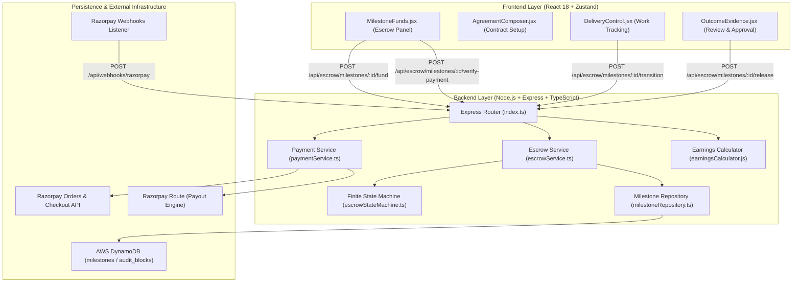
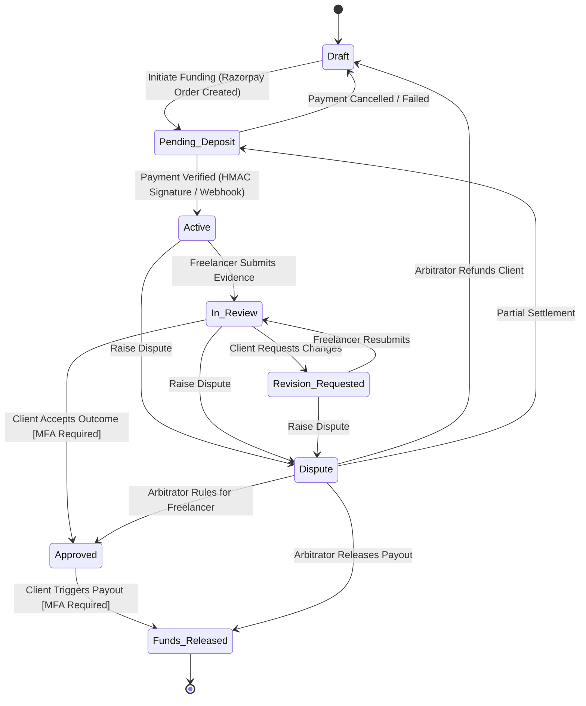

# FixFlowAI — Escrow & Razorpay Payment Integration: Implementation Plan

> **Document Type:** Core Subsystem Architecture & Implementation Plan  
> **Target Subsystem:** Escrow FSM & Razorpay Payment Integration  
> **Status:** Active Reference  
> **Last Updated:** 2026-07-24  

---

## 1. Executive Summary & Core Mission

FixFlowAI relies on **evidence-backed milestone escrow payments** to solve the trust deficit in freelancing. Freelancers are guaranteed payment once agreed deliverables are verified, while clients retain full protection over their capital until milestone criteria are met.

The core escrow subsystem is built on five pillars:
1. **Finite State Machine (FSM):** Pure state transition engine governing 8 milestone lifecycle states.
2. **Payment Gateway Integration:** Razorpay Order creation, inline glassmorphic checkout, and webhook verification.
3. **Automated Fund Distribution:** Razorpay Route for splitting payouts and deducting platform fees/taxes.
4. **Cryptographic Audit Ledger:** Immutable, SHA-256 chained ledger recording every state change and transition metadata.
5. **Multi-Factor Authentication (MFA):** Mandatory verification gate for high-value state changes (`Approved` and `Funds_Released`).

---

## 2. System Architecture & Topology



---

## 3. Current State Audit: What's Built vs. Remaining Gaps

### 3.1 ✅ Fully Implemented Capabilities

| Component | File Path | Implementation Details |
|-----------|-----------|------------------------|
| **Pure FSM State Machine** | [escrowStateMachine.ts](file:///c:/Users/suvam/Desktop/VS%20code/Projects/FixFlowAI/backend/src/skills/escrowStateMachine.ts) | 8 state types, 15 allowed transitions, version tracking, MFA verifier seam, and block hashing. |
| **Service Layer Orchestration** | [escrowService.ts](file:///c:/Users/suvam/Desktop/VS%20code/Projects/FixFlowAI/backend/src/services/escrowService.ts) | Connects repository persistence to pure FSM state transitions. |
| **Persistence Seam** | [milestoneRepository.ts](file:///c:/Users/suvam/Desktop/VS%20code/Projects/FixFlowAI/backend/src/services/milestoneRepository.ts) | Swappable providers: `InMemory`, `FileStore`, and `DynamoDbMilestoneRepository`. |
| **Payment Gateway Service** | [paymentService.ts](file:///c:/Users/suvam/Desktop/VS%20code/Projects/FixFlowAI/backend/src/services/paymentService.ts) | Razorpay Order creation, payment signature verification, webhook signature verification, and simulated mode logic. |
| **Fee & Tax Calculator** | [earningsCalculator.js](file:///c:/Users/suvam/Desktop/VS%20code/Projects/FixFlowAI/backend/src/skills/earningsCalculator.js) | Calculates 10% platform fee, 2% + ₹3 gateway fee, 1% India TDS withholding, and 1.5% client checkout premium. |
| **Fund Endpoint** | [index.ts](file:///c:/Users/suvam/Desktop/VS%20code/Projects/FixFlowAI/backend/src/index.ts) L769 | Generates Razorpay Order and transitions milestone `Draft → Pending_Deposit`. |
| **Verify Payment Endpoint** | [index.ts](file:///c:/Users/suvam/Desktop/VS%20code/Projects/FixFlowAI/backend/src/index.ts) L809 | Verifies HMAC-SHA256 signature and transitions `Pending_Deposit → Active`. |
| **Webhook Endpoint** | [index.ts](file:///c:/Users/suvam/Desktop/VS%20code/Projects/FixFlowAI/backend/src/index.ts) L855 | Validates `x-razorpay-signature` and auto-captures `payment.captured` events. |
| **Frontend Checkout Modal** | [MilestoneFunds.jsx](file:///c:/Users/suvam/Desktop/VS%20code/Projects/FixFlowAI/frontend/src/sections/dashboard/MilestoneFunds.jsx) | Renders fee breakdowns, opens Razorpay Checkout SDK, and handles simulated fallback mode. |

---

### 3.2 ❌ Remaining Technical Gaps

1. **Dedicated Release & Payout Route (`POST /api/escrow/milestones/:id/release`):**
   - *Current Gap:* `transferFundsToFreelancer()` exists in `paymentService.ts` but is not wired to an Express endpoint.
   - *Impact:* Clients cannot trigger final payout to freelancers upon approving deliverables.

2. **Webhook Idempotency Layer:**
   - *Current Gap:* Webhook handler currently processes events without checking if the Razorpay `payment_id` or `event_id` was previously processed.
   - *Impact:* Duplicate webhook retries could attempt redundant FSM transitions.

3. **Dispute Management Subsystem (`POST /api/escrow/milestones/:id/dispute`):**
   - *Current Gap:* Dispute transitions (`Active → Dispute`, `In_Review → Dispute`) are defined in FSM, but API routes and resolution endpoints are missing.
   - *Impact:* Unresolved client-freelancer disagreements lack a structured arbitration workflow.

4. **Razorpay Refund Flow:**
   - *Current Gap:* No backend service to invoke Razorpay Refunds API when a milestone is cancelled or disputed in client favor.
   - *Impact:* Capital remains locked in Razorpay account during refunds.

5. **Freelancer Account Onboarding (Razorpay Route Linked Accounts):**
   - *Current Gap:* No endpoint or UI form to collect freelancer bank details and create a Razorpay Linked Account (`acc_xxxx`).
   - *Impact:* Production payouts via Razorpay Route cannot route to freelancer bank accounts.

---

## 4. Finite State Machine (FSM) State Rules & Transitions

### 4.1 State Matrix Definitions

| State Name | Allowed Next States | Description | Triggering User Role |
|------------|---------------------|-------------|----------------------|
| **`Draft`** | `Pending_Deposit` | Milestone created; agreement pending client funding. | Client / System |
| **`Pending_Deposit`** | `Active`, `Draft` | Razorpay order generated; awaiting payment confirmation. | Client / Webhook |
| **`Active`** | `In_Review`, `Dispute` | Funds secured in escrow; freelancer executing deliverables. | Freelancer / Client |
| **`In_Review`** | `Approved`, `Revision_Requested`, `Dispute` | Deliverable evidence uploaded; client inspecting outcome. | Client |
| **`Revision_Requested`** | `In_Review`, `Dispute` | Client requested changes; freelancer updating work. | Freelancer |
| **`Approved`** | `Funds_Released` | Deliverable accepted by client [Requires MFA]; pending release. | Client |
| **`Funds_Released`** | *Terminal State* | Escrow funds transferred to freelancer bank account [Requires MFA]. | System / Client |
| **`Dispute`** | `Approved`, `Funds_Released`, `Draft`, `Pending_Deposit` | Milestone locked in arbitration; awaiting resolution decision. | Arbitrator / System |

### 4.2 State Machine Diagram



---

## 5. End-to-End Payment & Escrow Workflow

### Phase 1: Order Generation (`POST /api/escrow/milestones/:id/fund`)
1. Client initiates funding for a milestone in `Draft` state.
2. System calls `createRazorpayOrder(milestoneId, grossAmount)`.
3. Razorpay returns `order_id` (e.g. `order_K9xZ123456789`).
4. Milestone state updates to `Pending_Deposit`, and `razorpayOrderId` is saved.

### Phase 2: Checkout & Verification (`POST /api/escrow/milestones/:id/verify-payment`)
1. Razorpay Checkout modal renders on the frontend.
2. User enters payment credentials (UPI, Card, Netbanking).
3. Upon success, Razorpay SDK returns `razorpay_payment_id` and `razorpay_signature`.
4. Client sends parameters to `/verify-payment`.
5. Server verifies signature:
   $$\text{HMAC-SHA256}(\text{order\_id} + "|" + \text{payment\_id}, \text{RAZORPAY\_KEY\_SECRET}) \stackrel{?}{=} \text{razorpay\_signature}$$
6. State transitions `Pending_Deposit → Active`. Cryptographic audit block #2 is appended.

### Phase 3: Deliverable Submission & Client Approval
1. Freelancer uploads work evidence in `DeliveryControl.jsx`.
2. State transitions `Active → In_Review`.
3. Client verifies work in `OutcomeEvidence.jsx`.
4. Client provides MFA OTP token.
5. System verifies OTP token and transitions `In_Review → Approved`.

### Phase 4: Fund Release & Payout (`POST /api/escrow/milestones/:id/release`)
1. Client triggers final fund release.
2. Backend computes exact fee breakdown via `calculateEarningsBreakdown()`.
3. System invokes Razorpay Route:
   ```typescript
   razorpayClient.transfers.create({
     account: freelancerLinkedAccountId,
     amount: netFreelancerEarningsInPaise,
     currency: 'INR'
   });
   ```
4. State transitions `Approved → Funds_Released`. Cryptographic audit chain locks the record.

---

## 6. Financial Breakdown & Calculation Formulas

FixFlowAI enforces transparent financial reporting for both parties prior to checkout.

### 6.1 Formula Matrix

1. **Platform Commission Fee ($\text{Fee}_{\text{platform}}$):**
   $$\text{Fee}_{\text{platform}} = \text{GrossAmount} \times \text{CommissionRate}$$
   *Tiers:* `FREE` (10%), `SOLO` (5%), `PRO` (3%), `AGENCY` (2%).

2. **Razorpay Gateway Processing Fee ($\text{Fee}_{\text{gateway}}$):**
   $$\text{Fee}_{\text{gateway}} = (\text{GrossAmount} \times 0.02) + 3.00$$

3. **Tax Deducted at Source / TDS ($\text{Tax}_{\text{TDS}}$):**
   $$\text{Tax}_{\text{TDS}} = \begin{cases} \text{GrossAmount} \times 0.01 & \text{if CountryCode} = \text{'IN'} \\ 0.00 & \text{otherwise} \end{cases}$$

4. **Net Freelancer Earnings ($\text{Earnings}_{\text{net}}$):**
   $$\text{Earnings}_{\text{net}} = \max\left(0, \text{GrossAmount} - \text{Fee}_{\text{platform}} - \text{Fee}_{\text{gateway}} - \text{Tax}_{\text{TDS}}\right)$$

5. **Client Checkout Total ($\text{Checkout}_{\text{total}}$):**
   $$\text{Checkout}_{\text{total}} = \text{GrossAmount} + (\text{GrossAmount} \times 0.015)$$

---

### 6.2 Worked Examples

#### Scenario A: Standard ₹10,000 Milestone (Free Tier, India Freelancer)

| Parameter / Line Item | Calculation | Amount (INR) |
|-----------------------|-------------|--------------|
| **Gross Milestone Value** | Contract Value | **₹10,000.00** |
| Client Premium (1.5%) | ₹10,000 × 0.015 | + ₹150.00 |
| **Total Amount Paid by Client** | ₹10,000 + ₹150 | **₹10,150.00** |
| Platform Fee (10% Tier) | ₹10,000 × 0.10 | - ₹1,000.00 |
| Razorpay Gateway Fee (2% + ₹3) | (₹10,000 × 0.02) + ₹3 | - ₹203.00 |
| India TDS Withholding (1%) | ₹10,000 × 0.01 | - ₹100.00 |
| **Net Disbursed to Freelancer** | ₹10,000 - ₹1,000 - ₹203 - ₹100 | **₹8,697.00** |

#### Scenario B: High-Value ₹50,000 Milestone (Pro Tier, India Freelancer)

| Parameter / Line Item | Calculation | Amount (INR) |
|-----------------------|-------------|--------------|
| **Gross Milestone Value** | Contract Value | **₹50,000.00** |
| Client Premium (1.5%) | ₹50,000 × 0.015 | + ₹750.00 |
| **Total Amount Paid by Client** | ₹50,000 + ₹750 | **₹50,750.00** |
| Platform Fee (3% Pro Tier) | ₹50,000 × 0.03 | - ₹1,500.00 |
| Razorpay Gateway Fee (2% + ₹3) | (₹50,000 × 0.02) + ₹3 | - ₹1,003.00 |
| India TDS Withholding (1%) | ₹50,000 × 0.01 | - ₹500.00 |
| **Net Disbursed to Freelancer** | ₹50,000 - ₹1,500 - ₹1,003 - ₹500 | **₹46,997.00** |

---

## 7. Cryptographic Audit Ledger & Security Architecture

### 7.1 SHA-256 Block Structure

Every milestone state transition appends a tamper-evident audit block to the `audit_blocks` table.

```typescript
export interface AuditTrailBlock {
  index: number;              // 1-indexed block position
  timestamp: string;          // ISO 8601 UTC timestamp
  milestoneId: string;        // UUID of target milestone
  fromState: MilestoneState;  // Origin state
  toState: MilestoneState;    // Destination state
  triggerUserId: string;      // User ID or 'system'
  triggerUserRole: UserRole;  // Client, Freelancer, Arbitrator, System
  metadata: string;           // Details + MFA stamp
  previousHash: string;       // SHA-256 hash of block (n-1)
  hash: string;               // SHA-256 hash of current block
}
```

### 7.2 Hash Calculation Function

$$\text{BlockHeader} = \text{index} + "|" + \text{timestamp} + "|" + \text{milestoneId} + "|" + \text{fromState} + "|" + \text{toState} + "|" + \text{triggerUserId} + "|" + \text{triggerUserRole} + "|" + \text{metadata} + "|" + \text{previousHash}$$

$$\text{hash} = \text{SHA-256}(\text{BlockHeader})$$

Genesis block ($n=1$) must set `previousHash` to `0000000000000000000000000000000000000000000000000000000000000000` (64 zeros).

---

## 8. API Endpoint Specification

### 8.1 Active Escrow Endpoints

| Method | Endpoint Route | Auth Level | Request Payload | Response Schema |
|--------|----------------|------------|-----------------|-----------------|
| `POST` | `/api/escrow/milestones` | Required | `{ proposalId, title, amount }` | `{ id, state: "Draft", version: 0, ... }` |
| `GET` | `/api/escrow/milestones?proposalId=` | Required | *None* | `[ { milestone }, ... ]` |
| `GET` | `/api/escrow/milestones/:id` | Required | *None* | `{ milestone }` |
| `GET` | `/api/escrow/milestones/:id/audit` | Required | *None* | `{ blocks: [...], valid: boolean }` |
| `POST` | `/api/escrow/milestones/:id/transition` | Required | `{ toState, triggerUserId, expectedVersion, mfaToken }` | `{ milestone, block }` |
| `POST` | `/api/escrow/milestones/:id/fund` | Required | *None* | `{ key, orderId, amount, currency, milestone }` |
| `POST` | `/api/escrow/milestones/:id/verify-payment` | Required | `{ razorpayPaymentId, razorpayOrderId, razorpaySignature }` | `{ milestone }` |
| `POST` | `/api/webhooks/razorpay` | Unauthenticated (Signature check) | Razorpay Webhook Payload | `{ status: "ok" }` |

---

### 8.2 Proposed API Additions (To Be Implemented)

```typescript
// 1. Fund Release Route
POST /api/escrow/milestones/:id/release
Headers: Authorization: Bearer <token>
Body: {
  mfaToken: string;
  freelancerAccountId: string;
}
Response: {
  milestone: Milestone;
  transfer: { success: boolean; transferId?: string };
  breakdown: EarningsBreakdown;
}

// 2. Raise Dispute Route
POST /api/escrow/milestones/:id/dispute
Headers: Authorization: Bearer <token>
Body: {
  reason: string;
  evidenceUrls: string[];
}
Response: {
  milestone: Milestone;
  disputeId: string;
}

// 3. Resolve Dispute Route (Arbitrator only)
POST /api/escrow/milestones/:id/resolve-dispute
Headers: Authorization: Bearer <token>
Body: {
  resolution: "freelancer_payout" | "client_refund" | "split";
  resolvedState: "Approved" | "Funds_Released" | "Draft";
  refundAmount?: number;
}
Response: {
  milestone: Milestone;
  auditBlock: AuditTrailBlock;
}
```

---

## 9. Verification & Production Readiness Checklist

- [x] **State Machine Pure Unit Tests:** Verified 15 state transitions in `backend/src/test/testSkills.ts`.
- [x] **Optimistic Concurrency Control:** Tested version conflict detection (`VersionMismatchError`).
- [x] **Cryptographic Hash Verification:** Re-verified SHA-256 block chain integrity checks.
- [x] **Earnings & Fee Verification:** Tested calculations against standard test suites.
- [x] **Signature Security Check:** HMAC-SHA256 signature verification enabled for live Razorpay mode.
- [ ] **Webhook Idempotency Store:** Provision `processed_events` table to store `event_id` hashes.
- [ ] **Razorpay Live Mode Switch:** Swap test keys (`rzp_test_...`) for live production keys (`rzp_live_...`).
- [ ] **CloudWatch Audit Alarm:** Configure alerts for any invalid audit chain detection.

---

> **Related Specifications:**  
> - [Remaining Story Tasks](file:///c:/Users/suvam/Desktop/VS%20code/Projects/FixFlowAI/docs/specifications/core_subsystems/remaining_story_tasks.md)  
> - [Go-Live Roadmap](file:///c:/Users/suvam/Desktop/VS%20code/Projects/FixFlowAI/docs/specifications/go_live_roadmap.md)  
