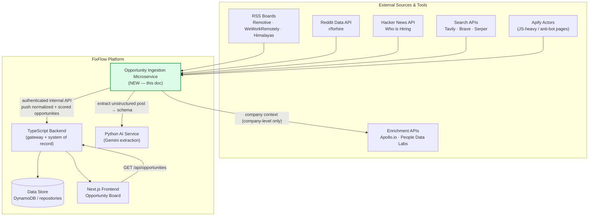
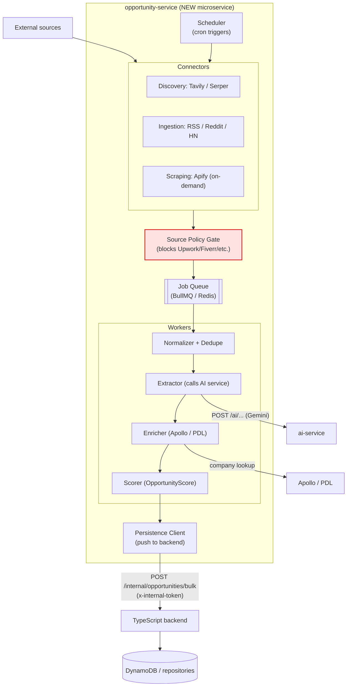
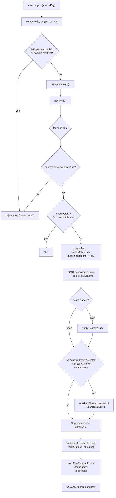
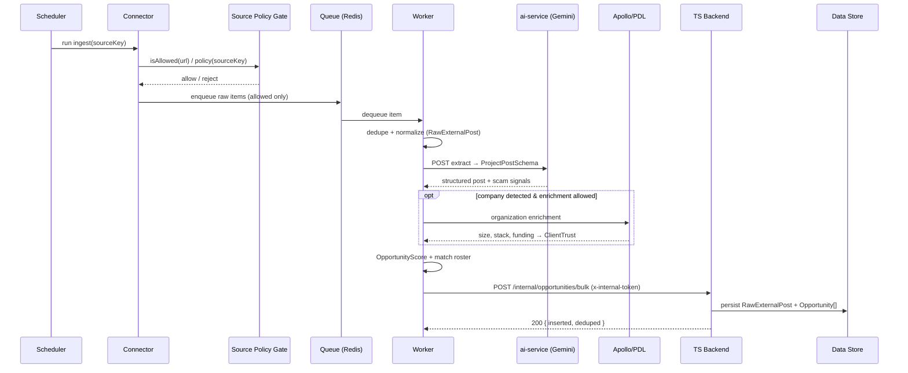
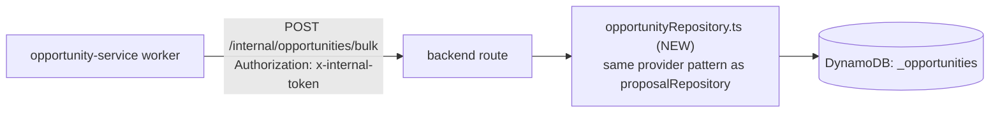
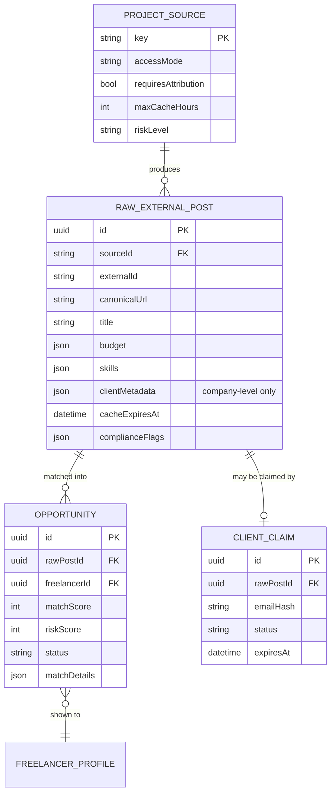
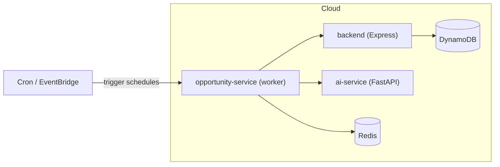

# FixFlowAI — Opportunity Ingestion Microservice (Design + Build Guide)

> **Audience:** the engineer who will build the new scraping / ingestion microservice.
> **Goal of the service:** automatically discover freelance **project opportunities** (and, where lawful, the associated **company/client context**) from external platforms, normalize + score them, and **write them into FixFlow's existing data store** so that any freelancer is automatically shown opportunities that match their skills and past projects.
> **Status:** Design spec. Not yet implemented.
> **Companion docs (read these too):**
> - `client_project_ingestion_feasibility.md` — the legal/compliance boundary (READ FIRST)
> - `opportunity_intelligence_implementation.md` — connector-level code patterns
> - `opportunity_intelligence_alternative_platforms.md` — tool cost/alternatives (June 2026)
> - `../ai_features/ai_005_opportunity_intelligence_scoring.md` — the scoring feature
> - `../ai_features/ai_006_smart_matching_lead_scoring.md` — the matching engine

---

## 0. Read This Before You Write Any Code (Compliance Guardrail)

You asked for scraping of **client name, email, and project info** from platforms like **Upwork and Fiverr**. Be aware of a hard boundary that this project already committed to:

| What you want | Verdict | Why |
|---|---|---|
| Harvest **client emails / personal contact details** from Upwork/Fiverr | ❌ **Do not build** | Violates Upwork/Fiverr ToS + anti-circumvention, is blocked by the existing `sourcePolicy.ts` gate, and harvesting personal emails without a lawful basis is a GDPR/privacy violation. |
| Copy Upwork/Fiverr **project posts** into FixFlow at scale | ❌ **Do not build** | No public project-post API for Fiverr; Upwork's API caps caching at 24h and forbids aggregation/competing services. |
| Auto-message clients to move them off-platform | ❌ **Do not build** | Spam + non-circumvention + account-ban risk. |
| Discover **project opportunities** from **compliant sources** (RSS boards, Reddit/HN official APIs, open-web search) | ✅ **Build this** | These are public/official feeds with documented usage terms. |
| **Enrich the company** behind an opportunity (size, industry, tech stack, funding) via Apollo.io / People Data Labs | ✅ **Build this (company-level only)** | Apollo/PDL are firmographic enrichment APIs. Use **company** data to score trust — do **not** use them to mass-export personal client emails for outreach. |
| Let a **client voluntarily claim** their project inside FixFlow (email verification + consent) | ✅ **Build this** | Consent-based, so contact data is lawful. |

**The reframing that keeps your goal intact:** you don't need to scrape client emails to reach your prime goal ("a freelancer seeking opportunities gets matched ones based on skills/projects"). You need a compliant **opportunity feed** + the **matching engine you already have** (`matchingEngine.ts`). This microservice builds that feed. Contact/identity of a client only enters the system when the client **claims** the project themselves.

Everything below is designed around that compliant core. The red-line items above are explicitly gated out at the `sourcePolicy` layer.

---

## 1. Where This Microservice Fits (System Context)

FixFlow today has three deployable units:

- **`backend/`** — TypeScript/Express gateway + system of record (auth, escrow, payments, persistence via the repository pattern).
- **`ai-service/`** — stateless Python/FastAPI service that owns the Gemini LLM features.
- **NEW → `opportunity-service/`** — the microservice this document specifies.



**Key architectural decision:** the microservice **does not own the database**. It stays consistent with how `ai-service/` already works — the **TypeScript backend remains the single system of record**. The microservice pushes results to an authenticated internal backend endpoint, which persists them through the existing repository layer. (Section 7 also covers the direct-DB-write alternative and when to pick it.)

---

## 2. The Prime Goal, Expressed as a Pipeline

> "When a freelancer is seeking opportunities, they automatically get ones matched to their skills and projects."

```mermaid
flowchart LR
    A["Compliant external sources"] --> B["Discover + Ingest"]
    B --> C["Normalize to RawExternalPost"]
    C --> D["Gemini extraction → ProjectPostSchema"]
    D --> E["Company enrichment (optional, company-level)"]
    E --> F["OpportunityScore (per source)"]
    F --> G["Persist RawExternalPost + Opportunity"]
    G --> H["Match vs freelancer skills/projects<br/>(matchingEngine.ts)"]
    H --> I["Freelancer Opportunity Board"]
```



The microservice owns steps **B → F** and the **write** in **G**. Matching (**H**) reuses the backend's existing `matchingEngine.ts`. The board (**I**) is frontend work tracked separately.

---

## 3. Tool Selection (What To Actually Use)

Your named candidates were Apify, Apollo.io, and "some other tools." Here's the decision, per pipeline layer, reconciled with the cost research already in `opportunity_intelligence_alternative_platforms.md`.

| Layer | Job | Recommended primary | Cheaper/alt | Skip unless… |
|---|---|---|---|---|
| **Discovery** | Find "need a dev" signals on the open web | **Tavily** (AI-native, source-attributed) | **Serper.dev** (cheapest SERP), **Exa** (semantic) | Brave — free tier removed Feb 2026 |
| **Ingestion** | Pull structured feeds | **Direct official APIs** (rss-parser + Reddit API + HN Firebase) — **$0** | **n8n** self-hosted for visual scheduling | **Apify** — only when a source needs JS rendering / anti-bot |
| **Scraping (JS-heavy pages)** | Render + extract pages a plain fetch can't | **Apify** (managed actors, proxies, anti-bot) | Firecrawl (clean Markdown for LLM) | Don't point Apify at Upwork/Fiverr/LinkedIn — gated out |
| **Enrichment (company)** | Company size, stack, funding, industry | **Apollo.io** Organization Enrichment | **People Data Labs** (free tier: ~100/mo) | Don't use Apollo for personal-email export/outreach |
| **Extraction (unstructured → schema)** | Turn a messy post into `ProjectPostSchema` | **Gemini** via the existing `ai-service/` | — | Don't regex-parse; formats vary too much |

**Bottom line for the build:** start with **Tavily (discovery) + direct RSS/Reddit/HN connectors (ingestion) + Gemini (extraction) + Apollo or PDL (company enrichment)**. Add **Apify only** when you hit a source that genuinely needs a headless browser. This is the cheapest compliant path and reuses infrastructure you already have.

> The step-by-step setup for the two tools you specifically asked about — **Apify** and **Apollo.io** — plus **Tavily**, is in Section 9.

---

## 4. High-Level Architecture (Microservice Containers)



**Why a queue inside the service:** discovery/scraping is bursty and rate-limited per source; the queue (BullMQ on Redis, already in your stack) gives you retries, backoff, and per-source concurrency without hammering upstream APIs.

---

## 5. Low-Level Architecture (Module + Data Flow)

This is the internal view your teammate will code against.



### 5.1 OpportunityScore (the ranking math — not an LLM call)

```
OpportunityScore =
    0.30 * SkillMatch          (freelancer skills ∩ post.requiredSkills)
  + 0.20 * BudgetFit           (post budget vs freelancer rate range)
  + 0.15 * Recency             (decays over ~7 days)
  + 0.15 * BriefQuality        (Gemini-scored post completeness)
  + 0.10 * SourceCompliance    (RSS/official > search result)
  + 0.10 * ClientTrust         (Apollo/PDL enrichment; neutral-low if unknown)
  - ScamPenalty                (crypto-only pay, PII requests, too-good budgets…)
```

Reuse the weighting/skill-synonym approach already implemented in `matchingEngine.ts` so scoring stays consistent across the platform.

---

## 6. Ingestion Sequence (End-to-End)



---

## 7. How It "Automatically Updates the Existing Database Table"

Your current data layer (`backend/src/services/*Repository.ts`) uses a **pluggable repository pattern** selected by env:
`PERSISTENCE_PROVIDER=dynamodb` → DynamoDB, otherwise in-memory; `userRepository` also supports `seed` and `http` providers. There is **no Postgres/Prisma in the code today** despite the steering note — build against the repository pattern.

There are two clean ways to write opportunities. **Recommended = Option A.**

### Option A — Push through the backend (recommended, keeps one system of record)



Steps for the teammate:
1. Add `backend/src/services/opportunityRepository.ts` mirroring `proposalRepository.ts` (in-memory + DynamoDB providers, `PERSISTENCE_PROVIDER` switch).
2. Add an **internal-only** route `POST /internal/opportunities/bulk` guarded by a shared secret header (`x-internal-token`), separate from user auth. Upsert by `(sourceId, externalId)` for idempotency.
3. The microservice calls that route with a batch of normalized + scored opportunities.

**Why recommended:** the backend stays the single writer; you reuse DynamoDB config (`config/aws.ts`), keep audit/validation in one place, and mirror the exact pattern `ai-service/` uses.

### Option B — Microservice writes DynamoDB directly

Give the microservice its own AWS credentials and write to `<prefix>_opportunities` / `<prefix>_raw_posts` tables via the AWS SDK. Faster to build, but now two services write the same tables — you must duplicate validation and schema rules. **Pick this only if** the backend push becomes a throughput bottleneck.

### 7.1 Data model the service persists

Follow the Prisma-style models already drafted in `client_project_ingestion_feasibility.md §6.3`. Minimum tables:



Note `clientMetadata` is **company-level only** (name, domain, size, industry) — never harvested personal emails. Personal contact enters solely via `CLIENT_CLAIM` (consent flow).

---

## 8. Suggested Service Skeleton

Two viable runtimes. Given the ingestion/queue/connector code patterns already written in TypeScript (`opportunity_intelligence_implementation.md`), **a Node/TypeScript worker is the lower-friction choice** and shares types with the backend. (Python is fine too if your teammate prefers it and mirrors the `ai-service/` layout — but you'd re-implement BullMQ patterns.)

```
opportunity-service/
├── package.json
├── .env.example
├── src/
│   ├── index.ts                     # boot: start scheduler + workers
│   ├── config.ts                    # env: API keys, backend URL, token
│   ├── sourcePolicy.ts              # SINGLE source of truth (copy/share w/ backend)
│   ├── connectors/
│   │   ├── search/
│   │   │   ├── tavilyConnector.ts
│   │   │   └── serperConnector.ts
│   │   ├── feeds/
│   │   │   ├── rssConnector.ts      # Remotive / WWR / Himalayas (rss-parser)
│   │   │   ├── redditConnector.ts   # official Reddit Data API
│   │   │   └── hnConnector.ts       # HN Firebase API (free, no auth)
│   │   ├── scraping/
│   │   │   └── apifyConnector.ts    # on-demand, JS-heavy pages only
│   │   └── enrichment/
│   │       ├── apolloEnrichment.ts
│   │       └── pdlEnrichment.ts     # cheaper fallback
│   ├── queue/
│   │   ├── queue.ts                 # BullMQ queue + Redis connection
│   │   └── scheduler.ts             # cron repeat jobs per source
│   ├── workers/
│   │   ├── normalizeWorker.ts       # dedupe + RawExternalPost
│   │   ├── extractWorker.ts         # calls ai-service for ProjectPostSchema
│   │   ├── enrichWorker.ts          # Apollo/PDL company enrichment
│   │   └── scoreWorker.ts           # OpportunityScore + match
│   ├── services/
│   │   ├── aiServiceClient.ts       # HTTP client → ai-service
│   │   ├── backendClient.ts         # HTTP client → backend /internal/opportunities/bulk
│   │   └── dedupeService.ts
│   └── schemas/
│       ├── rawExternalPost.ts       # zod
│       └── projectPost.ts           # zod (mirror of ai-service extraction schema)
└── README.md
```

---

## 9. Step-by-Step Tool Setup Guides

### 9.1 Apify (managed scraping — use only for JS-heavy/anti-bot sources)

> Apify runs "Actors" (pre-built or custom scrapers) in the cloud with rotating proxies. You trigger a run over the API, wait for it to finish, then read its dataset. Docs: https://docs.apify.com/api/client/js

**Setup:**
1. Create a free account at https://apify.com and open **Settings → Integrations** to copy your **API token**. (Free tier includes a small monthly credit.)
2. Add to the microservice `.env`:
   ```bash
   APIFY_API_TOKEN=apify_api_xxxxxxxx
   ```
3. Install the client:
   ```bash
   npm install apify-client
   ```
4. Pick an Actor from the Apify Store for the specific source (e.g. an RSS or generic web scraper). **Never** select an Actor that targets Upwork/Fiverr/LinkedIn — those are gated out.
5. Minimal connector:
   ```typescript
   // src/connectors/scraping/apifyConnector.ts
   import { ApifyClient } from 'apify-client';
   const apify = new ApifyClient({ token: process.env.APIFY_API_TOKEN! });

   export async function runActor(actorId: string, input: object) {
     const run = await apify.actor(actorId).call(input);         // start + wait
     const { items } = await apify.dataset(run.defaultDatasetId).listItems();
     return items;                                               // raw records
   }
   ```
6. Every returned item must still pass `sourcePolicy.isAllowed(url)` before you store it.

**Compliance rule for Apify in this project:** it is an *execution engine*, not a permission slip. The source policy gate decides what's allowed; Apify only fetches sources the gate already approved.

---

### 9.2 Apollo.io (company enrichment — company-level only)

> Apollo enriches an **organization** from a domain or name (size, industry, tech stack, funding). Use it to compute `ClientTrust`, **not** to export personal client emails. Docs: https://docs.apollo.io/reference/organization-enrichment

**Setup:**
1. Sign up at https://apollo.io. Under **Settings → Integrations → API**, generate an **API key**. (Company enrichment is cheaper on credits than personal-email export — you'll only use org enrichment.)
2. Add to `.env`:
   ```bash
   APOLLO_API_KEY=xxxxxxxx
   ```
3. Organization enrichment connector (Apollo's 2026 API authenticates via the `x-api-key` header — verify against the live docs when you build):
   ```typescript
   // src/connectors/enrichment/apolloEnrichment.ts
   export async function enrichCompany(domain: string) {
     const res = await fetch(
       `https://api.apollo.io/api/v1/organizations/enrich?domain=${encodeURIComponent(domain)}`,
       { method: 'POST', headers: { 'x-api-key': process.env.APOLLO_API_KEY!, 'Content-Type': 'application/json' } },
     );
     if (!res.ok) return null;
     const { organization } = await res.json();
     if (!organization) return null;
     return {
       name: organization.name,
       employeeCount: organization.estimated_num_employees ?? null,
       industry: organization.industry ?? null,
       techStack: (organization.technologies ?? []).map((t: any) => t.name),
       fundingStage: organization.latest_funding_stage ?? null,
     };
   }
   ```
4. Feed the result into `computeClientTrustScore()` (pattern shown in `opportunity_intelligence_implementation.md §3.5`).

**Do not** call Apollo's People Enrichment / email-reveal endpoints to build an outreach list from marketplace clients — that's the red-line path from Section 0.

**Cheaper alternative:** People Data Labs Company API (free tier ~100 lookups/month, no card) covers size/industry for $0 at MVP volume. Wire it behind the same `enrichCompany()` interface.

---

### 9.3 Tavily (open-web discovery — recommended primary discovery tool)

> Tavily is an AI-native search API returning clean, source-attributed snippets — ideal for finding "looking for a developer" posts across forums/blogs.

**Setup:**
1. Get an API key at https://tavily.com.
2. Add to `.env`:
   ```bash
   TAVILY_API_KEY=tvly-xxxxxxxx
   ```
3. Install + connector:
   ```bash
   npm install @tavily/core
   ```
   ```typescript
   // src/connectors/search/tavilyConnector.ts
   import { TavilyClient } from '@tavily/core';
   const tavily = new TavilyClient({ apiKey: process.env.TAVILY_API_KEY! });

   export async function discover(skills: string[]) {
     const q = `"looking for developer" OR "need freelancer" ${skills.slice(0,4).join(' OR ')}`;
     const r = await tavily.search(q, {
       searchDepth: 'advanced',
       maxResults: 15,
       excludeDomains: ['upwork.com','fiverr.com','freelancer.com','peopleperhour.com'],
       includeRawContent: false,   // snippets only — avoid full-text storage issues
     });
     return r.results;
   }
   ```

---

## 10. Environment Variables (microservice)

```bash
# opportunity-service/.env

# Discovery
TAVILY_API_KEY=tvly-...
SERPER_API_KEY=...            # optional cheap fallback

# Ingestion (official APIs)
REDDIT_CLIENT_ID=...
REDDIT_CLIENT_SECRET=...
# HN Firebase API needs no key

# Scraping (only for JS-heavy sources)
APIFY_API_TOKEN=apify_api_...

# Enrichment (company-level)
APOLLO_API_KEY=...
PDL_API_KEY=...               # optional cheaper alternative

# Infra
REDIS_URL=redis://localhost:6379

# Downstream services
AI_SERVICE_URL=http://localhost:8000
AI_SERVICE_TOKEN=...          # matches ai-service
BACKEND_INTERNAL_URL=http://localhost:4000
BACKEND_INTERNAL_TOKEN=...    # matches backend /internal route guard
```

---

## 11. Deployment Topology



- The microservice is a **background worker** (no public HTTP surface needed beyond an optional `/health`). It doesn't need to be internet-facing — that shrinks its attack surface.
- If you deploy serverless, the scheduler can be **EventBridge → Lambda** invoking each connector; otherwise a long-running container with BullMQ repeatable jobs.
- Secrets (API keys, internal token) go in your secrets manager, not in the image.

---

## 12. Build Milestones (suggested order for the teammate)

| Phase | Deliverable | Depends on |
|---|---|---|
| **0** | Copy `sourcePolicy.ts` in; confirm blocked domains; add `opportunityRepository.ts` + `POST /internal/opportunities/bulk` in backend | Section 7 |
| **1** | RSS connectors (Remotive/WWR/Himalayas) → normalize → push to backend (no scoring yet) | Phase 0 |
| **2** | Gemini extraction via `ai-service`; add `ProjectPostSchema`; dedupe | Phase 1 |
| **3** | OpportunityScore + match vs roster (`matchingEngine.ts`); freelancer boards populate | Phase 2 |
| **4** | Tavily discovery + Reddit/HN connectors | Phase 3 |
| **5** | Apollo/PDL company enrichment → ClientTrust | Phase 3 |
| **6** | Apify connector (only if a needed source requires JS rendering) | as needed |
| **7** | Client-claim consent flow (lawful contact path) | Phase 3 |

Ship Phase 1–3 first: that already delivers the prime goal (skill-matched opportunities auto-loaded) using entirely free, compliant sources.

---

## 13. Compliance Checklist (must stay green)

- [ ] Every source defined in `sourcePolicy.ts` **before** a connector is built for it.
- [ ] Upwork / Fiverr / Freelancer.com / PeoplePerHour / LinkedIn hard-blocked at the gate.
- [ ] No personal contact details (emails/phones) scraped or stored — company-level only.
- [ ] Attribution + canonical source link stored and shown on every opportunity.
- [ ] Per-source retention TTL enforced (`cacheExpiresAt`); expired raw posts purged.
- [ ] No automated outbound messages to clients; human-in-the-loop for all applications.
- [ ] Client contact enters the system only via the consent-based claim flow.
- [ ] Audit log for enrichment API calls and ingestion runs.
- [ ] Rate limits + backoff per source (queue-level).

---

## 14. Cross-References

| Document | Why |
|---|---|
| `client_project_ingestion_feasibility.md` | The compliance boundary + DB model drafts. **Read first.** |
| `opportunity_intelligence_implementation.md` | Connector-level TypeScript patterns you'll port into the service. |
| `opportunity_intelligence_alternative_platforms.md` | Tool cost/alternatives (why Tavily+direct APIs over Apify+Brave at MVP). |
| `../ai_features/ai_005_opportunity_intelligence_scoring.md` | The scoring feature + scam detection table. |
| `../ai_features/ai_006_smart_matching_lead_scoring.md` | The `matchingEngine.ts` this service feeds. |
| `../../../backend/src/services/matchingEngine.ts` | Reuse for match step (H). |
| `../../../backend/src/services/proposalRepository.ts` | Template for the new `opportunityRepository.ts`. |

---

*Compliance note: this document is engineering guidance, not legal advice. Before enabling any new source or enrichment provider in production, confirm its current terms of service and your data-protection obligations.*
