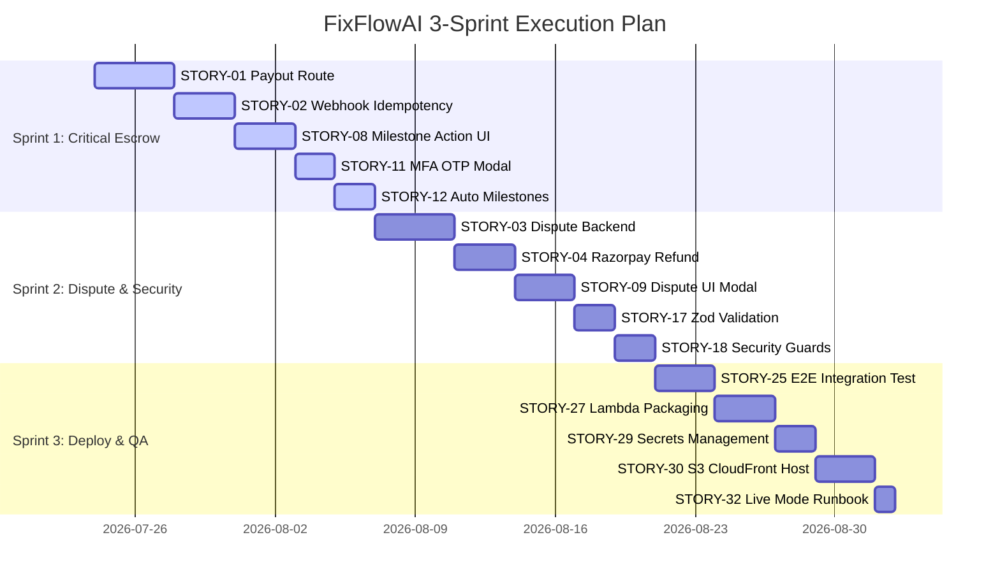

# FixFlowAI — Remaining Story Tasks (Sprint Backlog Specification)

> **Document Type:** Core Subsystem Backlog & Sprint Planning Specification  
> **Target Subsystem:** All FixFlowAI Subsystems (Escrow, UI, Security, Testing, DevOps, AI, Growth)  
> **Status:** Active Backlog  
> **Last Updated:** 2026-07-24  

---

## 1. Executive Summary & Backlog Overview

This document provides the definitive, sprint-ready task breakdown required to take FixFlowAI from its current state to a fully deployed, production-grade freelancing platform.

Every story is formatted according to strict Agile conventions:
- **Story Title & User Value Statement**
- **Priority Tier:** P0 (Critical / Blocker), P1 (High), P2 (Medium), P3 (Low)
- **Story Points (Effort):** Fibonacci scale (1, 2, 3, 5, 8)
- **Dependencies**
- **Checklist of Acceptance Criteria**
- **Target Files to Modify / Create**

---

## 2. Epic Summary Dashboard

| Epic ID | Epic Name | Story Count | Total Points | Target Phase |
|---------|-----------|-------------|--------------|--------------|
| **`EPIC-01`** | 🔴 Escrow & Payment Completion | 7 Stories | 34 Points | Phase 4 (Payments) |
| **`EPIC-02`** | 🟠 Frontend UI Completion | 8 Stories | 29 Points | Phase 3 (Real Data) |
| **`EPIC-03`** | 🟠 Security Hardening | 6 Stories | 21 Points | Phase 7 (Security) |
| **`EPIC-04`** | 🟡 Testing & Quality Assurance | 5 Stories | 18 Points | Phase 7 (Testing) |
| **`EPIC-05`** | 🟡 Deployment & Infrastructure | 6 Stories | 26 Points | Phase 6 (Serverless) |
| **`EPIC-06`** | 🔵 Optional AI Capabilities | 3 Stories | 13 Points | Phase 5 (AI Features) |
| **`EPIC-07`** | 🔵 Platform Growth & Polish | 5 Stories | 15 Points | Phase 8 (Launch) |
| **TOTAL** | **All Epics** | **40 Stories** | **156 Points** | **Go-Live** |

---

## 3. Detailed Story Specifications by Epic

---

### 🔴 EPIC-01: Escrow & Payment Completion

---

#### `STORY-01`: Fund Release & Freelancer Payout Route
- **As a** client,  
- **I want to** release escrowed funds to the freelancer upon approving their deliverables,  
- **So that** the freelancer receives their net payout directly into their account.
- **Priority:** P0 — Critical | **Estimate:** 8 Story Points | **Dependencies:** None

**Acceptance Criteria:**
- [ ] New Express route `POST /api/escrow/milestones/:id/release` registered in `index.ts`.
- [ ] Validates that target milestone is currently in `Approved` state.
- [ ] Triggers FSM transition `Approved → Funds_Released` with mandatory MFA token verification.
- [ ] Computes exact fee breakdown using `calculateEarningsBreakdown()` (net payout, platform fee, gateway fee, TDS).
- [ ] Invokes `transferFundsToFreelancer()` in `paymentService.ts` to dispatch payout.
- [ ] Persists Razorpay transfer ID and transfer status to the milestone record.
- [ ] Creates immutable SHA-256 audit ledger block for the release event.
- [ ] Frontend `api.js` exposes `releaseMilestone(id, payload)`.

**Files:**
- `backend/src/index.ts`
- `backend/src/services/escrowService.ts`
- `frontend/src/lib/api.js`
- `frontend/src/sections/dashboard/MilestoneFunds.jsx`

---

#### `STORY-02`: Webhook Event Deduplication & Idempotency Store
- **As a** backend system,  
- **I want** incoming Razorpay webhooks to be checked against a deduplication ledger,  
- **So that** duplicate event deliveries do not trigger redundant state transitions.
- **Priority:** P0 — Critical | **Estimate:** 5 Story Points | **Dependencies:** None

**Acceptance Criteria:**
- [ ] Create `ProcessedEventsRepository` interface with `InMemory`, `File`, and `DynamoDB` providers.
- [ ] Webhook handler checks `event.payload.payment.entity.id` before executing FSM transitions.
- [ ] Duplicate events return HTTP `200 OK` with `{ status: "ok", deduplicated: true }`.
- [ ] DynamoDB `processed_events` table configured with 30-day TTL.
- [ ] Unit tests verifying duplicate webhook handling.

**Files:**
- `backend/src/services/processedEventsRepository.ts` [NEW]
- `backend/src/index.ts`

---

#### `STORY-03`: Dispute Resolution Backend Workflow
- **As a** client or freelancer,  
- **I want to** escalate an active milestone to dispute state for arbitration,  
- **So that** conflicts over deliverable quality are resolved fairly.
- **Priority:** P0 — Critical | **Estimate:** 8 Story Points | **Dependencies:** STORY-01

**Acceptance Criteria:**
- [ ] Add route `POST /api/escrow/milestones/:id/dispute` (raises dispute from `Active`, `In_Review`, or `Revision_Requested`).
- [ ] Add route `POST /api/escrow/milestones/:id/resolve-dispute` (restricted to `Arbitrator` or `System` roles).
- [ ] Resolution supports 3 outcomes: `Approved` (freelancer wins), `Draft` (client refund), or split settlement.
- [ ] Creates audit trail block with dispute reason, evidence links, and decision metadata.

**Files:**
- `backend/src/services/disputeRepository.ts` [NEW]
- `backend/src/index.ts`

---

#### `STORY-04`: Razorpay Refund Subsystem Integration
- **As a** platform system,  
- **I want to** trigger Razorpay Refunds when a dispute resolves in client favor,  
- **So that** funds are returned to the client's original payment method.
- **Priority:** P0 — Critical | **Estimate:** 5 Story Points | **Dependencies:** STORY-03

**Acceptance Criteria:**
- [ ] Add `createRefund(paymentId, amount)` to `paymentService.ts`.
- [ ] FSM transition `Dispute → Draft` invokes Razorpay refund API.
- [ ] Handles webhook event `refund.processed` to update milestone metadata.
- [ ] Simulated mode handles mock refund generation.

**Files:**
- `backend/src/services/paymentService.ts`
- `backend/src/index.ts`

---

#### `STORY-05`: Webhook Lifecycle Event Handlers
- **As a** backend system,  
- **I want to** handle `payment.failed`, `refund.processed`, and `transfer.processed` events,  
- **So that** all external Razorpay lifecycle events update local milestone states.
- **Priority:** P1 — High | **Estimate:** 3 Story Points | **Dependencies:** STORY-02

**Acceptance Criteria:**
- [ ] `payment.failed` event logs payment failure and keeps milestone in `Pending_Deposit`.
- [ ] `transfer.processed` event updates milestone payout confirmation status.
- [ ] Structured logging for all unhandled webhook event types.

**Files:**
- `backend/src/index.ts`

---

#### `STORY-06`: Freelancer Bank Account Onboarding (Razorpay Route)
- **As a** freelancer,  
- **I want to** configure my bank account details in my profile,  
- **So that** Razorpay Route can dispatch direct payouts to my bank.
- **Priority:** P1 — High | **Estimate:** 3 Story Points | **Dependencies:** STORY-01

**Acceptance Criteria:**
- [ ] Add endpoint `POST /api/freelancer/linked-account`.
- [ ] Accepts account number, IFSC code, beneficiary name, and account type.
- [ ] Invokes Razorpay Linked Accounts API to register `acc_xxxx`.
- [ ] Stores `razorpayLinkedAccountId` on the user record in DynamoDB.
- [ ] Bank account onboarding UI form added to `RoleOnboarding.jsx`.

**Files:**
- `backend/src/index.ts`
- `backend/src/services/paymentService.ts`
- `frontend/src/sections/dashboard/RoleOnboarding.jsx`

---

#### `STORY-07`: Payment History & Financial Audit Dashboard
- **As a** user,  
- **I want to** view a complete list of my past deposits, escrow holdings, and payouts,  
- **So that** I have full visibility over my project finances.
- **Priority:** P1 — High | **Estimate:** 5 Story Points | **Dependencies:** STORY-01

**Acceptance Criteria:**
- [ ] Endpoint `GET /api/payments/history` returning user transaction logs.
- [ ] Renders deposit date, milestone title, gross amount, net earnings, and Razorpay payment ID.
- [ ] Add `PaymentHistory.jsx` component into dashboard navigation.

**Files:**
- `frontend/src/sections/dashboard/PaymentHistory.jsx` [NEW]
- `backend/src/index.ts`

---

### 🟠 EPIC-02: Frontend UI Completion

---

#### `STORY-08`: Milestone Action Button Controls
- **As a** dashboard user,  
- **I want** contextual action buttons on milestone cards (Submit, Approve, Request Revision, Release),  
- **So that** I can trigger FSM state changes directly from the UI.
- **Priority:** P0 — Critical | **Estimate:** 5 Story Points | **Dependencies:** STORY-01

**Acceptance Criteria:**
- [ ] Freelancer sees "Submit for Review" on `Active` milestones.
- [ ] Client sees "Approve Deliverables" on `In_Review` milestones (triggers MFA modal).
- [ ] Client sees "Request Revision" on `In_Review` milestones.
- [ ] Client sees "Release Funds" on `Approved` milestones.
- [ ] Card automatically updates state badge and progress bar upon action completion.

**Files:**
- `frontend/src/sections/dashboard/MilestoneFunds.jsx`
- `frontend/src/sections/dashboard/DeliveryControl.jsx`

---

#### `STORY-09`: Dispute Modal & Evidence Collector
- **As a** user,  
- **I want** a dedicated modal to file disputes with supporting evidence links,  
- **So that** I can formally request arbitration when issues arise.
- **Priority:** P0 — Critical | **Estimate:** 5 Story Points | **Dependencies:** STORY-03

**Acceptance Criteria:**
- [ ] Modal opens when clicking "Raise Dispute" on active milestone cards.
- [ ] Includes reason input field and dynamic evidence URL list.
- [ ] Calls `api.disputeMilestone()` and updates milestone state to `Dispute`.

**Files:**
- `frontend/src/components/DisputeModal.jsx` [NEW]
- `frontend/src/sections/dashboard/MilestoneFunds.jsx`

---

#### `STORY-10`: Cryptographic Audit Trail Inspector Component
- **As a** user,  
- **I want to** inspect the SHA-256 audit chain for any milestone,  
- **So that** I can independently verify that milestone state changes are untampered.
- **Priority:** P1 — High | **Estimate:** 3 Story Points | **Dependencies:** None

**Acceptance Criteria:**
- [ ] Clicking "Audit Trail" opens slide-out drawer or modal.
- [ ] Renders sequential list of audit blocks with timestamps, state transitions, and user roles.
- [ ] Displays green "Audit Chain Valid" badge when hash links are intact.

**Files:**
- `frontend/src/components/AuditTrailViewer.jsx` [NEW]
- `frontend/src/sections/dashboard/MilestoneFunds.jsx`

---

#### `STORY-11`: Multi-Factor Authentication (MFA) OTP Modal
- **As a** client,  
- **I want** an OTP prompt before executing financial approvals or releases,  
- **So that** high-value funds cannot be released accidentally or fraudulently.
- **Priority:** P0 — Critical | **Estimate:** 3 Story Points | **Dependencies:** None

**Acceptance Criteria:**
- [ ] Renders 6-digit OTP input modal for `Approved` and `Funds_Released` transitions.
- [ ] Passes `mfaToken` string to backend API request.
- [ ] Displays error notification if MFA verification fails.

**Files:**
- `frontend/src/components/MFAModal.jsx` [NEW]
- `frontend/src/sections/dashboard/MilestoneFunds.jsx`

---

#### `STORY-12`: Automatic Milestone Generation on Contract Send
- **As a** client,  
- **I want** sending an agreement to automatically generate milestone records,  
- **So that** the project timeline phases translate into fundable escrow milestones.
- **Priority:** P0 — Critical | **Estimate:** 3 Story Points | **Dependencies:** None

**Acceptance Criteria:**
- [ ] Clicking "Send for Approval" in `AgreementComposer.jsx` creates milestone records via `api.createMilestone()`.
- [ ] Phase titles and budget values match proposal timeline definitions.
- [ ] Redirects user to Milestone Funds tab upon completion.

**Files:**
- `frontend/src/sections/dashboard/AgreementComposer.jsx`

---

#### `STORY-13`: Real Milestone Integration in Delivery Control Panel
- **As a** freelancer,  
- **I want** `DeliveryControl.jsx` to render live milestone data from the backend,  
- **So that** task execution states reflect actual project progress.
- **Priority:** P1 — High | **Estimate:** 3 Story Points | **Dependencies:** STORY-08

**Acceptance Criteria:**
- [ ] Replace static task arrays with live data from `api.listMilestones()`.
- [ ] Allow evidence submission per milestone.

**Files:**
- `frontend/src/sections/dashboard/DeliveryControl.jsx`

---

#### `STORY-14`: Real Evidence Review in Outcome Evidence Panel
- **As a** client,  
- **I want** `OutcomeEvidence.jsx` to display submitted work evidence for review,  
- **So that** I can inspect deliverables before triggering milestone approval.
- **Priority:** P1 — High | **Estimate:** 3 Story Points | **Dependencies:** STORY-08

**Acceptance Criteria:**
- [ ] Render uploaded evidence links for milestones in `In_Review` state.
- [ ] Connect "Approve Outcome" button to MFA approval workflow.

**Files:**
- `frontend/src/sections/dashboard/OutcomeEvidence.jsx`

---

#### `STORY-15`: Cross-Panel Workflow Footer Action Bar
- **As a** user,  
- **I want** action bar buttons ("Go to Delivery", "Fund Milestones") to switch dashboard tabs,  
- **So that** I can seamlessly move through the project delivery pipeline.
- **Priority:** P1 — High | **Estimate:** 2 Story Points | **Dependencies:** None

**Acceptance Criteria:**
- [ ] All `panel-link` buttons update `dashboardTab` state in Zustand store.
- [ ] URL hash updates to `#/dashboard/{tab}` dynamically.

**Files:**
- `frontend/src/sections/dashboard/MilestoneFunds.jsx`
- `frontend/src/sections/dashboard/AgreementComposer.jsx`
- `frontend/src/sections/dashboard/DeliveryControl.jsx`

---

### 🟠 EPIC-03: Security Hardening

---

#### `STORY-16`: Express Rate Limiting Middleware
- **As a** system operator,  
- **I want** rate limiting enabled on all escrow and payment endpoints,  
- **So that** automated brute-force attacks are prevented.
- **Priority:** P1 — High | **Estimate:** 3 Story Points | **Dependencies:** None

**Acceptance Criteria:**
- [ ] Apply `express-rate-limit`: 10 requests/minute per IP on `/api/escrow/*`.
- [ ] Webhook route excluded from rate limits.

**Files:**
- `backend/src/index.ts`

---

#### `STORY-17`: Strict Zod Schema Validation on All Body Payloads
- **As a** backend system,  
- **I want** every API request body validated against Zod schemas,  
- **So that** malformed or malicious inputs are rejected before execution.
- **Priority:** P1 — High | **Estimate:** 5 Story Points | **Dependencies:** None

**Acceptance Criteria:**
- [ ] Define Zod schemas for `createMilestone`, `transition`, `verifyPayment`, and `release`.
- [ ] Reject amounts below ₹100 or above ₹50,00,000.

**Files:**
- `backend/src/index.ts`

---

#### `STORY-18`: Production Simulation Mode Disable Guard
- **As a** security engineer,  
- **I want** mock payment simulation mode completely disabled when `NODE_ENV=production`,  
- **So that** simulated payments cannot bypass real gateway checks in production.
- **Priority:** P0 — Critical | **Estimate:** 2 Story Points | **Dependencies:** None

**Acceptance Criteria:**
- [ ] `paymentService.ts` throws error if simulation mode is invoked when `NODE_ENV=production`.
- [ ] Boot check requires `RAZORPAY_KEY_ID` and `RAZORPAY_KEY_SECRET` in production.

**Files:**
- `backend/src/services/paymentService.ts`
- `backend/src/index.ts`

---

#### `STORY-19`: Strict CORS Origin Restriction
- **As a** security engineer,  
- **I want** CORS configured to allow only trusted frontend domains,  
- **So that** unauthorized web origins cannot make API requests.
- **Priority:** P1 — High | **Estimate:** 2 Story Points | **Dependencies:** None

**Acceptance Criteria:**
- [ ] Restrict CORS origins to `https://fixflow.ai` and local development origin.

**Files:**
- `backend/src/index.ts`

---

#### `STORY-20`: Server-Side Milestone Amount Enforcement
- **As a** security engineer,  
- **I want** payment order amounts computed strictly from database records,  
- **So that** users cannot tamper with milestone amounts during client-side checkout.
- **Priority:** P0 — Critical | **Estimate:** 2 Story Points | **Dependencies:** None

**Acceptance Criteria:**
- [ ] Razorpay order creation reads amount from `milestoneRepository`, ignoring client-sent values.

**Files:**
- `backend/src/index.ts`

---

#### `STORY-21`: Automated Audit Chain Integrity Scanner
- **As a** security engineer,  
- **I want** a background process to regularly verify all cryptographic audit chains,  
- **So that** database tampering is detected immediately.
- **Priority:** P2 — Medium | **Estimate:** 3 Story Points | **Dependencies:** None

**Acceptance Criteria:**
- [ ] Background utility verifies `verifyAuditChain()` across all persisted milestone chains.
- [ ] Logs critical alert if any hash mismatch is discovered.

**Files:**
- `backend/src/services/escrowService.ts`

---

### 🟡 EPIC-04: Testing & Quality Assurance

---

#### `STORY-22`: FSM Transition Matrix Unit Test Suite
- **Priority:** P1 — High | **Estimate:** 3 Story Points | **Dependencies:** None
- **Acceptance Criteria:** 100% test coverage for all 15 valid transitions and invalid transition rejections in `escrowStateMachine.ts`.

#### `STORY-23`: Payment Service & Signature Unit Tests
- **Priority:** P1 — High | **Estimate:** 3 Story Points | **Dependencies:** None
- **Acceptance Criteria:** Unit tests for HMAC-SHA256 payment signature verification and order creation.

#### `STORY-24`: Earnings Calculator Test Suite
- **Priority:** P1 — High | **Estimate:** 2 Story Points | **Dependencies:** None
- **Acceptance Criteria:** Unit tests verifying platform fees across all tiers, India TDS withholding, and client checkout premiums.

#### `STORY-25`: End-to-End Escrow Integration Test Suite
- **Priority:** P1 — High | **Estimate:** 5 Story Points | **Dependencies:** STORY-01
- **Acceptance Criteria:** Integration test covering Create → Fund → Verify → Approve → Release pipeline.

#### `STORY-26`: Webhook Event Integration Test Suite
- **Priority:** P1 — High | **Estimate:** 5 Story Points | **Dependencies:** STORY-02
- **Acceptance Criteria:** Test suite simulating Razorpay `payment.captured` webhooks and deduplication handling.

---

### 🟡 EPIC-05: Deployment & Infrastructure

---

#### `STORY-27`: Express Backend AWS Lambda Packaging
- **Priority:** P1 — High | **Estimate:** 5 Story Points | **Dependencies:** None
- **Acceptance Criteria:** Express app wrapped using `@vendia/serverless-express` for AWS Lambda deployment.

#### `STORY-28`: DynamoDB Table Provisioning IaC Template
- **Priority:** P1 — High | **Estimate:** 3 Story Points | **Dependencies:** None
- **Acceptance Criteria:** SAM/CloudFormation template for `users`, `proposals`, `milestones`, `audit_blocks`, and `processed_events`.

#### `STORY-29`: AWS Secrets Manager Integration
- **Priority:** P0 — Critical | **Estimate:** 3 Story Points | **Dependencies:** None
- **Acceptance Criteria:** Fetch Razorpay API keys and JWT secrets from AWS Secrets Manager at Lambda cold start.

#### `STORY-30`: Frontend S3 + CloudFront Deployment
- **Priority:** P1 — High | **Estimate:** 5 Story Points | **Dependencies:** None
- **Acceptance Criteria:** Vite static build hosted on S3 and served globally via CloudFront CDN.

#### `STORY-31`: GitHub Actions CI/CD Deployment Pipeline
- **Priority:** P1 — High | **Estimate:** 5 Story Points | **Dependencies:** None
- **Acceptance Criteria:** Automated CI/CD pipeline running tests and deploying frontend/backend on push to `main`.

#### `STORY-32`: Production Razorpay Live Mode Transition Runbook
- **Priority:** P0 — Critical | **Estimate:** 2 Story Points | **Dependencies:** STORY-18
- **Acceptance Criteria:** Operational checklist for swapping Razorpay test keys for live credentials.

---

### 🔵 EPIC-06: Optional AI Capabilities

---

#### `STORY-33`: Asynchronous AI Evaluation Job Queue
- **Priority:** P2 — Medium | **Estimate:** 5 Story Points | **Dependencies:** None
- **Acceptance Criteria:** Async execution of AI-002 confidence grid evaluations for large brief inputs.

#### `STORY-34`: AI-005 Opportunity Intelligence Lead Board
- **Priority:** P2 — Medium | **Estimate:** 5 Story Points | **Dependencies:** None
- **Acceptance Criteria:** Opportunity board discovering external project leads via Gemini scoring.

#### `STORY-35`: DynamoDB-Backed AI Response Cache
- **Priority:** P2 — Medium | **Estimate:** 3 Story Points | **Dependencies:** None
- **Acceptance Criteria:** Cache identical prompt requests in DynamoDB to reduce Gemini API costs.

---

### 🔵 EPIC-07: Platform Growth & Polish

---

#### `STORY-36`: Automated Email Notifications on Milestone Events
- **Priority:** P2 — Medium | **Estimate:** 3 Story Points | **Dependencies:** None
- **Acceptance Criteria:** Email alerts sent to users when milestones are funded, approved, or released.

#### `STORY-37`: Multi-Currency Support (USD, EUR, GBP)
- **Priority:** P3 — Low | **Estimate:** 5 Story Points | **Dependencies:** None
- **Acceptance Criteria:** Multi-currency display and checkout conversion support.

#### `STORY-38`: Freelancer Analytics & Earnings Dashboard Panel
- **Priority:** P2 — Medium | **Estimate:** 3 Story Points | **Dependencies:** None
- **Acceptance Criteria:** Analytics panel displaying total earnings, pending payouts, and reputation trajectory.

#### `STORY-39`: Polygon Web3 Soulbound Reputation NFT Minting
- **Priority:** P3 — Low | **Estimate:** 5 Story Points | **Dependencies:** None
- **Acceptance Criteria:** Mint non-transferable reputation NFTs on Polygon for completed project milestones.

#### `STORY-40`: Legal Terms, Privacy Policy & Escrow Agreement Pages
- **Priority:** P1 — High | **Estimate:** 2 Story Points | **Dependencies:** None
- **Acceptance Criteria:** Standard legal pages for Terms of Service, Escrow Agreement, and Privacy Policy.

---

## 4. Recommended Sprint Breakdown Plan

---

> **Related Specifications:**  
> - [Escrow & Razorpay Implementation Plan](file:///c:/Users/suvam/Desktop/VS%20code/Projects/FixFlowAI/docs/specifications/core_subsystems/escrow_razorpay_implementation_plan.md)  
> - [Go-Live Roadmap](file:///c:/Users/suvam/Desktop/VS%20code/Projects/FixFlowAI/docs/specifications/go_live_roadmap.md)  
