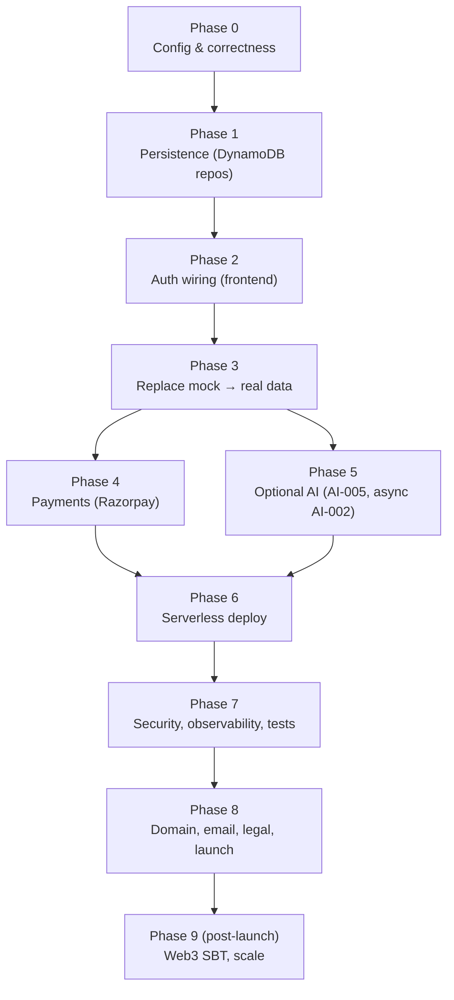

# FixFlowAI — Go-Live Roadmap

> **Purpose:** A single, honest, stepwise map of **everything still required to take FixFlowAI from its current state to a live, production website**, ordered so each phase unblocks the next. Use the checklists to track progress.

> **How to read this:** Section 1 = current reality. Section 2 = the dependency order (why this sequence). Sections 3+ = one phase at a time with goal, prerequisites, tasks, and "done when" criteria. Section 13 = the master checklist.

---

## 1. Where the project stands today

### ✅ Already done
- **Backend API (Express)** with live routes: AI-001 parse, AI-002 evaluate, AI-003 interview, AI-004 extensions, earnings/reputation/client-score, escrow FSM, AI-006 matching, sync telemetry.
- **Auth backend**: Google ID-token verification + JWT access/refresh + middleware + `/api/auth/*` routes.
- **Swappable data layer (interfaces)**: `freelancerRepository`, `userRepository`, `proposalRepository`, `milestoneRepository` (fully implemented seed/file + DynamoDB providers).
- **Real persistence**: DynamoDB repository implementations for Users, Proposals, and Milestones (FSM) are fully completed and integrated in `backend/src/services/`.
- **Auth wired in the frontend**: Google Sign-in and Dev Login are fully wired in `GoogleSignInButton.jsx`, `Login.jsx`, `Signup.jsx`, tokens are stored, and routes are protected.
- **Connected screens**: Overview, Agreement, Funds, Outcome, Delivery, and Role Onboarding are all connected and call the real backend API (`api.js`).
- **Payments (Razorpay)**: Razorpay order creation, payment verification, and webhook signature processing are fully implemented and integrated.
- **Stateless Python AI service**: The four LLM features (AI-001 brief parse, AI-002 confidence grid, AI-003 interview questions, AI-004 contract extensions) are migrated to a dedicated, stateless FastAPI Python service, proxying through the TS backend.
- **Docs**: AI feature specs + playbook, opportunity-intelligence build guide, cost analysis, serverless migration plan, Python migration plan.

### ❌ Not done yet (the gap to "live")
- **Not deployed** — runs locally on `:4000`; no Lambda/API Gateway, no frontend hosting.
- **Security, testing, CI/CD, domain, and legal pages** — need to configure Rate Limiting, Observability, and CloudWatch log triggers.
- **AI-005 (opportunity discovery)** not built (optional for v1).
- **Web3 (Polygon SBT)** not built (optional/post-launch).

---

## 2. Dependency order (why this sequence)

**Rule:** you cannot make screens "real" (Phase 3) before data persists (Phase 1) and a real user exists (Phase 2). Payments (Phase 4) need persisted escrow. Deploy (Phase 6) should come after the app is functionally complete so you deploy something that works.

---

## 3. Phase 0 — Configuration & correctness *(0.5 day)*

**Goal:** Remove the small blockers that make the current code fail at runtime.

**Tasks**
- [x] Fix `GEMINI_MODEL` — replaced with Python service model configuration (default `gemini-3.5-flash`, fallback `gemini-3.1-flash-lite`).
- [x] Generate and set `JWT_SECRET` (32+ bytes).
- [x] Create a Google OAuth 2.0 **Web** Client ID; set `GOOGLE_OAUTH_CLIENT_ID`; add frontend origins as authorized JavaScript origins.
- [x] Decide region = **`ap-south-1`**; recreate the (empty) DynamoDB tables there; delete the `us-east-1` ones; set `AWS_REGION=ap-south-1`.
- [x] Confirm `GET /api/health` shows `aiEnabled:true` and `authEnabled:true`.

**Done when:** health endpoint is green, AI calls succeed, and all infra is in one region.

---

## 4. Phase 1 — Persistence layer (DynamoDB) *(3–5 days)*

**Goal:** Data actually persists and is per-user. This is the foundation for everything "real."

**Prerequisite:** Phase 0 (region + tables).

**Tasks**
- [x] Add AWS SDK v3 (`@aws-sdk/client-dynamodb`, `@aws-sdk/lib-dynamodb`) to the backend.
- [x] Add `config/aws.ts` (region, table prefix, optional local endpoint) + a DynamoDB document-client singleton (module scope, keep-alive).
- [x] Implement `DynamoDbUserRepository` against the existing `UserRepository` interface; select it via `USER_PROVIDER=dynamodb`.
- [x] Implement a **`ProposalRepository`** (interface + Dynamo impl) — persist parsed proposals + evaluations keyed by `proposalId` and `userId`.
- [x] Refactor `escrowService.ts` to a **`MilestoneRepository`** (interface + Dynamo impl) using the `milestones` + `audit_blocks` tables — replace the in-memory `Map`.
- [x] Implement `DynamoDbFreelancerRepository` (or keep seed until you have real freelancers).
- [x] Seed initial freelancer data into the `freelancers` table (one-time script) if using the roster.

**Done when:** restart the server and previously created milestones/proposals are still there; the escrow audit chain survives across restarts.

---

## 5. Phase 2 — Authentication wiring (frontend) *(2–3 days)*

**Goal:** A real logged-in user with a real session; protected APIs.

**Prerequisite:** Phase 0 (Google client ID), Phase 1 (user persistence).

**Tasks**
- [x] Frontend: add Google Identity Services button; obtain a Google ID token client-side.
- [x] Replace mock `login()` in `Login.jsx` / `Signup.jsx` with a call to `POST /api/auth/google { idToken }` or `POST /api/auth/dev-login`.
- [x] Store the access token (memory/sessionStorage) + refresh token (localStorage or httpOnly cookie); persist the user in the store.
- [x] Update `frontend/src/lib/api.js` to attach `Authorization: Bearer <accessToken>` and to auto-refresh on `401` via `/api/auth/refresh`.
- [x] Wire logout to `POST /api/auth/logout` and clear local tokens.
- [x] Backend: protect the non-public routes with `requireAuth` (proposals, escrow, leads, etc.); keep health/auth public.
- [x] Add the role selection (client/freelancer/agency/developer) → `PATCH /api/auth/me/role`.

**Done when:** signing in with Google lands you in the dashboard as a real persisted user, and protected endpoints reject calls without a valid token.

---

## 6. Phase 3 — Replace mock data with real data *(4–6 days)*

**Goal:** No fabricated data anywhere; every screen shows real, per-user data or an honest empty/loading/error state.

**Prerequisite:** Phases 1 + 2.

**Tasks**
- [x] **Remove sample fallbacks** in Brief / Evidence / Delivery-extensions / Matches — on failure show loading/empty/error states (with try/catch graceful alerts), never fake data.
- [x] **Overview**: add `GET /api/overview` aggregating the user's real project state (stages, events, stats); wire the component.
- [x] **Agreement Composer**: persist + fetch the real agreement document (`/api/proposals/:id/agreement`).
- [x] **Milestone Funds**: drive from the real `MilestoneRepository` (`GET /api/escrow/milestones`) + earnings calc.
- [x] **Delivery**: real milestone tasks + a real activity/timeline feed (events table or derived).
- [x] **Outcome Evidence**: real reputation (`/api/reputation`) + completed-milestone proof events.
- [x] **Role Onboarding**: persist GitHub connection / wallet / team to the user record.
- [x] Replace `useLandingStore` seed arrays (initial milestones, change requests) with fetched data.
- [x] Add consistent **loading / empty / error** components used across all screens.

**Done when:** a brand-new account sees empty-but-correct screens, and data appears only as the user actually creates it.

---

## 7. Phase 4 — Payments & escrow funding (Razorpay) *(4–6 days)*

**Goal:** Real milestone funding and payout, tied to the escrow FSM.

**Prerequisite:** Phase 1 (persisted milestones), Phase 2 (auth).

**Tasks**
- [x] Razorpay account + API keys (test mode first); add `RAZORPAY_KEY_ID` / `RAZORPAY_KEY_SECRET`.
- [x] `POST /api/escrow/.../fund` → create a Razorpay order / virtual account; return payment coordinates.
- [x] Webhook endpoint `POST /api/webhooks/razorpay` (signature-verified) → on payment success transition the milestone `Pending_Deposit → Active` (FSM).
- [x] Payout/release on approval → Razorpay Route transfer; transition `Approved → Funds_Released`.
- [x] Use the existing `earningsCalculator` to show exact net/fees before funding.
- [x] Idempotency on webhooks (store processed event IDs).

**Done when:** a test payment funds a milestone, the FSM advances via webhook, and the audit chain records it.

---

## 8. Phase 5 — Optional AI capabilities *(parallel / as needed)*

**Goal:** The differentiators that aren't required for a functional v1 but add value.

**Tasks**
- [ ] **Long-running AI-002** → async job + poll (see serverless plan §3.7): `jobs` table, worker Lambda/queue, `202 + jobId`, poll endpoint.
- [ ] **AI-005 Opportunity Intelligence** → follow `opportunity_intelligence_build_guide.md` (source policy gate → free connectors → normalize/dedupe → Gemini extract → scoring → board + cron).
- [ ] **AI result caching** → DynamoDB-backed cache to cut repeat Gemini calls (cost + latency).

**Done when:** AI-002 never times out, and (if built) the Opportunity Board shows real discovered leads.

---

## 9. Phase 6 — Serverless deployment *(3–5 days)*

**Goal:** The app runs on AWS, not localhost.

**Prerequisite:** Phases 1–3 (a functional app), ideally 4.

**Tasks**
- [ ] Backend: wrap Express in one Lambda (serverless-express); HTTP API `ANY /api/{proxy+}` (see serverless plan §3).
- [ ] Performance: provisioned concurrency / warmer, esbuild bundle, 512 MB, module-scope clients, secrets cached (serverless plan §3.5).
- [ ] IaC: AWS SAM or Serverless Framework template (function, HTTP API, IAM least-privilege to DynamoDB/S3/Secrets).
- [ ] Secrets → **SSM Parameter Store / Secrets Manager** (not `.env` in prod).
- [ ] Frontend: build (Vite) → host on **S3 + CloudFront** (or Amplify Hosting); set `VITE_API_BASE_URL` to the API URL.
- [ ] CORS lock-down to the real frontend origin.

**Done when:** the public CloudFront URL serves the SPA and it talks to the deployed API.

---

## 10. Phase 7 — Security, observability, testing *(3–5 days)*

**Goal:** Production-safe and debuggable.

**Tasks**
- [ ] **Security**: rate limiting (per-IP/user), input validation on every route (Zod), secrets out of code, dependency audit, escrow MFA enforced, webhook signature verification.
- [ ] **Observability**: CloudWatch logs (structured), key metrics (latency, error rate, Gemini failures), alarms (5xx spike, Gemini quota), and a simple dashboard.
- [ ] **Testing**: unit tests for pure logic (matching, scoring, FSM, earnings), integration tests for routes, a smoke/e2e for the core happy path (sign in → brief → evaluate → match → fund).
- [ ] Error tracking (e.g. Sentry) on frontend + backend.

**Done when:** failures are visible and alertable, and the core path is covered by tests.

---

## 11. Phase 8 — Domain, email, legal, launch *(2–3 days)*

**Goal:** A real, compliant public launch.

**Tasks**
- [ ] Domain + DNS (Route 53), TLS (ACM) on CloudFront + custom API domain.
- [ ] Transactional email (SES) — verify domain, sender; wire onboarding/notifications.
- [ ] Legal pages: Privacy Policy, Terms; cookie/consent if needed.
- [ ] **Data compliance**: if AI-005 stores any external/personal data, document retention + honour the source policy; GDPR/CCPA basics.
- [ ] Accessibility pass (WCAG AA basics: focus states, labels, contrast, keyboard nav) and responsive QA.
- [ ] Final launch checklist + rollback plan.

**Done when:** the site is on your domain over HTTPS with legal pages and working email.

---

## 12. Phase 9 — Post-launch / optional *(later)*

- [ ] **Web3**: Polygon SBT reputation minting (Amoy testnet first).
- [ ] WebSocket real-time sync → API Gateway WebSocket (serverless plan §4).
- [ ] Scale tuning: DynamoDB provisioned capacity, CloudFront API caching, committed-use AI pricing.
- [ ] Analytics + product telemetry.

---

## 13. Master go-live checklist (condensed)

| Phase | Outcome | Status | Blocking for launch? |
|:---|:---|:---:|:---:|
| 0 — Config | Valid model, secrets, single region | ✅ Done | ✅ Yes |
| 1 — Persistence | DynamoDB repos; escrow persists | ✅ Done | ✅ Yes |
| 2 — Auth wiring | Real Google sign-in + protected APIs | ✅ Done | ✅ Yes |
| 3 — Real data | No mock; screens show real data | ✅ Done | ✅ Yes |
| 4 — Payments | Razorpay funding + payout via FSM | ✅ Done | ✅ Yes (core value) |
| 5 — Optional AI | Async AI-002, AI-005, caching | ⚠️ In Progress | ⬜ Nice-to-have |
| 6 — Deploy | Live on AWS serverless | ❌ Todo | ✅ Yes |
| 7 — Security/obs/test | Hardened + monitored + tested | ❌ Todo | ✅ Yes |
| 8 — Domain/legal | Domain, HTTPS, legal, email | ❌ Todo | ✅ Yes |
| 9 — Post-launch | Web3, real-time, scale | ❌ Todo | ⬜ Later |

**Critical path to a minimum live launch:** Phases **0 → 1 → 2 → 3 → 4 → 6 → 7 → 8**. Phase 5 and 9 can follow after launch.

---

## 14. Rough timeline

```mermaid
gantt
    dateFormat  X
    axisFormat %s
    section Foundation
    Phase 0 Config            :0, 1
    Phase 1 Persistence       :1, 5
    Phase 2 Auth wiring       :5, 8
    section Product
    Phase 3 Real data         :8, 14
    Phase 4 Payments          :14, 20
    section Launch
    Phase 6 Deploy            :20, 25
    Phase 7 Security/obs/test :25, 30
    Phase 8 Domain/legal      :30, 33
```

**Estimate:** ~5–7 focused weeks to a hardened public launch (solo), with Phase 5 (optional AI) and Phase 9 (Web3) layered in afterward. Parallelize where you have help (e.g. frontend Phase 3 while backend builds Phase 4).

---

## 15. Cross-references

| Topic | Doc |
|:---|:---|
| Serverless deploy + performance + async AI | [architecture/serverless_migration_plan.md](./architecture/serverless_migration_plan.md) |
| Cost at 1,000 users | [architecture/cost_analysis_1000_users.md](./architecture/cost_analysis_1000_users.md) |
| AI features (what & how) | [ai_features/README.md](./ai_features/README.md), [ai_features/ai_features_implementation_playbook.md](./ai_features/ai_features_implementation_playbook.md) |
| Opportunity Intelligence (AI-005) | [ai_features/opportunity_intelligence_build_guide.md](./ai_features/opportunity_intelligence_build_guide.md) |
| DynamoDB provisioning | `infra/dynamodb/` (create/delete scripts + README) |
| Repository pattern reference | `backend/src/services/freelancerRepository.ts`, `userRepository.ts` |

---

## 16. The single most important sequencing rule

**Don't deploy or chase optional features before Phases 1–3 are real.** A live site backed by mock data is worse than a local site that works. Get persistence → auth → real data solid, add payments, *then* deploy and harden. Everything else (AI-005, Web3, real-time) layers cleanly on top afterward.
