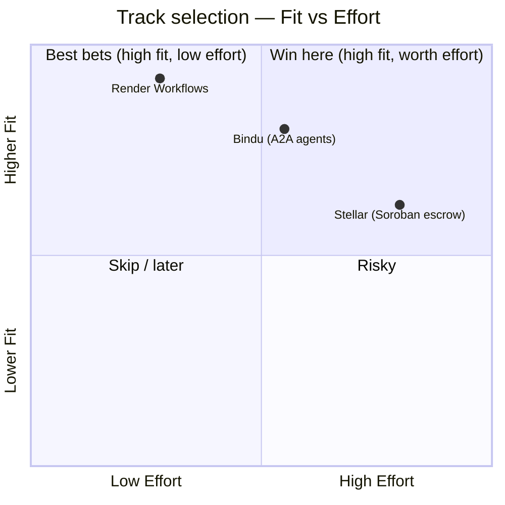
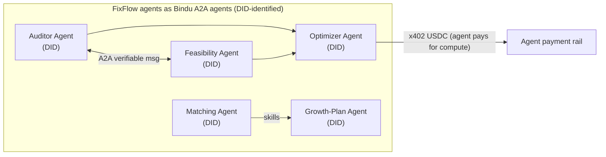
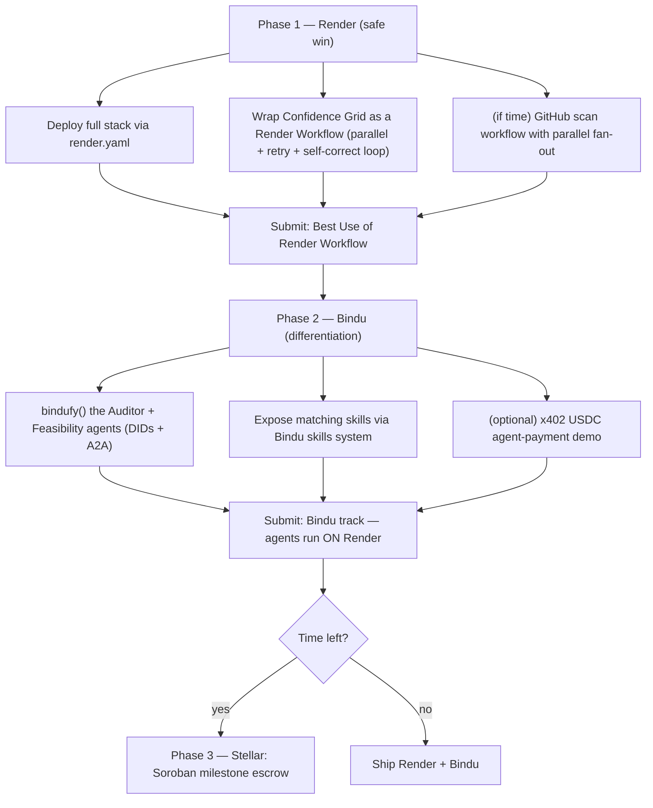

# FixFlowAI — BuildX'26 Prize Track Strategy

> **Goal:** win **at least one** BuildX'26 sponsor track with FixFlowAI.
> **Method:** map FixFlowAI's existing architecture to each sponsor's platform, then rank by win-probability = (fit × feasibility) ÷ effort.
> **Verdict up front:** target **Render ("Best Use of Render Workflow")** as the primary win, layer **Bindu** on top as a high-differentiation stretch, and treat **Stellar** as an optional on-chain escrow play only if time allows.
> *Sources are cited inline; external descriptions are paraphrased for licensing compliance.*

---

## 0. The Three Tracks (what each sponsor actually is)

| Track | What it is | Primary tech | FixFlow-relevant hook |
|:---|:---|:---|:---|
| **Render** | Cloud platform (web services, background workers, Postgres, Redis, cron). Special track: **"Best Use of Render Workflow"** — a durable-execution SDK that turns any function into a retryable task and chains tasks into multi-step / parallel pipelines. ([render.com](https://render.com/blog/durability-as-code-introducing-render-workflows)) | Any language; Render SDK | FixFlow is full of long-running, multi-step AI pipelines + needs hosting for TS backend, Python AI service, workers, DB, Redis |
| **Bindu** | "Identity, communication & payments layer for AI agents" — open-source **Agent-to-Agent (A2A)** protocol giving agents **DIDs**, verifiable comms, a skills system, and **USDC agent payments**; Python `bindufy()` wrapper. ([docs.ag2.ai](https://docs.ag2.ai/latest/docs/ecosystem/bindu/), [pypi](https://pypi.org/project/bindu/)) | Python | FixFlow already plans **DIDs + Soulbound credentials + multi-agent orchestration** (Auditor/Feasibility/Optimizer/Matching agents) |
| **Stellar** | Payments-focused blockchain with **Soroban smart contracts** (Rust) and fast/low-fee transfers. ([developers.stellar.org](https://developers.stellar.org/docs/build/smart-contracts)) | Rust (Soroban) | FixFlow's **milestone escrow + reputation credentials** are the on-chain candidates |

---

## 1. Executive Verdict & Ranking



| Rank | Track | Fit | Feasibility | Effort | Win probability | Call |
|:--:|:---|:--:|:--:|:--:|:--:|:---|
| 🥇 1 | **Render — Best Use of Render Workflow** | ★★★★★ | ★★★★★ | Low | **Highest** | **Primary — commit** |
| 🥈 2 | **Bindu — A2A agent identity/payments** | ★★★★☆ | ★★★★☆ | Medium | High | **Stretch — layer on Render** |
| 🥉 3 | **Stellar — Soroban escrow + credentials** | ★★★★☆ | ★★★☆☆ | High | Medium | Optional / if time |

**Why Render wins first:** FixFlowAI is *already* a collection of durable, multi-step, retryable, parallel pipelines. You aren't inventing a demo for the track — you're wrapping work you're already specced to build (AIA-01 async eval, AIA-03 GitHub scan, AIA-04 discovery). Lowest new-domain risk, strongest "best use" narrative.

---

## 2. Track 1 — Render (PRIMARY) 🥇

### 2.1 Why FixFlowAI is a near-perfect Render Workflows showcase

Render Workflows is durable execution: each step retries independently, steps chain into multi-step logic, and steps can run in parallel ([render.com](https://render.com/blog/durability-as-code-introducing-render-workflows)). FixFlowAI has **four** pipelines that are textbook fits:

```mermaid
flowchart TB
    subgraph W1["Workflow A — Confidence Grid (AI-002 / AIA-01)"]
        A1["parse brief"] --> A2{"parallel"}
        A2 --> A3["Auditor agent"]
        A2 --> A4["Feasibility agent"]
        A3 --> A5["mean score"]
        A4 --> A5
        A5 --> A6{"< threshold?"}
        A6 -->|yes| A7["optimize → re-evaluate (loop)"]
        A7 --> A5
        A6 -->|no| A8["persist result"]
    end
    subgraph W2["Workflow B — GitHub Deep Scan (AIA-03 / freelancer onboarding)"]
        B1["list repos"] --> B2["fan-out: analyze repos in parallel"]
        B2 --> B3["segment: skills"]
        B2 --> B4["segment: projects"]
        B2 --> B5["segment: experience"]
        B3 & B4 & B5 --> B6["confidence + persist"]
    end
    subgraph W3["Workflow C — Opportunity Ingestion (AIA-04)"]
        C1["scheduled trigger"] --> C2["discover"] --> C3["gate"] --> C4["normalize+dedupe"] --> C5["extract"] --> C6["enrich"] --> C7["score+persist"]
    end
    subgraph W4["Workflow D — End-to-end hire (brief→match→interview→escrow)"]
        D1["brief"] --> D2["match"] --> D3["interview"] --> D4["escrow"]
    end
```



Each maps to a Render Workflow property:
- **Parallel steps** → confidence grid's Auditor ‖ Feasibility; GitHub repo fan-out.
- **Retryable steps** → every Gemini call (aligns with story **AIA-05** resilience) and every external fetch.
- **Long-running / survives restarts** → GitHub scan (1–2 min), confidence self-correction loop, discovery cron.
- **Scheduled** → opportunity discovery (**AIA-04**).

### 2.2 Which FixFlow features run where on Render

| FixFlow component | Render primitive | Notes |
|:---|:---|:---|
| Confidence-grid evaluation (AI-002) | **Render Workflow** | Replaces the "async job + poll" plan (AIA-01) with a durable workflow — cleaner win story |
| GitHub deep scan (freelancer onboarding) | **Render Workflow** (parallel + steps) | Progressive segment reveal = workflow step completion events |
| Opportunity ingestion pipeline (AI-005) | **Render Workflow + Cron** | Scheduled multi-step ingestion |
| TypeScript backend (gateway) | **Render Web Service** | System of record |
| Python AI service (FastAPI) | **Render Web Service** (private) | The four LLM features + growth plan |
| Redis (queues/cache) | **Render Key Value** | AIA-02 cache, rate limits |
| PostgreSQL | **Render Postgres** | Persistence |
| Full stack | **Render Blueprint (`render.yaml`)** | "Full Startup Infrastructure" category = one-file deploy of the whole system |

### 2.3 Scope & feasibility

- **Scope (MVP for the track):** deploy the whole FixFlow stack on Render via `render.yaml`, and convert **at least one** pipeline (recommend the **Confidence Grid**, most visual) into a Render Workflow with parallel Auditor/Feasibility steps + retry + the self-correction loop. Add the **GitHub scan** workflow if time allows — it's the most impressive (parallel fan-out + progressive reveal).
- **Feasibility: Very High.** No new language, no blockchain, no smart contracts. It's your existing Python/TS code wrapped in the Render SDK. Uses the $50 credits. ([render.com/docs/credits](https://render.com/docs/credits))
- **Effort: Low–Medium.** Mostly deployment + wrapping 1–2 pipelines.

### 2.4 Winning narrative
> "FixFlowAI turns a chaotic hiring lifecycle into durable, observable pipelines. Our multi-agent Confidence Grid and parallel GitHub deep-scan run as Render Workflows — every LLM step retries independently, the self-correction loop survives restarts, and the whole trust-first platform deploys from one `render.yaml`."

---

## 3. Track 2 — Bindu (STRETCH, highest differentiation) 🥈

### 3.1 Why it's on-theme

Bindu gives AI agents **DIDs, verifiable A2A communication, a skills system, and USDC payments** via a Python `bindufy()` wrapper ([docs.ag2.ai](https://docs.ag2.ai/latest/docs/ecosystem/bindu/), [pypi](https://pypi.org/project/bindu/)). FixFlowAI *already* plans **Soulbound DID credentials**, a **multi-agent** Confidence Grid, and a **skills**-driven matching engine — so the conceptual overlap is unusually strong.



### 3.2 Which FixFlow features map to Bindu

| FixFlow feature | Bindu capability | Payoff |
|:---|:---|:---|
| Confidence Grid (Auditor + Feasibility + Optimizer) | **A2A protocol** — agents with DIDs exchanging verifiable messages | The multi-agent grid literally becomes "agents that talk" |
| Freelancer reputation / Soulbound credentials | **Agent DIDs + verifiable credentials** | Aligns with the trust-first DID vision (already in `product.md`) |
| Matching / Growth-plan engines | Bindu **skills system** | Agents advertise skills; matching becomes agent capability discovery |
| Paying for AI work / escrow micro-payments | **x402 USDC agent payments** | Novel: agents settle in USDC before doing work |

### 3.3 Scope & feasibility

- **Scope (MVP):** wrap the two Confidence-Grid agents with `bindufy()` so they run as DID-identified A2A microservices that exchange verifiable messages, and expose the matching engine's skills via Bindu's skills system. Optional: one x402 USDC payment demo.
- **Feasibility: Medium–High.** Bindu is **Python**, and your `ai-service` is Python/FastAPI — natural fit. Main work: refactor agents to Bindu's handler/A2A model + DID setup. Payments (EVM/USDC) add scope.
- **Effort: Medium.** New protocol to learn, but Python-native and conceptually pre-aligned.

### 3.4 The combined play (recommended)
Render + Bindu **compose**: run your **Bindu A2A agents** as services **on Render**, orchestrated by a **Render Workflow**. One project, two track submissions, one coherent story: *"durable multi-agent workflows of DID-identified agents."*

---

## 4. Track 3 — Stellar (OPTIONAL / on-chain escrow) 🥉

### 4.1 Fit

FixFlow's **milestone escrow** and **reputation credentials** are the on-chain candidates. Stellar is payments-first with **Soroban** smart contracts ([developers.stellar.org](https://developers.stellar.org/docs/build/smart-contracts)) — a natural home for milestone-release escrow and low-fee payouts, and an alternative to the currently-planned Polygon + Razorpay stack.

```mermaid
flowchart LR
    CLIENT["Client funds milestone"] --> SC["Soroban escrow contract"]
    SC -->|milestone approved (MFA)| REL["release USDC to freelancer"]
    SC --> CRED["reputation credential (Stellar asset)"]
```

### 4.2 Which FixFlow features map to Stellar

| FixFlow feature | Stellar mapping |
|:---|:---|
| Escrow FSM (`escrowStateMachine`) | Soroban smart contract enforcing milestone states + release |
| Milestone payouts (Razorpay/Polygon plan) | Stellar USDC payments (fast, cheap) |
| Soulbound reputation (Polygon SBT plan) | Stellar-issued non-transferable credential asset |

### 4.3 Scope & feasibility

- **Scope (MVP):** a Soroban contract for a single funded milestone with an approve→release path, wired to the existing escrow FSM as the on-chain settlement layer.
- **Feasibility: Medium.** Requires **Rust + Soroban** — a new language/domain and a rewrite of the escrow settlement path. Highest risk under time pressure.
- **Effort: High.**

**Recommendation:** pursue only if you specifically want on-chain escrow as a headline feature. Otherwise it dilutes focus from the higher-probability Render/Bindu wins.

---

## 5. Feasibility & Effort Matrix (side by side)

| Dimension | Render | Bindu | Stellar |
|:---|:--:|:--:|:--:|
| New language/domain to learn | None | A2A protocol (Python) | Rust + Soroban |
| Reuses existing FixFlow code | ✅ Heavy | ✅ Python AI agents | ⚠️ Rewrite escrow |
| Aligns with an existing spec/story | AIA-01/03/04 | DID/SBT + multi-agent | Escrow FSM + SBT |
| Demo "wow" factor | High (parallel workflows) | Very high (novel A2A) | High (on-chain) |
| Time to a working MVP | Days | ~1 week | 1–2+ weeks |
| Risk | Low | Medium | High |
| **Recommended** | **✅ Primary** | **✅ Stretch** | ⚪ Optional |

---

## 6. Recommended Execution Plan



### Milestones
| Phase | Deliverable | Track |
|:--|:--|:--|
| 1 | Whole stack on Render + 1 pipeline as a Render Workflow | Render (primary win) |
| 2 | 2 Confidence-Grid agents as DID'd A2A Bindu agents, hosted on Render | Bindu (stretch) |
| 3 (opt) | Soroban milestone-escrow contract | Stellar |

---

## 7. Risks & Mitigations

| Risk | Track | Mitigation |
|:---|:---|:---|
| Spreading across 3 tracks dilutes quality | all | Commit to **Render first**; Bindu only after Render is submittable; Stellar last |
| Bindu A2A refactor overruns | Bindu | Scope to **two** agents only; skip payments if tight |
| Soroban/Rust learning curve | Stellar | Treat as optional; single-contract MVP or drop |
| Gemini failures during a live demo | Render/Bindu | Ship **AIA-05** resilience + fallbacks first (already specced) |
| Render credits exhausted | Render | Monitor $50 credit; scale workers down between demos ([render.com/docs/credits](https://render.com/docs/credits)) |

---

## 8. Bottom Line

- **Win target:** **Render — Best Use of Render Workflow.** FixFlowAI's multi-agent Confidence Grid, parallel GitHub scan, and scheduled opportunity ingestion are exactly what durable workflows are for — and you're already specced to build them. Lowest risk, strongest "best use" story.
- **Amplify with Bindu:** turn your AI agents into DID-identified A2A agents (Python-native, on-theme with your trust/DID vision) and run them **on Render** — one build, two submissions, one narrative.
- **Stellar only if time remains:** on-chain Soroban escrow is a real fit but the heaviest lift; don't let it jeopardize the Render/Bindu wins.

---

## 9. Cross-References

| Document | Relevance |
|:---|:---|
| [AIA-01 Async Evaluation Jobs](../ai_features/stories/AIA-01-async-evaluation-jobs.md) | Becomes a Render Workflow |
| [AIA-03 GitHub Scan Pipeline](../ai_features/stories/AIA-03-github-scan-pipeline.md) | Parallel-fan-out Render Workflow |
| [AIA-04 Opportunity Discovery Automation](../ai_features/stories/AIA-04-opportunity-discovery-automation.md) | Scheduled Render Workflow |
| [AIA-05 Gemini Resilience](../ai_features/stories/AIA-05-gemini-call-resilience.md) | Per-step retries; ship before demo |
| [AI-002 Confidence Grid](../ai_features/ai_002_confidence_grid_self_correction.md) | The showcase multi-agent workflow |
| [Roles doc 01 — Freelancer GitHub Onboarding](../roles/01_freelancer_github_onboarding.md) | The parallel scan workflow |
| [product.md (steering)](../../../.kiro/steering/product.md) | DID/SBT + trust-first vision (Bindu alignment) |
| [Serverless Migration Plan](../architecture/serverless_migration_plan.md) | Compare with Render deployment |

*Note: platform capabilities summarized from vendor documentation as of 2026-07; verify current SDK/API details and prize rules on each sponsor's site before building.*
