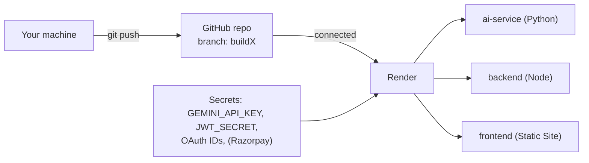
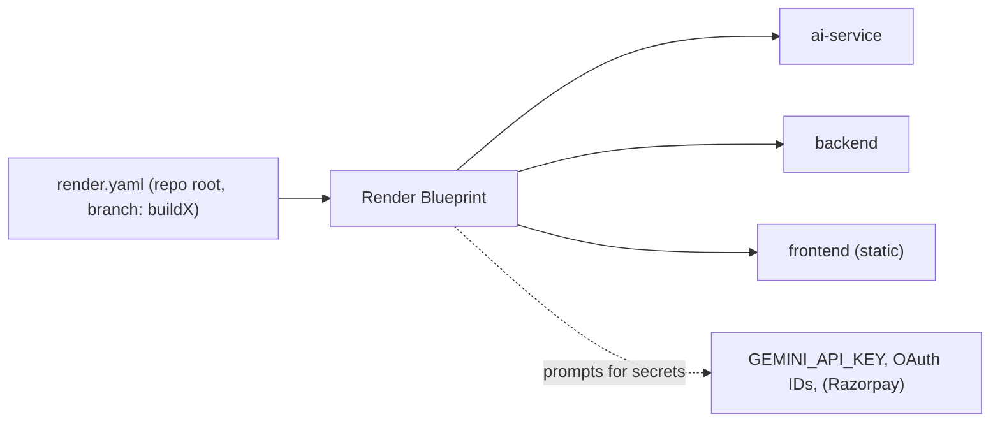

# 01 — Render Deployment Guide (from the `buildX` branch)

> Step-by-step to get **all three FixFlowAI services live on Render**, deployed from the **`buildX`** branch, with the WebSocket sync server working, AI features enabled, and the escrow/payment endpoints ready. Uses **seed + in-memory** persistence so **no external database is required**. Payments run in **simulated mode** by default; flip to live Razorpay whenever you're ready.

---

## 0. Prerequisites

- A **Render account** (free tier + the BuildX credits).
- The FixFlowAI repo on **GitHub/GitLab** (Render deploys from a connected git repo).
- A **Google Gemini API key** (for AI features).
- A **Google OAuth 2.0 Web Client ID** + **GitHub OAuth App** (for sign-in) — optional for a pure API demo, required for real login.
- (Optional, only for live payments) **Razorpay** Key ID / Key Secret / Webhook Secret.



> ⚠️ **Secrets safety:** the repo `.gitignore` already excludes `secrets/`, `.env`, and `*.seed.json`. Never commit real keys — enter them in the Render dashboard (they map to `sync:false` vars in `render.yaml`).

---

## 1. Prepare the `buildX` branch

Render deploys a specific branch. Create/prepare `buildX`:

```bash
# from repo root
git checkout -b buildX        # or: git checkout buildX
git push -u origin buildX
```

> Keep `main` as your AWS/production line. `buildX` is what Render watches. (See branching model in [doc 03](./03_configuration_and_blueprint_reference.md#5-branching--deploy-model).)

**Seed data note:** `data/` and `*.seed.json` are gitignored. Because the demo uses `USER_PROVIDER=seed` / `FREELANCER_PROVIDER=seed`, make sure the seed files are actually in the branch Render builds. If a fresh clone is missing them, force-add once:

```bash
git add -f backend/data/users.seed.json backend/data/freelancers.seed.json
git commit -m "chore: include seed data for Render demo"
```

---

## 2. Deploy the AI service first (Python / FastAPI)

It only needs `GEMINI_API_KEY`, so get it green before the backend.

### 2.1 Create the service
Render Dashboard → **New → Web Service** → connect the repo → select branch **`buildX`**.

| Setting | Value |
|---|---|
| **Name** | `fixflowai-ai-service` |
| **Language / Runtime** | Python 3 |
| **Root Directory** | `ai-service` |
| **Build Command** | `pip install -r requirements.txt` |
| **Start Command** | `uvicorn app.main:app --host 0.0.0.0 --port $PORT` |
| **Instance type** | Free (or Starter) |

> ⚠️ **Must use `--port $PORT`.** Render injects `PORT`; binding to `0.0.0.0` is required so Render can route to it.

### 2.2 Environment variables

| Key | Value | Notes |
|---|---|---|
| `GEMINI_API_KEY` | *your key* | **Secret** — required |
| `GEMINI_MODEL` | `gemini-3.5-flash` | default model |
| `AI_SERVICE_TOKEN` | *a random string* | shared secret; must match backend |
| `CONFIDENCE_THRESHOLD` | `75` | optional |
| `MAX_CORRECTION_CYCLES` | `1` | optional |

### 2.3 Verify
Open `https://fixflowai-ai-service.onrender.com/health` — expect `{ "status": "ok", "aiEnabled": true, ... }`. Docs at `/docs`.

---

## 3. Deploy the backend (Node / Express + WebSocket + escrow)

### 3.1 Create the service
**New → Web Service** → same repo → branch **`buildX`**.

| Setting | Value |
|---|---|
| **Name** | `fixflowai-backend` |
| **Root Directory** | `backend` |
| **Build Command** | `npm install && npm run build` |
| **Start Command** | `npm start` |
| **Instance type** | Free (or Starter) |

> `npm run build` runs `tsc` → `dist/`; `npm start` runs `node dist/index.js`, which reads `process.env.PORT` (Render sets it) and boots Express + the `/sync` WebSocket on the same port.

### 3.2 Environment variables

| Key | Value | Notes |
|---|---|---|
| `AI_SERVICE_URL` | AI service URL | public `https://…onrender.com` or private `host:port` |
| `AI_SERVICE_TOKEN` | *same string as AI service* | must match |
| `JWT_SECRET` | *32+ byte random* | **Secret, required** — `node -e "console.log(require('crypto').randomBytes(48).toString('base64url'))"` |
| `GOOGLE_OAUTH_CLIENT_ID` | *your web client id* | Google sign-in |
| `GITHUB_OAUTH_CLIENT_ID` / `GITHUB_OAUTH_CLIENT_SECRET` | *your GitHub OAuth app* | freelancer sign-in |
| `GITHUB_OAUTH_CALLBACK_URL` | `https://fixflowai-frontend.onrender.com/` | must match GitHub app + frontend URL |
| `FREELANCER_PROVIDER` | `seed` | uses `data/freelancers.seed.json` — no DB |
| `USER_PROVIDER` | `seed` | uses `data/users.seed.json` — no DB |
| `FRONTEND_ORIGINS` | `https://fixflowai-frontend.onrender.com,https://fixflowai.xyz` | **CORS allow-list** (comma separated) |
| `ALLOW_PAYMENT_SIMULATION` | `true` | lets simulated payments run under `NODE_ENV=production` |
| `PORT` | *(leave unset)* | Render sets it automatically |

**Persistence:** leave `PERSISTENCE_PROVIDER` unset for the demo (proposals in-memory; milestone + webbook-dedup stores use an ephemeral file on Render that resets on redeploy — fine for a demo). Do **not** set `dynamodb` unless you're wiring real AWS.

**Live payments (optional):** set `RAZORPAY_KEY_ID`, `RAZORPAY_KEY_SECRET`, `RAZORPAY_WEBHOOK_SECRET`, and change `ALLOW_PAYMENT_SIMULATION` to `false`. Then register the webhook URL `https://fixflowai-backend.onrender.com/api/webhooks/razorpay` in the Razorpay dashboard.

### 3.3 Verify
- `https://fixflowai-backend.onrender.com/api/health` → status + `aiEnabled` (proxied from the AI service).

---

## 4. Deploy the frontend (Vite React — Static Site)

### 4.1 Create the static site
**New → Static Site** → same repo → branch **`buildX`**.

| Setting | Value |
|---|---|
| **Name** | `fixflowai-frontend` |
| **Root Directory** | `frontend` |
| **Build Command** | `npm install && npm run build` |
| **Publish Directory** | `dist` |

### 4.2 Environment variables

| Key | Value | Notes |
|---|---|---|
| `VITE_API_BASE_URL` | `https://fixflowai-backend.onrender.com` | the **public** backend URL — the browser calls it directly |

> `VITE_API_BASE_URL` is baked in at **build time**, so set it before the build (or set it and trigger a redeploy once the backend URL is known). The app uses **hash routing** (`#/dashboard`), so no SPA rewrite rule is needed.

### 4.3 Wire the pieces together
1. Set the backend's `FRONTEND_ORIGINS` to include the static site URL (`https://fixflowai-frontend.onrender.com`) so CORS allows it.
2. In your **Google OAuth** credentials, add the frontend origin as an authorized JavaScript origin.
3. In your **GitHub OAuth app**, set the callback to the frontend URL and match `GITHUB_OAUTH_CALLBACK_URL`.

---

## 5. WebSocket (real-time sync) on Render

Your `/sync` WebSocket shares the backend's HTTP server and port. **Render web services support WebSockets natively.** Clients connect to `wss://fixflowai-backend.onrender.com/sync`.

> On the **free instance type**, services sleep after inactivity and cold-start on the next request — a sleeping service drops WebSocket connections. Use a **Starter** instance (or a keep-alive ping) for a live judged demo.

---

## 6. One-click alternative: deploy via Blueprint

A **`render.yaml`** already lives at the repo root. Push the `buildX` branch, then **Render → New → Blueprint** → pick the repo/branch. Render creates all three services and prompts for the `sync:false` secrets. Full file + notes in [doc 03](./03_configuration_and_blueprint_reference.md#2-full-renderyaml).



---

## 7. End-to-end verification

```bash
curl https://fixflowai-ai-service.onrender.com/health      # aiEnabled:true
curl https://fixflowai-backend.onrender.com/api/health     # ok
```

Then in the browser: open the frontend URL, sign in, parse a brief, create + fund a milestone (simulated checkout auto-confirms), then approve + release (MFA modal), and open the Audit Trail drawer.

---

## 8. Troubleshooting

| Symptom | Cause | Fix |
|---|---|---|
| Backend exits on boot with "RAZORPAY_… required in production" | `NODE_ENV=production` (Render default) + no keys | Set `ALLOW_PAYMENT_SIMULATION=true` (demo) or add live keys |
| Frontend calls fail / CORS error | `VITE_API_BASE_URL` unset or origin not allowed | Set the build var + add the site to `FRONTEND_ORIGINS`, redeploy |
| AI service `aiEnabled:false` | No `GEMINI_API_KEY` | Set it; redeploy |
| Backend AI calls 502/timeout | Wrong `AI_SERVICE_URL` or AI service asleep | Check URL; wake/upgrade AI service |
| `401` from AI service | Token mismatch | `AI_SERVICE_TOKEN` must be identical on both |
| Empty roster / login fails | Seed files not in branch | `git add -f` the seed files (see §1) |
| WebSocket drops after idle | Free instance sleeping | Starter instance or keep-alive ping |
| Rate limited (429) on escrow calls | STORY-16 limiter (10/min/IP) | Expected under load; slow down or raise the limit |

---

## 9. What's next

All services live? Proceed to **[02 — Render Workflows Guide](./02_render_workflows_guide.md)** to convert the Confidence Grid into a durable workflow for the "Best Use of Render Workflow" track.
