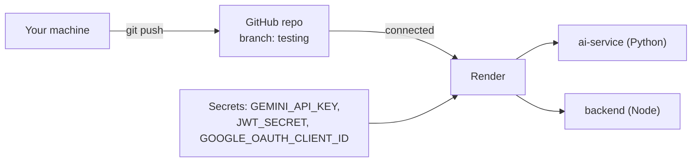
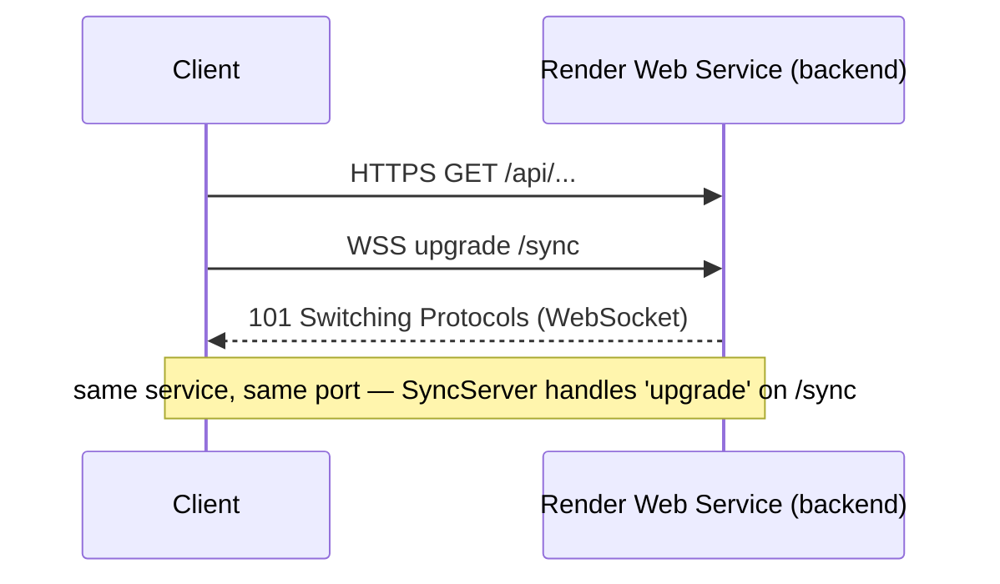
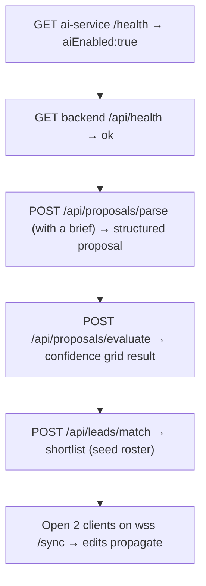
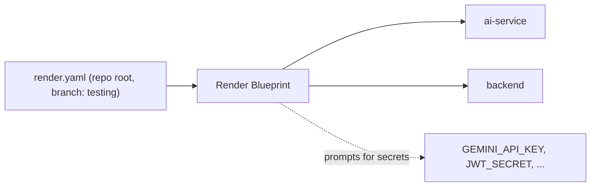

# 01 — Render Deployment Guide (from the `testing` branch)

> Step-by-step to get **both FixFlowAI services live on Render**, deployed from the **`testing`** branch, with the WebSocket sync server working and AI features enabled. Uses **seed + in-memory** persistence so **no external database is required**.

---

## 0. Prerequisites

- A **Render account** (free tier + the BuildX $50 credits).
- The FixFlowAI repo on **GitHub/GitLab** (Render deploys from a connected git repo).
- A **Google Gemini API key** (for AI features).
- A **Google OAuth 2.0 Web Client ID** (for sign-in) — optional for a pure API demo, required for real login.



---

## 1. Prepare the `testing` branch

Render deploys a specific branch. Create/prepare `testing`:

```bash
# from repo root
git checkout -b testing        # or: git checkout testing
git push -u origin testing
```

> Keep `main` as your AWS/production line. `testing` is what Render watches. (See branching model in [doc 03](./03_configuration_and_blueprint_reference.md#5-branching--deploy-model).)

---

## 2. Deploy the AI service first (Python / FastAPI)

It only needs `GEMINI_API_KEY`, so get it green before the backend.

### 2.1 Create the service
Render Dashboard → **New → Web Service** → connect the repo → select branch **`testing`**.

| Setting | Value |
|---|---|
| **Name** | `fixflowai-ai-service` |
| **Language / Runtime** | Python 3 |
| **Root Directory** | `ai-service` |
| **Build Command** | `pip install -r requirements.txt` |
| **Start Command** | `uvicorn app.main:app --host 0.0.0.0 --port $PORT` |
| **Instance type** | Free (or Starter) |

> ⚠️ **Must use `--port $PORT`.** Render injects `PORT`; your `config.py` `PORT` value is not what uvicorn binds to unless you pass it. Binding to `0.0.0.0` is required so Render can route to it.

### 2.2 Environment variables
Add these under the service's **Environment**:

| Key | Value | Notes |
|---|---|---|
| `GEMINI_API_KEY` | *your key* | **Secret** — required |
| `GEMINI_MODEL` | `gemini-3.5-flash` | default model (fallback `gemini-3.1-flash-lite`) |
| `AI_SERVICE_TOKEN` | *a random string* | shared secret; must match backend |
| `CONFIDENCE_THRESHOLD` | `75` | optional |
| `MAX_CORRECTION_CYCLES` | `1` | optional |

> Generate `AI_SERVICE_TOKEN` once: `node -e "console.log(require('crypto').randomBytes(24).toString('base64url'))"` and reuse the same value in the backend.

### 2.3 Verify
After deploy, open `https://fixflowai-ai-service.onrender.com/health` — expect:
```json
{ "status": "ok", "aiEnabled": true, "model": "gemini-3.5-flash" }
```
If `aiEnabled: false` → `GEMINI_API_KEY` isn't set. Interactive docs live at `/docs`.

---

## 3. Deploy the backend (Node / Express + WebSocket)

### 3.1 Create the service
**New → Web Service** → same repo → branch **`testing`**.

| Setting | Value |
|---|---|
| **Name** | `fixflowai-backend` |
| **Language / Runtime** | Node |
| **Root Directory** | `backend` |
| **Build Command** | `npm install && npm run build` |
| **Start Command** | `npm start` |
| **Instance type** | Free (or Starter) |

> `npm run build` runs `tsc` → `dist/`; `npm start` runs `node dist/index.js`, which reads `process.env.PORT` (Render sets it) and boots Express + the `/sync` WebSocket on the same port.

### 3.2 Environment variables

| Key | Value | Notes |
|---|---|---|
| `AI_SERVICE_URL` | `https://fixflowai-ai-service.onrender.com` | point at the AI service from step 2 (or its **internal** URL — see below) |
| `AI_SERVICE_TOKEN` | *same string as AI service* | must match |
| `JWT_SECRET` | *32+ byte random* | **Secret, required** — `node -e "console.log(require('crypto').randomBytes(48).toString('base64url'))"` |
| `GOOGLE_OAUTH_CLIENT_ID` | *your web client id* | required for Google sign-in |
| `FREELANCER_PROVIDER` | `seed` | uses `data/freelancers.seed.json` — no DB |
| `USER_PROVIDER` | `seed` | uses `data/users.seed.json` — no DB |
| `PORT` | *(leave unset)* | Render sets it automatically |

**Do NOT set** `PERSISTENCE_PROVIDER=dynamodb` for the Render demo → leaving it unset uses the **in-memory** proposal store (no AWS needed). Razorpay/AWS/DynamoDB vars stay blank unless you want those flows.

### 3.3 Service-to-service networking (recommended)
Render services in the same account can talk over a **private internal URL** (no public round-trip, no egress). In the backend set:
```
AI_SERVICE_URL = http://fixflowai-ai-service:10000   # internal host:port
```
…or just use the public `https://…onrender.com` URL for simplicity. Both work; private is faster and doesn't consume public bandwidth.

### 3.4 Verify
- `https://fixflowai-backend.onrender.com/api/health` → should report status + `aiEnabled` (proxied from the AI service).
- Test a real AI call once both are up (see §5).

---

## 4. WebSocket (real-time sync) on Render

Your `/sync` WebSocket shares the backend's HTTP server and port. **Render web services support WebSockets natively** — nothing extra to configure. Clients connect to:
```
wss://fixflowai-backend.onrender.com/sync
```



> On the **free instance type**, services **sleep after inactivity** and cold-start on the next request — fine for a demo, but a sleeping service drops WebSocket connections. Use a **paid instance** (or a keep-alive ping) for a live judged demo.

---

## 5. End-to-end verification



Minimal smoke test (replace host + a valid access token where auth is required):
```bash
curl https://fixflowai-ai-service.onrender.com/health
curl https://fixflowai-backend.onrender.com/api/health
```

---

## 6. One-click alternative: deploy via Blueprint

Instead of clicking through both services, commit a **`render.yaml`** at the repo root and use **New → Blueprint**. Render reads it and creates both services at once. Full file in [doc 03](./03_configuration_and_blueprint_reference.md#2-full-renderyaml).



---

## 7. Troubleshooting

| Symptom | Cause | Fix |
|---|---|---|
| AI service `aiEnabled:false` | No `GEMINI_API_KEY` | Set it; redeploy |
| Backend AI calls return 502/timeout | Wrong `AI_SERVICE_URL` or AI service asleep | Check URL; wake/upgrade AI service |
| `401` from AI service | Token mismatch | `AI_SERVICE_TOKEN` must be identical on both |
| Backend build fails | TS build error | Run `npm run build` locally; fix, push |
| uvicorn "port already in use" / not reachable | Missing `--host 0.0.0.0 --port $PORT` | Use the exact start command in §2.1 |
| WebSocket drops after idle | Free instance sleeping | Paid instance or keep-alive ping |
| `JWT_SECRET ... shorter than 32` on boot | Secret missing/short | Set a 32+ byte value |

---

## 8. What's next

Both services live? Proceed to **[02 — Render Workflows Guide](./02_render_workflows_guide.md)** to convert the Confidence Grid into a durable workflow for the "Best Use of Render Workflow" track.
