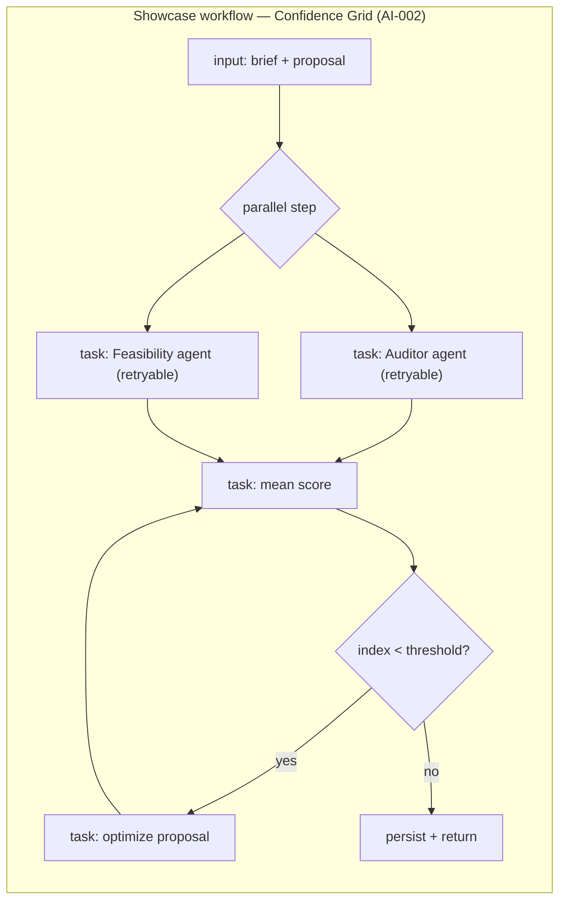
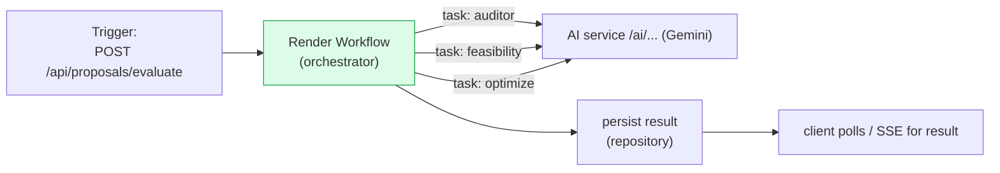
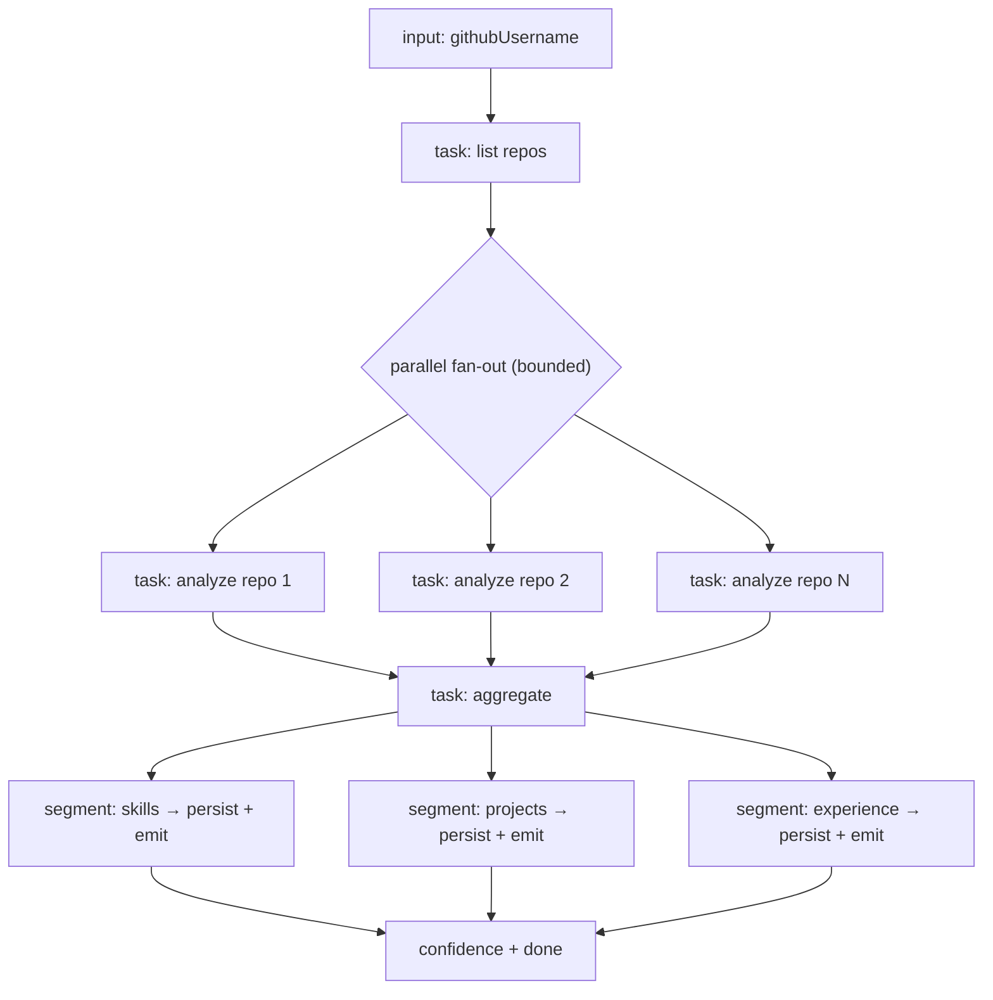
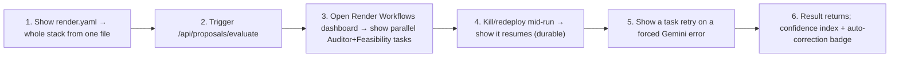

# 02 — Render Workflows Guide ("Best Use of Render Workflow" track)

> How to turn FixFlowAI's AI pipelines into **durable Render Workflows** — the centerpiece of the competition submission. Render Workflows lets you turn any function into a **durable, independently-retryable task** and **chain tasks** into multi-step / parallel pipelines that survive restarts. ([render.com](https://render.com/blog/durability-as-code-introducing-render-workflows)) *(Description paraphrased for licensing compliance.)*
> **⚠️ Verify the exact SDK names/signatures against the current Render Workflows docs before coding — the API evolves. The code below is illustrative.**

---

## 1. Why FixFlowAI is the ideal workflow showcase

Three of your pipelines are textbook durable-execution cases. Pick the **Confidence Grid** as the primary demo (most visual: parallel agents + a self-correcting loop), and add the **GitHub scan** if time allows (parallel fan-out).



**Why it maps perfectly:**
- **Parallel tasks** → Auditor and Feasibility run concurrently.
- **Independent retries** → each Gemini call retries on transient failure (this is story **AIA-05** made durable — the workflow gives you retries for free).
- **Survives restarts / long-running** → the self-correction loop can run for tens of seconds without holding an HTTP request open (this replaces the "async job + poll" plan in **AIA-01** with something cleaner).

---

## 2. Architecture: where the workflow sits

The workflow orchestrates; the **Python AI service still owns the Gemini logic**. The workflow calls your existing `/ai/confidence/evaluate` (or its sub-steps) as durable tasks. Nothing about your business logic changes — you wrap it.



> **Design rule (keeps it clean):** the workflow is an **orchestration adapter**. Put it behind the same interface you'd use for AWS Step Functions so `main` stays deployable to both targets (see [doc 03 §5](./03_configuration_and_blueprint_reference.md#5-branching--deploy-model)). One env var (`ORCHESTRATOR=render`) selects it.

---

## 3. Step-by-step: build the Confidence Grid workflow

### Step 3.1 — Add the Render SDK
In the service that will run the workflow (simplest: the **backend**, which already owns orchestration and persistence):
```bash
# in backend/  (verify the actual package name in Render docs)
npm install <render-workflows-sdk>
```

### Step 3.2 — Define tasks (durable units)
Each task is a function Render can retry independently. Split the confidence grid into tasks that call your AI service:

```ts
// backend/src/workflows/confidenceGrid.workflow.ts  (ILLUSTRATIVE)
// Verify SDK API against current Render Workflows docs.

import { evaluateAuditor, evaluateFeasibility, optimizeProposal } from '../services/aiClient.js';

// task: Auditor agent — retried independently on transient failure
export const auditorTask = defineTask('auditor', async ({ briefText, proposal }) => {
  return evaluateAuditor(briefText, proposal);      // → AI service (Gemini)
}, { retries: 3, backoff: 'exponential' });

// task: Feasibility agent
export const feasibilityTask = defineTask('feasibility', async ({ briefText, proposal }) => {
  return evaluateFeasibility(briefText, proposal);
}, { retries: 3, backoff: 'exponential' });

// task: optimizer
export const optimizeTask = defineTask('optimize', async ({ briefText, proposal, issues }) => {
  return optimizeProposal(briefText, proposal, issues);
}, { retries: 2 });
```

### Step 3.3 — Compose the workflow (parallel + loop)
```ts
// ILLUSTRATIVE composition
export const confidenceGridWorkflow = defineWorkflow('confidence-grid', async (ctx, input) => {
  let proposal = input.proposal;
  let optimized = false;

  for (let cycle = 0; cycle <= MAX_CYCLES; cycle++) {
    // parallel fan-out — Render runs these concurrently, each retryable
    const [auditor, feasibility] = await Promise.all([
      ctx.run(auditorTask,    { briefText: input.briefText, proposal }),
      ctx.run(feasibilityTask,{ briefText: input.briefText, proposal }),
    ]);

    const index = mean(auditor, feasibility);
    if (index >= THRESHOLD || cycle === MAX_CYCLES) {
      return { auditor, feasibility, confidenceIndex: index, optimized, finalProposal: proposal };
    }
    // self-correction — durable loop; survives restarts between cycles
    proposal = await ctx.run(optimizeTask, { briefText: input.briefText, proposal, issues: [...auditor.issues, ...feasibility.issues] });
    optimized = true;
  }
});
```

### Step 3.4 — Trigger it from the route
`POST /api/proposals/evaluate` starts the workflow and returns a handle; the client polls for the result (mirrors AIA-01):
```ts
app.post('/api/proposals/evaluate', requireAuth, async (req, res) => {
  const run = await startWorkflow(confidenceGridWorkflow, {
    briefText: req.body.briefText, proposal: req.body.proposal,
  });
  res.status(202).json({ runId: run.id });          // non-blocking
});

app.get('/api/workflows/:runId', requireAuth, async (req, res) => {
  res.json(await getWorkflowStatus(req.params.runId));  // status + result when done
});
```

### Step 3.5 — Run the workflow on Render
Add a **Render service/worker** that hosts the workflow runtime (per Render's deploy model for Workflows — check current docs whether it's a Background Worker or part of the web service). Add it to `render.yaml` (see [doc 03](./03_configuration_and_blueprint_reference.md)).

---

## 4. Stretch: GitHub Deep Scan workflow (parallel fan-out)

The most visually impressive workflow — analyzes many repos **in parallel** and reveals results segment-by-segment (matches [roles doc 01](../roles/01_freelancer_github_onboarding.md)).



- Each repo analysis is a **retryable task** (GitHub rate-limit hiccups auto-recover).
- Segment completion → workflow **emits an event** → SSE to the onboarding UI (progressive reveal).

---

## 5. Demo script for the judges (2 minutes)



Talking points that win "Best Use of Render Workflow":
- **Real parallelism** (two AI agents), not a linear script.
- **Independent retries** on the flaky part (LLM calls).
- **Durable loop** (self-correction survives restarts).
- **One `render.yaml`** deploys the whole trust-first platform.

---

## 6. Mapping table — FixFlow pipeline → Render Workflow feature

| Pipeline | Workflow feature demonstrated | Story it fulfills |
|---|---|---|
| Confidence Grid (AI-002) | parallel tasks + retries + durable loop | AIA-01 (async), AIA-05 (resilience), AIE-03 (self-correct) |
| GitHub deep scan | parallel fan-out + event emission | AIA-03, roles doc 01 |
| Opportunity ingestion | scheduled multi-step pipeline | AIA-04 |

---

## 7. Cross-references

| Document | Why |
|---|---|
| [01 — Deployment Guide](./01_render_deployment_guide.md) | Get services live first |
| [03 — Configuration & Blueprint](./03_configuration_and_blueprint_reference.md) | `render.yaml` incl. the workflow service |
| [AI-002 Confidence Grid](../ai_features/ai_002_confidence_grid_self_correction.md) | The logic being wrapped |
| [AIA-01 Async Eval Jobs](../ai_features/stories/AIA-01-async-evaluation-jobs.md) | Superseded by the durable workflow |
| [BuildX Strategy](../product_strategy/buildx_prize_track_strategy.md) | Why this is the primary track |
