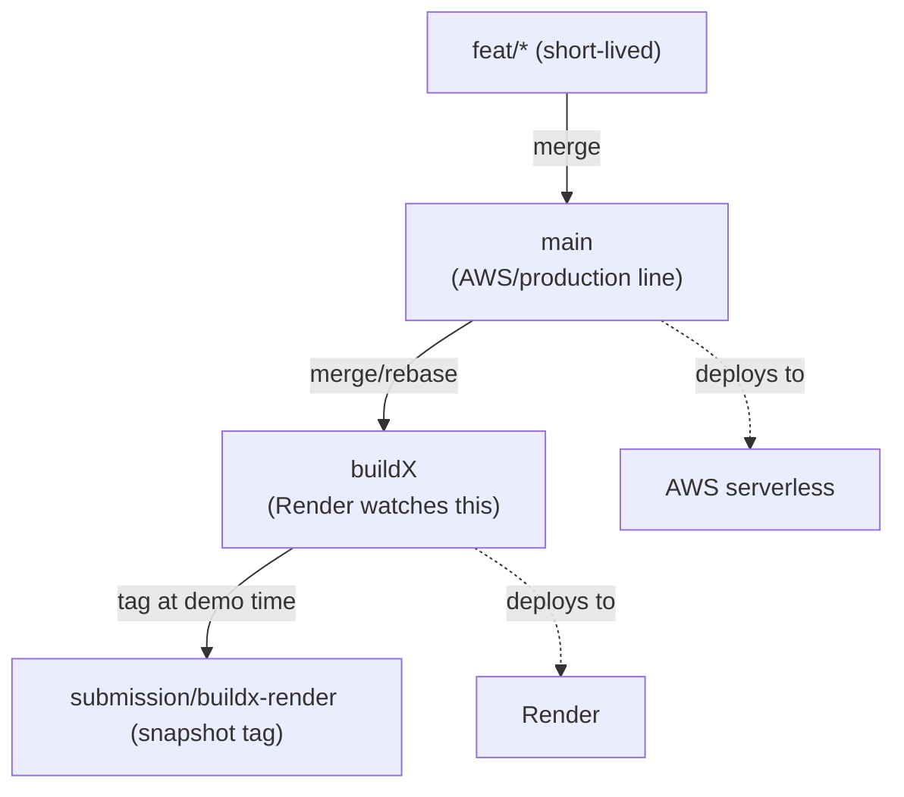

# 03 — Configuration & Blueprint Reference

> The exact **`render.yaml`**, the **environment-variable matrix** per service, the **service topology**, and the **branch/deploy model** for running FixFlowAI on Render's `buildX` branch alongside your AWS production line.

---

## 1. Service topology

```mermaid
flowchart TB
    subgraph RENDER["Render (branch: buildX)"]
        FE["fixflowai-frontend<br/>Static Site (Vite/React)"]
        BE["fixflowai-backend<br/>Web Service (Node)<br/>REST /api + WSS /sync + escrow"]
        AI["fixflowai-ai-service<br/>Web Service (Python)<br/>/ai/* + /health"]
        WF["fixflowai-workflows<br/>(Workflow runtime — track)"]
    end
    G["Gemini API"]
    RZP["Razorpay (optional, live payments)"]

    FE -->|VITE_API_BASE_URL (public)| BE
    BE -->|AI_SERVICE_URL (private)| AI
    BE -.->|orders / payouts / webhooks| RZP
    WF --> AI
    BE -.-> WF
    AI --> G

    classDef svc fill:#dcfce7,stroke:#16a34a;
    class FE,BE,AI,WF svc;
```

- **Three services** for the full app: frontend (static), backend, ai-service.
- **Fourth service (workflows)** is added only for the competition track.
- **No database service needed** for the demo (seed + in-memory). Add **Render Postgres/Key Value** later only if you wire real persistence.

---

## 2. Full `render.yaml`

The blueprint lives at the **repository root** and targets the **`buildX`** branch. Push the branch, then use **Render → New → Blueprint**.

```yaml
# render.yaml — FixFlowAI Blueprint (buildX branch)
services:
  # 1) Python AI service (FastAPI + Gemini) — deploy first
  - type: web
    name: fixflowai-ai-service
    runtime: python
    branch: buildX
    rootDir: ai-service
    buildCommand: pip install -r requirements.txt
    startCommand: uvicorn app.main:app --host 0.0.0.0 --port $PORT
    plan: free
    healthCheckPath: /health
    envVars:
      - key: GEMINI_API_KEY
        sync: false
      - key: GEMINI_MODEL
        value: gemini-3.5-flash
      - key: CONFIDENCE_THRESHOLD
        value: "75"
      - key: MAX_CORRECTION_CYCLES
        value: "1"
      - key: AI_SERVICE_TOKEN
        generateValue: true

  # 2) TypeScript backend (Express + WebSocket + escrow/payments)
  - type: web
    name: fixflowai-backend
    runtime: node
    branch: buildX
    rootDir: backend
    buildCommand: npm install && npm run build
    startCommand: npm start
    plan: free
    healthCheckPath: /api/health
    envVars:
      - key: AI_SERVICE_URL
        fromService:
          type: web
          name: fixflowai-ai-service
          property: hostport
      - key: AI_SERVICE_TOKEN
        fromService:
          type: web
          name: fixflowai-ai-service
          envVarKey: AI_SERVICE_TOKEN
      - key: JWT_SECRET
        generateValue: true
      - key: GOOGLE_OAUTH_CLIENT_ID
        sync: false
      - key: GITHUB_OAUTH_CLIENT_ID
        sync: false
      - key: GITHUB_OAUTH_CLIENT_SECRET
        sync: false
      - key: GITHUB_OAUTH_CALLBACK_URL
        sync: false
      - key: FREELANCER_PROVIDER
        value: seed
      - key: USER_PROVIDER
        value: seed
      - key: FRONTEND_ORIGINS
        value: https://fixflowai-frontend.onrender.com,https://fixflowai.xyz,https://www.fixflowai.xyz
      - key: ALLOW_PAYMENT_SIMULATION
        value: "true"
      - key: RAZORPAY_KEY_ID
        sync: false
      - key: RAZORPAY_KEY_SECRET
        sync: false
      - key: RAZORPAY_WEBHOOK_SECRET
        sync: false

  # 3) Frontend (Vite React) — static site
  - type: web
    name: fixflowai-frontend
    runtime: static
    branch: buildX
    rootDir: frontend
    buildCommand: npm install && npm run build
    staticPublishPath: ./dist
    envVars:
      - key: VITE_API_BASE_URL
        sync: false        # the backend's PUBLIC URL, baked in at build time
```

> **Notes**
> - `fromService … property: hostport` wires the backend to the AI service over Render's **private network**. If your SDK version doesn't support it, fall back to the public `https://fixflowai-ai-service.onrender.com` URL as a plain `value`.
> - `generateValue: true` lets Render create `JWT_SECRET` / `AI_SERVICE_TOKEN` so they never live in git.
> - `VITE_API_BASE_URL` is a **build-time** var (browser → backend is a public call), so it cannot use the private `hostport`. Enter the public backend URL, then redeploy the static site.
> - **Payments:** demo runs simulated (`ALLOW_PAYMENT_SIMULATION=true`). For live payments, fill the `RAZORPAY_*` secrets and set that flag to `false`.
> - If the blueprint schema rejects `runtime: static`, create the frontend as a **Static Site** via the dashboard instead (same build command + publish dir).

---

## 3. Environment-variable matrix

### AI service (`ai-service`)
| Key | Required | Value / example | Purpose |
|---|:--:|---|---|
| `GEMINI_API_KEY` | ✅ | *secret* | Enables all AI features |
| `GEMINI_MODEL` | – | `gemini-3.5-flash` | Model |
| `AI_SERVICE_TOKEN` | – | *generated* | Shared secret with backend |
| `CONFIDENCE_THRESHOLD` | – | `75` | AI-002 threshold |
| `MAX_CORRECTION_CYCLES` | – | `1` | AI-002 self-correction cycles |
| `PORT` | auto | *(Render sets)* | uvicorn binds `--port $PORT` |

### Backend (`backend`)
| Key | Required | Value / example | Purpose |
|---|:--:|---|---|
| `AI_SERVICE_URL` | ✅ | AI service URL | Where to proxy AI calls |
| `AI_SERVICE_TOKEN` | – | *same as AI service* | Must match |
| `JWT_SECRET` | ✅ | *32+ bytes* | Signs access JWTs |
| `GOOGLE_OAUTH_CLIENT_ID` | ✅* | *web client id* | Google sign-in |
| `GITHUB_OAUTH_CLIENT_ID` / `_SECRET` | ✅* | *GitHub OAuth app* | Freelancer sign-in |
| `GITHUB_OAUTH_CALLBACK_URL` | ✅* | frontend URL | Must match GitHub app |
| `FRONTEND_ORIGINS` | ✅ | csv of origins | **CORS allow-list** (STORY-19) |
| `ALLOW_PAYMENT_SIMULATION` | ✅† | `true` (demo) / `false` (live) | Permits simulated payments under `NODE_ENV=production` |
| `FREELANCER_PROVIDER` | – | `seed` | No DB for matching roster |
| `USER_PROVIDER` | – | `seed` | No DB for users |
| `PERSISTENCE_PROVIDER` | – | *(unset)* | Unset = in-memory proposals; milestones use ephemeral file |
| `RAZORPAY_KEY_ID` / `_SECRET` / `_WEBHOOK_SECRET` | ○ | *secret* | Only for **live** payments |
| `PORT` | auto | *(Render sets)* | Express + `/sync` bind here |

> `*` required for real login · `†` required because Render defaults `NODE_ENV=production` · `○` optional (live payments only).

### Frontend (`frontend`, static site)
| Key | Required | Value / example | Purpose |
|---|:--:|---|---|
| `VITE_API_BASE_URL` | ✅ | `https://fixflowai-backend.onrender.com` | Public backend URL (build-time) |

> **Demo rule:** keep AWS/DynamoDB blank, providers on `seed`, and `ALLOW_PAYMENT_SIMULATION=true` → the whole app runs on Render with **zero external infra** beyond Gemini.

---

## 4. Persistence options on Render

```mermaid
flowchart TD
    Q{"Need data to survive restarts?"} -->|No (demo)| SEED["seed + in-memory<br/>(default) — $0, simplest"]
    Q -->|Yes, Render-native| PG["Render Postgres<br/>(requires new repository impl — code targets DynamoDB today)"]
    Q -->|Yes, reuse AWS| DDB["Keep DynamoDB<br/>(set PERSISTENCE_PROVIDER=dynamodb + AWS creds)"]
```

- **For the demo:** seed + in-memory. Milestone/webhook-dedup stores fall back to an **ephemeral file** on Render (resets on redeploy) — acceptable within a live session.
- **Render Postgres:** the code has DynamoDB + in-memory/file repositories, not Postgres — would need a new `*Repository.ts`. Out of scope for the demo.
- **Reuse AWS DynamoDB:** set `PERSISTENCE_PROVIDER=dynamodb` + `AWS_*` creds; couples the demo to AWS.

---

## 5. Branching & deploy model

One `main` for AWS, `buildX` for Render, no diverging platform branches. Platform differences live in **config + a thin orchestration adapter**, not in forked code.



- **`render.yaml` uses `branch: buildX`** → Render auto-deploys on push to `buildX`.
- Keep AWS-specific config (`template.yaml`/CDK) in the same repo; Render ignores it and vice-versa.
- Freeze what you submit with a **`submission/buildx-render`** tag, keep evolving `buildX`.

---

## 6. Cost & instance sizing

| Service | Free tier | Recommended for judged demo |
|---|---|---|
| frontend (static) | Always free, no sleep | Free |
| ai-service | Sleeps after idle; cold start | Starter (stays warm) |
| backend | Sleeps after idle; **drops WebSockets** | Starter (keeps `/sync` alive) |
| workflows | per Render Workflows pricing | check docs |

- Scale web services to Free between demos to conserve credits.

---

## 7. Pre-submission checklist

- [ ] `render.yaml` committed at repo root on `buildX`.
- [ ] Seed files (`users.seed.json`, `freelancers.seed.json`) present in the `buildX` branch.
- [ ] `GEMINI_API_KEY`, `JWT_SECRET`, OAuth IDs set (secrets, not in git).
- [ ] `AI_SERVICE_TOKEN` identical on both services.
- [ ] `FRONTEND_ORIGINS` includes the static-site URL; `VITE_API_BASE_URL` points at the backend.
- [ ] `ALLOW_PAYMENT_SIMULATION=true` (demo) OR real `RAZORPAY_*` keys + `false` (live).
- [ ] ai-service `/health` → `aiEnabled:true`; backend `/api/health` → ok; frontend loads.
- [ ] A real `parse → evaluate → match` round trip works; escrow fund→approve→release works.
- [ ] `wss://…/sync` connects (Starter instance if judged live).
- [ ] `submission/buildx-render` tag created at demo state.

---

## 8. Cross-references

| Document | Why |
|---|---|
| [01 — Deployment Guide](./01_render_deployment_guide.md) | Manual click-through + verification |
| [02 — Render Workflows Guide](./02_render_workflows_guide.md) | The workflow service in this blueprint |
| [Escrow & Razorpay Plan](../core_subsystems/escrow_razorpay_implementation_plan.md) | The payment flows behind the `RAZORPAY_*` vars |
| [Serverless Migration Plan](../architecture/serverless_migration_plan.md) | The AWS side of the branch model |
