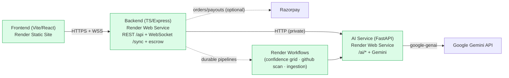
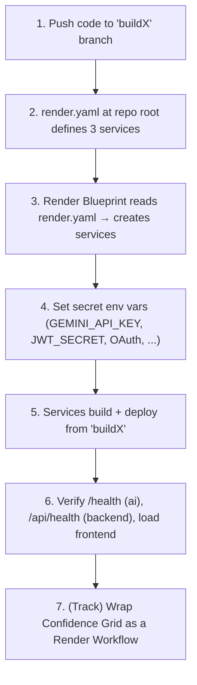

# FixFlowAI on Render — Deployment & Workflows Guide

> **Purpose:** everything needed to deploy FixFlowAI to **Render** from the **`buildX`** branch and to implement the **"Best Use of Render Workflow"** competition track.
> **Audience:** you (and anyone helping with the BuildX'26 submission).
> **Scope:** the current codebase — Vite/React frontend (static site) + TypeScript backend (Express + WebSocket sync + escrow/payments) + Python AI service (FastAPI + Gemini) — plus the durable-workflow layer for the special track.

---

## What you're deploying

FixFlowAI is two long-running services that talk over HTTP, plus (for the competition) durable **Render Workflows** wrapping the AI pipelines.

**Key facts confirmed from your code:**
- Frontend builds with `vite build` → static `dist/`; the browser calls the backend via `VITE_API_BASE_URL`. Uses **hash routing**, so no SPA rewrite is needed.
- Backend build `tsc` → start `node dist/index.js`; reads `process.env.PORT`; WebSocket sync is bound to the **same port** at path `/sync`. CORS is restricted via `FRONTEND_ORIGINS`.
- AI service runs with `uvicorn app.main:app`; needs `GEMINI_API_KEY`.
- Repositories are swappable (`seed` / `http` / `dynamodb`) → a Render-only demo runs on **`seed` + in-memory**, so **no external database is required**. Payments run **simulated** unless real `RAZORPAY_*` keys are set.

---

## Documents in this folder

| # | Document | Read it when |
|---|---|---|
| 01 | [Render Deployment Guide](./01_render_deployment_guide.md) | You want the full step-by-step to get both services live on the `testing` branch |
| 02 | [Render Workflows Guide](./02_render_workflows_guide.md) | You're implementing the "Best Use of Render Workflow" track (durable AI pipelines) |
| 03 | [Configuration & Blueprint Reference](./03_configuration_and_blueprint_reference.md) | You need the exact `render.yaml`, env-var matrix, and branch/deploy model |

---

## The 5-minute mental model

---

## Deploy order (do it in this sequence)

1. **AI service first** — it has no dependencies except `GEMINI_API_KEY`. Get `/health` returning `aiEnabled: true`.
2. **Backend second** — point its `AI_SERVICE_URL` at the AI service, set `JWT_SECRET` + OAuth IDs + `FRONTEND_ORIGINS` + `ALLOW_PAYMENT_SIMULATION=true`, verify `/api/health`.
3. **Frontend third** — set `VITE_API_BASE_URL` to the backend's public URL, deploy the static site, then add its origin to the backend's `FRONTEND_ORIGINS`.
4. **Render Workflows** — once services are up, wrap the Confidence Grid pipeline (the showcase for the track).

Start with **[01 — Render Deployment Guide](./01_render_deployment_guide.md)**.

---

## Cross-references

| Document | Why |
|---|---|
| [BuildX Prize Track Strategy](../product_strategy/buildx_prize_track_strategy.md) | Why Render is the primary track |
| [AI Service Guide](../../../References/ai-service-guide.md) | The FastAPI service you're deploying |
| [Serverless Migration Plan](../architecture/serverless_migration_plan.md) | The AWS production target (Render is the competition target) |
| [AIA-01 / AIA-03 / AIA-04 stories](../ai_features/stories/) | The pipelines that become Render Workflows |
