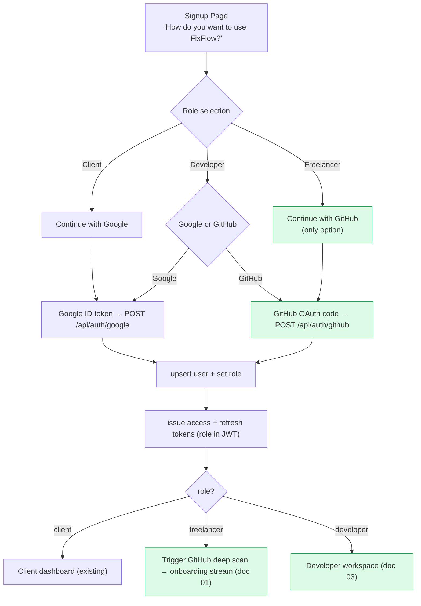
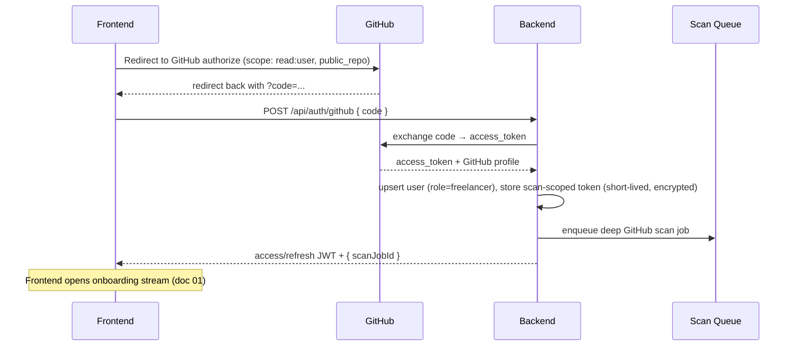
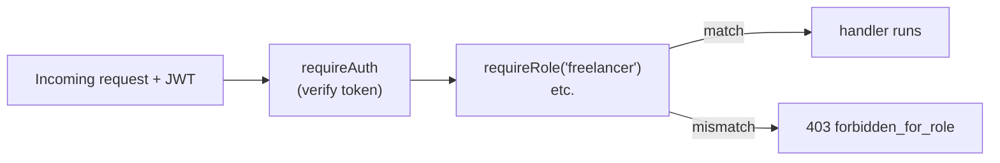
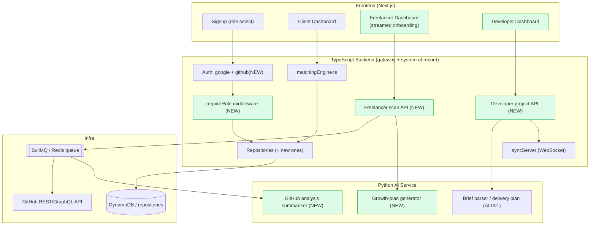
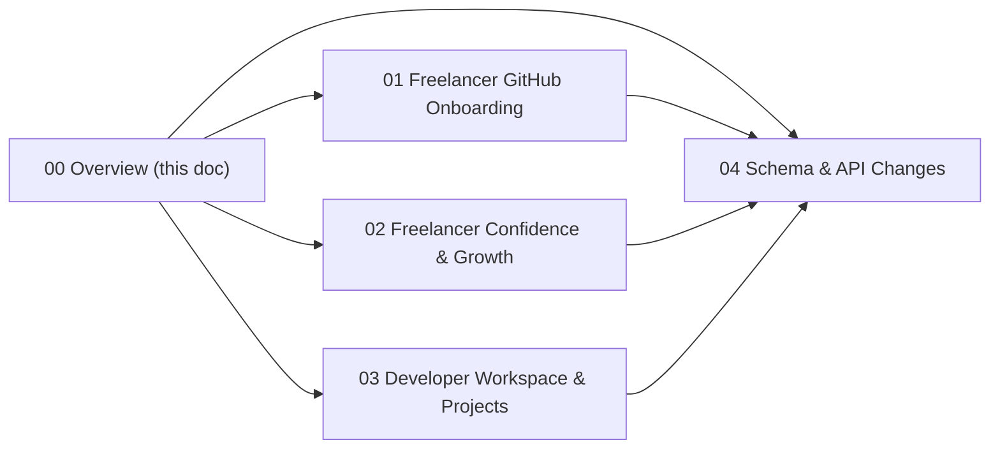

# 00 — Role Architecture Overview

> **Read this first.** It defines how the three roles differ at the signup, auth, permission, and data levels, and summarizes every schema/architecture change the role system requires. Detailed per-role specs live in documents 01–04.

---

## 1. What Exists Today (Baseline)

The current backend (`backend/src/`) already has:

- **Auth:** Google ID-token verification (`auth/googleOauth.ts`) → issues our own access JWT + opaque refresh token (`auth/tokens.ts`). Auth routes in `routes/auth.ts`.
- **Roles:** `UserRole = 'client' | 'freelancer' | 'agency' | 'developer'` already exists in `services/userRepository.ts`. Role is set/changed via `PATCH /api/auth/me/role` and is embedded in the access-token `role` claim.
- **Repository pattern:** `userRepository`, `proposalRepository`, `milestoneRepository` etc. select a provider by env (`seed` / `http` / `dynamodb` / in-memory). **No live Postgres/Prisma yet** — the Prisma schema in `architecture/database_design.md` is the target model, the code runs on DynamoDB/seed today.
- **Matching engine:** `services/matchingEngine.ts` scores a freelancer roster against a project. It consumes `skills`, `githubLanguages`, `domains`, `reputationScore`, etc. — exactly the fields the freelancer scan must produce.

**Design implication:** we extend, we don't rewrite. The Client role is already wired end-to-end. Freelancer and Developer add new auth providers, new profile data, and new dashboards on top of the same auth/JWT/repository foundation.

---

## 2. Signup: One Page, Three Paths

### Auth-per-role rules

| Role | Allowed providers | Rationale |
|---|---|---|
| **Client** | Google only | Frictionless business signup; matches existing working flow. |
| **Freelancer** | **GitHub only** | Identity **is** their code. GitHub OAuth gives the access token needed to analyze repos. No email/password, no Google — enforced server-side. |
| **Developer** | Google **or** GitHub | Developers plan/build software; GitHub is optional so they can link repos, but they don't require deep scanning like freelancers. **Decision point:** default to Google, allow GitHub link later. |

> **Enforcement:** the signup intent (`role`) is passed with the auth request. The backend rejects mismatches — e.g. a Google token arriving with `intendedRole=freelancer` is refused with `400 role_requires_github`.

---

## 3. Why Freelancer Needs a New Auth Provider (GitHub OAuth)

The existing Google flow uses an **ID token** (identity only). Freelancer onboarding must **read the user's repositories**, which requires a GitHub **access token** obtained via the OAuth **authorization-code** flow.

New backend module required: **`auth/githubOauth.ts`** (mirrors `googleOauth.ts` but does a code→token exchange and fetches the GitHub profile). New route: **`POST /api/auth/github`**. Full contract in [doc 04](./04_schema_and_api_changes.md).

**Security note:** the GitHub access token is used only to run the scan, then discarded (or stored encrypted with a short TTL if re-scan is offered). Never expose it to the frontend. Request the **minimum scopes** (`read:user`, and `public_repo` only if private-repo analysis is explicitly opted into).

---

## 4. Permission Matrix

Enforced by a new `requireRole(...roles)` middleware layered on top of the existing `requireAuth`.

| Capability / Endpoint group | Client | Freelancer | Developer |
|---|:---:|:---:|:---:|
| Post project briefs (`/api/proposals/*`) | ✅ | ❌ | ❌ |
| Get AI freelancer shortlist (`/api/leads/match`) | ✅ | ❌ | ❌ |
| Be matched / appear in shortlists | ❌ | ✅ | ❌ |
| GitHub deep scan (`/api/freelancer/*`) | ❌ | ✅ | ❌ |
| View/act on client leads | ❌ | ✅ | ❌ |
| Escrow as payer | ✅ | ❌ | ❌ |
| Escrow as payee | ❌ | ✅ | ❌ |
| Create/manage own projects (`/api/dev/projects/*`) | ❌ | ❌ | ✅ |
| Generate project timeline/proposal/team | ❌ | ❌ | ✅ |
| Team collaboration workspace | ✅ (project) | limited | ✅ |

> **Hard rule:** Developers have **no path** to client or lead data. The middleware blocks it; the frontend never renders those routes for the `developer` role.

---

## 5. High-Level System Architecture (with new pieces)

---

## 6. Schema & Architecture Change Summary

Full definitions in [doc 04](./04_schema_and_api_changes.md). At a glance:

| Change | Type | Where | Why |
|---|---|---|---|
| Surface 3 roles on signup; keep enum incl. `agency` | Behavior | signup + `auth/me/role` | Product requirement |
| `POST /api/auth/github` + `auth/githubOauth.ts` | New module + route | backend | Freelancer GitHub-only login |
| `requireRole()` middleware | New module | `auth/` | Enforce permission matrix |
| `GithubScanJob` model + statuses | New model | schema | Track multi-segment scan progress |
| `FreelancerSkill` (with evidence, `editable=false`) | New model | schema | Tamper-proof AI-verified skills |
| `FreelancerProject` (top repos) | New model | schema | Verified project/work experience |
| `ProfileConfidence` + `GrowthPlan` + `GrowthItem` | New models | schema | Confidence score + improvement plan (doc 02) |
| Extend `FreelancerProfile.githubScan` JSON shape | Change | schema | Structured, segmented scan output |
| `DevProject` + `DevProjectMember` + `DevTask` | New models | schema | Developer multi-project workspace (doc 03) |
| Reuse `Workspace`/`WorkspaceMember`/`syncServer` | Reuse | — | Developer team collaboration |
| New `ai-service` endpoints: `/ai/github/summarize`, `/ai/growth/plan` | New endpoints | ai-service | Analysis + growth plan generation |

---

## 7. Where Each Feature Is Specified

Proceed to [doc 01 — Freelancer GitHub Onboarding](./01_freelancer_github_onboarding.md).
