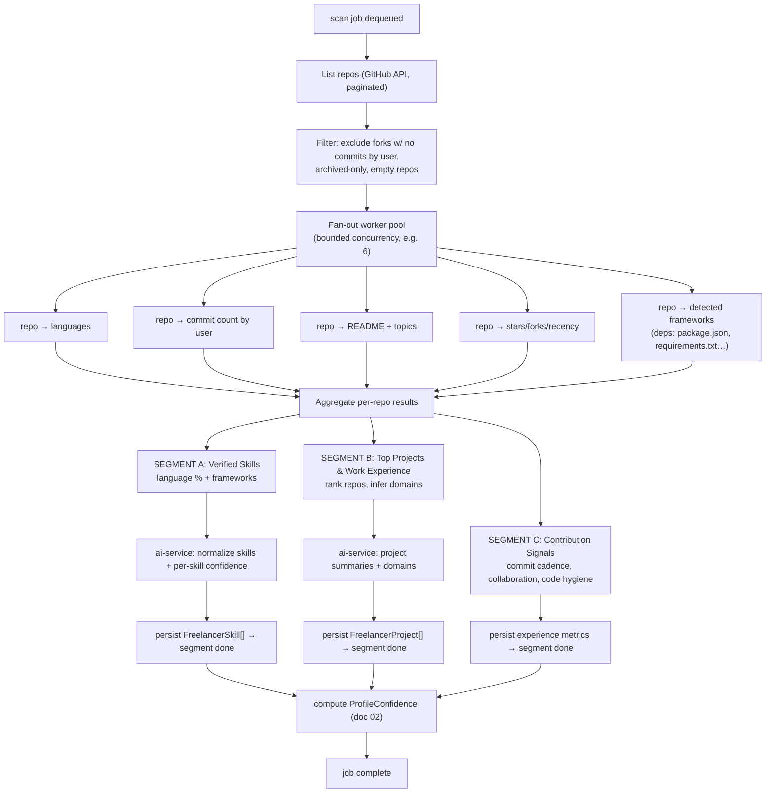
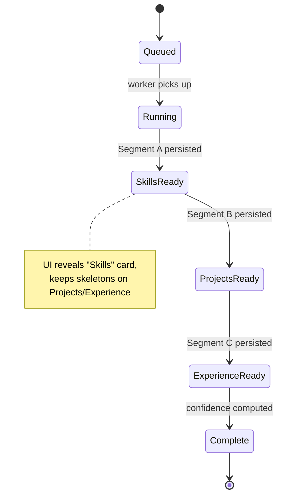
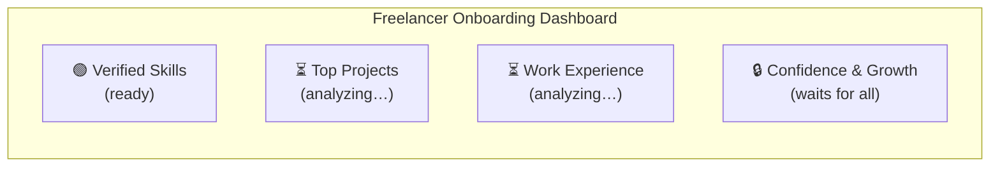
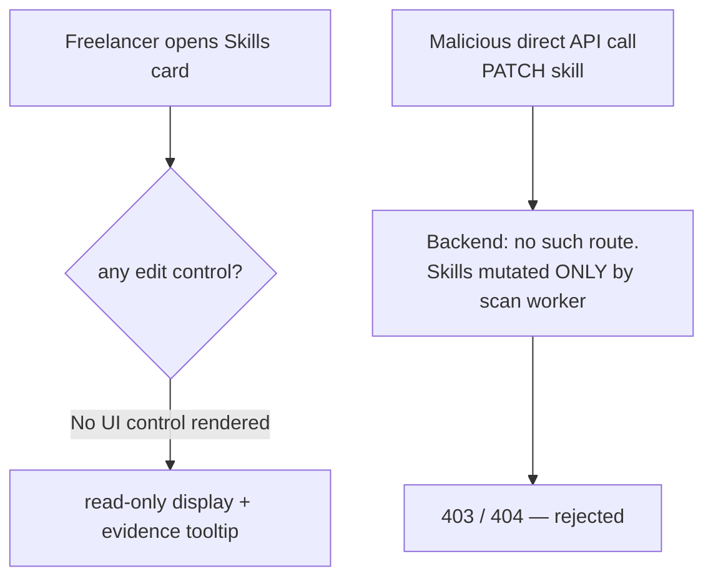
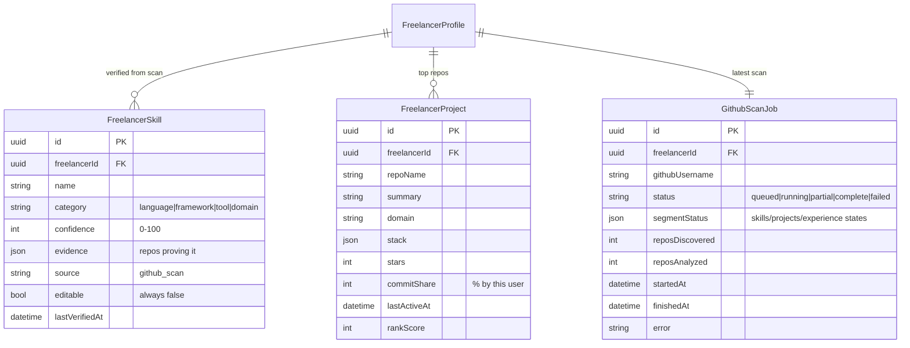
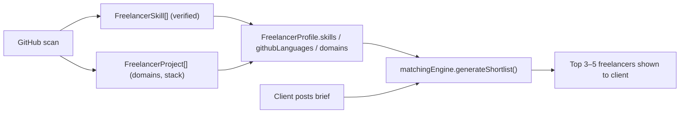

# 01 — Freelancer GitHub Onboarding (Deep Scan + Progressive Reveal)

> **Feature:** When a freelancer signs up, they authenticate **only** with GitHub. The platform then performs a deep, parallel analysis of every repository to derive their **verified skills, top projects, and work experience**. Results stream into the dashboard **segment-by-segment** as each finishes. The derived skills are **AI-filtered and read-only** — a freelancer cannot edit them. This verified profile is what the matching engine uses to place them on client shortlists.

---

## 1. Goal & Non-Negotiables

| Requirement | How it's met |
|---|---|
| Freelancer logs in **only** via GitHub | New `POST /api/auth/github`; Google/password refused for `freelancer` intent |
| Analyze the profile **in depth**, each repo **in parallel** | Fan-out worker pool over repos with bounded concurrency |
| Derive skills, projects, contributions, work experience | Per-repo extraction + aggregation + Gemini summarization |
| Store verified data → feeds matching engine | Writes `FreelancerSkill`, `FreelancerProject`, `FreelancerProfile.githubScan` |
| Takes 1–2 minutes (deep, per-repo) | Async background job; UI never blocks |
| Dashboard shows sub-segments (skills, projects, experience) | Segmented job model; each segment persisted independently |
| Skills are **not editable** (AI-level filtration, anti-gaming) | No write endpoint for skills; `editable=false`; server rejects edits |
| Reveal each segment as it completes | SSE stream / job-status polling; first segment shows while others run |

---

## 2. End-to-End Flow

```mermaid
sequenceDiagram
    autonumber
    participant FE as Freelancer (browser)
    participant GH as GitHub
    participant BE as Backend
    participant Q as Scan Queue (BullMQ)
    participant W as Scan Workers (parallel)
    participant AI as ai-service (Gemini)
    participant DB as Data Store

    FE->>GH: "Continue with GitHub" (OAuth authorize)
    GH-->>FE: redirect ?code=...
    FE->>BE: POST /api/auth/github { code, intendedRole: "freelancer" }
    BE->>GH: exchange code → access_token + profile
    BE->>DB: upsert user(role=freelancer) + FreelancerProfile
    BE->>Q: enqueue scan job (segments: SKILLS, PROJECTS, EXPERIENCE)
    BE-->>FE: { accessToken, refreshToken, scanJobId }

    FE->>BE: GET /api/freelancer/scan/:jobId/stream (SSE)
    Note over FE,BE: connection stays open; events pushed per segment

    Q->>W: dispatch repo fan-out (bounded concurrency)
    par Per-repo analysis (parallel)
        W->>GH: repo languages, commits, contributions, README, topics, stars
    end
    W->>W: aggregate → SKILLS segment
    W->>AI: summarize languages/frameworks → verified skills
    AI-->>W: normalized skills + confidence per skill
    W->>DB: persist FreelancerSkill[]  (segment SKILLS = done)
    BE-->>FE: SSE event: segment "SKILLS" ready

    W->>W: rank repos → PROJECTS segment
    W->>AI: summarize top projects + domains
    AI-->>W: project cards + domains
    W->>DB: persist FreelancerProject[] (segment PROJECTS = done)
    BE-->>FE: SSE event: segment "PROJECTS" ready

    W->>W: contribution/collaboration signals → EXPERIENCE segment
    W->>DB: persist experience metrics (segment EXPERIENCE = done)
    BE-->>FE: SSE event: segment "EXPERIENCE" ready

    W->>DB: mark scan job complete; compute profile confidence (doc 02)
    BE-->>FE: SSE event: "complete" (+ confidence + growth plan trigger)
```

---

## 3. The Scan Pipeline (Low-Level)



### 3.1 Parallelism model

- **Repo-level fan-out:** each repo is analyzed concurrently by a bounded pool (start at concurrency 6; tune against GitHub rate limits). Never spawn one unbounded task per repo — a user with 200 repos would exhaust rate limits and memory.
- **Segment-level:** the three segments are computed from the same aggregated repo data. Segment A (skills) is fastest and persists first; B and C follow. Each segment is **written and marked `done` independently** so the UI can reveal it immediately.
- **GitHub rate limits:** authenticated REST allows 5,000 req/hr. Prefer the **GraphQL API** to batch (languages + stars + topics + commit history in fewer calls). Cache per-repo results keyed by repo `pushed_at` so re-scans are cheap.

### 3.2 What each segment produces

| Segment | Derived data | Source signals |
|---|---|---|
| **A · Verified Skills** | Languages (with %), frameworks/libraries, tools; each with a confidence and evidence list | Repo language bytes, dependency manifests, topics |
| **B · Top Projects & Experience** | Ranked project cards (name, summary, domain, stack, role, recency, stars) | README, topics, commit share, stars, activity window |
| **C · Contribution Signals** | Commit cadence, active years, collaboration (PRs/reviews), documentation quality | Commit history, PR/review activity, README presence/length |

---

## 4. Progressive Reveal (Segmented Streaming UX)

> "Suppose there are three segments and each takes ~1 minute. When segment 1 finishes it becomes visible while 2 and 3 keep running."



### Transport options (pick one)

| Option | When | Notes |
|---|---|---|
| **SSE** `GET /api/freelancer/scan/:jobId/stream` | **Recommended** | One-way server→client; simple; matches existing proposal-stream pattern in the ERD doc. Pass token as query param for `EventSource`. |
| **Polling** `GET /api/freelancer/scan/:jobId` every 3–5s | Fallback | Returns `{ status, segments: { skills, projects, experience } }` with per-segment state. Simpler, slightly less snappy. |

### SSE event frames

```text
event: segment_ready
data: { "segment": "skills", "payload": { ...verified skills... } }

event: segment_ready
data: { "segment": "projects", "payload": { ...project cards... } }

event: segment_ready
data: { "segment": "experience", "payload": { ...contribution metrics... } }

event: scan_complete
data: { "confidence": 72, "growthPlanId": "gp_..." }
```

### Dashboard layout during onboarding



Each card has three states: `analyzing` (skeleton + spinner + "researching your repositories…"), `ready` (data), `error` (retry that segment only).

---

## 5. Tamper-Proof Skills (Anti-Gaming)

The single most important rule: **freelancers cannot edit their skills.**



Enforcement layers:
1. **No write endpoint.** There is deliberately **no** `PATCH/POST /api/freelancer/skills`. Skills are written **only** by the scan worker (server-internal).
2. **`editable: false`** flag on every `FreelancerSkill` record, plus `source: "github_scan"` and `evidence[]` (repos/where proven). This makes provenance auditable.
3. **Re-scan, don't edit.** The only way skills change is a fresh scan (`POST /api/freelancer/rescan`), which re-derives from current code. A freelancer can trigger a re-scan but cannot hand-author results.
4. **Optional self-claimed section (clearly separated).** If you ever allow "aspirational skills," store them in a distinct `selfClaimedSkills` field that is **visibly unverified** and is **excluded from match scoring**. The matching engine only trusts `github_scan` skills.

> This is a core trust UVP: a client sees skills that are *proven by code*, not typed into a form.

---

## 6. Data Model (additions)

Full Prisma + DynamoDB definitions in [doc 04](./04_schema_and_api_changes.md). Shapes relevant here:



The aggregate `FreelancerProfile.githubScan` JSON keeps the matching-engine-friendly rollup (`{ languages: {..%}, repos: [...], commits: n, lastScanned }`) so `matchingEngine.ts` works unchanged.

---

## 7. How This Feeds Matching (The Payoff)



Because skills are code-verified, the `GitHubSignal` and `SkillOverlap` factors in AI-006 become trustworthy — a freelancer ranks for what they can actually prove, giving the client "maximum advantage" from the engine (the stated goal).

---

## 8. API Surface (summary — full contracts in doc 04)

| Method | Endpoint | Role | Purpose |
|---|---|---|---|
| `POST` | `/api/auth/github` | public | GitHub OAuth code exchange → login as freelancer |
| `POST` | `/api/freelancer/scan` | freelancer | Start/kick a deep scan (auto-triggered at signup) |
| `GET` | `/api/freelancer/scan/:jobId` | freelancer | Poll scan + per-segment status |
| `GET` | `/api/freelancer/scan/:jobId/stream` | freelancer | SSE stream of segment-ready events |
| `GET` | `/api/freelancer/profile` | freelancer | Verified profile (skills read-only) |
| `POST` | `/api/freelancer/rescan` | freelancer | Re-derive from current GitHub state |
| — | ~~`PATCH /api/freelancer/skills`~~ | — | **Intentionally does not exist** |

New AI endpoint: `POST /ai/github/summarize` (ai-service) — normalizes raw language/framework signals into clean, deduped skills with per-skill confidence. Mirrors the existing structured-output pattern.

---

## 9. Implementation Milestones

| Phase | Deliverable |
|---|---|
| **1** | `auth/githubOauth.ts` + `POST /api/auth/github` + role gating; freelancer can log in |
| **2** | `GithubScanJob` model + queue + repo listing + bounded fan-out worker (no AI yet) |
| **3** | Segment A (skills) end-to-end: aggregate → `ai-service` summarize → persist → SSE reveal |
| **4** | Segments B & C (projects, experience) + full progressive streaming UI |
| **5** | Tamper-proof enforcement audit (no write path), evidence tooltips, re-scan |
| **6** | Confidence score + growth-plan hook → [doc 02](./02_freelancer_confidence_growth_plan.md) |

---

## 10. Edge Cases & Rules

- **Sparse profile** (few/no repos): still complete the scan with low confidence, then hand off to the growth plan (doc 02) instead of blocking onboarding.
- **Huge profile** (200+ repos): cap deep analysis to top N by recency+stars+commit share; note "analyzed top N of M repos."
- **Private repos:** only if the user explicitly grants `repo`/`public_repo` scope; default to public only.
- **Rate-limit hit mid-scan:** persist completed segments, mark job `partial`, resume with backoff.
- **Forked/boilerplate repos:** down-weight or exclude to avoid inflating skills.
- **Re-scan cadence:** allow at most 1 manual re-scan per N hours to protect GitHub quota.

Proceed to [doc 02 — Confidence & Growth Plan](./02_freelancer_confidence_growth_plan.md).
