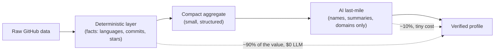
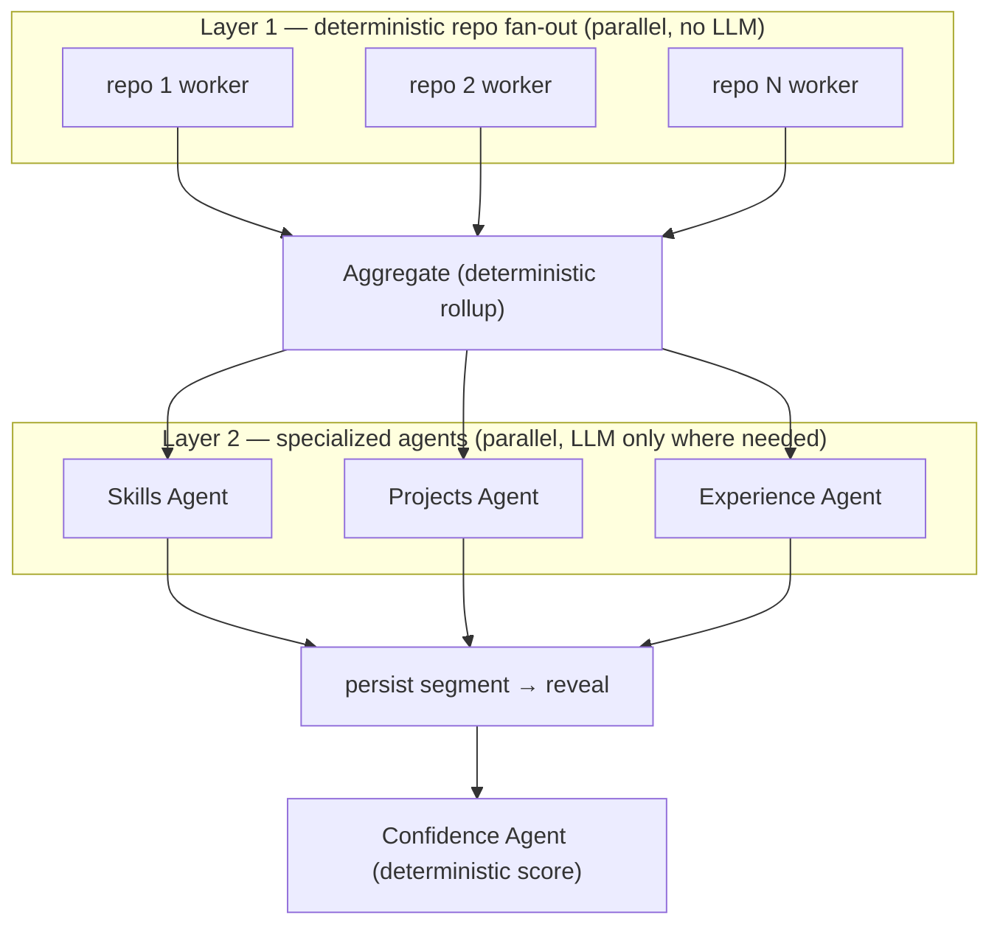
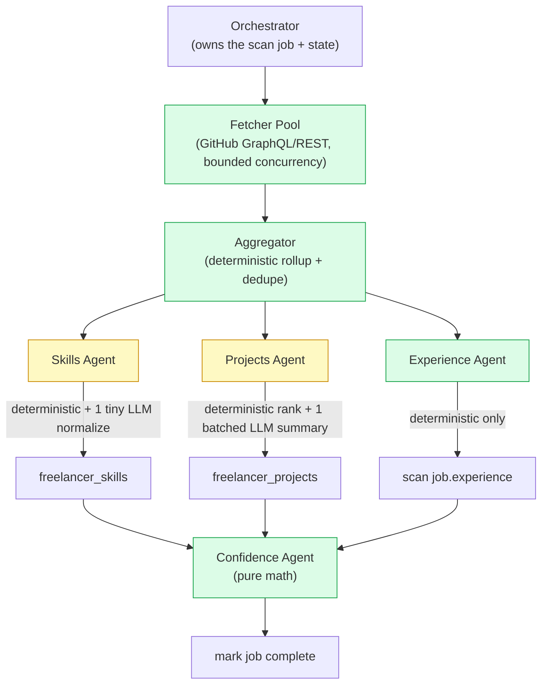
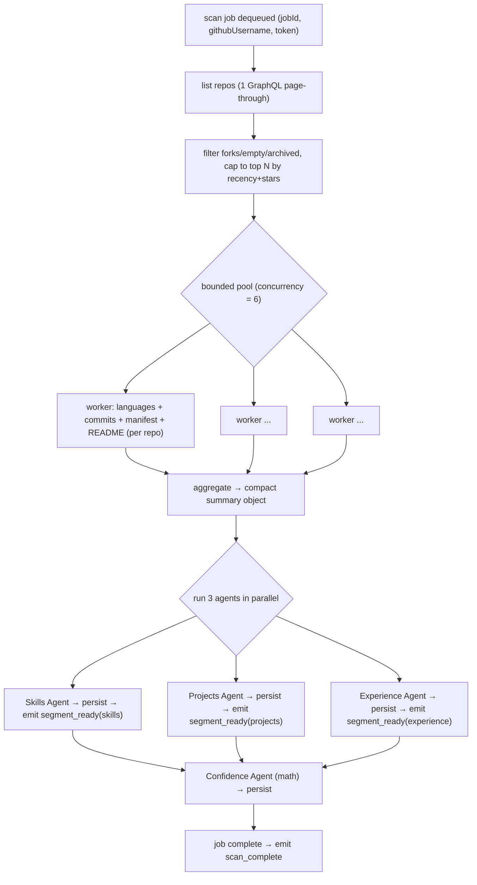
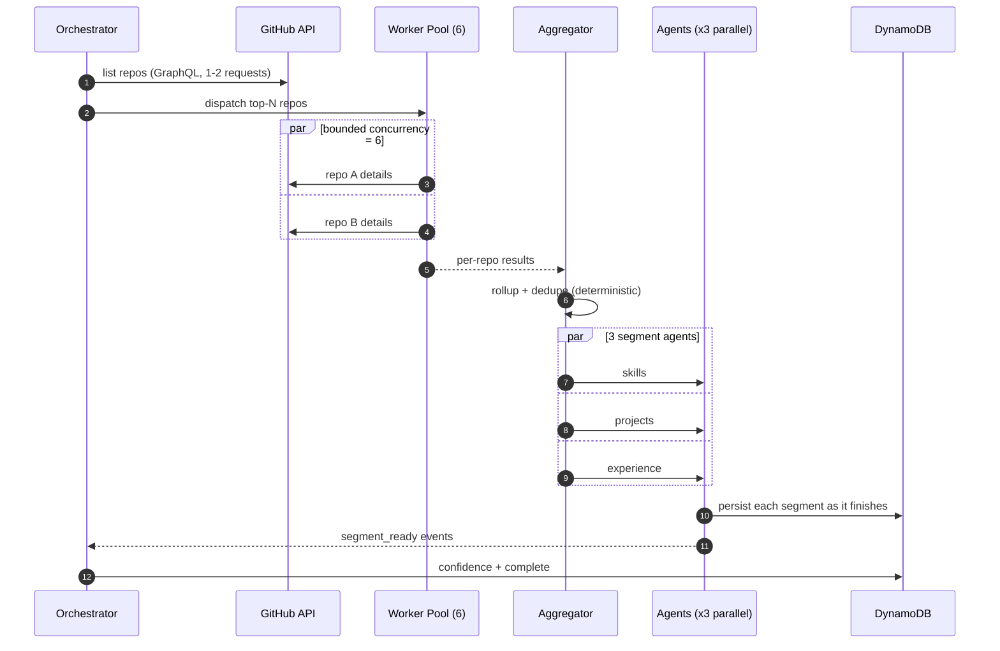
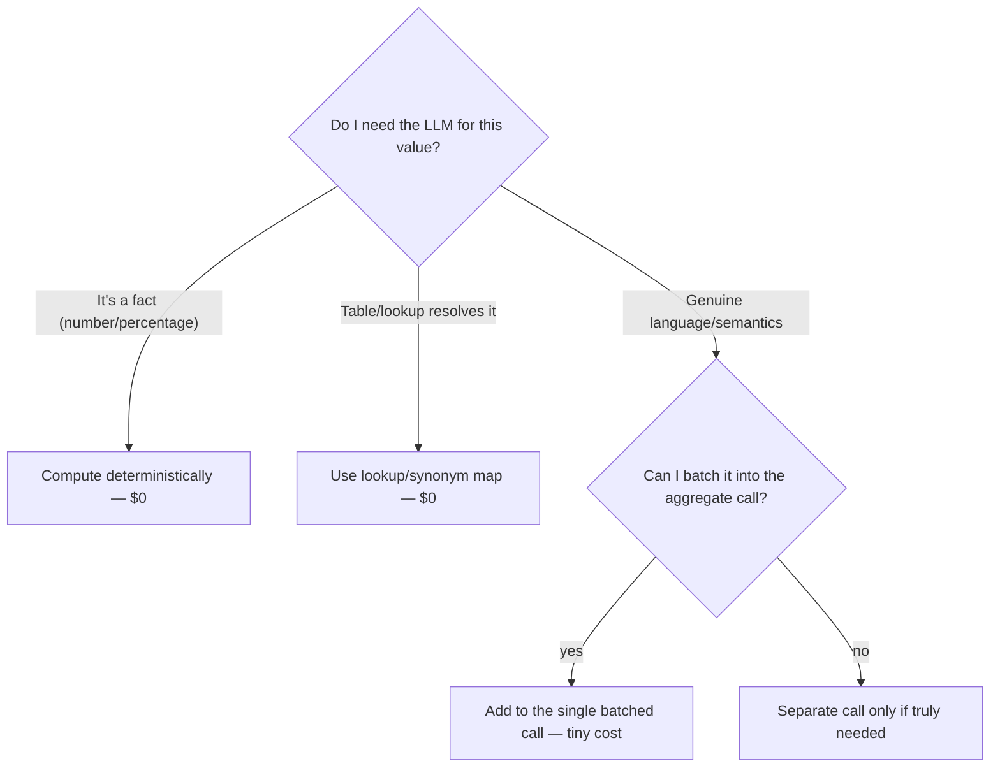
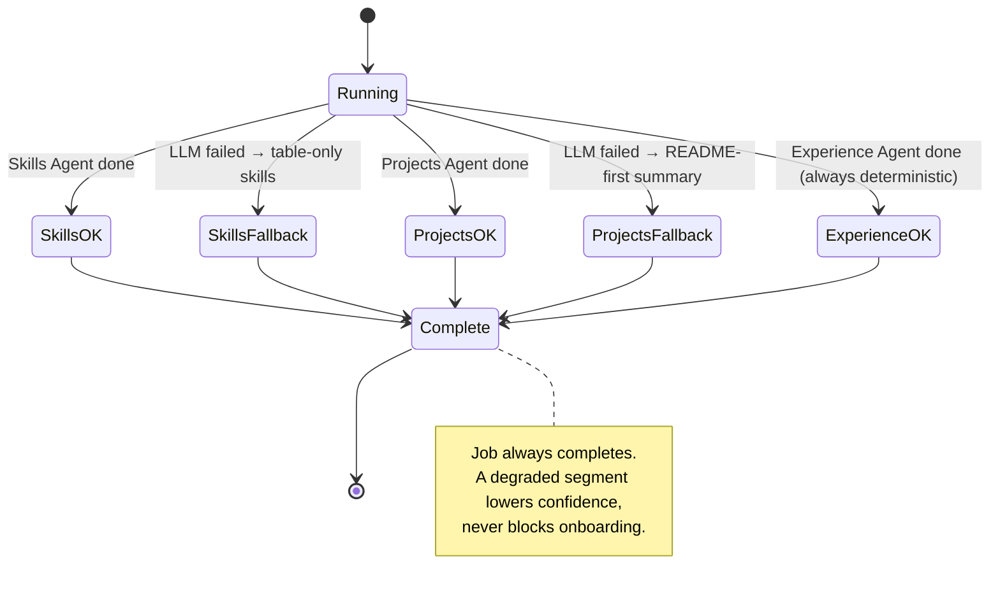
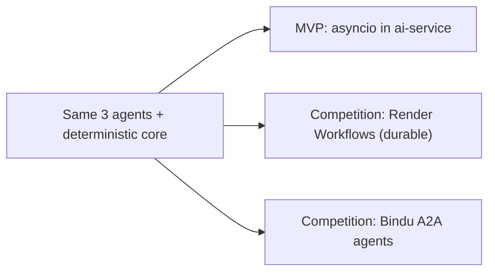

# 01a — GitHub Onboarding: Multi-Agent + Parallel Implementation Roadmap

> **Question this answers:** *How do I build the freelancer GitHub onboarding (doc 01) with a multi-agent / parallel design — not relying on a single agent or one big AI call — for the most accurate output at the least cost?*
> **One-line answer:** Do the heavy lifting **deterministically and in parallel** (no LLM), and use a **small pool of specialized AI agents only for the last-mile semantic step** — each agent independent, parallel, cheap, and individually falling back. Never send one giant prompt with all the repo data.

---

## 1. The Core Idea: "Deterministic core, AI at the edges"

The single most important decision. Most of what onboarding produces are **facts**, not opinions:

| Signal | How you get it | Needs AI? |
|---|---|---|
| Languages + % per repo | GitHub API returns exact byte counts | ❌ No — it's math |
| Commit count / commit share | GitHub API | ❌ No |
| Stars, forks, recency | GitHub API | ❌ No |
| Frameworks used | Parse `package.json`, `requirements.txt`, etc. | ⚠️ Mostly deterministic (lookup table); AI only for ambiguity |
| Clean skill names / dedupe synonyms | normalize "reactjs"→"React", "ts"→"TypeScript" | ⚠️ Table first, AI for the long tail |
| Project summary (human-readable) | condense README + activity | ✅ Yes — genuine language task |
| Domain inference ("fintech", "devtools") | from topics + README semantics | ✅ Yes |

**Why this matters for cost + accuracy:**
- Feeding raw repo data to an LLM to "figure out languages" is **slower, more expensive, and less accurate** than reading the number GitHub already gives you. LLMs hallucinate facts; APIs don't.
- So the LLM's job shrinks to a **tiny, well-scoped semantic step** on an already-aggregated summary — which means small prompts, low tokens, low cost, high accuracy.

---

## 2. Should You Use Multi-Agent + Parallel? Yes — at Two Different Layers

There are **two independent kinds of parallelism**. Use both.

### Layer 1 — Parallel data workers (deterministic fan-out over repos)
Analyze many repos **at the same time** with a bounded worker pool. No LLM. Pure functions. This is where throughput comes from.

### Layer 2 — Parallel specialized agents (the 3 segments)
After aggregation, run **three small, specialized agents concurrently**, each owning one segment and each with its own fallback:
- **Skills Agent** — verified languages/frameworks/tools + per-skill confidence.
- **Projects Agent** — ranked top projects, summaries, domains.
- **Experience Agent** — contribution cadence, collaboration, documentation signals.

**Why 3 agents beats 1 big call:**
| One giant LLM call | Three specialized agents |
|---|---|
| Huge prompt = high token cost | Small focused prompts = low cost |
| Slow (one long request) | Parallel = ~3× faster wall-clock |
| One failure kills everything | Each agent falls back independently |
| Can't reveal progressively | Each finishes + reveals on its own (matches doc 01 streaming UX) |
| Mixes concerns = more hallucination | Narrow scope = higher accuracy |

> **"Not relying on one agent or AI service":** each segment agent is independent and has a **deterministic fallback**, so if Gemini is down, the scan still completes with facts-only results (lower confidence, but never a hard failure). No single point of failure.

---

## 3. Agent Topology (who does what)

| Agent | Deterministic part (always) | LLM part (only if enabled + worth it) | Fallback if LLM fails |
|---|---|---|---|
| **Fetcher Pool** | fetch repos, languages, commits, manifests, READMEs | — | retry with backoff |
| **Aggregator** | merge per-repo data, dedupe, synonym-map | — | — |
| **Skills Agent** | language % → skills, framework lookup table, confidence from evidence | normalize long-tail names, resolve ambiguous frameworks (1 small call) | use table-only skills |
| **Projects Agent** | rank repos (stars + commit share + recency), pick top N | write 1–2 line summary + infer domain (1 **batched** call for all top repos) | summary = first README paragraph, domain = top topic |
| **Experience Agent** | commit cadence, active years, PR/review counts, README quality | — (usually none) | — |
| **Confidence Agent** | weighted score (doc 02 formula) | — | — |

---

## 4. Low-Level Data Flow (DAG)

Notes:
- Each `segment_ready` write is **independent** so the UI reveals it the moment it lands (progressive UX from doc 01).
- The Confidence Agent runs only after all three persist, but it's pure math (fast, free).

---

## 5. Parallelism & Throughput Model

**Throughput tactics (fastest + fewest API calls):**
1. **Prefer GitHub GraphQL** over REST — fetch languages, stars, topics, and recent commits for many repos in **one query** instead of N REST calls.
2. **Bounded concurrency** (start at 6). Never unbounded — a 300-repo user would blow the rate limit and memory.
3. **Cap to top-N repos** (env `SCAN_TOP_N_REPOS`, e.g. 50) ranked by recency + stars + commit share. Diminishing returns past that.
4. **Conditional requests / ETag caching** keyed by repo `pushed_at` — re-scans skip unchanged repos for free.
5. **Rate-limit backoff**: on `403`/secondary limits, exponential backoff; persist partial progress and resume.

---

## 6. Cost Optimization — The Rules (and the math)

### The rules
1. **Never call the LLM per repo.** Aggregate first, then call once (or in one batch) on the summary. Per-repo LLM = linear cost explosion.
2. **Facts stay deterministic.** Languages, commits, stars, cadence → never an LLM.
3. **Use the cheap model** for the last mile: `gemini-3.1-flash-lite` (your configured fallback) is more than enough for name-normalization and short summaries.
4. **Batch the Projects Agent**: one call summarizes all top-N projects, not one call per project.
5. **Skip the LLM when the table already answered.** If synonym/framework lookup resolves everything with high confidence, don't call Gemini at all.
6. **Cache LLM outputs** keyed by the aggregate hash — a re-scan with no repo changes reuses the summary at $0.
7. **Two LLM calls per scan, max** (Skills normalize + Projects summarize). Experience needs none.

### Worked cost sketch (illustrative — verify against current pricing)
For a typical freelancer (≈30 relevant repos):

| Step | Calls | Model | Rough cost |
|---|---|---|---|
| GitHub fetch (GraphQL) | ~2 | — | $0 (API quota) |
| Deterministic aggregation | 0 | — | $0 |
| Skills normalize | 1 small | flash-lite | ~fraction of a cent |
| Projects summarize (batched) | 1 | flash-lite | ~fraction of a cent |
| Experience + confidence | 0 | — | $0 |
| **Total LLM per onboarding** | **2** | | **≈ 1–2 cents** |

Compare to the naive "one big LLM call over all repos" or "LLM per repo": **10–50× more tokens** for **worse** accuracy.

---

## 7. Accuracy Tactics

- **Evidence-linked skills:** every skill carries the repos that prove it (`evidence[]`). Accuracy is auditable, and the UI can show "proven by: repo-x, repo-y".
- **Confidence per skill** from *strength of evidence* (bytes of that language, number of repos, recency), computed deterministically — no LLM guesswork.
- **Constrain the LLM with schema** (Pydantic/Zod response schema) so it can only emit structured, validated output — it normalizes, it doesn't invent.
- **Down-weight forks/boilerplate** so a cloned tutorial doesn't inflate skills.
- **Recency weighting** so stale skills rank below current ones.
- **Deterministic fallback = still correct, just less polished** — facts remain accurate even with zero AI.

---

## 8. Failure Isolation (no single point of failure)

- Each agent is wrapped in its own try/fallback (same pattern as your existing `ai-service` features).
- One agent's LLM failure **does not** affect the other two.
- The scan job records per-segment status (`segmentStatus` on `github_scan_jobs`) so you know exactly what degraded.

---

## 9. Persistence & Progressive Reveal (maps to tables you already created)

| Data | Table (already provisioned) | Written by |
|---|---|---|
| Scan job + per-segment status | `github_scan_jobs` (PK `jobId`, GSI `FreelancerScansIndex`) | Orchestrator |
| Verified skills (read-only) | `freelancer_skills` (`freelancerId`+`skillName`) | Skills Agent |
| Top projects | `freelancer_projects` (`freelancerId`+`projectId`) | Projects Agent |
| Confidence score + band | `profile_confidence` (PK `freelancerId`) | Confidence Agent |

Progressive reveal: the frontend opens the SSE stream (`GET /api/freelancer/scan/:jobId/stream`); each agent's `segment_ready` event flips that card from skeleton → data while the others keep running.

---

## 10. Orchestration: Pick One (all support parallel agents)

| Option | Best for | Parallelism | Effort | Note |
|---|---|---|---|---|
| **asyncio in the Python `ai-service`** | simplest, cheapest, MVP | `asyncio.gather` for repo fetch + 3 agents | Low | Recommended default — matches your existing service |
| **BullMQ jobs (TS backend)** | queue-based retries/idempotency | parallel jobs | Medium | Good if you want durable retries without a workflow engine |
| **Render Workflows** | the BuildX competition track | native parallel tasks + durable retries | Medium | See `render/02_render_workflows_guide.md` |
| **Bindu A2A agents** | competition differentiation | agents as A2A services with DIDs | High | The 3 segment agents become DID'd A2A agents |

**Recommendation:** build the MVP with **asyncio in `ai-service`** (fastest to correct + cheapest), then, for the competition, wrap the exact same agents in **Render Workflows** (durability) and/or expose them via **Bindu** (A2A) — the agent boundaries you design here map 1:1 onto both.

---

## 11. Implementation Roadmap

```mermaid
gantt
    title GitHub Onboarding — build order
    dateFormat X
    axisFormat %s
    section Deterministic core (no AI)
    Fetcher pool (GraphQL + concurrency + backoff)   :a1, 0, 3
    Aggregator (rollup + dedupe + synonym map)        :a2, after a1, 2
    Experience Agent (pure math)                      :a3, after a2, 1
    Confidence Agent (score + band)                   :a4, after a3, 1
    section AI last-mile (cheap, batched)
    Skills Agent (table + 1 normalize call + fallback):b1, after a2, 2
    Projects Agent (rank + 1 batched summary call)    :b2, after a2, 2
    section Delivery
    Persist + SSE progressive reveal                  :c1, after a4, 2
    Cache + re-scan (ETag + aggregate-hash)           :c2, after c1, 2
    Wrap for Render Workflows / Bindu (competition)   :c3, after c2, 3
```

### Phase-by-phase
| Phase | Deliverable | AI? |
|---|---|---|
| **1** | Fetcher pool: list + top-N + bounded concurrency + rate-limit backoff | ❌ |
| **2** | Aggregator: per-repo rollup, dedupe, synonym normalization | ❌ |
| **3** | Experience Agent + Confidence Agent (both pure math) → first real numbers | ❌ |
| **4** | Skills Agent: table-first, one small normalize call, deterministic fallback | ✅ tiny |
| **5** | Projects Agent: deterministic ranking + one batched summary call | ✅ tiny |
| **6** | Persist to the 4 tables + SSE progressive reveal | ❌ |
| **7** | Caching (ETag per repo + LLM output keyed by aggregate hash) + re-scan | ❌ |
| **8** | (Competition) wrap agents in Render Workflows and/or Bindu A2A | — |

> Ship Phases 1–3 first: you already have a **working, useful, $0-LLM onboarding** (facts-only profile + confidence). Phases 4–5 just add polish (clean names + summaries) for cents.

---

## 12. Done-When Checklist

- [ ] Repos fetched via GraphQL with bounded concurrency + backoff; top-N cap enforced.
- [ ] All **facts** (languages, commits, stars, cadence) computed deterministically — zero LLM.
- [ ] Exactly **2 LLM calls max** per scan (Skills normalize + Projects summarize), on `gemini-3.1-flash-lite`, batched.
- [ ] Each of the 3 agents runs in parallel and has an independent deterministic fallback.
- [ ] Job always completes; degraded segments only lower confidence.
- [ ] Skills persisted with `editable=false` + `evidence[]`.
- [ ] Segments persist independently and stream to the UI via SSE.
- [ ] Re-scan reuses ETag + cached LLM output for unchanged data.

---

## 13. Cross-References

| Document | Why |
|---|---|
| [01 — Freelancer GitHub Onboarding](./01_freelancer_github_onboarding.md) | The feature spec this implements |
| [02 — Confidence & Growth Plan](./02_freelancer_confidence_growth_plan.md) | The Confidence Agent's formula + growth loop |
| [04 — Schema & API Changes](./04_schema_and_api_changes.md) | The tables written to |
| [AIA-03 GitHub Scan Pipeline](../ai_features/stories/AIA-03-github-scan-pipeline.md) | The automation story this fulfills |
| [AIA-05 Gemini Resilience](../ai_features/stories/AIA-05-gemini-call-resilience.md) | Per-agent retry/fallback pattern |
| [Render Workflows Guide](../render/02_render_workflows_guide.md) | Durable orchestration option |
| [BuildX Strategy](../product_strategy/buildx_prize_track_strategy.md) | Render + Bindu framing |

*Bottom line: parallelism yes — but the cheapest, most accurate design gets its accuracy from deterministic data and its resilience from small, independent, parallel agents. The LLM is a spice, not the meal.*
