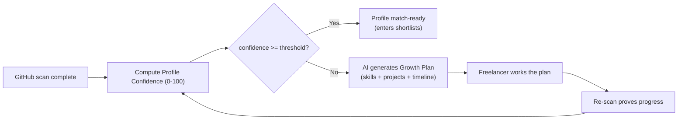
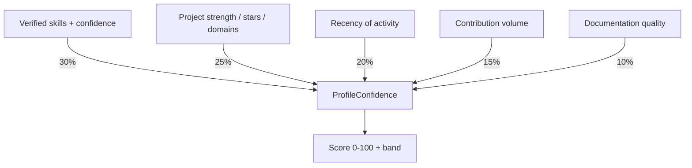
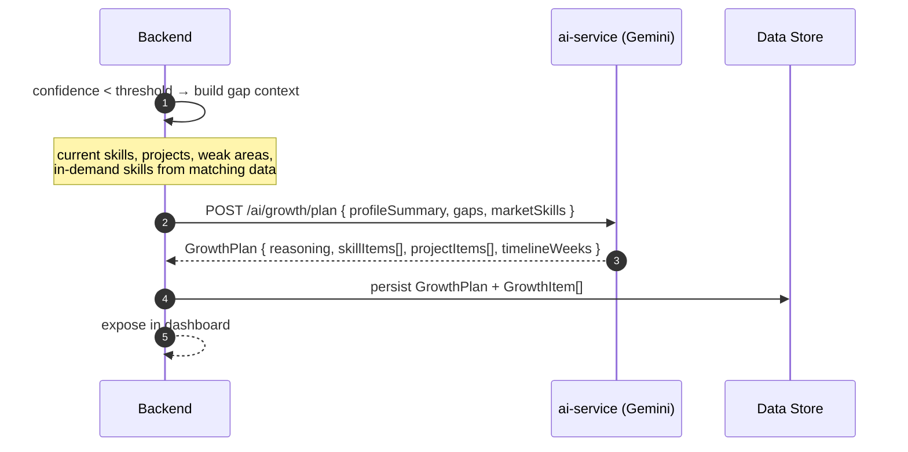
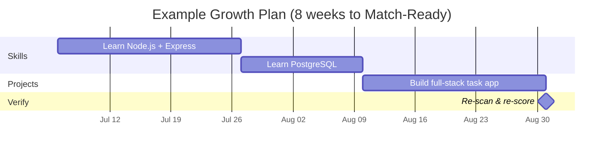
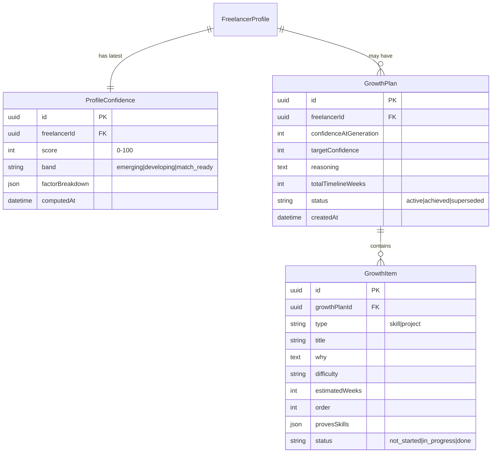

# 02 — Freelancer Profile Confidence & AI Growth Plan

> **Feature:** After the GitHub scan (doc 01), the platform computes a **Profile Confidence Score**. If a freelancer lacks enough projects or skills to score well, the AI engine automatically generates a **personalized growth plan** — which skills to learn and which projects to build — each with a **realistic completion timeline**. This levels the playing field so newer freelancers can earn strong opportunities too.

---

## 1. Why This Exists

The matching engine (AI-006) rewards proven skills and real projects. A talented but early-career freelancer with a thin GitHub would rarely surface — which is unfair and shrinks the talent pool. The growth plan turns "you're not ready" into "here's exactly how to get ready, and by when."



The loop is deliberate: **plan → build → re-scan → confidence rises → match-ready.** Progress is always proven by code, never self-asserted.

---

## 2. Profile Confidence Score

A transparent, math-based score (not a black box). Computed server-side right after the scan segments persist.

```
ProfileConfidence =
    0.30 * SkillBreadthDepth     (# verified skills × avg per-skill confidence)
  + 0.25 * ProjectStrength       (# strong projects, stars, domain clarity)
  + 0.20 * Recency               (activity in last 6–12 months)
  + 0.15 * ContributionVolume    (commit cadence, sustained activity)
  + 0.10 * Documentation         (README quality, communication signal)
```



### Confidence bands

| Band | Range | Meaning | Platform behavior |
|---|---|---|---|
| 🔴 Emerging | 0–49 | Thin profile | Growth plan required; not yet in client shortlists |
| 🟡 Developing | 50–74 | Some proof, gaps remain | Appears in shortlists with a "growing" badge; growth plan offered |
| 🟢 Match-Ready | 75–100 | Strong, code-verified | Full shortlist eligibility |

> The threshold (default **75**) mirrors the existing `CONFIDENCE_THRESHOLD` used by the confidence grid, keeping platform semantics consistent.

---

## 3. Growth Plan Generation

When confidence < threshold, the backend calls a new AI-service endpoint that turns the profile gaps + target market demand into an actionable, time-boxed plan.



### What the plan contains

| Part | Description |
|---|---|
| **Reasoning** | Plain-language explanation of what's missing and why it matters for getting hired |
| **Skill items** | Specific skills to learn, each with rationale, resources hint, difficulty, and an estimated timeline (weeks) |
| **Project items** | Concrete portfolio projects to build that would prove those skills, each with scope, target stack, and estimated build time |
| **Timeline** | Ordered, week-by-week schedule so the freelancer knows what to do first and when each item should be done |

### Example growth-plan shape

```json
{
  "confidenceAtGeneration": 58,
  "targetConfidence": 75,
  "reasoning": "Strong React foundation, but no backend or database evidence — most client briefs in your domain require full-stack proof.",
  "skillItems": [
    { "skill": "Node.js + Express", "why": "Appears in 68% of matched briefs you'd qualify for", "difficulty": "medium", "estimatedWeeks": 3, "order": 1 },
    { "skill": "PostgreSQL", "why": "Pairs with Node for full-stack credibility", "difficulty": "medium", "estimatedWeeks": 2, "order": 2 }
  ],
  "projectItems": [
    { "title": "Full-stack task API + React client", "provesSkills": ["Node.js", "PostgreSQL", "React"], "scope": "CRUD API, auth, deployed demo", "estimatedWeeks": 3, "order": 3 }
  ],
  "totalTimelineWeeks": 8
}
```

---

## 4. Timeline Visualization

The plan renders as a schedule the freelancer can follow and check off.



- Each item has a status: `not_started → in_progress → done`.
- Completing project items is **proven by a re-scan**, not a checkbox — when the new repo appears in the scan, confidence rises automatically.
- A progress ring shows `currentConfidence → targetConfidence`.

---

## 5. Data Model (additions)

Full definitions in [doc 04](./04_schema_and_api_changes.md).



---

## 6. API Surface (summary — full contracts in doc 04)

| Method | Endpoint | Role | Purpose |
|---|---|---|---|
| `GET` | `/api/freelancer/confidence` | freelancer | Current score, band, factor breakdown |
| `GET` | `/api/freelancer/growth-plan` | freelancer | Active growth plan + items + timeline |
| `PATCH` | `/api/freelancer/growth-plan/items/:id` | freelancer | Update item status (`in_progress`, etc.) — status only, not the AI content |
| `POST` | `/api/freelancer/growth-plan/regenerate` | freelancer | Re-generate after major profile change |

New AI endpoint: `POST /ai/growth/plan` (ai-service) — structured-output generation following the same Gemini + schema + fallback pattern as the other four AI features.

> **Guardrail:** the freelancer can update **item status** (their progress) but cannot edit the AI-generated skills/projects or their timelines — consistent with the tamper-proof principle. The plan content changes only via regeneration from real data.

---

## 7. Fairness & Anti-Gaming Notes

- Confidence and growth completion are **always tied to code evidence** (via re-scan), so the growth plan can't be "gamed" by marking items done.
- Market-demand inputs (which skills to recommend) should come from your own matching/opportunity data, not a freelancer's self-report, so recommendations reflect real hiring signals.
- Keep the growth plan **encouraging and specific** — it's a retention and equity feature, not a rejection notice.

---

## 8. Implementation Milestones

| Phase | Deliverable |
|---|---|
| **1** | `ProfileConfidence` computation after scan; expose `/api/freelancer/confidence` + band badge |
| **2** | `POST /ai/growth/plan` in ai-service (schema + fallback) |
| **3** | `GrowthPlan`/`GrowthItem` models + `/api/freelancer/growth-plan` |
| **4** | Timeline (Gantt) UI + progress ring + item status updates |
| **5** | Re-scan → auto recompute confidence → mark plan `achieved` when threshold reached |

Proceed to [doc 03 — Developer Workspace & Projects](./03_developer_workspace_and_projects.md).
