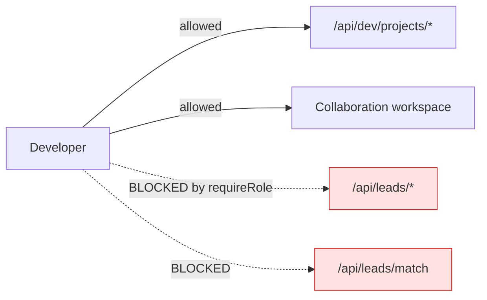
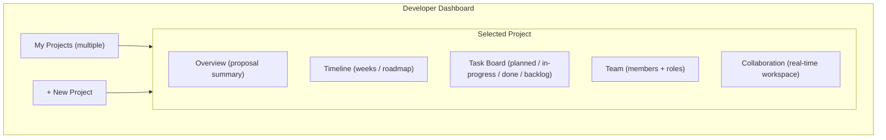
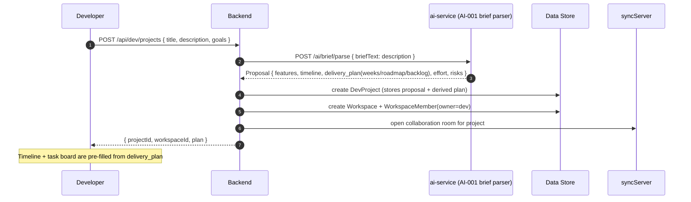
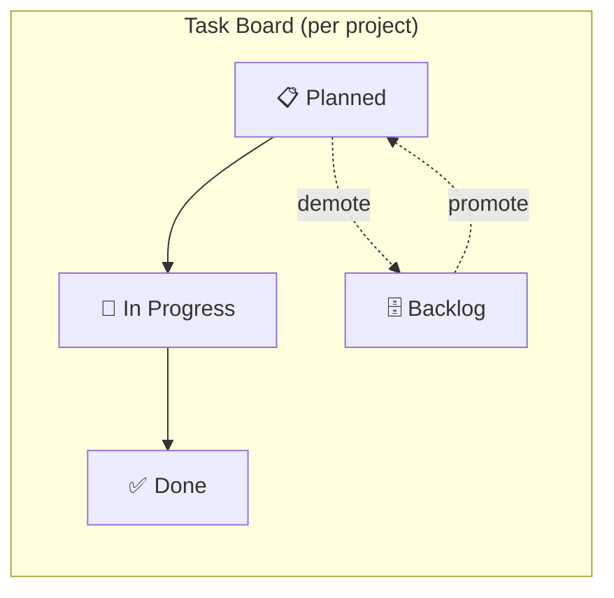
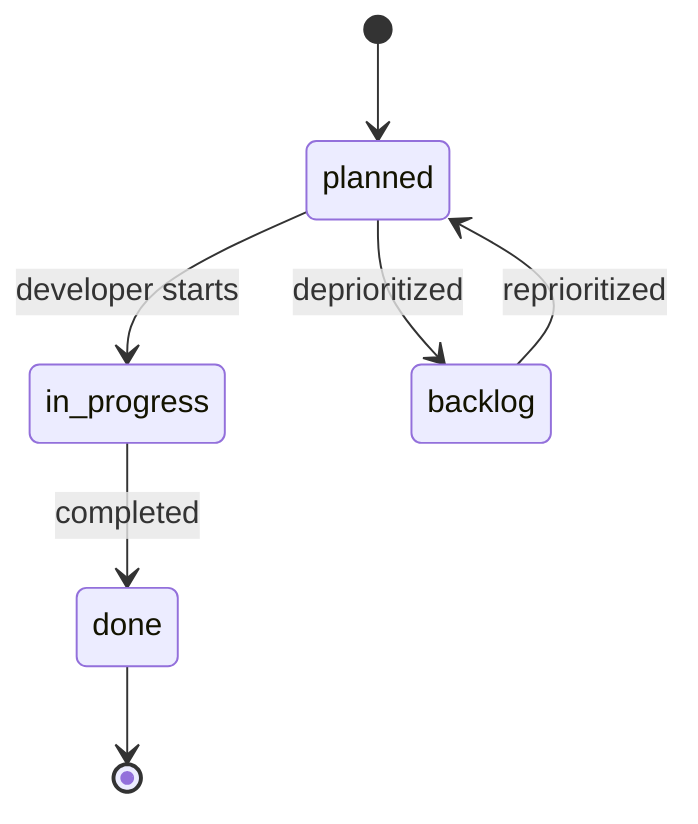
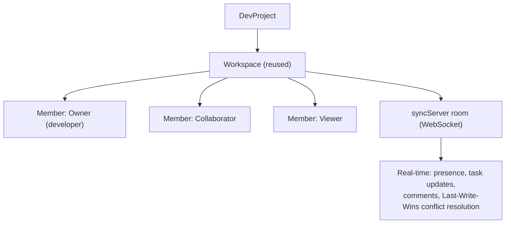
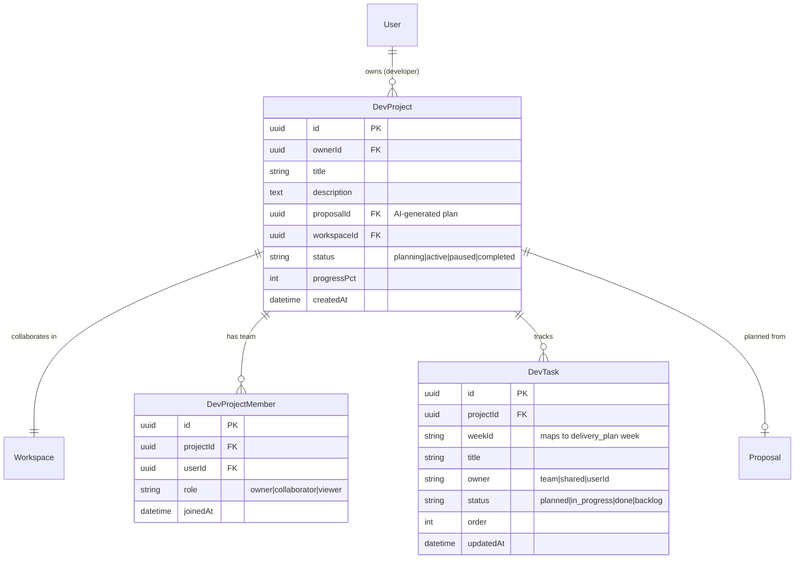

# 03 — Developer Workspace & Project Management

> **Feature:** The **Developer** role is not client-facing. Developers use FixFlowAI as a **project delivery workspace**: they create multiple projects, auto-generate a project **proposal, timeline, and team plan**, then **manage progress** and **collaborate with their team** — all from one dashboard. Developers have **no access** to client or lead data.

---

## 1. Role Definition & Boundaries

| Developers CAN | Developers CANNOT |
|---|---|
| Create and manage **multiple projects** | See or contact clients |
| Auto-generate proposal + timeline + team plan per project | Appear in client match shortlists |
| Track project/task progress on a board | Post briefs or receive leads |
| Run **team collaboration workspaces** (real-time) | Act as escrow payer/payee |
| Invite teammates to a project | Access `/api/leads/*`, `/api/proposals/*` (client), matching |

---

## 2. Reuse Map (Don't Rebuild)

The developer experience is largely a **recomposition of existing subsystems**:

| Developer need | Reuses | New wiring |
|---|---|---|
| Project proposal + timeline | **AI-001 brief parser** → `Proposal.delivery_plan` (weeks, roadmap, backlog already exist!) | Point brief parser at a developer's own project description |
| Weekly plan / tasks | `Proposal.delivery_plan.weeks[].tasks[]` (has `owner`, `status: planned/done/backlog`) | Surface as a task board |
| Team collaboration | **`syncServer`** (WebSocket, vector clocks) + `Workspace` + `WorkspaceMember` | Bind a project to a workspace room |
| Notifications | `Proposal.delivery_plan.notificationDefaults` (channels/events already modeled) | Hook to dev events |

> This means the developer role ships fast: the AI planning and real-time collaboration primitives already exist. The new work is a project container, membership, a progress board, and role gating.

---

## 3. Developer Dashboard Overview

---

## 4. Project Creation Flow (AI-Assisted)

The developer's project description is fed to the **same brief parser** the client side uses — so a developer instantly gets a structured feature list, weekly plan, roadmap, backlog, and effort breakdown to start from.

---

## 5. Project Progress Management

Tasks come straight from `delivery_plan.weeks[].tasks[]` (which already model `owner`, `status`, `notify`). Surface them as a board:

- **Roadmap view:** `delivery_plan.roadmap[]` (milestones with `targetWeek`, `status`).
- **Progress metric:** `% tasks done`, plus per-week completion, drives a project health indicator.
- **Notifications:** reuse `notificationDefaults` (`in_app`/`email`, events like `goal_completed`, `assignment`, `backlog_moved`).

---

## 6. Team & Collaboration

- **Membership:** a project maps to a `Workspace`; teammates are `WorkspaceMember`s with roles (`owner`, `collaborator`, `viewer`).
- **Real-time:** reuse `syncServer` (already implements WebSocket multiplexing + causal vector clocks + LWW). A project opens a room keyed by its id.
- **Invites:** `POST /api/dev/projects/:id/members` adds a teammate (by email/username). Teammates must also be `developer` (or invited guests with scoped access — decision point).

---

## 7. Data Model (additions)

Full definitions in [doc 04](./04_schema_and_api_changes.md). New models compose with existing `Workspace`/`Proposal`.

> `DevTask` is seeded from `Proposal.delivery_plan.weeks[].tasks[]` on project creation, then edited freely (developers **can** edit their own tasks — unlike freelancer skills, task management is the developer's job).

---

## 8. API Surface (summary — full contracts in doc 04)

| Method | Endpoint | Role | Purpose |
|---|---|---|---|
| `POST` | `/api/dev/projects` | developer | Create project (auto-generates plan via AI-001) |
| `GET` | `/api/dev/projects` | developer | List own projects |
| `GET` | `/api/dev/projects/:id` | developer | Project detail (plan, timeline, board) |
| `PATCH` | `/api/dev/projects/:id` | developer | Update status/metadata |
| `POST` | `/api/dev/projects/:id/regenerate-plan` | developer | Re-run brief parser on updated description |
| `GET/POST/PATCH` | `/api/dev/projects/:id/tasks` | developer | Manage task board |
| `POST` | `/api/dev/projects/:id/members` | developer | Invite/add teammate |
| `WS` | sync room (existing `syncServer`) | member | Real-time collaboration |

---

## 9. Implementation Milestones

| Phase | Deliverable |
|---|---|
| **1** | `requireRole('developer')` gating; `DevProject` model + create/list/detail |
| **2** | Wire project creation to AI-001 brief parser → store `delivery_plan`; seed `DevTask[]` |
| **3** | Timeline + roadmap + task board UI (from `delivery_plan`) |
| **4** | `Workspace` binding + `DevProjectMember` + invites |
| **5** | Real-time collaboration via existing `syncServer` room per project |
| **6** | Progress metrics + notifications (reuse `notificationDefaults`) |

---

## 10. Open Decision Points (flag to product)

- **Developer auth:** Google default with optional GitHub link (per doc 00). Confirm.
- **Guest teammates:** can a non-developer be invited as a `viewer`? Recommend yes, with a scoped guest token.
- **Overlap with client "Workspace":** developers reuse the same `Workspace` model but never touch escrow/leads — confirm the gating is airtight in code review.

Proceed to [doc 04 — Schema & API Changes](./04_schema_and_api_changes.md).
