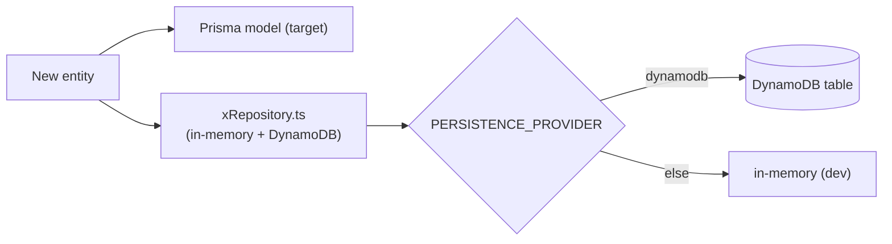
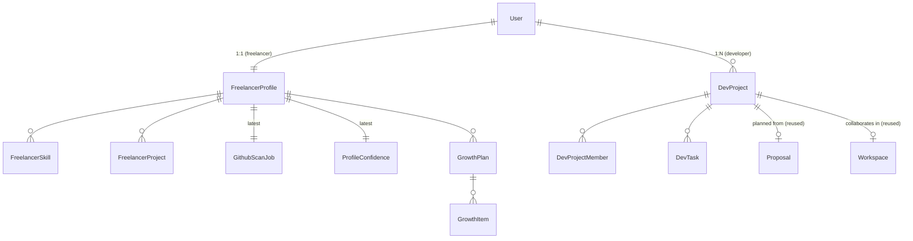

# 04 — Schema & API Changes (Consolidated Delta)

> **Purpose:** the authoritative, consolidated list of **every** schema addition and API contract introduced by the role-based platform (docs 00–03). This is a **delta** on top of the base models in [`../architecture/database_design.md`](../architecture/database_design.md) and [`../architecture/erd_and_api_contracts.md`](../architecture/erd_and_api_contracts.md). Implement against **both** persistence layers that exist in the repo: the target **Prisma/PostgreSQL** model and the current **repository pattern** (DynamoDB / seed / in-memory).

---

## 1. Persistence Reality Check

- **Target model:** PostgreSQL + Prisma (as in `database_design.md`).
- **Today's code:** repository pattern (`services/*Repository.ts`) over DynamoDB/seed/in-memory. **No live Prisma yet.**
- **Therefore:** for each new entity below, add (a) a Prisma model to the target schema **and** (b) a new `*Repository.ts` following the existing `proposalRepository.ts` shape (in-memory + DynamoDB providers, `PERSISTENCE_PROVIDER` switch). Keep field names identical across both.



---

## 2. Enums (additions)

```prisma
// Extend the existing Role usage. The app-level UserRole in code is already
// 'client' | 'freelancer' | 'agency' | 'developer'. Keep all four; the signup
// page surfaces three (Client, Freelancer, Developer). 'agency' stays for compat.

enum AuthProvider {
  GOOGLE
  GITHUB
}

enum ScanStatus {
  QUEUED
  RUNNING
  PARTIAL
  COMPLETE
  FAILED
}

enum SkillCategory {
  LANGUAGE
  FRAMEWORK
  TOOL
  DOMAIN
}

enum ConfidenceBand {
  EMERGING       // 0-49
  DEVELOPING     // 50-74
  MATCH_READY    // 75-100
}

enum GrowthItemType {
  SKILL
  PROJECT
}

enum GrowthItemStatus {
  NOT_STARTED
  IN_PROGRESS
  DONE
}

enum DevProjectStatus {
  PLANNING
  ACTIVE
  PAUSED
  COMPLETED
}
```

---

## 3. User / Auth Changes

```prisma
model User {
  // ... existing fields ...
  authProvider   AuthProvider @default(GOOGLE)   // NEW — which provider this user signed up with
  githubUsername String?                          // NEW — set for GitHub-auth users
  githubUserId   String?      @unique             // NEW — stable GitHub id
  // NOTE: never store the GitHub access token in plaintext. If retained for
  // re-scan, store encrypted with a short TTL in a separate secrets store, not here.
}
```

**Code-side (`services/userRepository.ts`):** extend the `User` interface + `upsertFromGoogleProfile` companion `upsertFromGithubProfile(input)`; keep `role` handling as-is.

### Auth API additions

#### `POST /api/auth/github`
- **Auth:** public
- **Body:** `{ "code": "<oauth_code>", "intendedRole": "freelancer" | "developer" }`
- **Behavior:** exchange code → GitHub access token + profile; upsert user with `authProvider=GITHUB`; if `intendedRole=freelancer`, enqueue a deep scan.
- **200:**
  ```json
  {
    "user": { "id": "...", "role": "freelancer", "authProvider": "GITHUB", "githubUsername": "octocat" },
    "accessToken": "eyJ...",
    "refreshToken": "...",
    "scanJobId": "job_gh_..."   // present only for freelancer
  }
  ```
- **Errors:** `400 role_requires_github` (a Google token used for a GitHub-only role), `401 github_exchange_failed`.

#### Role-provider enforcement (applies to `POST /api/auth/google` too)
- Reject `intendedRole=freelancer` on the Google endpoint → `400 role_requires_github`.

---

## 4. New Middleware: `requireRole`

```ts
// backend/src/auth/roles.ts  (NEW)
import type { Request, Response, NextFunction } from 'express';
import type { UserRole } from '../services/userRepository.js';

export function requireRole(...roles: UserRole[]) {
  return (req: Request, res: Response, next: NextFunction) => {
    const role = req.auth?.role;                 // set by requireAuth
    if (!role || !roles.includes(role)) {
      res.status(403).json({ error: 'forbidden_for_role', allowed: roles });
      return;
    }
    next();
  };
}
```
Usage: `app.post('/api/dev/projects', requireAuth, requireRole('developer'), handler)`.

---

## 5. Freelancer Scan Models (doc 01)

```prisma
model GithubScanJob {
  id             String     @id @default(uuid()) @db.Uuid
  freelancerId   String     @db.Uuid
  githubUsername String
  status         ScanStatus @default(QUEUED)
  segmentStatus  Json       // { skills: "done"|"running"|"error", projects: ..., experience: ... }
  reposDiscovered Int       @default(0)
  reposAnalyzed   Int       @default(0)
  startedAt      DateTime?
  finishedAt     DateTime?
  error          String?
  createdAt      DateTime   @default(now())

  freelancer     FreelancerProfile @relation(fields: [freelancerId], references: [id], onDelete: Cascade)
  @@index([freelancerId])
}

model FreelancerSkill {
  id             String        @id @default(uuid()) @db.Uuid
  freelancerId   String        @db.Uuid
  name           String
  category       SkillCategory
  confidence     Int           // 0-100
  evidence       Json          // [{ repo, signal, detail }]
  source         String        @default("github_scan")
  editable       Boolean       @default(false)   // ALWAYS false — tamper-proof
  lastVerifiedAt DateTime      @default(now())

  freelancer     FreelancerProfile @relation(fields: [freelancerId], references: [id], onDelete: Cascade)
  @@unique([freelancerId, name])
  @@index([freelancerId])
}

model FreelancerProject {
  id           String   @id @default(uuid()) @db.Uuid
  freelancerId String   @db.Uuid
  repoName     String
  summary      String   @db.Text
  domain       String?
  stack        Json     // string[]
  stars        Int      @default(0)
  commitShare  Int      @default(0)   // % of commits by this user
  lastActiveAt DateTime?
  rankScore    Int      @default(0)

  freelancer   FreelancerProfile @relation(fields: [freelancerId], references: [id], onDelete: Cascade)
  @@index([freelancerId])
}
```

**`FreelancerProfile.githubScan` JSON (structured rollup — keep for matching engine):**
```json
{
  "languages": { "TypeScript": 62, "Python": 24, "Go": 14 },
  "repos": ["proposal-generator", "billing-svc"],
  "commits": 1840,
  "topDomains": ["fintech", "devtools"],
  "segments": { "skills": true, "projects": true, "experience": true },
  "lastScanned": "2026-07-04T10:00:00Z"
}
```

---

## 6. Confidence & Growth Models (doc 02)

```prisma
model ProfileConfidence {
  id              String         @id @default(uuid()) @db.Uuid
  freelancerId    String         @unique @db.Uuid
  score           Int            // 0-100
  band            ConfidenceBand
  factorBreakdown Json           // { skillBreadthDepth, projectStrength, recency, contribution, documentation }
  computedAt      DateTime       @default(now())

  freelancer      FreelancerProfile @relation(fields: [freelancerId], references: [id], onDelete: Cascade)
}

model GrowthPlan {
  id                     String   @id @default(uuid()) @db.Uuid
  freelancerId           String   @db.Uuid
  confidenceAtGeneration Int
  targetConfidence       Int      @default(75)
  reasoning              String   @db.Text
  totalTimelineWeeks     Int
  status                 String   @default("active") // active|achieved|superseded
  createdAt              DateTime @default(now())

  freelancer  FreelancerProfile @relation(fields: [freelancerId], references: [id], onDelete: Cascade)
  items       GrowthItem[]
  @@index([freelancerId])
}

model GrowthItem {
  id            String           @id @default(uuid()) @db.Uuid
  growthPlanId  String           @db.Uuid
  type          GrowthItemType
  title         String
  why           String           @db.Text
  difficulty    String           // easy|medium|hard
  estimatedWeeks Int
  order         Int
  provesSkills  Json             // string[]
  status        GrowthItemStatus @default(NOT_STARTED)

  plan          GrowthPlan @relation(fields: [growthPlanId], references: [id], onDelete: Cascade)
  @@index([growthPlanId])
}
```

---

## 7. Developer Project Models (doc 03)

```prisma
model DevProject {
  id          String           @id @default(uuid()) @db.Uuid
  ownerId     String           @db.Uuid
  title       String
  description String           @db.Text
  proposalId  String?          @db.Uuid   // AI-001 generated plan
  workspaceId String?          @db.Uuid   // reuse Workspace for collaboration
  status      DevProjectStatus @default(PLANNING)
  progressPct Int              @default(0)
  createdAt   DateTime         @default(now())
  updatedAt   DateTime         @updatedAt

  owner       User             @relation(fields: [ownerId], references: [id], onDelete: Cascade)
  members     DevProjectMember[]
  tasks       DevTask[]
  @@index([ownerId])
}

model DevProjectMember {
  id        String   @id @default(uuid()) @db.Uuid
  projectId String   @db.Uuid
  userId    String   @db.Uuid
  role      String   @default("collaborator") // owner|collaborator|viewer
  joinedAt  DateTime @default(now())

  project   DevProject @relation(fields: [projectId], references: [id], onDelete: Cascade)
  @@unique([projectId, userId])
}

model DevTask {
  id        String   @id @default(uuid()) @db.Uuid
  projectId String   @db.Uuid
  weekId    String?  // maps to delivery_plan week id
  title     String
  owner     String   @default("team") // team|shared|<userId>
  status    String   @default("planned") // planned|in_progress|done|backlog
  order     Int      @default(0)
  updatedAt DateTime @updatedAt

  project   DevProject @relation(fields: [projectId], references: [id], onDelete: Cascade)
  @@index([projectId])
}
```

---

## 8. Full API Contract Table

### Auth
| Method | Endpoint | Role | Notes |
|---|---|---|---|
| `POST` | `/api/auth/github` | public | GitHub OAuth code exchange (NEW) |
| `POST` | `/api/auth/google` | public | Existing; now rejects freelancer intent |

### Freelancer — scan & profile
| Method | Endpoint | Role | Notes |
|---|---|---|---|
| `POST` | `/api/freelancer/scan` | freelancer | Start deep scan (auto at signup) → `{ scanJobId }` |
| `GET` | `/api/freelancer/scan/:jobId` | freelancer | `{ status, segmentStatus, reposAnalyzed }` |
| `GET` | `/api/freelancer/scan/:jobId/stream` | freelancer | SSE: `segment_ready`, `scan_complete` |
| `GET` | `/api/freelancer/profile` | freelancer | Verified skills (read-only) + projects |
| `POST` | `/api/freelancer/rescan` | freelancer | Rate-limited re-derive |
| `GET` | `/api/freelancer/confidence` | freelancer | Score, band, breakdown |
| `GET` | `/api/freelancer/growth-plan` | freelancer | Active plan + items + timeline |
| `PATCH` | `/api/freelancer/growth-plan/items/:id` | freelancer | **Status only** (progress) |
| `POST` | `/api/freelancer/growth-plan/regenerate` | freelancer | Regenerate from current data |

### Developer — projects
| Method | Endpoint | Role | Notes |
|---|---|---|---|
| `POST` | `/api/dev/projects` | developer | Create + auto-plan (AI-001) |
| `GET` | `/api/dev/projects` | developer | List own |
| `GET` | `/api/dev/projects/:id` | developer | Detail (plan/timeline/board) |
| `PATCH` | `/api/dev/projects/:id` | developer | Update status/metadata |
| `POST` | `/api/dev/projects/:id/regenerate-plan` | developer | Re-run parser |
| `GET` | `/api/dev/projects/:id/tasks` | developer | Board |
| `POST` | `/api/dev/projects/:id/tasks` | developer | Add task |
| `PATCH` | `/api/dev/projects/:id/tasks/:taskId` | developer | Move/update task |
| `POST` | `/api/dev/projects/:id/members` | developer | Invite teammate |

### AI service (new endpoints — Python `ai-service`)
| Method | Endpoint | Purpose |
|---|---|---|
| `POST` | `/ai/github/summarize` | Normalize raw language/framework signals → clean skills + per-skill confidence |
| `POST` | `/ai/growth/plan` | Generate growth plan (skills + projects + timeline) from gaps + market skills |

> Both follow the existing ai-service pattern: Pydantic request/response, Gemini `generate_structured`, and a safe fallback (see [`../../../References/ai-service-guide.md`](../../../References/ai-service-guide.md)). Add matching TS types in `backend/src/types/ai.ts` and client methods in `services/aiClient.ts`.

---

## 9. ERD — New Entities in Context



---

## 10. Migration & Rollout Notes

1. **Non-breaking for Client.** All additions are new tables/fields; the client flow is untouched. `authProvider` defaults to `GOOGLE`, so existing users are unaffected.
2. **Order of build:** Auth (GitHub + `requireRole`) → freelancer scan → confidence/growth → developer projects. Each is independently shippable.
3. **Dual persistence:** land Prisma models and repositories together; gate reads/writes behind `PERSISTENCE_PROVIDER` exactly like `proposalRepository.ts`.
4. **Secrets:** GitHub OAuth client id/secret + (optional, encrypted) access-token store go in the secrets manager, referenced by env — never committed.
5. **Env additions:**
   ```bash
   GITHUB_OAUTH_CLIENT_ID=...
   GITHUB_OAUTH_CLIENT_SECRET=...
   GITHUB_OAUTH_CALLBACK_URL=...
   GITHUB_SCAN_CONCURRENCY=6
   SCAN_TOP_N_REPOS=50
   PROFILE_CONFIDENCE_THRESHOLD=75
   ```

---

## 11. Cross-References

| Document | Why |
|---|---|
| [00 Role Architecture Overview](./00_role_architecture_overview.md) | Signup, auth-per-role, permission matrix |
| [01 Freelancer GitHub Onboarding](./01_freelancer_github_onboarding.md) | Scan pipeline these models back |
| [02 Confidence & Growth Plan](./02_freelancer_confidence_growth_plan.md) | Confidence/growth models |
| [03 Developer Workspace](./03_developer_workspace_and_projects.md) | DevProject models |
| [`../architecture/database_design.md`](../architecture/database_design.md) | Base Prisma schema extended here |
| [`../architecture/erd_and_api_contracts.md`](../architecture/erd_and_api_contracts.md) | Base API contracts extended here |
