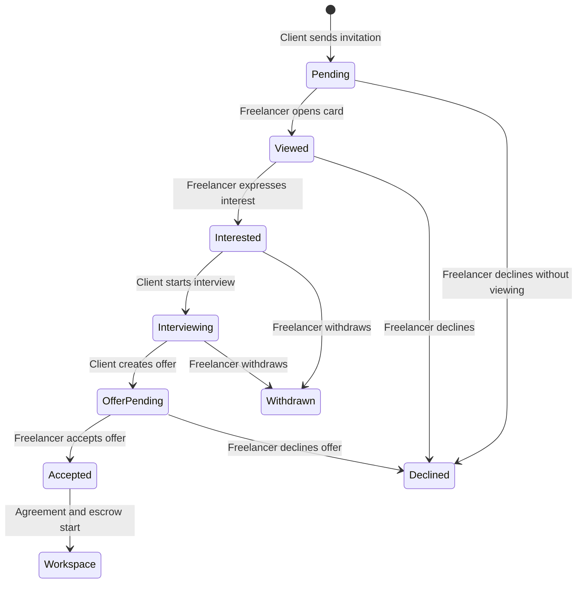

# 05 — Freelancer Work Matches & Opportunity Board

> **Purpose:** define the freelancer-side counterpart to the client hiring workflow. It gives freelancers a truthful, actionable view of work that is matched to their verified skills without recreating open-bid spam.
>
> **Status:** implementation specification. The client-side shortlist, invitation, and selection workflow is implemented first. This document defines the next freelancer delivery.

---

## 1. Product Decision

FixFlowAI has two kinds of work discovery. They must look and behave differently.

| Type | Who creates it | What the freelancer sees | Primary action |
| --- | --- | --- | --- |
| **Native invite** | A FixFlow client selects and invites a verified freelancer | A private project card with proof of fit, scope, budget/timeline, and client trust information | `Interested`, `Decline`, or `Ask a question` |
| **External opportunity** | A permitted RSS/API source or a freelancer’s own URL/text import | An attributed source card with a canonical source URL and source-policy restrictions | `Apply on source` or `Draft proposal` |

Never label an external opportunity as a FixFlow client. Never label a skill-fit result as an invitation. The UI must use one of these exact labels:

- **Invited** — the client chose this freelancer from the shortlist.
- **Eligible match** — only for a future, opt-in verified talent pool; the client has not selected the freelancer.
- **External opportunity** — sourced elsewhere; application happens on the original platform unless policy explicitly allows otherwise.

The default marketplace behavior remains private, client-curated invitations. This protects the product’s zero-noise promise. A future client setting can opt into a capped verified-talent pool only after the private shortlist is insufficient.

---

## 2. Relationship to the Client Workflow

The current client workflow persists a `ClientMatchWorkflow` against a proposal:

```text
suggested → shortlisted → invited → interviewing → selected
                       ↘ archived
```

The freelancer experience starts only at `invited`. It must never reveal:

- a client’s private shortlist before an invitation;
- candidate ranking, competing candidate identities, or the full raw scoring matrix;
- client email, telephone, or sensitive documents before the client permits disclosure.

The client’s state and the freelancer’s response are separate facts. A freelancer being interested does not mean the client selected them, and a client selecting someone does not mean that freelancer accepted the work.



The client-only `status` field should be migrated to `clientStatus`; add a second `freelancerStatus`. Until migration, map `status: "invited"` to `clientStatus: "invited", freelancerStatus: "pending"`.

---

## 3. Freelancer Dashboard UX

### 3.1 Navigation

Add a freelancer-only sidebar item:

```ts
{ id: 'work-matches', label: 'Work matches', icon: BriefcaseBusiness, roles: ['freelancer'] }
```

**Component:** `frontend/src/sections/dashboard/FreelancerWorkMatches.jsx`

The page has two tabs:

1. **Invitations** — private work from FixFlow clients.
2. **Opportunities** — external and manual-import project cards.

Show an unread badge only for `pending` invitations. Do not show a badge for algorithmic skill matches that have not been opened to the freelancer.

### 3.2 Invitations tab

Top summary cards:

| Card | Definition |
| --- | --- |
| New invitations | `freelancerStatus = pending` |
| Awaiting client | `freelancerStatus = interested` and no interview/offer |
| Interviews | client status is `interviewing` |
| Offers | offer status is `pending` |

Each invitation card must show:

- project title and one-sentence outcome;
- budget range/currency, delivery timeline, location/work mode when present;
- required skills and optional/preferred skills;
- **Your verified fit**: matched skills, GitHub evidence count, and transparent gaps;
- client quality label: `New client`, `Established client`, `Premium client`, or a specific risk warning produced by `clientScoring.js`;
- received time and invitation expiry;
- current response state;
- `View details`, `Interested`, `Decline`, and `Ask a question` actions.

Use a plain-language explanation such as:

> You were invited because React, Node.js, and PostgreSQL are verified in your GitHub profile. The client also needs Redis, which is not yet verified.

Do not show only a number such as “82% match.” The score may be displayed, but the evidence and limits must be visible beside it.

### 3.3 Invitation detail view

The detail drawer/page includes:

1. Project outcome, scope summary, deliverable boundaries, and milestones.
2. Required/preferred skills and a match-evidence section.
3. Budget, timeline, timezone/location, and availability assumptions.
4. Client trust summary and explicit risk labels.
5. Clarification questions generated from brief risks. They are questions—not an auto-generated cover letter.
6. The response panel with a maximum 500-character availability note.
7. Agreement/escrow preview only after an offer is created.

All rendering is plain text/React text nodes; do not render project description HTML with `dangerouslySetInnerHTML`.

### 3.4 Opportunity Board tab

The board is for jobs that are not private FixFlow invitations. It provides filters for:

- verified skill fit;
- budget and duration;
- source;
- recency;
- risk/client confidence;
- application policy.

The opportunity card includes source name and attribution, original link, title, normalised summary, skills, budget, age, risk label, and a source-policy badge.

Allowed actions are policy-driven:

| Policy | Primary action | Prohibited action |
| --- | --- | --- |
| `apply_on_source` | Open canonical source URL | Submit through FixFlow |
| `draft_only` | Create a private proposal draft | Automated submission or contact outreach |
| `client_claim_allowed` | Offer a consent-based Client Claim path | Invite the external client without consent |

The source-policy gate described in `core_subsystems/client_project_ingestion_feasibility.md` is mandatory before any card is stored or displayed.

---

## 4. Shared Data Model

### 4.1 Target relational schema

The current client MVP stores the workflow with a proposal. Before exposing freelancer access, extract the following first-class records in both PostgreSQL/Prisma and the repository layer.

```prisma
enum ClientMatchStatus {
  SUGGESTED
  SHORTLISTED
  INVITED
  INTERVIEWING
  SELECTED
  ARCHIVED
}

enum FreelancerMatchStatus {
  NOT_INVITED
  PENDING
  VIEWED
  INTERESTED
  DECLINED
  WITHDRAWN
  OFFER_PENDING
  ACCEPTED
}

model ProjectMatch {
  id                 String                @id @default(uuid()) @db.Uuid
  proposalId         String                @db.Uuid
  freelancerId       String                @db.Uuid
  clientStatus       ClientMatchStatus     @default(SUGGESTED)
  freelancerStatus   FreelancerMatchStatus @default(NOT_INVITED)
  scoreSnapshot      Json                  // score, factors, reasons, gaps, algorithmVersion
  invitationExpiresAt DateTime?
  version            Int                   @default(1)
  createdAt          DateTime              @default(now())
  updatedAt          DateTime              @updatedAt

  @@unique([proposalId, freelancerId])
  @@index([freelancerId, freelancerStatus, updatedAt])
  @@index([proposalId, clientStatus])
}

model ProjectMatchAudit {
  id              String   @id @default(uuid()) @db.Uuid
  projectMatchId  String   @db.Uuid
  action          String
  actorId         String   @db.Uuid
  actorRole       String   // client | freelancer | system
  fromClientState String?
  toClientState   String?
  fromFreelancerState String?
  toFreelancerState   String?
  previousHash    String
  hash            String
  createdAt       DateTime @default(now())

  @@index([projectMatchId, createdAt])
}
```

`scoreSnapshot` is immutable after it is saved. A re-match creates a new snapshot version or a separate audit event; it must not overwrite a score used to explain an existing invitation.

### 4.2 Repository contract

Create `backend/src/services/projectMatchRepository.ts` with the same provider model as `proposalRepository.ts`:

```ts
interface ProjectMatchRepository {
  listForClient(proposalId: string, clientId: string): Promise<ProjectMatch[]>;
  listForFreelancer(freelancerId: string, filters: FreelancerMatchFilters): Promise<ProjectMatch[]>;
  getForClient(matchId: string, clientId: string): Promise<ProjectMatch | null>;
  getForFreelancer(matchId: string, freelancerId: string): Promise<ProjectMatch | null>;
  createOrRefreshFromShortlist(input: CreateProjectMatchesInput): Promise<ProjectMatch[]>;
  transitionFreelancer(input: FreelancerMatchTransitionInput): Promise<ProjectMatch>;
}
```

For DynamoDB, use:

- `project_matches` table: PK `matchId`, GSI `FreelancerMatchesIndex` (`freelancerId`, `updatedAt`) and GSI `ProposalMatchesIndex` (`proposalId`, `updatedAt`).
- conditional writes on `version` for every mutation;
- `project_match_audit` table keyed by `matchId` + timestamp/hash sequence.

For the current file-backed development provider, serialise writes and perform the version check in the same critical section before persisting.

### 4.3 External opportunity records

External opportunities remain separate from `ProjectMatch`:

```ts
type OpportunityStatus = 'new' | 'saved' | 'drafted' | 'applied_on_source' | 'hidden' | 'expired';

interface FreelancerOpportunity {
  id: string;
  freelancerId: string;
  sourceKey: SourceKey;
  sourceUrl: string;
  title: string;
  normalizedBrief: ProjectPost;
  matchEvidence: OpportunityMatchEvidence;
  policySnapshot: SourcePolicy;
  status: OpportunityStatus;
  version: number;
  expiresAt: string;
  createdAt: string;
  updatedAt: string;
}
```

The policy snapshot prevents a source-rule change from silently changing what was allowed when the freelancer saved an opportunity.

---

## 5. API Contract

All routes require `requireAuth` followed by `requireRole('freelancer')`. The route must derive the freelancer identity from `req.auth.sub`; it must never accept a freelancer ID in the body as authority.

### 5.1 Native invitations

| Method | Endpoint | Purpose |
| --- | --- | --- |
| `GET` | `/api/freelancer/matches?status=pending` | Paginated private invitations/read model |
| `GET` | `/api/freelancer/matches/:matchId` | Detail for this freelancer only |
| `PATCH` | `/api/freelancer/matches/:matchId/viewed` | Mark pending invitation as viewed, idempotently |
| `PATCH` | `/api/freelancer/matches/:matchId/respond` | `interested`, `declined`, or `withdrawn` with version check |
| `POST` | `/api/freelancer/matches/:matchId/questions` | Submit bounded clarification question; no open chat before interest |

Example response request:

```json
{
  "action": "interested",
  "availabilityNote": "I can begin next week and can reserve 20 hours per week.",
  "expectedVersion": 4
}
```

Zod boundary schema:

```ts
const FreelancerResponseSchema = z.object({
  action: z.enum(['interested', 'declined', 'withdrawn']),
  availabilityNote: z.string().trim().max(500).optional(),
  declineReason: z.enum(['availability', 'budget', 'scope', 'other']).optional(),
  expectedVersion: z.number().int().positive(),
}).superRefine((value, ctx) => {
  if (value.action === 'declined' && !value.declineReason) {
    ctx.addIssue({ code: z.ZodIssueCode.custom, path: ['declineReason'], message: 'Choose a decline reason.' });
  }
});
```

The service must enforce this transition map:

```ts
const FREELANCER_TRANSITIONS = {
  pending: ['viewed', 'interested', 'declined'],
  viewed: ['interested', 'declined'],
  interested: ['withdrawn'],
  offer_pending: ['accepted', 'declined'],
  accepted: [],
  declined: [],
  withdrawn: [],
} as const;
```

Return `409` for a stale version or invalid transition, `404` for a match that is not owned by the authenticated freelancer, and `403` for an incorrect role. Do not disclose whether another freelancer has a match for the same project.

### 5.2 External opportunities

| Method | Endpoint | Purpose |
| --- | --- | --- |
| `GET` | `/api/opportunities` | Freelancer’s paginated opportunity board |
| `GET` | `/api/opportunities/:id` | Detail with source-policy snapshot |
| `PATCH` | `/api/opportunities/:id` | Save or hide with `expectedVersion` |
| `POST` | `/api/opportunities/:id/draft-proposal` | Generate/edit a private draft only |
| `POST` | `/api/opportunities/:id/mark-applied` | User confirms an external application happened |

`mark-applied` must never submit an application. It records a user-confirmed action and audit event only.

---

## 6. Backend Implementation Plan

### Phase A — Extract shared match records

1. Add `ProjectMatchSchema`, `ProjectMatchAuditSchema`, and strict action schemas in `backend/src/services/projectMatchWorkflow.ts`.
2. Migrate the current proposal-embedded `ClientMatchWorkflow` into `ProjectMatch` records. Preserve candidate score snapshot, current status, version, and all hash-chain entries.
3. Change the client project-match routes to use `projectMatchRepository.ts` rather than scanning proposal data.
4. Send a notification event when the client transition becomes `INVITED`.

### Phase B — Freelancer invitation API

1. Add `backend/src/routes/freelancerMatches.ts`.
2. Mount it after the existing freelancer router, with `requireAuth` and `requireRole('freelancer')` on every route.
3. Implement object-level lookups by `freelancerId = req.auth.sub` and reject all other records as `404`.
4. Add response transitions, SHA-256 audit events, and conditional/versioned persistence.
5. Create a notification record after every client or freelancer transition. Email can be introduced later; in-app notification is the MVP.

### Phase C — Opportunity Board

1. Build the source-policy gate before a connector or card UI.
2. Add manual URL/text import before automated discovery.
3. Persist source attribution, TTL, policy snapshot, and match evidence.
4. Enable RSS/API-friendly sources only after their policy is reviewed.
5. Keep Upwork/Fiverr/other restricted sources out of automated ingestion unless a written compliant integration path exists.

---

## 7. Frontend Implementation Plan

### 7.1 Store

Create `frontend/src/store/useFreelancerMatchesStore.js` rather than extending the landing store further.

```ts
{
  invitations: [],
  opportunities: [],
  activeTab: 'invitations',
  filters: { status: 'all', minFit: 0, source: 'all', recency: 'all' },
  loading: false,
  actionLoadingId: null,
  error: null,
  fetchInvitations(),
  respondToInvitation(matchId, action, expectedVersion),
  fetchOpportunities(),
  updateOpportunity(id, patch, expectedVersion),
}
```

Use optimistic updates only for low-risk visual state (`viewed`, `save`, `hide`). For interest, decline, withdrawal, acceptance, and anything that changes client expectations, wait for the server’s versioned response before updating the card.

### 7.2 Components

| File | Responsibility |
| --- | --- |
| `FreelancerWorkMatches.jsx` | Page shell, tab state, filters, empty/error/loading states |
| `FreelancerInvitationCard.jsx` | Private native invitation summary and response controls |
| `FreelancerInvitationDetail.jsx` | Scope, evidence, trust, clarification questions, response note |
| `OpportunityBoard.jsx` | Search/filter/list of external/manual opportunities |
| `OpportunityCard.jsx` | Attribution, match evidence, policy-safe actions |
| `OpportunityDetail.jsx` | Full source and compliance detail |

Render cards with the existing `panel-card`, `panel-badge`, and `panel-btn` design system. Maintain keyboard access, visible focus states, and 44px touch targets.

### 7.3 Empty states

| State | Copy | Action |
| --- | --- | --- |
| No verified profile | “Complete your GitHub verification to become eligible for client matches.” | Go to Analytics/onboarding |
| No invitations | “No active invitations yet. Your verified profile remains eligible for relevant projects.” | Browse opportunities |
| Declined/expired invite | “This invitation is no longer active.” | Hide/archive only |
| No external opportunities | “No opportunities match these filters right now.” | Clear filters / import URL |

Do not make a low-confidence freelancer feel rejected. Link the existing growth plan with specific, code-verifiable next steps.

---

## 8. Notifications and Real-Time Behavior

Use the existing WebSocket infrastructure only for notification events; do not put match state solely in a socket frame.

```ts
type MatchNotification =
  | { type: 'match.invited'; matchId: string; proposalId: string }
  | { type: 'match.interested'; matchId: string }
  | { type: 'match.declined'; matchId: string }
  | { type: 'match.offer_created'; matchId: string }
  | { type: 'match.expiring'; matchId: string; expiresAt: string };
```

Persist the transition first, then publish the event. On reconnect, the frontend re-fetches the read model; it must not infer state from missed messages.

---

## 9. Security, Privacy, and Fairness Requirements

1. Every state-changing request uses Zod validation, JWT auth, RBAC, and object-level authorization.
2. Every transition checks `expectedVersion` and returns `409` on a conflict.
3. Every transition writes a SHA-256 chained audit record with actor ID, actor role, old/new client state, old/new freelancer state, and timestamp.
4. Candidate identity/profile data is shown to a client only when the candidate belongs to that client’s proposal match record.
5. A freelancer can see only their own invitation records; return `404`, not an authorization hint, for foreign IDs.
6. Skills used in matching must be GitHub-verified. Self-claimed skills are visibly separate and excluded from match scoring.
7. Client reputation must be phrased truthfully. A new client is “New client,” not low-risk or high-risk by assumption.
8. Preserve source attribution, canonical links, retention TTL, and source-specific action rules on every external card.
9. Do not scrape contact information, send automated outreach, or auto-submit applications.
10. Rate-limit invitation responses and opportunity draft generation by authenticated user.

---

## 10. Test Plan

Add tests under `backend/src/test/` and `frontend/src/test/`.

### Backend

- Zod accepts a valid response and rejects unknown action, missing version, note over 500 characters, and invalid decline payload.
- Every valid freelancer transition is accepted.
- Every illegal backward/terminal transition is rejected.
- Two responses with the same version cause exactly one successful update and one `409`.
- Audit chain is valid after client and freelancer transitions; one altered field invalidates it.
- A freelancer cannot read/respond to another freelancer’s invitation.
- A client cannot create a freelancer response and a freelancer cannot call client match mutation routes.
- External source policy blocks `mark-applied` where an action is not allowed.

### Frontend

- Invitation card renders verified evidence and skill gap text.
- `Interested` sends the correct version and updates from server response.
- A `409` shows a refresh message and preserves the existing card rather than pretending the response succeeded.
- Opportunity card uses `Apply on source` for external records and never renders an in-FixFlow apply button.
- Keyboard-only use can open details and submit a response.

---

## 11. Delivery Sequence and Acceptance Criteria

| Phase | Deliverable | Done when |
| --- | --- | --- |
| 1 | Shared match records | Client invitations persist independently of a browser session and have versioned audit entries |
| 2 | Freelancer invitation inbox | A verified freelancer sees only their invites and can respond safely |
| 3 | Client/freelancer hand-off | Interest, interview, offer, acceptance, agreement, and escrow are connected without state bypass |
| 4 | Manual opportunity import | A freelancer can save/import a URL or pasted brief with source warnings |
| 5 | Opportunity board | Policy-compliant external cards, filters, attribution, and link-out application are live |

The feature is complete only when a client can invite a verified freelancer, the freelancer can understand why they were invited and respond, and an accepted offer moves into the existing agreement/escrow workflow with no untracked state change.
