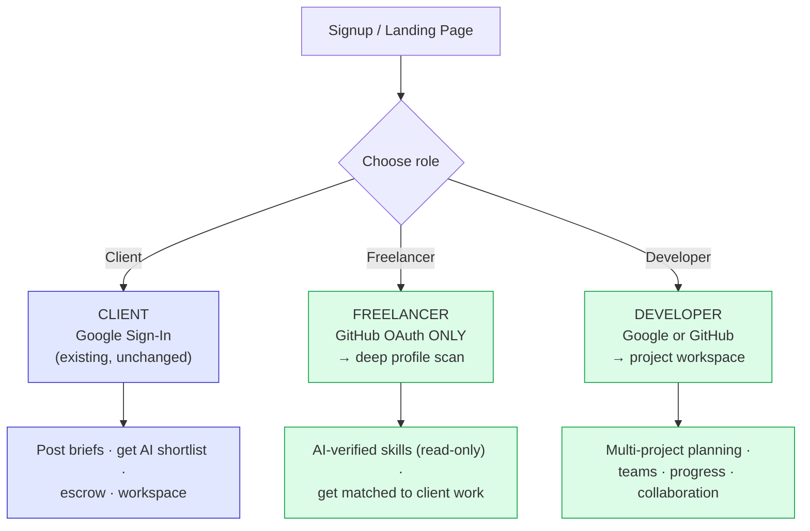

# FixFlowAI — Role-Based Platform Specifications

> **Purpose:** This folder is the single source of truth for FixFlowAI's three-role platform: **Client**, **Freelancer**, and **Developer**. Each role has a distinct signup path, dashboard, permission set, and set of subsystems.
> **Audience:** the software development team implementing each role's features independently.
> **Status:** Design spec. The **Client** role reflects the existing, working codebase; **Freelancer** and **Developer** are new builds.

---

## The Three Roles at a Glance

| Role | Primary auth | Sees clients? | Core value | Build status |
|---|---|---|---|---|
| **Client** | Google Sign-In | — (is the client) | Post brief → AI shortlist → escrow → delivery | ✅ Working today |
| **Freelancer** | **GitHub OAuth only** | ✅ Gets matched to client projects | AI-verified, tamper-proof skill profile from real code | 🆕 New |
| **Developer** | Google or GitHub | ❌ **No client access** | Plan & run own software projects with a team | 🆕 New |

---

## Document Map

| # | Document | What it covers |
|---|---|---|
| 00 | [Role Architecture Overview](./00_role_architecture_overview.md) | Signup flow, auth-per-role, permission matrix, high-level architecture, schema-change summary |
| 01 | [Freelancer GitHub Onboarding](./01_freelancer_github_onboarding.md) | GitHub-only login, deep parallel repo analysis, progressive segment streaming, tamper-proof skills |
| 02 | [Freelancer Confidence & Growth Plan](./02_freelancer_confidence_growth_plan.md) | Profile confidence score + AI-generated skill/project growth plan with timelines |
| 03 | [Developer Workspace & Projects](./03_developer_workspace_and_projects.md) | Multi-project management, timeline/proposal/team generation, progress board, collaboration |
| 04 | [Schema & API Changes](./04_schema_and_api_changes.md) | Consolidated Prisma + DynamoDB additions and REST/SSE API contracts for all new features |

---

## Guiding Principles (apply to every role)

1. **Reuse before rebuild.** The platform already has a brief parser (AI-001), confidence grid (AI-002), interview generator (AI-003), matching engine (AI-006), escrow FSM, sync server, and workspace model. New roles compose these, they do not duplicate them.
2. **The backend stays the system of record.** New AI work (GitHub analysis summarization, growth-plan generation) runs in the Python `ai-service`; persistence stays in the TypeScript backend via the repository pattern.
3. **Tamper-proof by design.** Freelancer skills are AI-derived from code evidence and are **read-only** — there is no write path for a freelancer to edit them.
4. **Progressive UX.** Long-running analysis streams results segment-by-segment so the user never stares at a blank loading screen.
5. **Least privilege.** Role is embedded in the JWT (`role` claim) and enforced by middleware. Developers can never reach client/lead endpoints.

---

## Cross-References

| Document | Why |
|---|---|
| [`../architecture/database_design.md`](../architecture/database_design.md) | Base Prisma schema these specs extend |
| [`../architecture/erd_and_api_contracts.md`](../architecture/erd_and_api_contracts.md) | Base API contracts these specs extend |
| [`../ai_features/ai_006_smart_matching_lead_scoring.md`](../ai_features/ai_006_smart_matching_lead_scoring.md) | The matching engine freelancer profiles feed |
| [`../../../References/ai-service-guide.md`](../../../References/ai-service-guide.md) | The AI service that will host new analysis endpoints |
