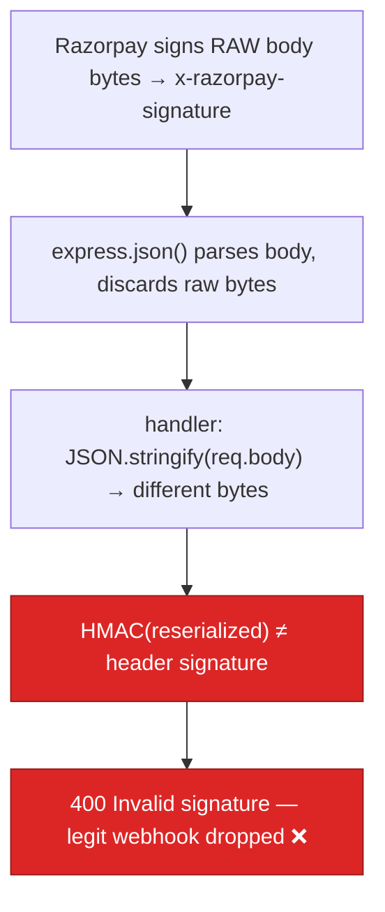

# BUG-08 — Razorpay Webhook HMAC Is Computed Over a Re-Serialized Body (Real Webhooks Never Validate)

> **Role**: Backend Engineer / Security Auditor · **Priority**: 🔴 Critical · **Effort**: ~0.5 day
> **Status**: 🔴 Not started. Identified in [index.ts — `/api/webhooks/razorpay` handler](../../backend/src/index.ts).

---

## Story Identity

| Field | Value |
|:---|:---|
| **Story ID** | `BUG-08` |
| **Owner** | Backend Engineer |
| **Files** | `backend/src/index.ts`, `backend/src/services/paymentService.ts` |
| **Depends on** | None (distinct from BUG-04, which fixed the *missing-secret* bypass) |

---

## 1. Current Problem

The webhook handler verifies the HMAC over `JSON.stringify(req.body)` — i.e. a **re-serialization** of the already-parsed JSON — not the **raw request bytes** Razorpay signed:

```typescript
// backend/src/index.ts
app.use(express.json({ limit: '2mb' }));   // ← consumes & discards the raw body for ALL routes
// ...
app.post('/api/webhooks/razorpay', asyncRoute(async (req, res) => {
  const signature = req.headers['x-razorpay-signature'] as string;
  const body = JSON.stringify(req.body);   // ← re-serialized, NOT the bytes Razorpay hashed
  const webhookSecret = process.env.RAZORPAY_WEBHOOK_SECRET || '';
  const isValid = verifyWebhookSignature(body, signature, webhookSecret);
  // ...
```

HMAC is byte-exact. `express.json()` parses the payload and the original bytes are gone; `JSON.stringify` then re-emits JSON with **different key order, whitespace, unicode escaping, and number formatting** than Razorpay produced. The recomputed digest will not match the `x-razorpay-signature` header, so:

- **Every legitimate Razorpay webhook is rejected with `400`.** `payment.captured` events never transition `Pending_Deposit → Active`. Escrow funding via the webhook path is silently broken end to end.



> This is **not** BUG-04. BUG-04 addressed returning `true` when the secret was missing (fixed). BUG-08 is that even with a correct secret, verification is computed over the **wrong bytes**, so correct webhooks fail.

---

## 2. Why It Matters

- **Payments appear broken in production**: milestones funded through Razorpay's async webhook never activate; freelancers won't see funded state.
- **Masks real tampering**: because *all* webhooks fail signature checks, operators cannot distinguish a genuine forged request from the everyday false negative.
- **Silent**: no crash, just a 400 the sender retries and abandons.

---

## 3. Step-Wise Solution

### Step 3.1 — Capture the raw body for the webhook route only
Mount a raw-body parser scoped to the webhook path *before* the global JSON parser, or use `express.json`'s `verify` hook to stash the raw buffer:

```typescript
app.use(express.json({
  limit: '2mb',
  verify: (req: any, _res, buf) => { req.rawBody = buf; },  // Buffer of exact bytes
}));
```

### Step 3.2 — Verify against the raw bytes
```typescript
const raw: Buffer = (req as any).rawBody ?? Buffer.from('');
const isValid = verifyWebhookSignature(raw.toString('utf8'), signature, webhookSecret);
```
`verifyWebhookSignature` already HMACs the string it is given; feed it the exact received bytes.

### Step 3.3 — Guard against empty/oversized signatures
Reject when `signature` is missing or `raw` is empty *before* HMAC, returning `400` with a clear code.

### Step 3.4 — Add a signed-fixture test
Add a test that signs a known raw payload with a test secret and asserts the handler accepts it, and that a byte-mutated payload is rejected.

---

## 4. Done When

- [ ] The raw request body is available to the webhook handler (via `verify` hook or route-scoped raw parser).
- [ ] Signature verification uses the raw bytes, not `JSON.stringify(req.body)`.
- [ ] A signed-fixture test proves a valid webhook is accepted and a tampered one is rejected.
- [ ] `payment.captured` transitions `Pending_Deposit → Active` end to end in a local Razorpay test.
- [ ] `npm run build` compiles cleanly.

---

## 5. Cross-References

| Document | Relevance |
|:---|:---|
| [index.ts](../../backend/src/index.ts) | Global JSON parser + webhook handler |
| [paymentService.ts](../../backend/src/services/paymentService.ts) | `verifyWebhookSignature` HMAC implementation |
| [BUG-04](../specifications/ai_features/stories/BUG-04-razorpay-webhook-bypass.md) | Related, but covers the missing-secret bypass (already fixed) |
