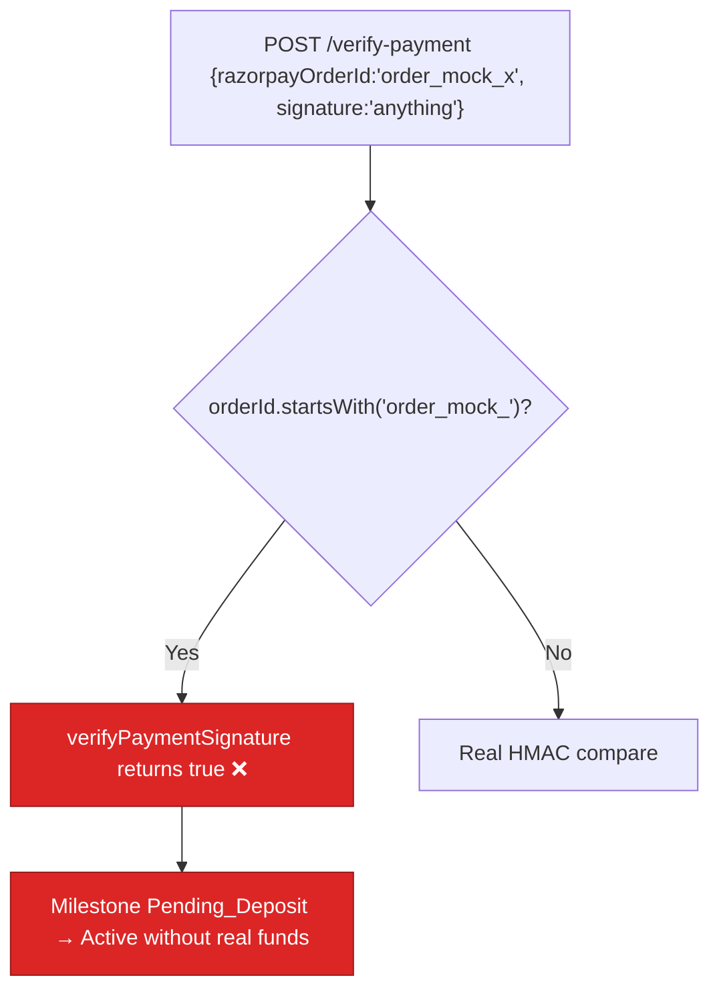

# BUG-09 — `verifyPaymentSignature` Silently Bypasses on Mock Order ID or Missing Secret

> **Role**: Security Auditor / Backend Engineer · **Priority**: 🟡 High · **Effort**: ~0.5 day
> **Status**: 🔴 Not started. Identified in [paymentService.ts — `verifyPaymentSignature`](../../backend/src/services/paymentService.ts).

---

## Story Identity

| Field | Value |
|:---|:---|
| **Story ID** | `BUG-09` |
| **Owner** | Security Auditor / Backend Engineer |
| **Files** | `backend/src/services/paymentService.ts`, `backend/src/index.ts` |
| **Depends on** | SEC-02 (ownership check closes the exploit surface) |

---

## 1. Current Problem

The client-side payment verifier returns `true` — accepting *any* signature — when the key secret is absent **or** the order id merely starts with `order_mock_`:

```typescript
// backend/src/services/paymentService.ts
export function verifyPaymentSignature(orderId, paymentId, signature): boolean {
  if (!KEY_SECRET || orderId.startsWith('order_mock_')) {
    console.log(`[SIMULATION] Bypassing signature check for mock/simulated order: ${orderId}`);
    return true;   // ← unconditional accept
  }
  // real HMAC compare...
}
```

This is called by `POST /api/escrow/milestones/:id/verify-payment`, which then transitions the milestone `Pending_Deposit → Active`. Two abuse paths:

1. **Missing secret in production** → *every* payment verification passes with no real payment.
2. **Attacker-chosen order id** → the endpoint never checks that `razorpayOrderId` in the body matches the milestone's stored `razorpayOrderId`, so a caller can submit `razorpayOrderId: "order_mock_deadbeef"` with any `razorpaySignature` and be accepted.



The `order_mock_*` shortcut is a legitimate *local-simulation* convenience, but the decision is based on an attacker-controllable string with no environment gate.

---

## 2. Why It Matters

- **Fake funding**: milestones activate without money in escrow — the exact failure BUG-04 aimed to prevent, reachable through the client verify path instead of the webhook.
- **Production risk on misconfig**: a missing `RAZORPAY_KEY_SECRET` turns *all* verifications into no-ops silently.

---

## 3. Step-Wise Solution

### Step 3.1 — Gate simulation strictly by environment, not by id shape
Only allow the bypass when `process.env.NODE_ENV !== 'production'` **and** `razorpayClient` is null (true simulation mode). In production, a missing secret must make verification return `false`.

```typescript
const SIMULATION = process.env.NODE_ENV !== 'production' && !razorpayClient;
if (SIMULATION) return true;
if (!KEY_SECRET) { console.error('KEY_SECRET missing — rejecting'); return false; }
// real HMAC compare
```

### Step 3.2 — Bind the order id to the milestone
In the `verify-payment` handler, reject unless the body `razorpayOrderId === milestone.razorpayOrderId`. This kills the attacker-chosen-id path even in simulation.

### Step 3.3 — Fail fast at boot in production
Extend `index.ts` boot checks: if `NODE_ENV === 'production'` and (`RAZORPAY_KEY_SECRET` missing), log critical and `exit(1)` (mirrors the existing webhook-secret check).

---

## 4. Done When

- [ ] Signature bypass is reachable only in non-production simulation mode (no live client).
- [ ] Missing `KEY_SECRET` in production ⇒ `verifyPaymentSignature` returns `false`.
- [ ] `verify-payment` rejects when body `razorpayOrderId` ≠ milestone's stored order id.
- [ ] Production boot fails fast when `RAZORPAY_KEY_SECRET` is unset.
- [ ] Tests cover: prod missing secret rejected, mismatched order id rejected.
- [ ] `npm run build` compiles cleanly.

---

## 5. Cross-References

| Document | Relevance |
|:---|:---|
| [paymentService.ts](../../backend/src/services/paymentService.ts) | `verifyPaymentSignature` / `createRazorpayOrder` |
| [index.ts](../../backend/src/index.ts) | `verify-payment` handler + boot checks |
| [SEC-02](./SEC-02-escrow-object-level-authorization.md) | Ownership check reduces the exploit surface |
