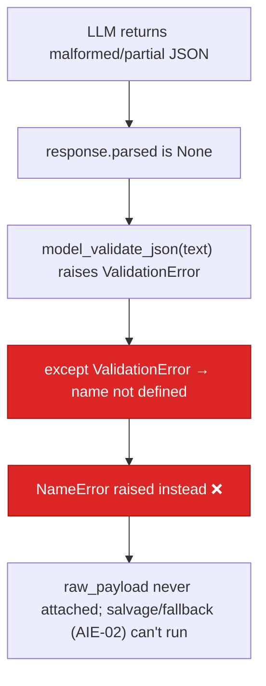

# BUG-10 — AI Service `ValidationError` Is Undefined: Fallback Path Throws `NameError`

> **Role**: AI Engineer · **Priority**: 🟡 High · **Effort**: ~0.25 day
> **Status**: 🔴 Not started. Identified in [llm/gemini.py — `generate_structured` tail](../../ai-service/app/llm/gemini.py).

---

## Story Identity

| Field | Value |
|:---|:---|
| **Story ID** | `BUG-10` |
| **Owner** | AI Engineer |
| **Files** | `ai-service/app/llm/gemini.py` |
| **Depends on** | None |

---

## 1. Current Problem

`generate_structured()` references `ValidationError` in its manual-validation fallback, but **`ValidationError` is never imported**. The module only imports `BaseModel`:

```python
# ai-service/app/llm/gemini.py
from pydantic import BaseModel        # ← ValidationError is NOT imported
# ...
    try:
        validated = response_schema.model_validate_json(text)
        await set_cached_response(...)
        return validated
    except ValidationError as e:       # ← NameError: name 'ValidationError' is not defined
        import json
        try:
            raw_payload = json.loads(text)
        except Exception:
            raw_payload = {}
        setattr(e, "raw_payload", raw_payload)
        raise e
```

This branch runs whenever the SDK does **not** populate `response.parsed` (malformed or partial JSON) and manual `model_validate_json` fails — precisely the degraded case the code is trying to handle. Instead of raising a clean `pydantic.ValidationError` (with the `raw_payload` attached for salvage/fallback), Python raises `NameError: name 'ValidationError' is not defined` while handling the original error.



The `NameError` masks the real validation failure, breaks the intended fallback contract (callers expect a `ValidationError` carrying `raw_payload`), and produces a confusing 500 instead of a graceful degraded response.

---

## 2. Why It Matters

- **The choke point for every AI feature**: `generate_structured` backs `brief_parser`, `confidence_grid`, `interview`, `extensions`, `opportunity`, and `growth`. This latent crash affects all of them on any malformed LLM output.
- **Defeats the salvage design (AIE-02)**: the whole point of attaching `raw_payload` is to let callers patch partial output. A `NameError` throws that away.
- **Trivially triggered**: any time Gemini returns JSON that doesn't match the schema — common under drift or truncation.

---

## 3. Step-Wise Solution

### Step 3.1 — Import `ValidationError`
```python
from pydantic import BaseModel, ValidationError
```

### Step 3.2 — Confirm the salvage contract
Verify callers that catch `ValidationError` read `getattr(e, "raw_payload", {})` and apply their sanitize/patch fallback. Keep the attribute name stable.

### Step 3.3 — Add a regression test
Feed `generate_structured` a response whose text is valid JSON but violates the schema; assert it raises `pydantic.ValidationError` (not `NameError`) and that `raw_payload` is the parsed dict.

### Step 3.4 — Lint guard
Add `ruff`/`flake8` (F821 undefined-name) to CI so an undefined reference like this is caught before merge. `python -m compileall` does **not** catch it because the name is only resolved at runtime inside the `except`.

---

## 4. Done When

- [ ] `ValidationError` is imported from `pydantic`.
- [ ] Malformed-but-parseable JSON raises `pydantic.ValidationError` with `raw_payload` attached.
- [ ] Regression test covers the fallback path.
- [ ] An F821-class lint runs in CI.
- [ ] `python -m compileall app` passes.

---

## 5. Cross-References

| Document | Relevance |
|:---|:---|
| [llm/gemini.py](../../ai-service/app/llm/gemini.py) | The undefined-name site |
| [AIE-02](../specifications/ai_features/stories/AIE-02-brief-parser-salvage-fallback.md) | Salvage/fallback that depends on `raw_payload` |
| [AIE-07](../specifications/ai_features/stories/AIE-07-fallback-logger-hardening.md) | Related robustness hardening |
