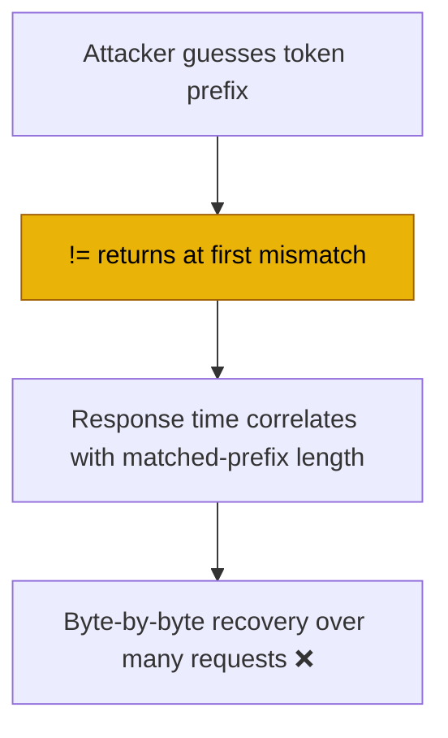

# IMP-01 — Constant-Time Comparison for the AI-Service Shared Secret

> **Role**: AI Engineer / Security Auditor · **Priority**: 🟢 Low · **Effort**: ~0.25 day
> **Status**: ✅ Implemented in [main.py — `verify_token`](../../ai-service/app/main.py).

---

## Story Identity

| Field | Value |
|:---|:---|
| **Story ID** | `IMP-01` |
| **Owner** | AI Engineer / Security Auditor |
| **Files** | `ai-service/app/main.py` |
| **Depends on** | None |

---

## 1. Current Problem

The AI service authenticates the backend with a shared secret, compared using Python's `!=` operator:

```python
# ai-service/app/main.py
async def verify_token(x_ai_service_token: Optional[str] = Header(default=None)) -> None:
    if settings.ai_service_token and x_ai_service_token != settings.ai_service_token:
        raise HTTPException(status_code=401, detail="Invalid or missing x-ai-service-token.")
```

`str != str` short-circuits at the first differing byte, so its runtime leaks how many leading characters matched. Over many requests this is a classic **timing side-channel** that can help an attacker recover the token byte by byte. The token is the only thing standing between the open internet and the (paid, LLM-backed) AI endpoints.



This is a hardening improvement, not an active exploit, hence Low priority — but it's a one-line fix on a security boundary.

---

## 2. Why It Matters

- **Defense of the AI boundary**: the shared secret gates every `dependencies=[Depends(verify_token)]` route; recovering it exposes the LLM features directly.
- **Cheap correctness**: constant-time comparison is the standard, expected way to compare secrets.

---

## 3. Step-Wise Solution

### Step 3.1 — Use `hmac.compare_digest`
```python
import hmac

async def verify_token(x_ai_service_token: Optional[str] = Header(default=None)) -> None:
    expected = settings.ai_service_token
    if not expected:
        return  # token auth disabled
    provided = x_ai_service_token or ""
    if not hmac.compare_digest(provided, expected):
        raise HTTPException(status_code=401, detail="Invalid or missing x-ai-service-token.")
```

### Step 3.2 — Consider requiring the token in production
Optionally, if `AI_SERVICE_TOKEN` is empty while running in a production-like environment, log a prominent warning (the AI service is otherwise open to anyone who can reach it).

### Step 3.3 — Test
Assert a wrong token yields 401 and a correct token passes; assert an empty configured secret disables the check as before.

---

## 4. Done When

- [x] Token comparison uses `hmac.compare_digest` (constant-time).
- [x] Empty configured secret preserves the "auth disabled" behavior (with an optional warning).
- [x] Tests cover correct/incorrect/empty-secret cases.
- [x] `python -m compileall app` passes.

---

## 5. Cross-References

| Document | Relevance |
|:---|:---|
| [main.py](../../ai-service/app/main.py) | `verify_token` dependency |
| [AIE-01 (implemented)](../specifications/ai_features/stories/AIE-01-model-allowlist-failfast.md) | Other boot/guard hardening on the AI service |
