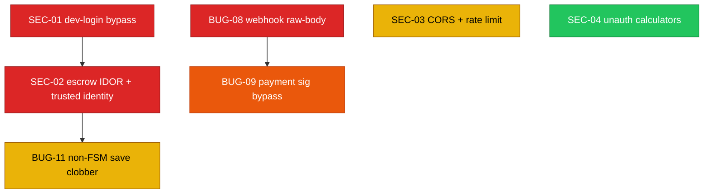

# FixFlowAI — Deep Audit Backlog (2026-07 code review)

> **What this is:** a fresh backlog of **bugs, code-breaking defects, security gaps, and improvements** found by reading the *actual* `backend/src/` and `ai-service/app/` code (not the specs) on 2026-07-17. Each story is a self-contained `.md` following the house format: problem → why it matters → step-wise solution → Mermaid visual → "Done When" → cross-refs.
>
> This complements the existing [`ai_features/stories`](../specifications/ai_features/stories/README.md) backlog. Those stories are AI-feature and pre-known-bug focused; **this folder holds newly discovered issues** the previous backlog does not cover.

---

## 0. First: what the existing `ai_features/stories` backlog actually shows (done vs not done)

I verified every prior story against the current code. **The trackers are stale — the codebase is far ahead of them.**

### Prior BUG-\* stories (the file statuses say "🔴 Not started" — the code says otherwise)

| Story | Tracker says | Code reality (verified) |
|:---|:---|:---|
| BUG-01 Escrow atomicity | 🔴 Not started | ✅ **Done** — `escrowService.applyTransition` now calls `repo.saveWithAuditBlock(...)` (single transactional write). |
| BUG-02 Gemini unbounded hang | ✅ done | ✅ **Done** — `gemini.generate_structured` wraps calls in `asyncio.wait_for(timeout=…)` + bounded retry/backoff. |
| BUG-03 WebSocket sync auth | 🔴 Not started | ✅ **Done** (2026-07-17) — JWT-gated upgrade, per-message `clientId===sub`, proposal-ownership authorization, and token-derived role enforcement in `syncServer.ts`. |
| BUG-04 Webhook secret bypass | 🔴 Not started | ✅ **Done** — `verifyWebhookSignature` returns `false` on missing secret; `index.ts` fails fast in production. |
| BUG-05 Confidence grid double-eval | ✅ done | ✅ **Done**. |
| BUG-06 MFA verifier stub | 🔴 Not started | ✅ **Done** — `escrowService` now calls real `verifyOtp(token, user.otpSecret)`; dummy strings no longer pass. |
| BUG-07 Refresh token growth | ✅ done | ✅ **Done** — `appendBoundedRefreshToken` + `MAX_REFRESH_TOKENS=30` + `pruneExpiredRefreshTokens`. |

### Prior AIE/AIA/AI stories (IMPLEMENTATION_STATUS says "0 done" — actually most are built)

| Story | Tracker says | Code reality (verified) |
|:---|:---|:---|
| AIE-01 Model allow-list + fail-fast | 🟡 ~70% | ✅ **Done** — `resolve_model()` gates every call incl. overrides; `/health` returns `allowedModels`; `main.py` `RuntimeError` on invalid env models. |
| AIA-05 Gemini resilience | 🟡 ~20% | ✅ **Done** — classification, retry+backoff+jitter, per-call timeout, telemetry inside `generate_structured`. |
| AIA-07 Circuit breaker | 🔴 Not started | ✅ **Done** — `llm/circuit_breaker.py` + `primary_breaker` wired into the retry loop; exposed on `/health`. |
| AIA-02 Result cache | 🔴 Not started | ✅ **Done** — `llm/cache.py` `get_cached_response`/`set_cached_response` wired into the wrapper. |
| AIA-06 Observability | 🔴 Not started | ✅ **Done** — `telemetry.py`, request-id middleware, `record_call`, `/health` metrics. |
| AIA-03 GitHub scan pipeline | 🔴 Not started | ✅ **Done** — `features/github_scan` + `/ai/github/scan` and `/ai/github/scan/stream` (SSE). |
| AIE-06 Opportunity scoring | 🔴 Not started | ✅ **Done** — `schemas/opportunity.py` + `features/opportunity.py` + `/ai/opportunity/score`. |
| AI-007 Growth plan | 🔴 Not started | ✅ **Done** — `schemas/growth.py` + `features/growth.py` + `/ai/growth/plan`. |
| AIE-03 Confidence regression guard | 🟡 ~30% | 🟡 **Partial** — `confidence_min_improvement` exists in `config.py`; per-cycle audit trail still worth verifying. |
| AIE-08 `Union[..., Any]` validation hole | 🟡 Medium | 🟡 **Still open** — `main.py` still declares `githubScan: Union[str, dict]` and `completedDeliverables: Union[str, list]`. |
| AIE-02 Brief-parser honest fallback | 🔴 0% | 🟡 **Partial** — `/api/proposals/parse` now returns `{source, degradedReason}` and 503 on `invalid_key`; end-to-end persistence of `degraded` present. |
| AIE-04 Eval harness | 🔴 0% | 🔴 **Not started**. |
| AIE-05 Reputation → matching | 🔴 0% | 🔴 **Not started** (unverified in `matchingEngine.ts`). |
| AIA-01 Async eval jobs | 🔴 0% | 🔴 **Not started**. |
| AIA-04 Discovery automation | 🔴 0% | 🔴 **Not started**. |

**Bottom line:** the two stale trackers ([stories/README](../specifications/ai_features/stories/README.md), [IMPLEMENTATION_STATUS](../specifications/ai_features/IMPLEMENTATION_STATUS.md)) badly under-report progress. **Recommended housekeeping:** flip the verified items to ✅ so the team stops re-doing finished work. Genuinely remaining from the old backlog: **AIE-04, AIE-05, AIA-01, AIA-04, AIE-08** (BUG-03 has since been completed — see below).

---

## 1. New Story Registry (this folder)

Newly discovered, **not** covered by the prior backlog. Prefixes: `SEC-*` security, `BUG-*` (08+) code defects, `IMP-*` improvements.

| ID | Story | Type | Priority | Effort | Touches |
|:---|:---|:---|:---:|:---:|:---|
| `SEC-01` | [Dev-login endpoint is a production auth bypass](./SEC-01-dev-login-auth-bypass.md) | 🔓 Security | 🔴 Critical | ~0.5 day | `routes/auth.ts`, `index.ts` |
| `SEC-02` | [Escrow endpoints trust client-supplied identity & lack ownership checks (IDOR)](./SEC-02-escrow-object-level-authorization.md) | 🔓 Security | 🔴 Critical | ~1.5 days | `index.ts`, `escrowService.ts`, `milestoneRepository.ts` |
| `BUG-08` | [Razorpay webhook HMAC computed over re-serialized body — real webhooks never validate](./BUG-08-webhook-rawbody-signature-mismatch.md) | 🐞 Code-breaking | 🔴 Critical | ~0.5 day | `index.ts`, `paymentService.ts` |
| `BUG-09` | [`verifyPaymentSignature` silently bypasses on mock id / missing secret](./BUG-09-payment-signature-mock-bypass.md) | 🐞/🔓 | 🟡 High | ~0.5 day | `paymentService.ts`, `index.ts` |
| `BUG-11` | [Non-FSM direct `save()` after transition clobbers version & skips audit](./BUG-11-non-fsm-milestone-save-clobber.md) | 🐞 Concurrency | 🟡 Medium | ~1 day | `index.ts`, `milestoneRepository.ts` |
| `SEC-03` | [Wide-open CORS + no rate limiting on auth/AI endpoints](./SEC-03-cors-and-rate-limiting.md) | 🔓 Security | 🟡 Medium | ~1 day | `index.ts` |
| `SEC-04` | [Deterministic calculator endpoints are unauthenticated](./SEC-04-unauthenticated-calculators.md) | 🔓 Security | 🟢 Low | ~0.25 day | `index.ts` |

> **Removed as implemented (git-recoverable):** `BUG-10` (the `ValidationError` NameError is fixed — it's imported and used in `gemini.py`) and `IMP-01` (constant-time token comparison is live in `main.py`).

---

## 2. Priority & Dependency Map

## 3. Suggested Execution Order

1. **Phase 1 — Stop the bleeding (Critical):** `SEC-01` (open auth door), `BUG-08` (payments silently broken), `SEC-02` (anyone can drive anyone's escrow).
2. **Phase 2 — Payment & AI correctness (High):** `BUG-09`, `BUG-11`.
3. **Phase 3 — Hardening (Medium/Low):** `SEC-03`, `SEC-04`.
