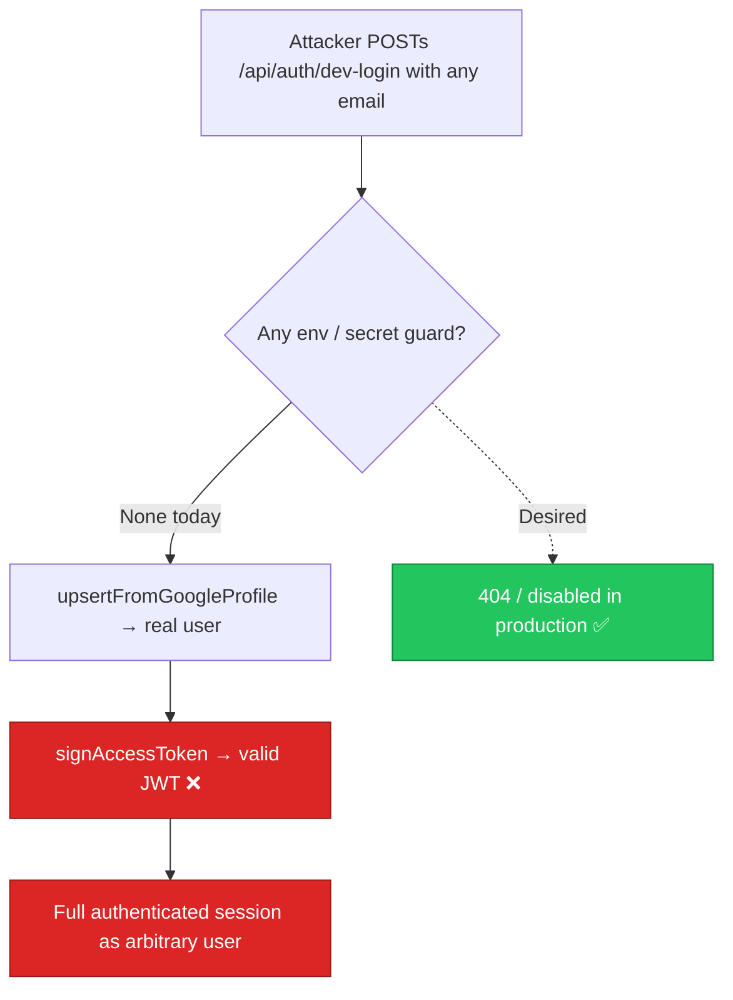

# SEC-01 — `/api/auth/dev-login` Is a Production Authentication Bypass

> **Role**: Security Auditor / Backend Engineer · **Priority**: 🔴 Critical · **Effort**: ~0.5 day
> **Status**: 🔴 Not started. Identified in [routes/auth.ts — `dev-login` handler](../../backend/src/routes/auth.ts).

---

## Story Identity

| Field | Value |
|:---|:---|
| **Story ID** | `SEC-01` |
| **Owner** | Security Auditor / Backend Engineer |
| **Files** | `backend/src/routes/auth.ts`, `backend/src/index.ts` |
| **Depends on** | None |

---

## 1. Current Problem

`authRouter` registers a `dev-login` route that mints a **fully valid access + refresh token pair for any email, with no credential of any kind**:

```typescript
// backend/src/routes/auth.ts
authRouter.post(
  '/dev-login',
  asyncRoute(async (req, res) => {
    const email = req.body?.email || 'dev-tester@fixflow.ai';
    const name = req.body?.name || 'Dev Tester';
    const profile = { googleSub: 'dev-sub-123456', email, emailVerified: true, name, /* ... */ };
    const repo = getUserRepository();
    const user = await repo.upsertFromGoogleProfile(profile);
    const accessToken = signAccessToken(user);          // ← real signed JWT
    const refreshToken = generateRefreshToken();          // ← real refresh token
    await repo.addRefreshTokenHash(user.id, hashRefreshToken(refreshToken));
    res.json({ user: publicUser(user), accessToken, refreshToken, /* ... */ });
  }),
);
```

There is **no `NODE_ENV` guard, no env flag, and no secret**. The route is mounted unconditionally via `app.use('/api/auth', authRouter)` in `index.ts`. Anyone who can reach the server can become any user:

```bash
curl -X POST https://api.fixflow.ai/api/auth/dev-login \
  -H 'Content-Type: application/json' \
  -d '{"email":"victim@company.com","name":"Anyone"}'
# → { accessToken: "<valid JWT>", ... }  full session, no password, no OAuth
```



---

## 2. Why It Matters

- **Total authentication bypass**: every `requireAuth`-protected route (proposals, escrow, overview, role changes) is reachable by forging an identity. This is the single highest-severity issue in the codebase.
- **Account takeover / impersonation**: passing a victim's email upserts/returns a session tied to that identity; combined with SEC-02 it grants control of their escrow milestones.
- **Silent by default**: because it "just works" in dev, it is trivially forgotten and shipped to production.

---

## 3. Step-Wise Solution

### Step 3.1 — Gate the route behind an explicit, non-production flag
Only register `dev-login` when **both** `NODE_ENV !== 'production'` **and** an opt-in flag is set:

```typescript
const DEV_LOGIN_ENABLED =
  process.env.NODE_ENV !== 'production' && process.env.ENABLE_DEV_LOGIN === 'true';

if (DEV_LOGIN_ENABLED) {
  authRouter.post('/dev-login', asyncRoute(async (req, res) => { /* ...existing... */ }));
} else {
  console.warn('[AuthRoute] dev-login is DISABLED (production or ENABLE_DEV_LOGIN!=true).');
}
```

### Step 3.2 — Fail loudly if misconfigured in production
In `index.ts` boot checks, if `NODE_ENV === 'production'` and `ENABLE_DEV_LOGIN === 'true'`, `process.exit(1)` with a clear message. A dev bypass must never be enable-able in prod.

### Step 3.3 — Defense in depth: never emit tokens from the disabled path
Ensure the route, when disabled, is simply not mounted (returns Express default 404) rather than returning any partial payload.

### Step 3.4 — Document the flag
Add `ENABLE_DEV_LOGIN=false` to `backend/.env.example` with a comment that it must stay false outside local development.

---

## 4. Done When

- [ ] `dev-login` is unreachable (404) unless `NODE_ENV !== 'production'` **and** `ENABLE_DEV_LOGIN === 'true'`.
- [ ] Server refuses to boot (`exit(1)`) if `NODE_ENV === 'production'` and `ENABLE_DEV_LOGIN === 'true'`.
- [ ] `.env.example` documents `ENABLE_DEV_LOGIN` defaulting to `false`.
- [ ] A test asserts the route returns 404 when the flag is unset.
- [ ] `npm run build` compiles cleanly.

---

## 5. Cross-References

| Document | Relevance |
|:---|:---|
| [routes/auth.ts](../../backend/src/routes/auth.ts) | Where `dev-login` is defined |
| [index.ts](../../backend/src/index.ts) | Router mount + boot-time env checks |
| [SEC-02](./SEC-02-escrow-object-level-authorization.md) | Escalation path once an identity is forged |
