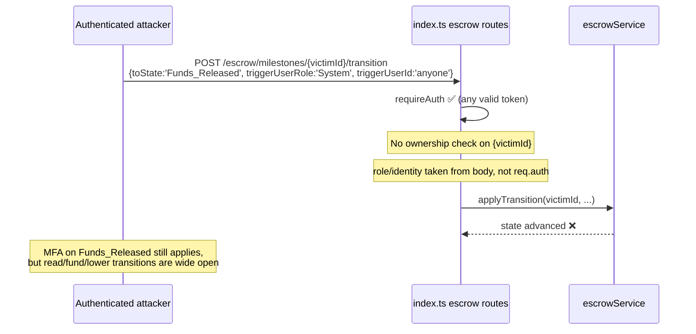

# SEC-02 — Escrow Endpoints Trust Client-Supplied Identity & Lack Ownership Checks (IDOR)

> **Role**: Security Auditor / FSM Expert · **Priority**: 🔴 Critical · **Effort**: ~1.5 days
> **Status**: 🔴 Not started. Identified in [index.ts — escrow routes](../../backend/src/index.ts).

---

## Story Identity

| Field | Value |
|:---|:---|
| **Story ID** | `SEC-02` |
| **Owner** | Security Auditor / Backend Engineer |
| **Files** | `backend/src/index.ts`, `backend/src/services/escrowService.ts`, `backend/src/services/milestoneRepository.ts` |
| **Depends on** | SEC-01 (a forged identity makes this trivially exploitable) |

---

## 1. Current Problem

The escrow routes are protected by `requireAuth`, but authentication is **not** authorization. Two distinct holes exist.

### Hole A — the transition endpoint trusts the request body for *who* is acting

```typescript
// backend/src/index.ts — POST /api/escrow/milestones/:id/transition
const { toState, triggerUserId, triggerUserRole, expectedVersion, /* ... */ } = req.body ?? {};
// ...
const result = await applyTransition(req.params.id, {
  toState: toState as any,
  triggerUserId,                                  // ← from the CLIENT, not req.auth
  triggerUserRole: (triggerUserRole as any) || 'System', // ← client picks their own role!
  expectedVersion,
  /* ... */
});
```

The acting user id **and role** are taken from the untrusted request body. A caller can set `triggerUserRole: 'System'` and any `triggerUserId`, so the audit trail and every role-gated decision are attacker-controlled.

### Hole B — no milestone belongs to anyone

`createMilestone` stores `{ id, proposalId, title, amount, state, version }` with **no owner field**, and every read/mutate route looks up purely by `:id`:

```typescript
// GET/POST /api/escrow/milestones/:id (+ /audit, /fund, /verify-payment, /transition)
const milestone = await getMilestone(req.params.id); // no check that it belongs to req.auth.sub
```

Any authenticated user can enumerate milestone UUIDs and **read, fund, verify-payment, or transition another party's escrow** — a classic Insecure Direct Object Reference.



> Note: the MFA gate (BUG-06, now fixed) still guards `Approved`/`Funds_Released` against a *different* user's OTP — but reads, funding, `Active`/`In_Review`/`Revision_Requested` transitions, and audit access are entirely unprotected, and the audit ledger is falsifiable via the spoofed role/identity.

---

## 2. Why It Matters

- **Broken access control** (OWASP A01) across the platform's financial core.
- **Falsified audit trail**: the SHA-256 ledger records attacker-chosen `triggeredBy`/`role`, defeating the "verifiable audit" UVP.
- **Cross-tenant data exposure**: milestone amounts, states, and payment ids of other users are readable by id.

---

## 3. Step-Wise Solution

### Step 3.1 — Derive identity & role from the token, never the body
In the transition handler, use `req.auth`:

```typescript
const result = await applyTransition(req.params.id, {
  toState,
  triggerUserId: req.auth!.sub,
  triggerUserRole: req.auth!.role as UserRole,
  expectedVersion,
  metadata,
  mfaToken,
});
```

Remove `triggerUserId` / `triggerUserRole` from the accepted body.

### Step 3.2 — Add an owner to every milestone
Add `ownerUserId` (and, where relevant, `clientUserId` / `freelancerUserId`) to the `Milestone` type. Populate it in `createMilestone` from `req.auth!.sub`. Derive the counterpart parties from the linked proposal.

### Step 3.3 — Enforce ownership on every escrow route
Introduce a helper `assertMilestoneAccess(milestone, auth)` that 404s (not 403 — avoid existence oracle) when the caller is neither the client nor the freelancer party. Call it in **all** of: `GET /:id`, `GET /:id/audit`, `POST /:id/transition`, `POST /:id/fund`, `POST /:id/verify-payment`.

### Step 3.4 — Scope list endpoints to the caller
`GET /api/escrow/milestones` and `listMilestones` must filter to milestones the caller is a party to, not return the whole store.

### Step 3.5 — Enforce role-appropriate transitions
Map which role may drive which transition (e.g. only the client funds/approves; only the freelancer submits for review) and reject mismatches with `422`.

---

## 4. Done When

- [ ] Transition handler ignores body `triggerUserId`/`triggerUserRole` and uses `req.auth`.
- [ ] `Milestone` carries owner/party ids, set at creation.
- [ ] All escrow read/mutate routes 404 for non-parties.
- [ ] List endpoints return only the caller's milestones.
- [ ] Role→transition matrix enforced; violations return 422.
- [ ] Tests cover: cross-user read blocked, spoofed role rejected, party-scoped list.
- [ ] `npm run build` compiles cleanly.

---

## 5. Cross-References

| Document | Relevance |
|:---|:---|
| [index.ts](../../backend/src/index.ts) | Escrow route handlers |
| [escrowService.ts](../../backend/src/services/escrowService.ts) | Transition orchestration |
| [escrowStateMachine.ts](../../backend/src/skills/escrowStateMachine.ts) | Valid transitions + audit block builder |
| [BUG-06 (fixed)](../specifications/ai_features/stories/BUG-06-mfa-verifier-stub.md) | MFA now real, but only guards Approved/Funds_Released |
