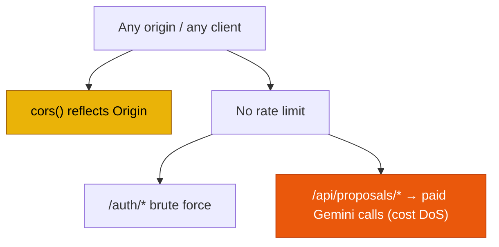

# SEC-03 — Wide-Open CORS and No Rate Limiting on Auth/AI Endpoints

> **Role**: Security Auditor / Backend Engineer · **Priority**: 🟡 Medium · **Effort**: ~1 day
> **Status**: 🔴 Not started. Identified in [index.ts — middleware setup](../../backend/src/index.ts).

---

## Story Identity

| Field | Value |
|:---|:---|
| **Story ID** | `SEC-03` |
| **Owner** | Security Auditor / Backend Engineer |
| **Files** | `backend/src/index.ts` |
| **Depends on** | None |

---

## 1. Current Problem

Two hardening gaps at the edge.

### A — CORS allows every origin
```typescript
// backend/src/index.ts
app.use(cors());   // ← reflects any Origin, no allow-list
```
`cors()` with no options permits requests from **any** website. Any page on the internet can call the API with a user-supplied bearer token and read responses.

### B — No rate limiting anywhere
There is no throttling on the high-value, unauthenticated-by-design endpoints:

- `POST /api/auth/google`, `/api/auth/github`, `/api/auth/refresh`, `/api/auth/dev-login` — brute-force / credential-stuffing / token-guessing surface.
- The AI proxy routes (`/api/proposals/parse`, `/api/proposals/evaluate`, `/api/interview-questions`, `/api/contract-extensions`) — each triggers a **paid Gemini call**, so unbounded requests are a direct cost-amplification and DoS vector.



---

## 2. Why It Matters

- **CORS**: an over-permissive policy widens the blast radius of any leaked token and enables cross-site data reads from untrusted pages.
- **Rate limiting**: without it, auth endpoints are brute-forceable and each AI route is an open door to run up the Gemini bill or exhaust the service.

---

## 3. Step-Wise Solution

### Step 3.1 — Restrict CORS to an allow-list
Drive allowed origins from env (`CORS_ALLOWED_ORIGINS`, comma-separated) and reject others:
```typescript
const allowed = (process.env.CORS_ALLOWED_ORIGINS || '').split(',').map(s => s.trim()).filter(Boolean);
app.use(cors({
  origin: (origin, cb) => (!origin || allowed.includes(origin)) ? cb(null, true) : cb(new Error('CORS: origin not allowed')),
  credentials: false,
}));
```

### Step 3.2 — Add per-route rate limiting
Introduce a limiter (e.g. `express-rate-limit`, or a Redis-backed limiter per `tech.md`). Apply a strict limit to `/api/auth/*` (e.g. 10/min/IP) and a separate budget to the AI proxy routes (e.g. 30/min/user), keyed by `req.auth?.sub ?? req.ip`.

### Step 3.3 — Return structured 429s
Respond with `429 Too Many Requests`, a `Retry-After` header, and a JSON error code the frontend can surface.

### Step 3.4 — Make limits configurable
Expose window/max via env so ops can tune without redeploying code.

---

## 4. Done When

- [ ] CORS honors an env-driven allow-list; disallowed origins are rejected.
- [ ] `/api/auth/*` is rate-limited per IP.
- [ ] AI proxy routes are rate-limited per user (fallback per IP).
- [ ] Exceeding a limit returns `429` + `Retry-After`.
- [ ] Limits are env-configurable and documented in `.env.example`.
- [ ] `npm run build` compiles cleanly.

---

## 5. Cross-References

| Document | Relevance |
|:---|:---|
| [index.ts](../../backend/src/index.ts) | CORS + route registration |
| [tech.md](../../.kiro/steering/tech.md) | Redis is the planned store for rate limiting |
| [SEC-01](./SEC-01-dev-login-auth-bypass.md) | `dev-login` should also be removed from the attack surface |
