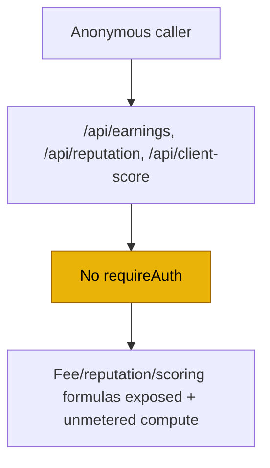

# SEC-04 — Deterministic Calculator Endpoints Are Unauthenticated

> **Role**: Backend Engineer · **Priority**: 🟢 Low · **Effort**: ~0.25 day
> **Status**: 🔴 Not started. Identified in [index.ts — calculator routes](../../backend/src/index.ts).

---

## Story Identity

| Field | Value |
|:---|:---|
| **Story ID** | `SEC-04` |
| **Owner** | Backend Engineer |
| **Files** | `backend/src/index.ts` |
| **Depends on** | None |

---

## 1. Current Problem

Three business-logic endpoints are registered **without** `requireAuth`, unlike every other data route:

```typescript
// backend/src/index.ts
app.post('/api/earnings', (req, res) => { /* calculateEarningsBreakdown(...) */ });      // no requireAuth
app.post('/api/reputation', (req, res) => { /* calculateReputationMetrics(...) */ });     // no requireAuth
app.post('/api/client-score', (req, res) => { /* calculateClientScore(...) */ });         // no requireAuth
```

They accept arbitrary input and return the platform's fee structure, reputation formula, and client-scoring outputs to anyone. While these are pure/deterministic (no persistence, no key), leaving them open:

- **Leaks business logic** — the exact tiered-commission, gateway-fee, and TDS math, and the reputation/client-scoring weightings, are probeable by adversaries and competitors.
- **Adds an unmetered compute surface** that bypasses the auth and (future) rate-limit layer.



---

## 2. Why It Matters

- **Consistency**: every other data-bearing route requires a token; these three are an inconsistent gap that's easy to overlook when adding rate limiting or audit logging.
- **Information exposure**: pricing and scoring internals are competitive/abuse-relevant even if the math is "just" deterministic.

---

## 3. Step-Wise Solution

### Step 3.1 — Decide the intended audience
If these are meant to power the authenticated dashboard, add `requireAuth`. If one is intentionally public (e.g. a marketing "earnings calculator"), document that explicitly and keep it public **behind rate limiting** (SEC-03).

### Step 3.2 — Apply `requireAuth` to the internal ones
```typescript
app.post('/api/earnings', requireAuth, (req, res) => { /* ... */ });
app.post('/api/reputation', requireAuth, (req, res) => { /* ... */ });
app.post('/api/client-score', requireAuth, (req, res) => { /* ... */ });
```

### Step 3.3 — Tighten input validation
Validate array/number shapes for `escrowHistory`, `clientHistory`, and `grossAmount` before computing, returning `400` on bad input.

---

## 4. Done When

- [ ] Internal calculator routes require a valid token (or are explicitly documented as public + rate-limited).
- [ ] Inputs are validated with clear `400`s on malformed payloads.
- [ ] A test confirms unauthenticated access is rejected for the protected routes.
- [ ] `npm run build` compiles cleanly.

---

## 5. Cross-References

| Document | Relevance |
|:---|:---|
| [index.ts](../../backend/src/index.ts) | Calculator route registration |
| [SEC-03](./SEC-03-cors-and-rate-limiting.md) | Rate limiting for any endpoint kept public |
